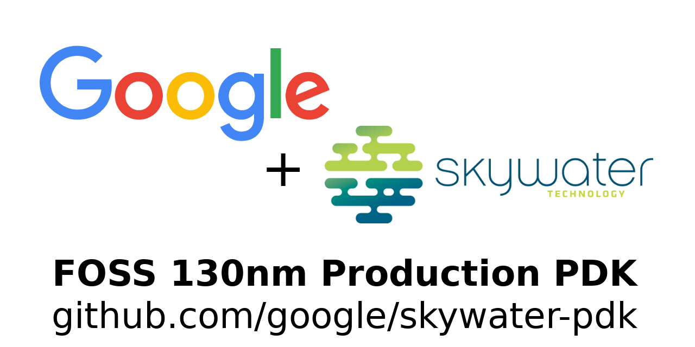

SkyWater Open Source PDK
========================

.. image:: https://img.shields.io/github/license/google/skywater-pdk
   :alt: GitHub license - Apache 2.0
   :target: https://github.com/google/skywater-pdk

.. image:: https://travis-ci.org/google/skywater-pdk.svg?branch=master
   :alt: Travis Badge - https://travis-ci.org/google/skywater-pdk
   :target: https://travis-ci.org/google/skywater-pdk

.. image:: https://readthedocs.org/projects/skywater-pdk/badge/?version=latest&style=flat
   :alt: ReadTheDocs Badge - https://skywater-pdk.rtfd.io
   :target: https://skywater-pdk.rtfd.io

.. image:: https://img.shields.io/github/v/tag/google/skywater-pdk?include_prereleases&sort=semver
   :alt: Latest GitHub tag (including pre-releases)
   :target: https://gitHub.com/google/skywater-pdk/commit/

.. image:: https://img.shields.io/github/commits-since/google/skywater-pdk/v0.0.0
   :alt: GitHub commits since latest release (v0.0.0)
   :target: https://gitHub.com/google/skywater-pdk/commit/

The SkyWater Open Source PDK is a collaboration between Google and SkyWater Technology Foundry to provide a fully open source `Process Design Kit <https://en.wikipedia.org/wiki/Process_design_kit>`_ and related resources, which can be used to create manufacturable designs at SkyWater’s facility.

As of May 2020, this repository is targeting the SKY130 process node. If the SKY130 process node release is successful then in the future more advanced technology nodes may become available.

The SkyWater Open Source PDK documentation can be found at <https://skywater-pdk.rtfd.io>.

.. |current-status| replace:: **Experimental Preview**

Current Status -- |current-status|
==================================

.. current_status_text

*Warning*
   Google and SkyWater are currently treating the current content as an **experimental preview** / **alpha release**.

While the SKY130 process node and the PDK from which this open source release was derived have been used to create many designs that have been successfully manufactured commercially in significant quantities, the open source PDK is not intended to be used for production settings at this current time. It *should* be usable for doing test chips and initial design verification (but this is not guaranteed).

Google, SkyWater and our partners are currently doing internal validation and test designs, including silicon validation or the released data and plan to publish these results.

The PDK will be tagged with a production version when ready to do production design, see the "`Versioning Information <docs/versioning.rst>`_" section for a full description of the version numbering scheme.

To get notified about future new releases of the PDK, and other important news, please sign up on the
`skywater-pdk-announce mailing list <https://groups.google.com/forum/#!forum/skywater-pdk-announce>`_
[`join link <https://groups.google.com/forum/#!forum/skywater-pdk-announce/join>`_].

See both the `Known Issues <docs/known_issues.rst>`_ section and the `SkyWater PDK GitHub issue list <https://github.com/google/skywater-pdk/issues>`_ to get more detailed information around currently known issues.

Resources
=========

The latest SkyWater SKY130 PDK design resources can be viewed at the following locations:

* `On Github @ google/skywater-pdk <https://github.com/google/skywater-pdk>`_
* `Google CodeSearch interface @ https://cs.opensource.google/skywater-pdk <https://cs.opensource.google/skywater-pdk>`_
* `foss-eda-tools.googlesource.com/skywater-pdk <https://foss-eda-tools.googlesource.com/skywater-pdk/>`_

SKY130 Process Node
===================

The SKY130 is a mature 180nm-130nm hybrid technology originally developed internally by Cypress Semiconductor before being spun out into SkyWater Technology and made accessible to general industry. SkyWater and Google’s collaboration is now making this technology accessible to everyone!

The SKY130 Process node technology stack consists of;

* Support for internal 1.8V with 5.0V I/Os (operable at 2.5V)
* 1 level of local interconnect
* 5 levels of metal
* Is inductor-capable
* Has high sheet rho poly resistor
* Optional MiM capacitors
* Includes SONOS shrunken cell
* Supports 10V regulated supply
* HV extended-drain NMOS and PMOS

The `SKY130 Process Node`_ is an extremely flexible offering, including many normally *optional* features as standard (features like the local interconnect, SONOS functionality, MiM capacitors, and more). This provides the designer with a **wide range** of flexibility in design choices.

If your needs extend beyond the standard included functionality in the `SKY130 Process Node`_, please see `Contacting SkyWater`_ as they specializes in enabling production volume of process customization include `the addition of specialized materials like Nb, Ge, V2O5, Carbon Nanotubes <https://www.skywatertechnology.com/technology/>`_. Google and SkyWater continuing to explore new options to be included in the `SkyWater Open Source PDK`_ and `SKY130 Process Node`_ that enable new innovative solutions to traditional design problems.

Typical usages of 130nm Process Nodes
-------------------------------------

The `130nm process <https://en.wikichip.org/wiki/130_nm_lithography_process>`_ was first commercialized around the 2001-2002 time frame and is now primarily used in the area of research, small microcontroller development, and mixed signal embedded designs such as IoT devices.

A living Google document at <https://j.mp/si130nm> has been created to provide **inspiration** from what researchers, commercial entities and other groups have done with similar **sized** process nodes. As there are widely different constraints and possibilities from changes in both the manufacturing process and materials it is important **not** to assumed that the exact results found in the `130nm inspiration document <https://j.mp/si130nm>`_ can be identically reproduced on the `SKY130 Process Node`_.

PDK Contents
============

The SkyWater Open Source PDK contains;

* Comprehensive documentation around the design rules required to create manufacturable devices on the SKY130 Process Node.
* EDA tooling support files for multiple open source and proprietary design flows.
* Primitive cell libraries and models for creating analog designs.
* **Multiple** standard digital cell libraries covering a range of different use cases.
* **Multiple** documented examples of using the PDK (see below).

For more information see the `PDK Contents section of the SkyWater SKY130 PDK <https://skywater-pdk.rtfd.io>`_.

Using the SkyWater Open Source PDK
==================================

The SkyWater Open Source PDK aims to contain comprehensive documentation about using the design kit with multiple tools and design flows to enable many different types of ASIC creation.

* `[TODO #11] <https://github.com/google/skywater-pdk/issues/11>`_ - Examples of using the `PDK for digital design <https://skywater-pdk.rtfd.io>`_.
* `[TODO #14] <https://github.com/google/skywater-pdk/issues/14>`_ - Example of using the PDK to `create a RISC-V SoC design using the OpenROAD ASIC tool flow <https://skywater-pdk.rtfd.io>`_.
* `[TODO #12] <https://github.com/google/skywater-pdk/issues/12>`_ - Examples of using the PDK for `analog design <https://skywater-pdk.rtfd.io>`_.
* `[TODO #13] <https://github.com/google/skywater-pdk/issues/13>`_ - Examples of using the PDK with `analog generators <https://skywater-pdk.rtfd.io>`_ like `FASoC <https://fasoc.engin.umich.edu/>`_ and `Berkeley Analog Generator (BAG) <https://github.com/bluecheetah/bag>`_.

We are excited to see additions to this documentation around using this design kit with new tools and design flows. Please see the `Contributing file <docs/contributing.rst>`_ for information on how to do this.

To download or update to the 'latest' version of all standard cell libraries, and to regenerate the liberty files, clone this repository and run the following commands.

.. code:: bash

   # Expect a large download! ~7GB at time of writing.
   SUBMODULE_VERSION=latest make submodules -j3 || make submodules -j1

   # Regenerate liberty files
   make timing

Support
=======

Like many open source projects there are multiple ways to get support on the SkyWater Open Source PDK.

SkyWater has created a Market Partner Ecosystem to be able to provide support from design through back end package and test.  If you are interested in getting additional support through the ASIC development process, reach out to SkyWater using the information in the `Contacting SkyWater`_ section below.

There is also a `users mailing list  <https://groups.google.com/forum/#!forum/skywater-pdk-users>`_ [`join link <https://groups.google.com/forum/#!forum/skywater-pdk-users/join>`_] to allow like minded users of the PDK to provide support to each other.

Google does not provide external support for using the SkyWater Open Source PDK and is distributing this repository on an "AS IS" BASIS, WITHOUT WARRANTIES OR CONDITIONS OF ANY KIND, either express or implied. See the license_ section for the full terms.

About SkyWater Technology Foundry
=================================

SkyWater is a solely U.S.-based and U.S.-owned, DoD-accredited, Trusted Foundry. Through its Technology Foundry model, SkyWater provides custom design and development services, design IP, and volume manufacturing for integrated circuits and micro devices. The Company’s world-class operations and unique processing capabilities enable mixed-signal CMOS, power, rad-hard and ROIC solutions. SkyWater’s Innovation Engineering Services empower development of superconducting and 3D ICs, along with carbon nanotube, photonic and MEMS devices. SkyWater serves customers in growing markets such as aerospace & defense, automotive, cloud & computing, consumer, industrial, IoT and medical. For more information, please visit: www.skywatertechnology.com/.

SkyWater is building from a long heritage in the microelectronics industry. The SkyWater facility was originally established by Minnesota based Control Data Corporation (CDC) in the 1980s. The CDC fab was acquired by Cypress Semiconductor in 1991. During the Cypress era, the facility was expanded and upgraded multiple times, keeping pace with Moore's Law into the late 2000s and was known for being a US-based production facility that was competitive with Asian-based fabs. SkyWater spun-off from Cypress in 2017 with private equity backing from Minnesota based Oxbow Industries.

Contacting SkyWater
-------------------
Requests for more information about SKY130 and other standard and customer foundry technologies can be emailed to <swfoundry@skywatertechnology.com> or `submitted via this webform <https://www.skywatertechnology.com/contact/>`_.

License
=======

The SkyWater Open Source PDK is released under the `Apache 2.0 license <https://github.com/google/skywater-pdk/blob/master/LICENSE>`_.

The copyright details (which should also be found at the top of every file) are;

::

   Copyright 2020 SkyWater PDK Authors

   Licensed under the Apache License, Version 2.0 (the "License");
   you may not use this file except in compliance with the License.
   You may obtain a copy of the License at

       http://www.apache.org/licenses/LICENSE-2.0

   Unless required by applicable law or agreed to in writing, software
   distributed under the License is distributed on an "AS IS" BASIS,
   WITHOUT WARRANTIES OR CONDITIONS OF ANY KIND, either express or implied.
   See the License for the specific language governing permissions and
   limitations under the License.

