Comparison page for old and new symbols
---------------------------------------

This page should be deleted after PR review.

|old_symbol-cap_mim_m3| |symbol-cap_mim_m3|

|old_symbol-cap_mim_m4| |symbol-cap_mim_m4|

|old_symbol-cap_var-hvt| |symbol-cap_var-hvt|

|old_symbol-cap_var-lvt| |symbol-cap_var-lvt|

|old_symbol-cap_vpp-parallel| |symbol-cap_vpp-parallel|

|old_symbol-cap_vpp-perpendicular| |symbol-cap_vpp-perpendicular|

|old_symbol-diode-01| |symbol-diode-01|

|old_symbol-diode-02| |symbol-diode-02|

|old_symbol-diode-03| |symbol-diode-03|

|old_symbol-diode-04| |symbol-diode-04|

|old_symbol-diode-05| |symbol-diode-05|

|old_symbol-diode-06| |symbol-diode-06|

|old_symbol-diode-07| |symbol-diode-07|

|old_symbol-diode-08| |symbol-diode-08|

|old_symbol-diode-09| |symbol-diode-09|

|old_symbol-diode-10| |symbol-diode-10|

|old_symbol-diode-11| |symbol-diode-11|

|old_symbol-diode-12| |symbol-diode-12|

|old_symbol-diode-13| |symbol-diode-13|

|old_symbol-diode-14| |symbol-diode-14|

|old_symbol-diode-15| |symbol-diode-15|

|old_symbol-diode-16| |symbol-diode-16|

|old_symbol-diode-17| |symbol-diode-17|

|old_symbol-esd_nfet_g5v0d10v5| |symbol-esd_nfet_g5v0d10v5|

|old_symbol-esd_nfet_g5v0d10v5_nvt| |symbol-esd_nfet_g5v0d10v5_nvt|

|old_symbol-nfet_01v8| |symbol-nfet_01v8|

|old_symbol-nfet_01v8_lvt| |symbol-nfet_01v8_lvt|

|old_symbol-nfet_03v3_nvt| |symbol-nfet_03v3_nvt|

|old_symbol-nfet_05v0_nvt| |symbol-nfet_05v0_nvt|

|old_symbol-nfet_20v0| |symbol-nfet_20v0|

|old_symbol-nfet_20v0_iso| |symbol-nfet_20v0_iso|

|old_symbol-nfet_20v0_nvt| |symbol-nfet_20v0_nvt|

|old_symbol-nfet_20v0_zvt| |symbol-nfet_20v0_zvt|

|old_symbol-nfet_g11v0d16v0| |symbol-nfet_g11v0d16v0|

|old_symbol-nfet_g5v0d10v5| |symbol-nfet_g5v0d10v5|

|old_symbol-npn_05v0-1| |symbol-npn_05v0-1|

|old_symbol-npn_05v0-2| |symbol-npn_05v0-2|

|old_symbol-npn_05v0-3| |symbol-npn_05v0-3|

|old_symbol-pfet_01v8| |symbol-pfet_01v8|

|old_symbol-pfet_01v8_hvt| |symbol-pfet_01v8_hvt|

|old_symbol-pfet_01v8_lvt| |symbol-pfet_01v8_lvt|

|old_symbol-pfet_20v0| |symbol-pfet_20v0|

|old_symbol-esd_pfet_g5v0d10v5| |symbol-esd_pfet_g5v0d10v5|

|old_symbol-pfet_g5v0d10v5| |symbol-pfet_g5v0d10v5|

|old_symbol-pfet_g5v0d16v0| |symbol-pfet_g5v0d16v0|

|old_symbol-pnp_05v0-a| |symbol-pnp_05v0-a|

|old_symbol-pnp_05v0-b| |symbol-pnp_05v0-b|

|old_symbol-res_generic_l1| |symbol-res_generic_l1|

|old_symbol-res_generic_m1| |symbol-res_generic_m1|

|old_symbol-res_generic_m2| |symbol-res_generic_m2|

|old_symbol-res_generic_m3| |symbol-res_generic_m3|

|old_symbol-res_generic_m4| |symbol-res_generic_m4|

|old_symbol-res_generic_m5| |symbol-res_generic_m5|

|old_symbol-res_generic_nd| |symbol-res_generic_nd|

|old_symbol-res_generic_pd| |symbol-res_generic_pd|

|old_symbol-res_generic_po| |symbol-res_generic_po|

|old_symbol-res_generic_pw| |symbol-res_generic_pw|

|old_symbol-res_high_po| |symbol-res_high_po|

|old_symbol-res_high_po_0p35| |symbol-res_high_po_0p35|

|old_symbol-res_high_po_0p69| |symbol-res_high_po_0p69|

|old_symbol-res_high_po_1p41| |symbol-res_high_po_1p41|

|old_symbol-res_high_po_2p85| |symbol-res_high_po_2p85|

|old_symbol-res_high_po_5p73| |symbol-res_high_po_5p73|

|old_symbol-res_xhigh_po| |symbol-res_xhigh_po|

|old_symbol-res_xhigh_po_0p35| |symbol-res_xhigh_po_0p35|

|old_symbol-res_xhigh_po_0p69| |symbol-res_xhigh_po_0p69|

|old_symbol-res_xhigh_po_1p41| |symbol-res_xhigh_po_1p41|

|old_symbol-res_xhigh_po_2p85| |symbol-res_xhigh_po_2p85|

|old_symbol-res_xhigh_po_5p73| |symbol-res_xhigh_po_5p73|

.. |symbol-cap_mim_m3| image:: rules/device-details/cap_mim/symbol-cap_mim_m3.svg
.. |symbol-cap_mim_m4| image:: rules/device-details/cap_mim/symbol-cap_mim_m4.svg
.. |symbol-cap_var-hvt| image:: rules/device-details/cap_var/symbol-cap_var-hvt.svg
.. |symbol-cap_var-lvt| image:: rules/device-details/cap_var/symbol-cap_var-lvt.svg
.. |symbol-cap_vpp-parallel| image:: rules/device-details/cap_vpp/symbol-cap_vpp-parallel.svg
.. |symbol-cap_vpp-perpendicular| image:: rules/device-details/cap_vpp/symbol-cap_vpp-perpendicular.svg
.. |symbol-diode-01| image:: rules/device-details/diodes/symbol-diode-01.svg
.. |symbol-diode-02| image:: rules/device-details/diodes/symbol-diode-02.svg
.. |symbol-diode-03| image:: rules/device-details/diodes/symbol-diode-03.svg
.. |symbol-diode-04| image:: rules/device-details/diodes/symbol-diode-04.svg
.. |symbol-diode-05| image:: rules/device-details/diodes/symbol-diode-05.svg
.. |symbol-diode-06| image:: rules/device-details/diodes/symbol-diode-06.svg
.. |symbol-diode-07| image:: rules/device-details/diodes/symbol-diode-07.svg
.. |symbol-diode-08| image:: rules/device-details/diodes/symbol-diode-08.svg
.. |symbol-diode-09| image:: rules/device-details/diodes/symbol-diode-09.svg
.. |symbol-diode-10| image:: rules/device-details/diodes/symbol-diode-10.svg
.. |symbol-diode-11| image:: rules/device-details/diodes/symbol-diode-11.svg
.. |symbol-diode-12| image:: rules/device-details/diodes/symbol-diode-12.svg
.. |symbol-diode-13| image:: rules/device-details/diodes/symbol-diode-13.svg
.. |symbol-diode-14| image:: rules/device-details/diodes/symbol-diode-14.svg
.. |symbol-diode-15| image:: rules/device-details/diodes/symbol-diode-15.svg
.. |symbol-diode-16| image:: rules/device-details/diodes/symbol-diode-16.svg
.. |symbol-diode-17| image:: rules/device-details/diodes/symbol-diode-17.svg
.. |symbol-esd_nfet_g5v0d10v5_nvt| image:: rules/device-details/esd_nfet/symbol-esd_nfet_g5v0d10v5_nvt.svg
.. |symbol-esd_nfet_g5v0d10v5| image:: rules/device-details/esd_nfet/symbol-esd_nfet_g5v0d10v5.svg
.. |symbol-nfet_01v8_lvt| image:: rules/device-details/nfet_01v8_lvt/symbol-nfet_01v8_lvt.svg
.. |symbol-nfet_01v8| image:: rules/device-details/nfet_01v8/symbol-nfet_01v8.svg
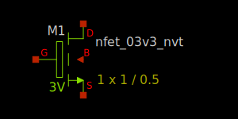
.. |symbol-nfet_05v0_nvt| image:: rules/device-details/nfet_05v0_nvt/symbol-nfet_05v0_nvt.svg
.. |symbol-nfet_20v0_iso| image:: rules/device-details/nfet_20v0_iso/symbol-nfet_20v0_iso.svg
.. |symbol-nfet_20v0_nvt| image:: rules/device-details/nfet_20v0_nvt/symbol-nfet_20v0_nvt.svg
.. |symbol-nfet_20v0| image:: rules/device-details/nfet_20v0/symbol-nfet_20v0.svg

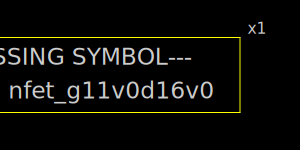
.. |symbol-nfet_g5v0d10v5| image:: rules/device-details/nfet_g5v0d10v5/symbol-nfet_g5v0d10v5.svg
.. |symbol-npn_05v0-1| image:: rules/device-details/npn_05v0/symbol-npn_05v0-1.svg
.. |symbol-npn_05v0-2| image:: rules/device-details/npn_05v0/symbol-npn_05v0-2.svg
.. |symbol-npn_05v0-3| image:: rules/device-details/npn_05v0/symbol-npn_05v0-3.svg
.. |symbol-pfet_01v8_hvt| image:: rules/device-details/pfet_01v8_hvt/symbol-pfet_01v8_hvt.svg
.. |symbol-pfet_01v8_lvt| image:: rules/device-details/pfet_01v8_lvt/symbol-pfet_01v8_lvt.svg
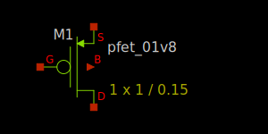
.. |symbol-pfet_20v0| image:: rules/device-details/pfet_20v0/symbol-pfet_20v0.svg
.. |symbol-esd_pfet_g5v0d10v5| image:: rules/device-details/pfet_g5v0d10v5/symbol-esd_pfet_g5v0d10v5.svg
.. |symbol-pfet_g5v0d10v5| image:: rules/device-details/pfet_g5v0d10v5/symbol-pfet_g5v0d10v5.svg
.. |symbol-pfet_g5v0d16v0| image:: rules/device-details/pfet_g5v0d16v0/symbol-pfet_g5v0d16v0.svg
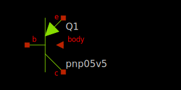
.. |symbol-pnp_05v0-b| image:: rules/device-details/pnp_05v0/symbol-pnp_05v0-b.svg
.. |symbol-res_generic_l1| image:: rules/device-details/res_generic/symbol-res_generic_l1.svg
.. |symbol-res_generic_m1| image:: rules/device-details/res_generic/symbol-res_generic_m1.svg
.. |symbol-res_generic_m2| image:: rules/device-details/res_generic/symbol-res_generic_m2.svg
.. |symbol-res_generic_m3| image:: rules/device-details/res_generic/symbol-res_generic_m3.svg
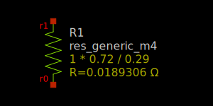
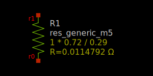
.. |symbol-res_generic_nd| image:: rules/device-details/res_generic/symbol-res_generic_nd.svg
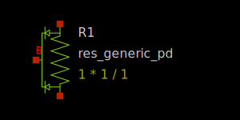
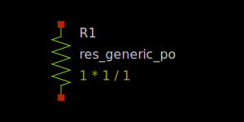
.. |symbol-res_generic_pw| image:: rules/device-details/res_generic/symbol-res_generic_pw.svg
.. |symbol-res_high_po_0p35| image:: rules/device-details/res_high/symbol-res_high_po_0p35.svg
.. |symbol-res_high_po_0p69| image:: rules/device-details/res_high/symbol-res_high_po_0p69.svg
.. |symbol-res_high_po_1p41| image:: rules/device-details/res_high/symbol-res_high_po_1p41.svg
.. |symbol-res_high_po_2p85| image:: rules/device-details/res_high/symbol-res_high_po_2p85.svg
.. |symbol-res_high_po_5p73| image:: rules/device-details/res_high/symbol-res_high_po_5p73.svg
.. |symbol-res_high_po| image:: rules/device-details/res_high/symbol-res_high_po.svg
.. |symbol-res_xhigh_po_0p35| image:: rules/device-details/res_xhigh/symbol-res_xhigh_po_0p35.svg
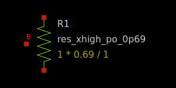
.. |symbol-res_xhigh_po_1p41| image:: rules/device-details/res_xhigh/symbol-res_xhigh_po_1p41.svg
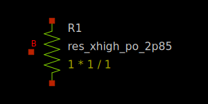
.. |symbol-res_xhigh_po_5p73| image:: rules/device-details/res_xhigh/symbol-res_xhigh_po_5p73.svg
.. |symbol-res_xhigh_po| image:: rules/device-details/res_xhigh/symbol-res_xhigh_po.svg

.. |old_symbol-cap_mim_m3| image:: old_symbols/cap_mim/symbol-cap_mim_m3.svg
.. |old_symbol-cap_mim_m4| image:: old_symbols/cap_mim/symbol-cap_mim_m4.svg
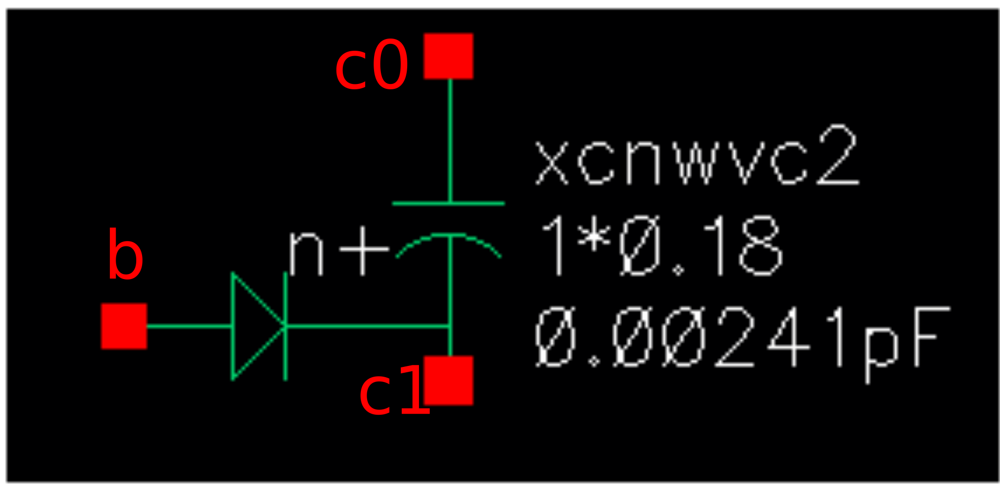
.. |old_symbol-cap_var-lvt| image:: old_symbols/cap_var/symbol-cap_var-lvt.svg
.. |old_symbol-cap_vpp-parallel| image:: old_symbols/cap_vpp/symbol-cap_vpp-parallel.svg

.. |old_symbol-diode-10| image:: old_symbols/diodes/symbol-diode-10.svg

.. |old_symbol-diode-16| image:: old_symbols/diodes/symbol-diode-16.svg

.. |old_symbol-esd_nfet_g5v0d10v5| image:: old_symbols/esd_nfet/symbol-esd_nfet_g5v0d10v5.svg

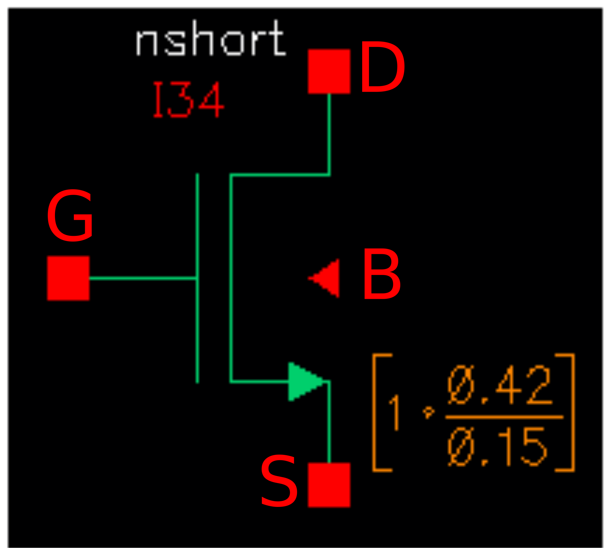
.. |old_symbol-nfet_01v8_lvt| image:: old_symbols/nfet_01v8_lvt/symbol-nfet_01v8_lvt.svg
.. |old_symbol-nfet_03v3_nvt| image:: old_symbols/nfet_03v3_nvt/symbol-nfet_03v3_nvt.svg

.. |old_symbol-nfet_20v0| image:: old_symbols/nfet_20v0/symbol-nfet_20v0.svg
.. |old_symbol-nfet_20v0_iso| image:: old_symbols/nfet_20v0_iso/symbol-nfet_20v0_iso.svg
.. |old_symbol-nfet_20v0_nvt| image:: old_symbols/nfet_20v0_nvt/symbol-nfet_20v0_nvt.svg

.. |old_symbol-nfet_g11v0d16v0| image:: old_symbols/nfet_g11v0d16v0/symbol-nfet_g11v0d16v0.svg

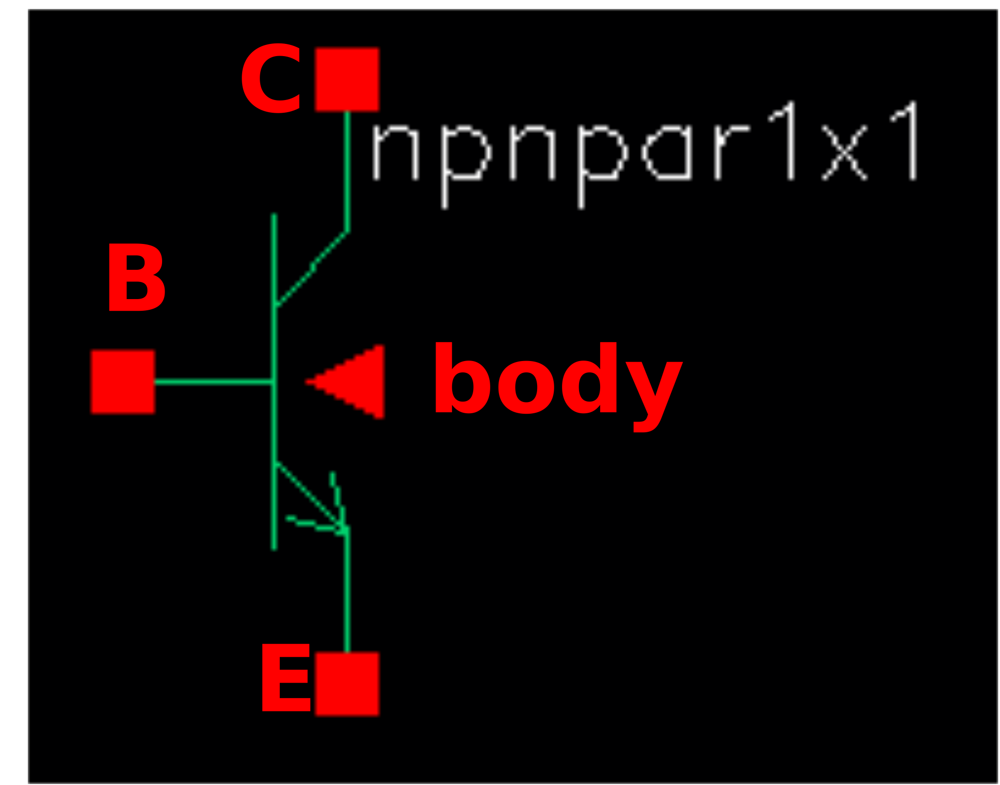
.. |old_symbol-npn_05v0-2| image:: old_symbols/npn_05v0/symbol-npn_05v0-2.svg

.. |old_symbol-pfet_01v8| image:: old_symbols/pfet_01v8/symbol-pfet_01v8.svg
.. |old_symbol-pfet_01v8_hvt| image:: old_symbols/pfet_01v8_hvt/symbol-pfet_01v8_hvt.svg

.. |old_symbol-pfet_20v0| image:: old_symbols/pfet_20v0/symbol-pfet_20v0.svg
.. |old_symbol-esd_pfet_g5v0d10v5| image:: old_symbols/pfet_g5v0d10v5/symbol-esd_pfet_g5v0d10v5.svg
.. |old_symbol-pfet_g5v0d10v5| image:: old_symbols/pfet_g5v0d10v5/symbol-pfet_g5v0d10v5.svg
.. |old_symbol-pfet_g5v0d16v0| image:: old_symbols/pfet_g5v0d16v0/symbol-pfet_g5v0d16v0.svg
.. |old_symbol-pnp_05v0-a| image:: old_symbols/pnp_05v0/symbol-pnp_05v0-a.svg
.. |old_symbol-pnp_05v0-b| image:: old_symbols/pnp_05v0/symbol-pnp_05v0-b.svg
.. |old_symbol-res_generic_l1| image:: old_symbols/res_generic/symbol-res_generic_l1.svg
.. |old_symbol-res_generic_m1| image:: old_symbols/res_generic/symbol-res_generic_m1.svg
.. |old_symbol-res_generic_m2| image:: old_symbols/res_generic/symbol-res_generic_m2.svg
.. |old_symbol-res_generic_m3| image:: old_symbols/res_generic/symbol-res_generic_m3.svg
.. |old_symbol-res_generic_m4| image:: old_symbols/res_generic/symbol-res_generic_m4.svg
.. |old_symbol-res_generic_m5| image:: old_symbols/res_generic/symbol-res_generic_m5.svg
.. |old_symbol-res_generic_nd| image:: old_symbols/res_generic/symbol-res_generic_nd.svg
.. |old_symbol-res_generic_pd| image:: old_symbols/res_generic/symbol-res_generic_pd.svg
.. |old_symbol-res_generic_po| image:: old_symbols/res_generic/symbol-res_generic_po.svg
.. |old_symbol-res_generic_pw| image:: old_symbols/res_generic/symbol-res_generic_pw.svg
.. |old_symbol-res_high_po| image:: old_symbols/res_high/symbol-res_high_po.svg
.. |old_symbol-res_high_po_0p35| image:: old_symbols/res_high/symbol-res_high_po_0p35.svg
.. |old_symbol-res_high_po_0p69| image:: old_symbols/res_high/symbol-res_high_po_0p69.svg
.. |old_symbol-res_high_po_1p41| image:: old_symbols/res_high/symbol-res_high_po_1p41.svg

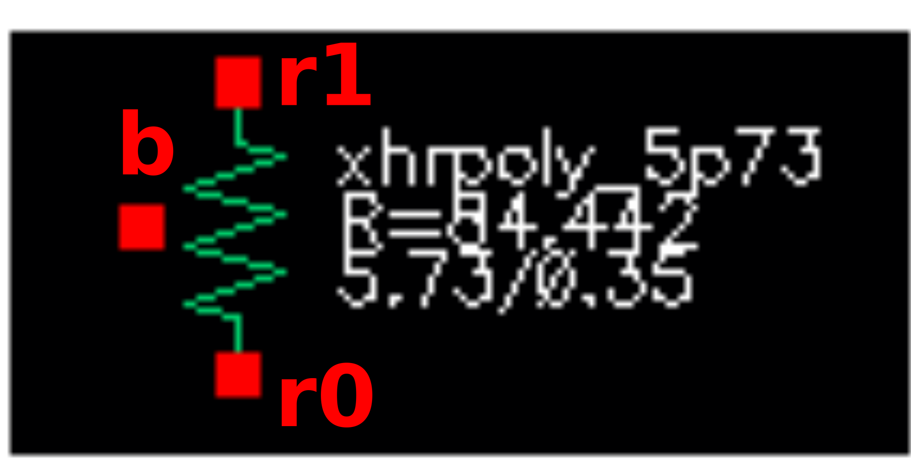
.. |old_symbol-res_xhigh_po| image:: old_symbols/res_xhigh/symbol-res_xhigh_po.svg

.. |old_symbol-res_xhigh_po_0p69| image:: old_symbols/res_xhigh/symbol-res_xhigh_po_0p69.svg
.. |old_symbol-res_xhigh_po_1p41| image:: old_symbols/res_xhigh/symbol-res_xhigh_po_1p41.svg
.. |old_symbol-res_xhigh_po_2p85| image:: old_symbols/res_xhigh/symbol-res_xhigh_po_2p85.svg

