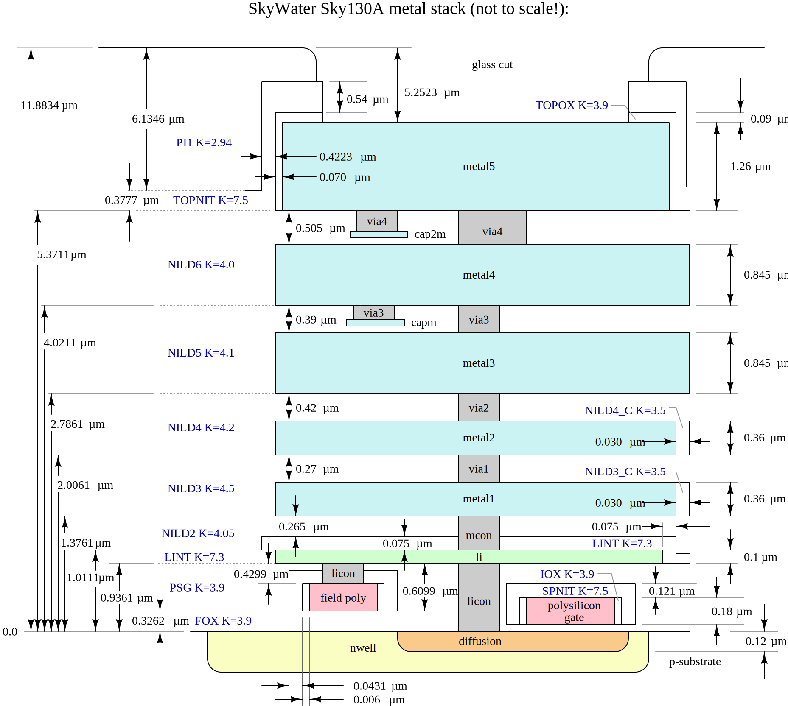

Criteria & Assumptions
======================

Process Stack Diagram
---------------------

Details about the layers can be found in :ref:`SkyWater GDS Layers Information` page.

General
-------

.. csv-table:: Table 1 - General
   :file: assumptions/01-general.csv
   :header-rows: 1
   :stub-columns: 1

Minimum Critical Dimensions
---------------------------

.. csv-table:: Table 2 - Minimum CDs in Design or on Wafer, required by Technology (Core or Periphery)
   :file: assumptions/02-mins.csv
   :header-rows: 1
   :widths: 20, 20, 10, 10, 10, 10

Semiconductor Criteria
----------------------

Basic Parameters
~~~~~~~~~~~~~~~~

.. csv-table:: Table 3a - Semiconductor Criteria - Basic Parameters
   :header-rows: 1
   :width: 100%
   :widths: 30, 10, 20, 10

    ,Units,Value,Variable name
    n-well peak concentration,cm-3,6.00E+017,NWPCONC
    background concentration,cm-3,8.00E+14,NWBCONC
    y.char,um,0.43,NWYCHAR
    desired Nmin/Ns ratio,,0.9,NMINNSRATIO
    min n-well width to guarantee 90 % peak concentr.,um,0.55,MINNWWID
    p-well peak concentration,cm-3,4E+017,PWPCONC
    p-well peak coordinate,um,0.42,PWPCOORD
    y.char,um,0.13,PWYCHAR
    min. p-well width to guarantee 90 % peak concentr.,um,0.33,MINPWWID

Junction Depths
~~~~~~~~~~~~~~~

.. csv-table:: Table 3b - Semiconductor Criteria - Junction Depths
   :header-rows: 1
   :width: 100%
   :widths: 30, 10, 10, 10, 10

    ,Units,Vertical Feature,Vertical Space,Variable name
    Baseline: N-Well,um,1.1, ,NWVDIM
    P-Well,um,0.75,,PWVDIM
    N-w/P-w junction (from drawn edge),um,*,0.034,WELLJCT
    N+ or P+ S/D (XJ),um,0.1,0.06,JCTD / LD
    Max (N+ or P+ S/D outdiff.) next to isol. edge,um,,0.007,LDST
    Max (N+ or P+ S/D outdiff.) next to isol. edge for 6 V reg. devices,,,0.05,LDST5
    N Tip (As),um, ,0.01,LDNTIP

Other Width Criteria
~~~~~~~~~~~~~~~~~~~~

.. csv-table:: Table 3c - Semiconductor Criteria - Other Width Criteria
   :header-rows: 1
   :width: 100%
   :widths: 30, 10, 20, 10

    ,Units,Value,Variable name
    Min. diff/tap width for reproducible resistivity,um,0.12,MINFWR
    Min. width to open a strip of tap between two diffs,um,0.34,SDM3
    "Max s/d diff width without contact, consistent w/Ram4,5,6",um,5.7,XMAXCON

Punchthrough Criteria
~~~~~~~~~~~~~~~~~~~~~

.. csv-table:: Table 3d - Semiconductor Criteria - Minimum Spacing for 3.3V Punchthrough (1.8V devices)
   :header-rows: 1
   :width: 100%
   :widths: 30, 10, 20, 10

    ,Units,Value,Variable name
    n-well - n-well ,um,0.835,NWPTS
    n+ - n+ or p+-p+,um,0.23,DPTS
    p+ in nwell to pwell,um,0.05,PPTS
    n+ in pwell to nwell,um,0.15,PNPTS

Latch-up/ESD Criteria
~~~~~~~~~~~~~~~~~~~~~

.. csv-table:: Table 3e - Semiconductor Criteria - Latch-up/ESD Criteria
   :header-rows: 1
   :width: 100%
   :widths: 30, 10, 20, 10

    Minimum n+ or p+ - nwell spacing to prevent latch-up,um,0.23,NPNWLU
    Min n-well enclos. of tap to ensure bkdwn N-w/P-w before N+/P-w (ESD),um,0.04,XNWESD
    Max. overlap of n-well by p+ tap,um,0.06,XNWPTS

Implant angles
~~~~~~~~~~~~~~

.. csv-table:: Table 3f - Semiconductor Criteria - Implant angles
   :header-rows: 1
   :width: 100%
   :widths: 30, 10, 10, 10, 10

    ,Units,Angle,,Variable name
    High current,deg,0,0,HCIMPA
    Angle for tip implant ,deg,7,,TipAng
    Angle for HV tip implant ,deg,40,,HvTipAngle
    Twist angle for HV Tip ,deg,23,,HvTipTwist

Physical Criteria
-----------------

.. csv-table:: Table 4 - Physical Criteria
   :file: assumptions/04-physical.csv
   :header-rows: 1
   :widths: 60, 10, 1, 10, 10, 10

Laser Fuse Criteria
-------------------

.. csv-table:: Table 5 - Laser Fuse Criteria
   :file: assumptions/05-laser-fuse.csv
   :header-rows: 1
   :widths: 60, 10, 1, 10, 10, 10

.. What happened to 6!?

Other criteria and parameters
-----------------------------

.. csv-table:: Table 7 - Other criteria and parameters
   :file: assumptions/07-other.csv
   :header-rows: 1
   :widths: 60, 10, 1, 10, 10, 10

Criteria for High Voltage FET
-----------------------------

.. csv-table:: Table 8 - Criteria for High Voltage FET
   :file: assumptions/08-hv.csv
   :header-rows: 1
   :widths: 60, 10, 1, 10, 10, 10

Criteria for polyimide manufacturability
----------------------------------------

.. csv-table:: Table 9 - Criteria for polyimide manufacturability
   :file: assumptions/09-polyimide.csv
   :header-rows: 1
   :widths: 60, 10, 1, 10, 10, 10

Criteria for VPP capacitor
--------------------------

.. csv-table:: Table 10 - Criteria for VPP capacitor
   :file: assumptions/10-vpp-capacitor.csv
   :header-rows: 1
   :widths: 60, 10, 1, 10, 10, 10
