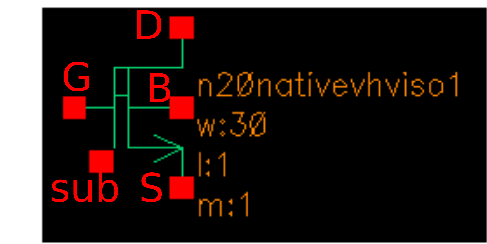
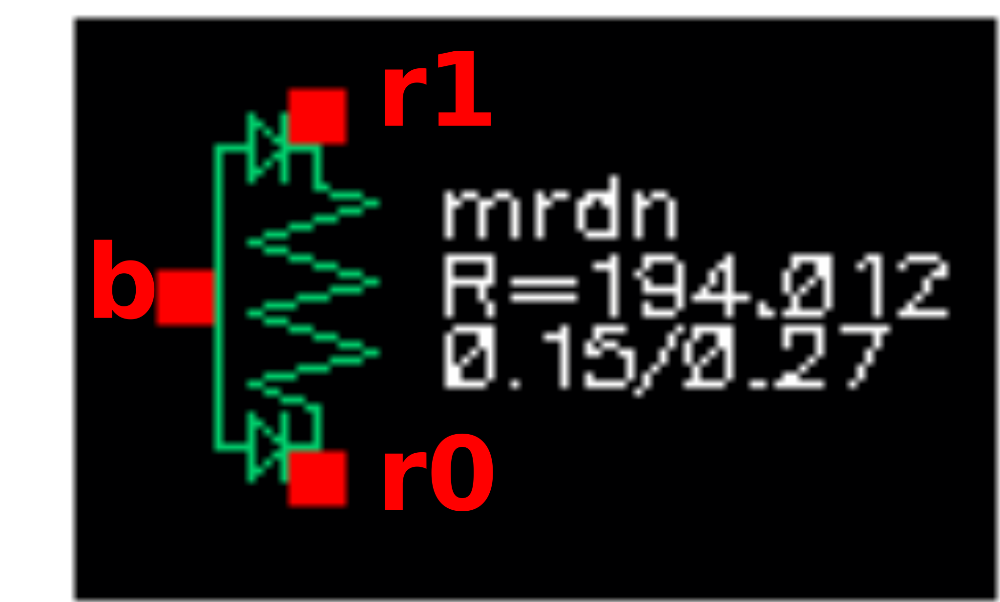
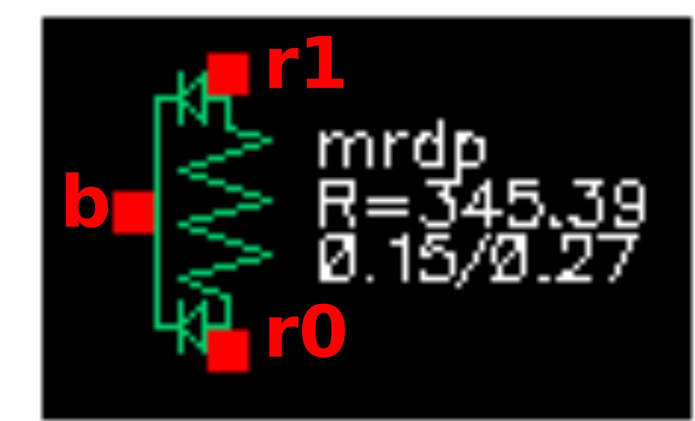
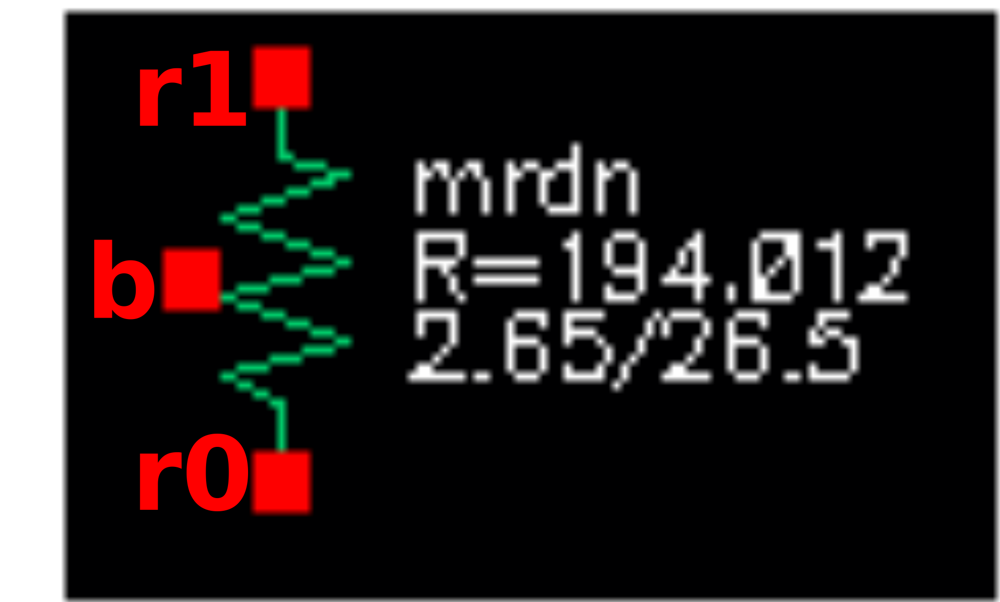
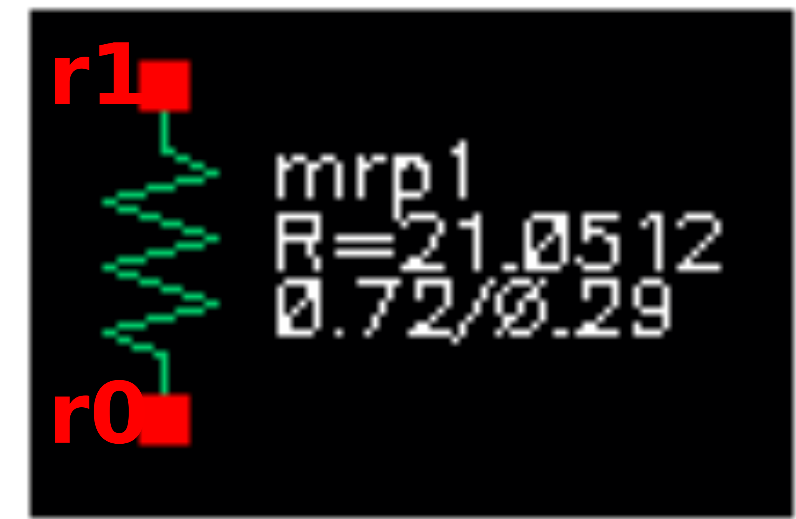
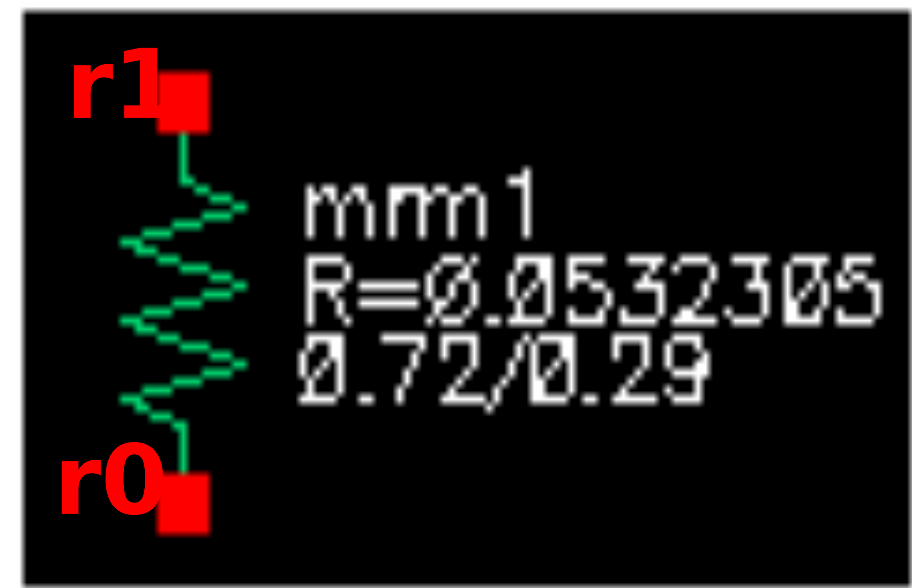
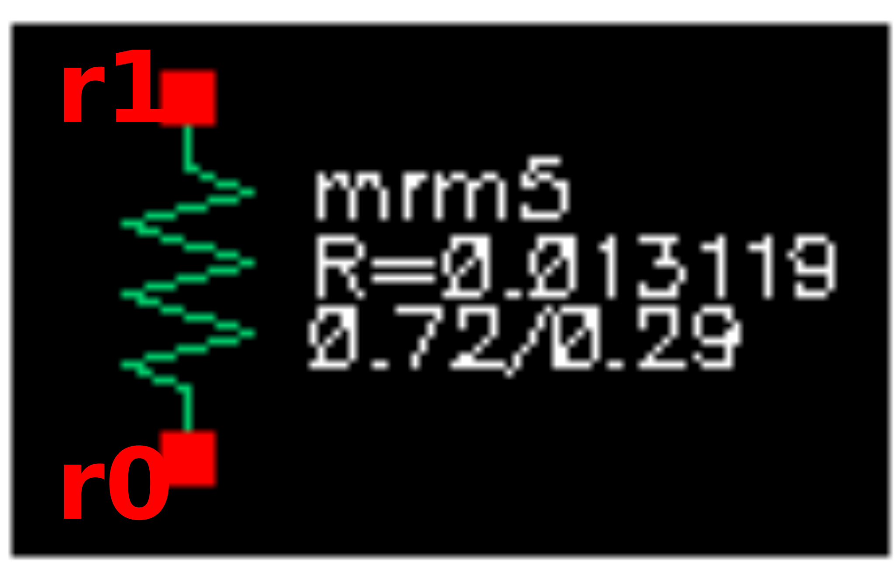
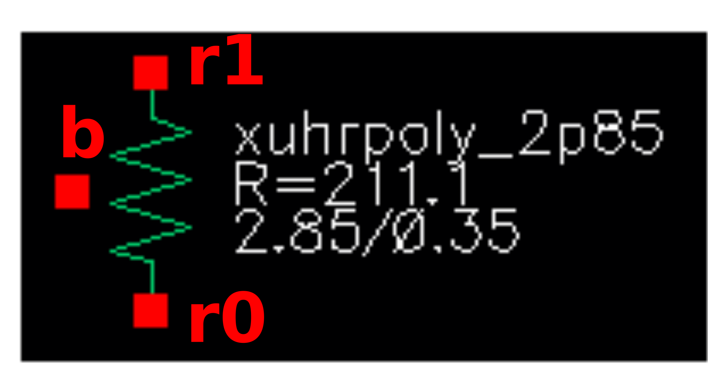

Device Details
==============

Bipolar (NPN)
-------------

Spice Model Information
~~~~~~~~~~~~~~~~~~~~~~~

-  Cell Name: :cell:`sky130_fd_pr_base__npn4`
-  Model Names: :model:`sky130_fd_pr_base__npnpar1x1`, :model:`sky130_fd_pr_base__npnpar1x2`, :model:`sky130_fd_pr_base__npn_1x1_2p0_hv`

Operating regime where SPICE models are valid

-  \|V\ :sub:`CE`\ \| = 0 to 5.0V
-  \|V\ :sub:`BE`\ \| = 0 to 5.0V
-  I\ :sub:`CE` = 0.01 to 10 µA/µm\ :sup:`2`

Details
~~~~~~~

The SKY130 process offers “free” NPN devices. The NPN uses the deep n-well as the collector. The device is not optimized, and must be used in the forward-active mode. The following sizes of NPN’s are available:

-  ungated device with emitter 1.0 x 1.0
-  ungated device with emitter 1.0 x 2.0
-  poly-gated version with octagonal emitter of A = 1.97 µm\ :sup:`2`

The :model:`sky130_fd_pr_base__npn_1x1_2p0_hv` device has a poly gate placed between the emitter and base diffusions, to prevent carrier recombination at the STI edge and increase β. The poly gate is connected to the emitter terminal.

Using this device must be done in conjunction with the correct guard rings, to avoid potential latchup issues with nearby circuitry. Reverse-active mode operation of the BJT’s are neither modeled nor permitted. E-test specs for the NPN devices are shown in the table below:

.. include:: device-details/bipolar-npn/bipolar-npn-table0.rst

Symbols for the npnpar are shown below

|symbol-bipolar-npn-1| |symbol-bipolar-npn-2| |symbol-bipolar-npn-3|

The cross-section of the :model:`sky130_fd_pr_base__npnpar1x1`/:model:`sky130_fd_pr_base__npnpar1x2` is shown below.

|cross-section-bipolar-npnpar1x|

The cross-section of the :model:`sky130_fd_pr_base__npn_1x1_2p0_hv` is shown below. The poly gate is tied to the emitter to prevent the parasitic MOSFET from turning on.

|cross-section-bipolar-npn_1x1_2p0_hv|

.. |symbol-bipolar-npn-1| image:: device-details/bipolar-npn/symbol-bipolar-npn-1.svg
.. |symbol-bipolar-npn-2| image:: device-details/bipolar-npn/symbol-bipolar-npn-2.svg
.. |symbol-bipolar-npn-3| image:: device-details/bipolar-npn/symbol-bipolar-npn-3.svg

Bipolar (PNP)
-------------

Spice Model Information
~~~~~~~~~~~~~~~~~~~~~~~

-  Cell Name: :cell:`sky130_fd_pr_base__pnp4`
-  Model Names: :model:`sky130_fd_pr_base__pnppar`, :model:`sky130_fd_pr_base__pnppar5x`

Operating regime where SPICE models are valid

-  \|V\ :sub:`CE`\ \| = 0 to 5.0V
-  \|V\ :sub:`BE`\ \| = 0 to 5.0V
-  I\ :sub:`CE` = 0.01 to 10 µA/µm\ :sup:`2`

Details
~~~~~~~

The SKY130 process offer a “free” PNP device, which utilizes the substrate as the collector. This device is not independently optimized, and can be used in forward-active mode. The following sizes of PNP are available:

-  ungated device with emitter 0.68 x 0.68 (A=0.4624 µm\ :sup:`2`)
-  ungated device with emitter 3.4 x 3.4 (A=11.56 µm\ :sup:`2`)

Using this device must be done in conjunction with the correct guard rings, to avoid potential latchup issues with nearby circuitry. Reverse-active mode operation of the BJT’s are neither modeled nor permitted.

E-test specs for these devices are shown in the table below:

.. include:: device-details/bipolar-pnp/bipolar-pnp-table0.rst

Symbols for the :model:`sky130_fd_pr_base__pnppar` is shown below

|symbol-bipolar-a| |symbol-bipolar-b|

The cross-section of the pnp is shown below.

No deep n-well exists in this device; the collector is the substrate.

|cross-section-bipolar|

MiM Capacitor
-------------

Spice Model Information
~~~~~~~~~~~~~~~~~~~~~~~

-  Cell Name: :cell:`sky130_fd_pr_base__mimcap34`, :cell:`sky130_fd_pr_base__mimcap45`
-  Model Names: :model:`sky130_fd_pr_base__xcmimc`, :model:`sky130_fd_pr_base__xcmim2c`

Operating Voltages where SPICE models are valid

-  \|V\ :sub:`c0` – V\ :sub:`c1`\ \| = 0 to 5.0V

Details
~~~~~~~

The MiM capacitor is constructed using a thin dielectric over metal, followed by a thin conductor layer on top of the dielectric. There are two possible constructions:

-  CAPM over Metal-3
-  CAP2M over Metal-4

The constructions are identical, and the capacitors may be stacked to maximize total capacitance.

Electrical specs are listed below:

.. include:: device-details/capacitors-mim/capacitors-mim-table0.rst

The symbol for the MiM capacitor is shown below. Note that the cap model is a sub-circuit which accounts for the parasitic contact resistance and the parasitic capacitance from the bottom plate to substrate.

|symbol-capacitor-mim|

Cell name

M \* W \* L

Calc capacitance

The cross-section of the “stacked” MiM capacitor is shown below:

|cross-section-capacitor-mim|

.. |symbol-capacitor-mim| image:: device-details/capacitors-mim/symbol-capacitor-mim.svg

Vertical Parallel Plate (VPP) capacitors
----------------------------------------

Spice Model Information
~~~~~~~~~~~~~~~~~~~~~~~

-  Cell Name: :cell:`sky130_fd_pr_base__cap_int3_vppcap`
-  Model Names: :model:`sky130_fd_pr_base__xcmvppXxY _{MMshield}`

   -  X and Y are size dimentions
   -  {MMshield} refers to metal layer used as shield

Operating Voltages where SPICE models are valid

-  \|V\ :sub:`c0` – V\ :sub:`c1`\ \| = 0 to 5.5V

Details
~~~~~~~

The VPP caps utilize the tight spacings of the metal lines to create capacitors using the available metal layers. The fingers go in opposite directions to minimize alignment-related variability, and the capacitor sits on field oxide to minimize silicon capacitance effects. A schematic diagram of the layout is shown below:

M3

**M2**

LI

M1

LAYOUT of M2, M3, M4

LAYOUT of LI and M1 (with POLY sheet)

**POLY**

**M4**

These capacitors are fixed-size, and they can be connected together to multiply the effective capacitance of a given node. There are multiple constructions under two different cell names:

cap\_int3—these are older versions, where stacked metal lines run parallel

-  xcmvpp3 (M1 \|\| M2 only, 7.84 x 8.58)
-  xcmvpp4 (M1 \|\| M2 only, 4.38 x 4.59)
-  xcmvpp5 (M1 \|\| M2 only, 2.19 x 4.59)
-  xcmvpp4p4x4p6\_m1m2 (M1 :sub:`┴` M2, 4.4 x 4.6, 4 quadrants)
-  xcmvpp11p5x11p7\_m1m2 (M1 :sub:`┴` M2, 11.5 x 11.7, 4 quadrants)
-  xcmvpp\_hd5\_4x2
-  xcmvpp\_hd5\_atlas\_fingercap\_l5 (M1 \|\| M2 \|\| M3 \|\| M4, 2.7 x 5.0)
-  xcmvpp\_hd5\_atlas\_fingercap2\_l5 (M1 \|\| M2 \|\| M3 \|\| M4, 2.85 x 5.0)
-  xcmvpp\_hd5\_atlas\_fingercap\_l10 (M1 \|\| M2 \|\| M3 \|\| M4, 2.7 x 10.0)
-  xcmvpp\_hd5\_atlas\_fingercap\_l20 (M1 \|\| M2 \|\| M3 \|\| M4, 2.7 x 20.0)
-  xcmvpp\_hd5\_atlas\_fingercap\_l40 (M1 \|\| M2 \|\| M3 \|\| M4, 2.7 x 40.0)

The symbol for the cap\_int3 is shown below. The terminals c0 and c1 represent the two sides of the capacitor, with b as the body (sub or well).

|symbol-capacitor-vpp-cap_int3|

cap\_int3

vppcap—newer versions, where stacked metal lines run perpendicular and there are shields on top and bottom

-  xcmvpp11p5x11p7\_m5shield (11.5x11.7, with M5 shield)
-  xcmvpp11p5x11p7\_polym5shield (11.5x11.7, with poly and M5 shield)
-  xcmvpp11p5x11p7\_lim5shield (11.5x11.7, with LI and M5 shield)
-  xcmvpp4p4x4p6\_m3\_lim5shield (4.4x4.6, M3 float, LI / M5 shield)
-  xcmvpp8p6x7p9\_m3\_lim5shield (8.6x7.9, M3 float, LI / M5 shield)
-  xcmvpp11p5x11p7\_m3\_lim5shield (11.5x11.7, M3 float, LI / M5 shield)
-  xcmvpp11p5x11p7\_m4shield (11.5x11.7, with M4 shield)
-  xcmvpp6p8x6p1\_polym4shield (6.8x6.1, with poly and M4 shield)
-  xcmvpp6p8x6p1\_lim4shield (6.8x6.1, with LI and M4 shield)
-  xcmvppx4x2xnhative10x4 (11.5x11.7, over 2 nhvnative of 10/4 each)

The symbol for the vppcap is shown below. The terminals c0 and c1 are the two capacitor terminals, “top” represents the top shield and “sub” the bottom shield.

|symbol-capacitor-vpp-cap|

The capacitors are fixed-size elements and must be used as-is; they can be used in multiples.

.. include:: device-details/capacitors-vpp/capacitors-vpp-table0.rst

This page intentionally left blank

.. |symbol-capacitor-vpp-cap| image:: device-details/capacitors-vpp/symbol-capacitor-vpp-cap.svg

SONOS cells
-----------

The SKY130 process currently supports two SONOS flash memory cells:

-  The original cell is supported in the S8PFHD, S8PHRC and S8PFN-20 technology options, with operating temperatures from -55°C to +155°C
-  The “star” cell is supported in the S8PHIRS technology option. Its cell size is approximately 25% smaller than the original cell, but its temperature range is restricted to -40°C to +125°C.

Spice models for the memory cells exist for multiple conditions:

.. include:: device-details/cells-sonos/cells-sonos-table0.rst

Program and Erase characteristics are described in more detail in the ***S8 Nonvolatile Technology Spec*** (001-08712), and summarized below:

.. include:: device-details/cells-sonos/cells-sonos-table1.rst

Endurance behavior is illustrated below (100K cycles guaranteed):

|sonos-erase-program|

Data retention behavior is shown below at 85C\ |sonos-data-retention|

E-test parameters are summarized below for both original and star cells:

.. include:: device-details/cells-sonos/cells-sonos-table2.rst

The schematic for the 2-T SONOS memory cell is shown below:

|schematic-sonos-cell|

The cross-section of the 2-T SONOS cell is shown below.

|cross-section-sonos-cell|

.. |schematic-sonos-cell| image:: device-details/cells-sonos/schematic-sonos-cell.svg

SRAM cells
----------

The SKY130 process currently supports only single-port SRAM’s, which are contained in hard-IP libraries. These cells are constructed with smaller design rules (Table 9), along with OPC (optical proximity correction) techniques, to achieve small memory cells. Use of the memory cells or their devices outside the specific IP is prohibited. The schematic for the SRAM is shown below in Figure 10. This cell is available in the S8 IP offerings and is monitored at e-test through the use of “pinned out” devices within the specific arrays.

|figure-10-schematics-of-the-single-port-sram|

**Figure 10. Schematics of the Single Port SRAM.**

A Dual-Port SRAM is currently being designed using a similar approach. Compilers for the SP and DP SRAM’s will be available end-2019.

Operating Voltages where SPICE models are valid

-  V\ :sub:`DS` = 0 to 1.8V
-  V\ :sub:`GS` = 0 to 1.8V
-  V\ :sub:`BS` = 0 to -1.8V

Details
~~~~~~~

N-pass FET (SRAM)
^^^^^^^^^^^^^^^^^

Spice Model Information
~~~~~~~~~~~~~~~~~~~~~~~

-  Cell Name: :cell:`sky130_fd_pr_base__nfet`
-  Model Name (SRAM): :model:`sky130_fd_pr_base__npass.1`

.. include:: device-details/cells-sram/cells-sram-table0.rst

N-latch FET (SRAM)
^^^^^^^^^^^^^^^^^^

Spice Model Information
~~~~~~~~~~~~~~~~~~~~~~~

-  Cell Name: :cell:`sky130_fd_pr_base__nfet`
-  Model Name (SRAM): :model:`sky130_fd_pr_base__npd.1`

.. include:: device-details/cells-sram/cells-sram-table1.rst

P-latch FET (SRAM)
^^^^^^^^^^^^^^^^^^

Spice Model Information
~~~~~~~~~~~~~~~~~~~~~~~

-  Cell Name: :cell:`sky130_fd_pr_base__pfet`
-  Model Name (SRAM): :model:`sky130_fd_pr_base__ppu.1`

.. include:: device-details/cells-sram/cells-sram-table2.rst

Diodes
------

Spice Model Information
~~~~~~~~~~~~~~~~~~~~~~~

-  Cell Name: :cell:`sky130_fd_pr_base__diode`
-  Model Names: :model:`sky130_fd_pr_base__ndiode`, :model:`sky130_fd_pr_base__ndiode_h`, :model:`sky130_fd_pr_base__ndiode_native`, :model:`sky130_fd_pr_base__ndiode_lvt`, :model:`sky130_fd_pr_base__pdiode`, :model:`sky130_fd_pr_base__pdiode_h`, :model:`sky130_fd_pr_base__pdiode_hvt`, :model:`sky130_fd_pr_base__pdiode_lvt`, :model:`sky130_fd_pr_base__xnwdiode_rf`, :model:`sky130_fd_pr_base__xdnwdiode_pwell_rf`, :model:`sky130_fd_pr_base__dnwdiode_pw`, :model:`sky130_fd_pr_base__dnwdiode_psub`, :model:`sky130_fd_pr_base__dnwdiode_psub_victim`, :model:`sky130_fd_pr_base__dnwdiode_psub_aggressor`, :model:`sky130_fd_pr_base__nwdiode`, :model:`sky130_fd_pr_base__nwdiode_victim`, :model:`sky130_fd_pr_base__nwdiode_aggressor`, :model:`sky130_fd_pr_base__xesd_ndiode_h_X`, :model:`sky130_fd_pr_base__xesd_ndiode_h_dnwl_X`, :model:`sky130_fd_pr_base__xesd_pdiode_h_X (X = 100 or 200 or 300)`
-  Cell Name: :cell:`sky130_fd_pr_base__lvsdiode`
-  Model Names: :model:`sky130_fd_pr_base__ndiode`, :model:`sky130_fd_pr_base__ndiode_h`, :model:`sky130_fd_pr_base__pdiode`, :model:`sky130_fd_pr_base__pdiode_h`, :model:`sky130_fd_pr_base__dnwdiode_psub`, :model:`sky130_fd_pr_base__dnwdiode_psub_victim`, :model:`sky130_fd_pr_base__dnwdiode_psub_aggressor`, :model:`sky130_fd_pr_base__nwdiode_victim`, :model:`sky130_fd_pr_base__nwdiode_aggressor`, :model:`sky130_fd_pr_base__xesd_ndiode_h_X`, :model:`sky130_fd_pr_base__xesd_ndiode_h_dnwl_X`, :model:`sky130_fd_pr_base__xesd_pdiode_h_X (X = 100 or 200 or 300)`

Operating regime where SPICE models are valid

-  \|V\ :sub:`d0` – V\ :sub:`d1`\ \| = 0 to 5.0V

Details
~~~~~~~

.. include:: device-details/diodes/diodes-table0.rst

Symbols for the diodes are shown below

|symbol-diode-01|\ |symbol-diode-02|\ |symbol-diode-03|\ |symbol-diode-04|

|symbol-diode-05| |symbol-diode-06| |symbol-diode-07| |symbol-diode-08|

|symbol-diode-09| |symbol-diode-10| |symbol-diode-11|

|symbol-diode-12| |symbol-diode-13|

|symbol-diode-14| |symbol-diode-15|

|symbol-diode-16| |symbol-diode-17|

.. |symbol-diode-01| image:: device-details/diodes/symbol-diode-01.svg
.. |symbol-diode-02| image:: device-details/diodes/symbol-diode-02.svg

.. |symbol-diode-05| image:: device-details/diodes/symbol-diode-05.svg
.. |symbol-diode-06| image:: device-details/diodes/symbol-diode-06.svg
.. |symbol-diode-07| image:: device-details/diodes/symbol-diode-07.svg
.. |symbol-diode-08| image:: device-details/diodes/symbol-diode-08.svg
.. |symbol-diode-09| image:: device-details/diodes/symbol-diode-09.svg
.. |symbol-diode-10| image:: device-details/diodes/symbol-diode-10.svg
.. |symbol-diode-11| image:: device-details/diodes/symbol-diode-11.svg
.. |symbol-diode-12| image:: device-details/diodes/symbol-diode-12.svg
.. |symbol-diode-13| image:: device-details/diodes/symbol-diode-13.svg
.. |symbol-diode-14| image:: device-details/diodes/symbol-diode-14.svg
.. |symbol-diode-15| image:: device-details/diodes/symbol-diode-15.svg
.. |symbol-diode-16| image:: device-details/diodes/symbol-diode-16.svg
.. |symbol-diode-17| image:: device-details/diodes/symbol-diode-17.svg

11V/16V NMOS FET
----------------

Spice Model Information
~~~~~~~~~~~~~~~~~~~~~~~

-  Cell Name: :cell:`sky130_fd_pr_base__nfetexd`
-  Model Name: :model:`sky130_fd_pr_base__nvhv`

Operating Voltages where SPICE models are valid, subject to SOA limitations:

-  V\ :sub:`DS` = 0 to +16V (V:sub:`GS` = 0)
-  V\ :sub:`DS` = 0 to +11V (V:sub:`GS` > 0)
-  V\ :sub:`GS` = 0 to 5.5V
-  V\ :sub:`BS` = 0 to -2.0V

Details
~~~~~~~

Major model output parameters are shown below and compared against the EDR (e-test) specs

.. include:: device-details/fet-nmos-11v-16v/fet-nmos-11v-16v-table0.rst

The symbol of the :model:`sky130_fd_pr_base__nvhv` (11V/16V NMOS FET) is shown below:

|symbol-11v-16v-nmos-fet|

The cross-section of the 11V/16VV NMOS FET is shown below.

|cross-section-11v-16v-nmos-fet|

1.8V NMOS FET
-------------

Spice Model Information
~~~~~~~~~~~~~~~~~~~~~~~

-  Cell Name: :cell:`sky130_fd_pr_base__nfet`
-  Model Name: :model:`sky130_fd_pr_base__nshort`

Operating Voltages where SPICE models are valid

-  V\ :sub:`DS` = 0 to 1.95V
-  V\ :sub:`GS` = 0 to 1.95V
-  V\ :sub:`BS` = +0.3 to -1.95V

Details
~~~~~~~

Major model output parameters are shown below and compared against the EDR (e-test) specs.

.. include:: device-details/fet-nmos-1v8/fet-nmos-1v8-table0.rst

The symbol of the :model:`sky130_fd_pr_base__nshort` (1.8V NMOS FET) is shown below:

|symbol-1v8-nmos-fet|

The cross-section of the NMOS FET is shown below:

|cross-section-1v8-nmos-fet|

The device shows the p-well inside of a deep n-well, but it can be made either with or without the DNW under the p-well

.. |symbol-1v8-nmos-fet| image:: device-details/fet-nmos-1v8/symbol-1v8-nmos-fet.svg
.. |cross-section-1v8-nmos-fet| image:: device-details/fet-nmos-1v8/cross-section-1v8-nmos-fet.svg

1.8V low-VT NMOS FET
--------------------

Spice Model Information
~~~~~~~~~~~~~~~~~~~~~~~

-  Cell Name: :cell:`sky130_fd_pr_base__nfet`
-  Model Name: :model:`sky130_fd_pr_base__nlowvt`

Operating Voltages where SPICE models are valid

-  V\ :sub:`DS` = 0 to 1.95V
-  V\ :sub:`GS` = 0 to 1.95V
-  V\ :sub:`BS` = +0.3 to -1.95V

Details
~~~~~~~

Major model output parameters are shown below and compared against the EDR (e-test) specs.

.. include:: device-details/fet-nmos-1v8-low-vt/fet-nmos-1v8-low-vt-table0.rst

Inverter Gate Delays using :model:`sky130_fd_pr_base__nlowvt`/pshort device combinations:

.. include:: device-details/fet-nmos-1v8-low-vt/fet-nmos-1v8-low-vt-table1.rst

The symbol of the :model:`sky130_fd_pr_base__nlowvt` (1.8V low-VT NMOS FET) is shown below:

|symbol-1v8-low-vt-nmos-fet|

The cross-section of the low-VT NMOS FET is shown below. The cross-section is identical to the std NMOS FET except for the V\ :sub:`T` adjust implants (to achieve the lower V\ :sub:`T`)

|cross-section-1v8-low-vt-nmos-fet|

.. |symbol-1v8-low-vt-nmos-fet| image:: device-details/fet-nmos-1v8-low-vt/symbol-1v8-low-vt-nmos-fet.svg

20V NMOS FET
------------

Spice Model Information
~~~~~~~~~~~~~~~~~~~~~~~

-  Cell Name: :cell:`sky130_fd_pr_base__nfetexd`
-  Model Name: :model:`sky130_fd_pr_base__n20vhv1`

Operating Voltages where SPICE models are valid, subject to SOA limitations:

-  V\ :sub:`DS` = 0 to +22V
-  V\ :sub:`GS` = 0 to 5.5V
-  V\ :sub:`BS` = 0 to -2.0V

Details
~~~~~~~

The 20V NMOS FET has similar construction to the 11V/16V NMOS FET, with several differences:

-  Longer drift region
-  Longer poly gate
-  Larger W/L
-  Devices placed in pairs (drain in center, sources on outside)

Major model output parameters are shown below and compared against the EDR (e-test) specs

.. include:: device-details/fet-nmos-20v/fet-nmos-20v-table0.rst

The symbol of the :model:`sky130_fd_pr_base__n20vhv1` (20V NMOS FET) is shown below.

|symbol-20v-nmos-fet|

The cross-section of the 20V NMOS FET is shown below.

|cross-section-20v-nmos-fet|

20V isolated NMOS FET
---------------------

Spice Model Information
~~~~~~~~~~~~~~~~~~~~~~~

-  Cell Name: :cell:`sky130_fd_pr_base__nfetexd`
-  Model Name: :model:`sky130_fd_pr_base__n20vhviso1`

Operating Voltages where SPICE models are valid, subject to SOA limitations:

-  V\ :sub:`DS` = 0 to +22V
-  V\ :sub:`GS` = 0 to 5.5V
-  V\ :sub:`BS` = 0 to -2.0V

Details
~~~~~~~

The 20V isolated NMOS FET has the same construction as the 20V NMOS FET, but is built over a Deep N-well. This permits the p-well to be isolated from the substrate and permit “high-side” usage (where the PW body is held above ground).

Major model output parameters are shown below and compared against the EDR (e-test) specs

.. include:: device-details/fet-nmos-20v-isolated/fet-nmos-20v-isolated-table0.rst

The symbol of the :model:`sky130_fd_pr_base__n20vhviso1` (20V isolated NMOS FET) is shown below.

|symbol-20v-isolated-nmos-fet|

The cross-section of the 20V isolated NMOS FET is shown below.

|cross-section-20v-isolated-nmos-fet|

.. |cross-section-20v-isolated-nmos-fet| image:: device-details/fet-nmos-20v-isolated/cross-section-20v-isolated-nmos-fet.svg

20V native NMOS FET
-------------------

Spice Model Information
~~~~~~~~~~~~~~~~~~~~~~~

-  Cell Name: :cell:`sky130_fd_pr_base__nfetexd`
-  Model Name: :model:`sky130_fd_pr_base__n20nativevhv1`

Operating Voltages where SPICE models are valid, subject to SOA limitations:

-  V\ :sub:`DS` = 0 to +22V
-  V\ :sub:`GS` = 0 to 5.5V
-  V\ :sub:`BS` = 0 to -2.0V

Details
~~~~~~~

The 20V native NMOS FET is similar to the 20V isolated NMOS FET, but has all Vt implants blocked to achieve a very low VT.

Major model output parameters are shown below and compared against the EDR (e-test) specs

.. include:: device-details/fet-nmos-20v-native/fet-nmos-20v-native-table0.rst

The symbol of the :model:`sky130_fd_pr_base__n20nativevhv1` (20V native NMOS FET) shown below.

|symbol-20v-native-nmos-fet|

The cross-section of the 20V native NMOS FET is shown below.

|cross-section-20v-native-nmos-fet|

20V NMOS zero-VT FET
--------------------

Spice Model Information
~~~~~~~~~~~~~~~~~~~~~~~

-  Cell Name: :cell:`sky130_fd_pr_base__nfetexd`
-  Model Name: :model:`sky130_fd_pr_base__n20zvtvhv1`

Operating Voltages where SPICE models are valid, subject to SOA limitations:

-  V\ :sub:`DS` = 0 to +22V
-  V\ :sub:`GS` = 0 to 5.5V
-  V\ :sub:`BS` = 0 to -2.0V

Details
~~~~~~~

The 20V NMOS zero-VT FET has p-well and all Vt implants blocked to achieve a zero VT.

Major model output parameters are shown below and compared against the EDR (e-test) specs

.. include:: device-details/fet-nmos-20v-zero-vt/fet-nmos-20v-zero-vt-table0.rst

The symbol of the :model:`sky130_fd_pr_base__n20zvtvhv1` (20V NMOS zero-VT FET) is still under development.

The cross-section of the 20V NMOS zero-VT FET is shown below.

|cross-section-20v-nmos-zero-vt-fet|

3.0V and 5.0V native NMOS FET
-----------------------------

Spice Model Information
~~~~~~~~~~~~~~~~~~~~~~~

-  Cell Name: :cell:`sky130_fd_pr_base__nfet`
-  Model Name: :model:`sky130_fd_pr_base__ntvnative`, :model:`sky130_fd_pr_base__nhvnative`

Operating Voltages where SPICE models are valid for :model:`sky130_fd_pr_base__ntvnative`

-  V\ :sub:`DS` = 0 to 3.3V
-  V\ :sub:`GS` = 0 to 3.3V
-  V\ :sub:`BS` = 0 to -3.3V

Details
~~~~~~~

Operating Voltages where SPICE models are valid for :model:`sky130_fd_pr_base__nhvnative`

-  V\ :sub:`DS` = 0 to 5.5V
-  V\ :sub:`GS` = 0 to 5.5V
-  V\ :sub:`BS` = +0.3 to -5.5V

Details
~~~~~~~

The native device is constructed by blocking out all VT implants.

The model and EDR (e-test) parameters are compared below. Note that the minimum gate length for 3V operation is 0.5 µm, whereas the 5V device has minimum gate length of 0.9 µm.

.. include:: device-details/fet-nmos-3v0-and-5v0-native/fet-nmos-3v0-and-5v0-native-table0.rst

The symbols for the :model:`sky130_fd_pr_base__ntvnative` and :model:`sky130_fd_pr_base__nhvnative` devices are shown below.

|symbol-3v0-and-5v0-native-nmos-fet-ntvnative| |symbol-3v0-and-5v0-native-nmos-fet-nhvnative|

The cross-section of the native devices is shown below. Note that the only differences between the nvtnative and :model:`sky130_fd_pr_base__nhvnative` devices are the minimum gate length and the VDS requirements.

|cross-section-3v0-and-5v0-native-nmos-fet|

.. |symbol-3v0-and-5v0-native-nmos-fet-nhvnative| image:: device-details/fet-nmos-3v0-and-5v0-native/symbol-3v0-and-5v0-native-nmos-fet-nhvnative.svg

5.0V/10.5V NMOS FET
-------------------

Spice Model Information
~~~~~~~~~~~~~~~~~~~~~~~

-  Cell Name: :cell:`sky130_fd_pr_base__nfet`
-  Model Name: :model:`sky130_fd_pr_base__nhv`

Operating Voltages where SPICE models are valid

-  V\ :sub:`DS` = 0 to 11.0V
-  V\ :sub:`GS` = 0 to 5.5V
-  V\ :sub:`BS` = 0 to -5.5V

Details
~~~~~~~

Major model output parameters are shown below and compared against the EDR (e-test) specs

.. include:: device-details/fet-nmos-5v0-10v5/fet-nmos-5v0-10v5-table0.rst

The symbols of the :model:`sky130_fd_pr_base__nhv` (5.0/10.5 V NMOS FET) is shown below:

|symbol-5v0-10v5-nmos-fet|

The cross-section of the 5.0/10.5 V NMOS FET is shown below.

|cross-section-5v0-10v5-nmos-fet|

.. |symbol-5v0-10v5-nmos-fet| image:: device-details/fet-nmos-5v0-10v5/symbol-5v0-10v5-nmos-fet.svg

NMOS ESD FET
------------

Spice Model Information
~~~~~~~~~~~~~~~~~~~~~~~

-  Cell Name: :cell:`sky130_fd_pr_base__nfet`
-  Model Name: :model:`sky130_fd_pr_base__nshortesd`, :model:`sky130_fd_pr_base__nhvesd`, :model:`sky130_fd_pr_base__nhvesdnative`

Operating Voltages where SPICE models are valid

-  V\ :sub:`DS` = 0 to 11.0V (nhv\*), 0 to 1.95V (nshort\*)
-  V\ :sub:`GS` = 0 to 5.0V (nhv\*), 0 to 1.95V (nshort\*)
-  V\ :sub:`BS` = 0 to -5.5V, (nhv), +0.3 to -5.5V (nhvnative), 0 to -1.95V (nshort\*)

Details
~~~~~~~

The ESD FET’s differ from the regular NMOS devices in several aspects, most notably:

-  Increased isolation spacing from contacts to surrounding STI
-  Increased drain contact-to-gate spacing
-  Placement of n-well under the drain contacts

Major model output parameters are shown below and compared against the EDR (e-test) specs

.. include:: device-details/fet-nmos-esd/fet-nmos-esd-table0.rst

The symbols of the :model:`sky130_fd_pr_base__nhvesd` and :model:`sky130_fd_pr_base__nhvesdnative` (ESD NMOS FET) are shown below:

|symbol-nmos-esd-fet-nhvesd| |symbol-nmos-esd-fet-nhvesdnative|

The cross-section of the ESD NMOS FET is shown below.

|cross-section-nmos-esd-fet|

.. |symbol-nmos-esd-fet-nhvesd| image:: device-details/fet-nmos-esd/symbol-nmos-esd-fet-nhvesd.svg
.. |symbol-nmos-esd-fet-nhvesdnative| image:: device-details/fet-nmos-esd/symbol-nmos-esd-fet-nhvesdnative.svg
.. |cross-section-nmos-esd-fet| image:: device-details/fet-nmos-esd/cross-section-nmos-esd-fet.svg

10V/16V PMOS FET
----------------

Spice Model Information
~~~~~~~~~~~~~~~~~~~~~~~

-  Cell Name: :cell:`sky130_fd_pr_base__pfetexd`
-  Model Name: :model:`sky130_fd_pr_base__pvhv`

Operating Voltages where SPICE models are valid, subject to SOA limitations:

-  V\ :sub:`DS` = 0 to -16V (V:sub:`GS` = 0)
-  V\ :sub:`DS` = 0 to -10V (V:sub:`GS` < 0)
-  V\ :sub:`GS` = 0 to -5.5V
-  V\ :sub:`BS` = 0 to +2.0V

Details
~~~~~~~

Major model output parameters are shown below and compared against the EDR (e-test) specs

.. include:: device-details/fet-pmos-10v-16v/fet-pmos-10v-16v-table0.rst

The symbol of the :model:`sky130_fd_pr_base__pvhv` (10V/16V PMOS FET) is shown below:

|symbol-10v-16v-pmos-fet|

The cross-section of the 10V/16V PMOS FET is shown below.

|cross-section-10v-16v-pmos-fet|

.. |symbol-10v-16v-pmos-fet| image:: device-details/fet-pmos-10v-16v/symbol-10v-16v-pmos-fet.svg
.. |cross-section-10v-16v-pmos-fet| image:: device-details/fet-pmos-10v-16v/cross-section-10v-16v-pmos-fet.svg

1.8V PMOS FET
-------------

Spice Model Information
~~~~~~~~~~~~~~~~~~~~~~~

-  Cell Name: :cell:`sky130_fd_pr_base__pfet`
-  Model Name: :model:`sky130_fd_pr_base__pshort`

Operating Voltages where SPICE models are valid

-  V\ :sub:`DS` = 0 to -1.95V
-  V\ :sub:`GS` = 0 to -1.95V
-  V\ :sub:`BS` = -0.1 to +1.95V

Details
~~~~~~~

Major model output parameters are shown below and compared against the EDR (e-test) specs.

.. include:: device-details/fet-pmos-1v8/fet-pmos-1v8-table0.rst

Inverter Gate Delays using nshort/:model:`sky130_fd_pr_base__pshort` device combinations:

.. include:: device-details/fet-pmos-1v8/fet-pmos-1v8-table1.rst

The symbol of the :model:`sky130_fd_pr_base__pshort` (1.8V PMOS FET) is shown below:

|symbol-1v8-pmos-fet|

The cross-section of the PMOS FET is shown below:

|cross-section-1v8-pmos-fet|

.. |symbol-1v8-pmos-fet| image:: device-details/fet-pmos-1v8/symbol-1v8-pmos-fet.svg

1.8V high-VT PMOS FET
---------------------

Spice Model Information
~~~~~~~~~~~~~~~~~~~~~~~

-  Cell Name: :cell:`sky130_fd_pr_base__pfet`
-  Model Name: :model:`sky130_fd_pr_base__phighvt`

Operating Voltages where SPICE models are valid

-  V\ :sub:`DS` = 0 to 1.95V
-  V\ :sub:`GS` = 0 to 1.95V
-  V\ :sub:`BS` = -0.1 to +1.95V

Details
~~~~~~~

Major model output parameters are shown below and compared against the EDR (e-test) specs

.. include:: device-details/fet-pmos-1v8-high-vt/fet-pmos-1v8-high-vt-table0.rst

Inverter Gate Delays using nshort/:model:`sky130_fd_pr_base__phighvt` device combinations:

.. include:: device-details/fet-pmos-1v8-high-vt/fet-pmos-1v8-high-vt-table1.rst

The symbol of the :model:`sky130_fd_pr_base__phighvt` (1.8V high-VT PMOS FET) is shown below:

|symbol-1v8-high-vt-pmos-fet|

The cross-section of the high-VT PMOS FET is shown below. The cross-section is identical to the std PMOS FET except for the V\ :sub:`T` adjust implants (to achieve the higher V\ :sub:`T`)

|cross-section-1v8-high-vt-pmos-fet|

.. |cross-section-1v8-high-vt-pmos-fet| image:: device-details/fet-pmos-1v8-high-vt/cross-section-1v8-high-vt-pmos-fet.svg

1.8V low-VT PMOS FET
--------------------

Spice Model Information
~~~~~~~~~~~~~~~~~~~~~~~

-  Cell Name: :cell:`sky130_fd_pr_base__pfet`
-  Model Name: :model:`sky130_fd_pr_base__plowvt`

Operating Voltages where SPICE models are valid

-  V\ :sub:`DS` = 0 to 1.95V
-  V\ :sub:`GS` = 0 to 1.95V
-  V\ :sub:`BS` = -0.1 to +1.95V

Details
~~~~~~~

Major model output parameters are shown below and compared against the EDR (e-test) specs

.. include:: device-details/fet-pmos-1v8-low-vt/fet-pmos-1v8-low-vt-table0.rst

Inverter Gate Delays using nlowvt/:model:`sky130_fd_pr_base__plowvt` device combinations:

.. include:: device-details/fet-pmos-1v8-low-vt/fet-pmos-1v8-low-vt-table1.rst

The symbol of the :model:`sky130_fd_pr_base__plowvt` (1.8V low-VT PMOS FET) is shown below:

|symbol-1v8-low-vt-pmos-fet|

The cross-section of the low-VT PMOS FET is shown below. The cross-section is identical to the std PMOS FET except for the V\ :sub:`T` adjust implants (to achieve the lower V\ :sub:`T`)

|cross-section-1v8-low-vt-pmos-fet|

.. |symbol-1v8-low-vt-pmos-fet| image:: device-details/fet-pmos-1v8-low-vt/symbol-1v8-low-vt-pmos-fet.svg

20V PMOS FET
------------

Spice Model Information
~~~~~~~~~~~~~~~~~~~~~~~

-  Cell Name: :cell:`sky130_fd_pr_base__pfetexd`
-  Model Name: :model:`sky130_fd_pr_base__p20vhv1`

Operating Voltages where SPICE models are valid, subject to SOA limitations:

-  V\ :sub:`DS` = 0 to -22V
-  V\ :sub:`GS` = 0 to -5.5V
-  V\ :sub:`BS` = 0 to +2.0V

Details
~~~~~~~

The 20V NMOS FET has similar construction to the 11V/16V NMOS FET, with several differences:

-  Longer drift region
-  Longer poly gate
-  Larger W/L
-  Devices placed in pairs (drain in middle, sources on outside)

Major model output parameters are shown below and compared against the EDR (e-test) specs

.. include:: device-details/fet-pmos-20v/fet-pmos-20v-table0.rst

The symbol of the :model:`sky130_fd_pr_base__p20vhv1` (20V PMOS FET) is shown below.

|symbol-20v-pmos-fet|

The cross-section of the 20V PMOS FET is shown below.

|cross-section-20v-pmos-fet|

.. |symbol-20v-pmos-fet| image:: device-details/fet-pmos-20v/symbol-20v-pmos-fet.svg

5.0V/10.5V PMOS FET
-------------------

Spice Model Information
~~~~~~~~~~~~~~~~~~~~~~~

-  Cell Name: :cell:`sky130_fd_pr_base__pfet`
-  Model Name: :model:`sky130_fd_pr_base__phv`, :model:`sky130_fd_pr_base__phvesd`

Operating Voltages where SPICE models are valid

-  V\ :sub:`DS` = 0 to -11.0V
-  V\ :sub:`GS` = 0 to -5.5V
-  V\ :sub:`BS` = 0 to +5.5V

Details
~~~~~~~

Major model output parameters are shown below and compared against the EDR (e-test) specs

.. include:: device-details/fet-pmos-5v0-10v5/fet-pmos-5v0-10v5-table0.rst

Inverter gate delays are shown below:

.. include:: device-details/fet-pmos-5v0-10v5/fet-pmos-5v0-10v5-table1.rst

The symbols of the :model:`sky130_fd_pr_base__phv` and pvhesd (5.0V/10.5V PMOS FET) are shown below:

|symbol-5v0-10v5-pmos-fet-phv| |symbol-5v0-10v5-pmos-fet-pvhesd|

The cross-section of the 5.0V PMOS FET is shown below.

|cross-section-5v0-10v5-pmos-fet|

.. |symbol-5v0-10v5-pmos-fet-pvhesd| image:: device-details/fet-pmos-5v0-10v5/symbol-5v0-10v5-pmos-fet-pvhesd.svg
.. |cross-section-5v0-10v5-pmos-fet| image:: device-details/fet-pmos-5v0-10v5/cross-section-5v0-10v5-pmos-fet.svg

Generic Resistors
-----------------

Generic resistors are supported in the PDK but are not recommended for analog applications. Resistor values will be extracted from the layout as long as the resistor layer is utilized, for LVS against schematic elements.

The following 3-terminal resistors are available, and have built-in diodes inside the models:

-  N+ diffusion (type “resn”, model mrdn)
-  P+ diffusion (type “resp”, model mrdp)
-  P-well (type “respw”, model xpwres)

The following 2-terminal resistors are available (all type “res”):

-  N+ doped gate poly (mrp1)
-  Local interconnect (mrl1)
-  Metal-1 (mrm1)
-  Metal-2 (mrm2)
-  Metal-3 (mrm3)
-  Metal-4 (mrm4)
-  Metal-5 (mrm5)

Specs for the generic resistors are shown below.

.. include:: device-details/resistors-generic/resistors-generic-table0.rst

Symbols for all resistors are shown below:

|symbol-resistor-generic-resn| |symbol-resistor-generic-resp|

resn resp

|symbol-resistor-generic-respw| |symbol-resistor-generic-res-poly|

respw res (poly)

|symbol-resistor-generic-res-li1| |symbol-resistor-generic-res-met1|

res (li1) res (met1)

|symbol-resistor-generic-res-met2| |symbol-resistor-generic-res-met3|

res (met2) res (met3)

|symbol-resistor-generic-res-met4| |symbol-resistor-generic-res-met5|

res (met4) res (met5)

.. |symbol-resistor-generic-res-li1| image:: device-details/resistors-generic/symbol-resistor-generic-res-li1.svg

.. |symbol-resistor-generic-res-met2| image:: device-details/resistors-generic/symbol-resistor-generic-res-met2.svg
.. |symbol-resistor-generic-res-met3| image:: device-details/resistors-generic/symbol-resistor-generic-res-met3.svg
.. |symbol-resistor-generic-res-met4| image:: device-details/resistors-generic/symbol-resistor-generic-res-met4.svg

P- poly precision resistors
---------------------------

Spice Model Information
~~~~~~~~~~~~~~~~~~~~~~~

-  Cell Name: :cell:`sky130_fd_pr_base__xuhrpoly_XpYY`, :cell:`sky130_fd_pr_base__xuhrpoly`
-  Model Type: subcircuit

Operating ranges where SPICE models are valid

-  \|V\ :sub:`r0` – V\ :sub:`r1`\ \| = 0 to 5.0V
-  Currents up to 500 µA/µm of width (preferred use ≤ 100 µA/µm)

Details
~~~~~~~

The resistors have 5 different fixed widths, plus a variable W/L option.

-  0.35 (0p35)
-  0.69 (0p69)
-  1.41 (1p41)
-  2.85 (2p83)
-  5.73 (5p73)

They are modeled as subcircuits, using a conventional resistor model combined with the capacitance under the resistor, as well as matching parameters and temperature coefficients. The fixed-width resistors may only be used in the above configurations. Each resistor end is contacted using a slot licon. Length is variable and measured between the front ends of the slot licons.

The resistors are modeled using the same equations as for the P+ poly resistors. In the case of the P- poly resistors, a separate implant is used to set the sheet resistance to 2000 ohm/sq.

Fixed value resistors have the same layout footprints as their P+ poly counterparts. Electrical and e-test specs are still TBD, once sufficient silicon has been evaluated. More details on the use of the precision resistors, and their models, are in the document ***SKY130 process Family Device Models*** (002-21997), currently under development.

The symbols for the 2000 ohm/sq precision resistors are shown below:

|symbol-resistor-precision-2000ohm-xuhrpoly_0p35| |symbol-resistor-precision-2000ohm-xuhrpoly_0p69|

xuhrpoly\_0p35 xuhrpoly\_0p69

|symbol-resistor-precision-2000ohm-xuhrpoly_1p41| |symbol-resistor-precision-2000ohm-xuhrpoly_2p85|

xuhrpoly\_1p41 xuhrpoly\_2p85

|symbol-resistor-precision-2000ohm-xuhrpoly_5p73|

xuhrpoly\_5p73

A generic version of the poly resistor is also available, which permits user inputs for W and L, and connections in series or parallel.

|symbol-resistor-precision-2000ohm-generic|

.. |symbol-resistor-precision-2000ohm-xuhrpoly_0p35| image:: device-details/resistors-pn-poly-precision/symbol-resistor-precision-2000ohm-xuhrpoly_0p35.svg

.. |symbol-resistor-precision-2000ohm-xuhrpoly_5p73| image:: device-details/resistors-pn-poly-precision/symbol-resistor-precision-2000ohm-xuhrpoly_5p73.svg
.. |symbol-resistor-precision-2000ohm-generic| image:: device-details/resistors-pn-poly-precision/symbol-resistor-precision-2000ohm-generic.svg

P+ poly precision resistors
---------------------------

Spice Model Information
~~~~~~~~~~~~~~~~~~~~~~~

-  Cell Name: :cell:`sky130_fd_pr_base__xhrpoly_XpYY`, :cell:`sky130_fd_pr_base__xhrpoly`
-  Model Type: subcircuit

Operating ranges where SPICE models are valid

-  \|V\ :sub:`r0` – V\ :sub:`r1`\ \| = 0 to 5.0V
-  Currents up to 500 µA/µm of width (preferred use ≤ 100 µA/µm)

Details
~~~~~~~

The resistors have 5 different fixed widths, plus a variable W/L option.

-  0.35 (0p35)
-  0.69 (0p69)
-  1.41 (1p41)
-  2.85 (2p83)
-  5.73 (5p73)

They are modeled as subcircuits, using a conventional resistor model combined with the capacitance under the resistor, as well as matching parameters and temperature coefficients. The fixed-width resistors may only be used in the above configurations. Each resistor end is contacted using a slot licon. Length is variable and measured between the front ends of the slot licons.

The fixed-width resistors are modeled using the equation

*R\ :sub:`0`* = head/tail resistance [Ω] (dominated by the slot licons)

*R\ :sub:`1`* = body resistance [Ω/µm] = R\ :sub:`SH`/W

A top-down schematic drawing of the precision resistor is shown below.

|p-poly-precision-resistors|

In addition to the R\ :sub:`0` and R\ :sub:`1` values, several fixed-value resistors are measured at e-test, as shown in the table below:

.. include:: device-details/resistors-pp-poly-precision/resistors-pp-poly-precision-table0.rst

More details on the use of the precision resistors, and their models, are in the document ***SKY130 process Family Device Models*** (002-21997), which can be obtained from SkyWater upon request.

The symbols for the 300 ohm/sq precision resistors are shown below:

|symbol-resistor-precision-300ohm-xhrpoly_0p35| |symbol-resistor-precision-300ohm-xhrpoly_0p69|

xhrpoly\_0p35 xhrpoly\_0p69

|symbol-resistor-precision-300ohm-xhrpoly_1p41| |symbol-resistor-precision-300ohm-xhrpoly_2p85|

xhrpoly\_1p41 xhrpoly\_2p85

|symbol-resistor-precision-300ohm-xhrpoly_5p73|

xhrpoly\_5p73

A generic version of the poly resistor is also available, which permits user inputs for W and L, and connections in series or parallel.

|symbol-resistor-precision-300ohm-generic|

.. |symbol-resistor-precision-300ohm-xhrpoly_0p69| image:: device-details/resistors-pp-poly-precision/symbol-resistor-precision-300ohm-xhrpoly_0p69.svg

.. |symbol-resistor-precision-300ohm-xhrpoly_2p85| image:: device-details/resistors-pp-poly-precision/symbol-resistor-precision-300ohm-xhrpoly_2p85.svg
.. |symbol-resistor-precision-300ohm-xhrpoly_5p73| image:: device-details/resistors-pp-poly-precision/symbol-resistor-precision-300ohm-xhrpoly_5p73.svg
.. |symbol-resistor-precision-300ohm-generic| image:: device-details/resistors-pp-poly-precision/symbol-resistor-precision-300ohm-generic.svg

Varactors
---------

Spice Model Information
~~~~~~~~~~~~~~~~~~~~~~~

-  Cell Name: :cell:`sky130_fd_pr_base__capbn_b`
-  Model Name: :model:`sky130_fd_pr_base__xcnwvc`, :model:`sky130_fd_pr_base__xcnwvc2`
-  Model Type: subcircuit

Operating Voltages where SPICE models are valid

-  \|V\ :sub:`0` – V\ :sub:`1`\ \| = 0 to 2.0V

Details
~~~~~~~

The following devices are available; they are subcircuits with the N-well to P-substrate diodes built into the model:

-  xcnwvc—low VT PMOS device option
-  xcnwvc2—high VT PMOS device option

The varactors are used as tunable capacitors, major e-test parameters are listed below. Further details on the device models and their usage are in the SKY130 process Family Spice Models (002-21997), which can be obtained from SkyWater upon request.

.. include:: device-details/varactors/varactors-table0.rst

There is no equivalent varactor for 5V operation. The NHV or PHV devices should be connected as capacitors for use at 5V.

The symbols for the varactors are shown below:

|symbol-varactors-a| |symbol-varactors-b|

The cross-section of the varactor is shown below:

|cross-section-varactors|

.. |symbol-varactors-a| image:: device-details/varactors/symbol-varactors-a.svg
.. |symbol-varactors-b| image:: device-details/varactors/symbol-varactors-b.svg
.. |cross-section-varactors| image:: device-details/varactors/cross-section-varactors.svg

