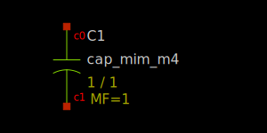

MiM Capacitor
-------------

Spice Model Information
~~~~~~~~~~~~~~~~~~~~~~~

-  Cell Names: :cell:`sky130_fd_pr__cap_mim_m3`, :cell:`sky130_fd_pr__cap_mim_m4`
-  Model Names: :model:`sky130_fd_pr__cap_mim_m3_1`, :model:`sky130_fd_pr__cap_mim_m3_2`

Operating Voltages where SPICE models are valid

-  :math:`|V_{c0} – V_{c1}| = 0` to 5.0V

Details
~~~~~~~

The MiM capacitor is constructed using a thin dielectric over metal, followed by a thin conductor layer on top of the dielectric. There are two possible constructions:

-  CAPM over Metal-3
-  CAP2M over Metal-4

The constructions are identical, and the capacitors may be stacked to maximize total capacitance.

Electrical specs are listed below:

.. include:: cap_mim-table0.rst

The symbols for the MiM capacitors are shown below. Note that the cap model is a sub-circuit which accounts for the parasitic contact resistance and the parasitic capacitance from the bottom plate to substrate.

|symbol-cap_mim_m3| |symbol-cap_mim_m4|

Cell name

M \* W \* L

Calc capacitance

The cross-section of the “stacked” MiM capacitor is shown below:

|cross-section-cap_mim|

.. |symbol-cap_mim_m3| image:: symbol-cap_mim_m3.svg

.. |cross-section-cap_mim| image:: cross-section-cap_mim.svg

