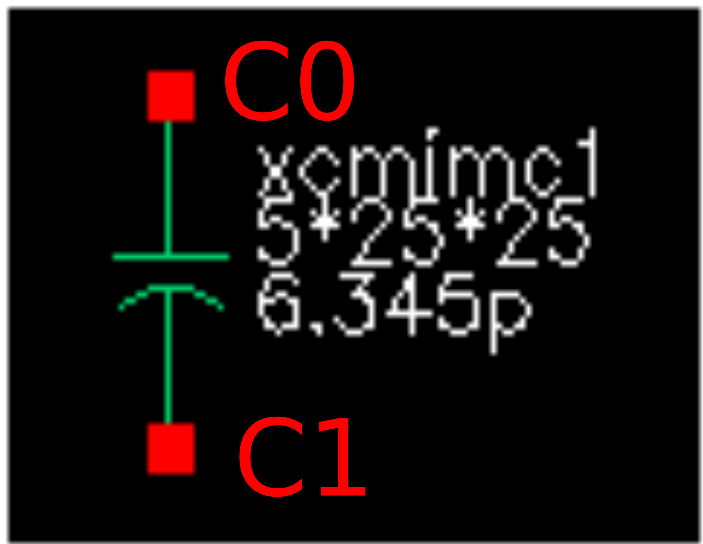

MiM Capacitor
-------------

Spice Model Information
~~~~~~~~~~~~~~~~~~~~~~~

-  Cell Name: :cell:`sky130_fd_pr_base__mimcap34`, :cell:`sky130_fd_pr_base__mimcap45`
-  Model Names: :model:`sky130_fd_pr_base__xcmimc`, :model:`sky130_fd_pr_base__xcmim2c`

Operating Voltages where SPICE models are valid

-  \|V\ :sub:`c0` – V\ :sub:`c1`\ \| = 0 to 5.0V

Details
~~~~~~~

The MiM capacitor is constructed using a thin dielectric over metal, followed by a thin conductor layer on top of the dielectric. There are two possible constructions:

-  CAPM over Metal-3
-  CAP2M over Metal-4

The constructions are identical, and the capacitors may be stacked to maximize total capacitance.

Electrical specs are listed below:

.. include:: capacitors-mim-table0.rst

The symbol for the MiM capacitor is shown below. Note that the cap model is a sub-circuit which accounts for the parasitic contact resistance and the parasitic capacitance from the bottom plate to substrate.

|symbol-capacitor-mim|

Cell name

M \* W \* L

Calc capacitance

The cross-section of the “stacked” MiM capacitor is shown below:

|cross-section-capacitor-mim|

.. |cross-section-capacitor-mim| image:: cross-section-capacitor-mim.svg

