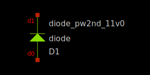

Diodes
------

Spice Model Information
~~~~~~~~~~~~~~~~~~~~~~~

-  Cell Name: :cell:`diode`
-  Model Names: :model:`sky130_fd_pr__diode_pw2nd_05v5`, :model:`sky130_fd_pr__diode_pw2nd_11v0`, :model:`sky130_fd_pr__diode_pw2nd_05v5_nvt`, :model:`sky130_fd_pr__diode_pw2nd_05v5_lvt`, :model:`sky130_fd_pr__diode_pd2nw_05v5`, :model:`sky130_fd_pr__diode_pd2nw_11v0`, :model:`sky130_fd_pr__diode_pd2nw_05v5_hvt`, :model:`sky130_fd_pr__diode_pd2nw_05v5_lvt`, :model:`sky130_fd_pr__model__parasitic__rf_diode_ps2nw`, :model:`sky130_fd_pr__model__parasitic__rf_diode_pw2dn`, :model:`sky130_fd_pr__model__parasitic__diode_pw2dn`, :model:`sky130_fd_pr__model__parasitic__diode_ps2dn`, :model:`dnwdiode_psub_victim`, :model:`dnwdiode_psub_aggressor`, :model:`sky130_fd_pr__model__parasitic__diode_ps2nw`, :model:`nwdiode_victim`, :model:`nwdiode_aggressor`, :model:`xesd_ndiode_h_X`, :model:`xesd_ndiode_h_dnwl_X`, :model:`xesd_pdiode_h_X (X = 100 or 200 or 300)`
-  Cell Name: :cell:`lvsdiode`
-  Model Names: :model:`sky130_fd_pr__diode_pw2nd_05v5`, :model:`sky130_fd_pr__diode_pw2nd_11v0`, :model:`sky130_fd_pr__diode_pd2nw_05v5`, :model:`sky130_fd_pr__diode_pd2nw_11v0`, :model:`sky130_fd_pr__model__parasitic__diode_ps2dn`, :model:`dnwdiode_psub_victim`, :model:`dnwdiode_psub_aggressor`, :model:`nwdiode_victim`, :model:`nwdiode_aggressor`, :model:`xesd_ndiode_h_X`, :model:`xesd_ndiode_h_dnwl_X`, :model:`xesd_pdiode_h_X (X = 100 or 200 or 300)`

Operating regime where SPICE models are valid

-  :math:`|V_{d0} – V_{d1}| = 0` to 5.0V

Details
~~~~~~~

.. include:: diodes-table0.rst

Symbols for the diodes are shown below

|symbol-diode-01|
|symbol-diode-02|
|symbol-diode-03|
|symbol-diode-04|
|symbol-diode-05|
|symbol-diode-06|
|symbol-diode-07|
|symbol-diode-08|
|symbol-diode-09|
|symbol-diode-10|
|symbol-diode-11|
|symbol-diode-12|
|symbol-diode-13|
|symbol-diode-14|
|symbol-diode-15|
|symbol-diode-16|
|symbol-diode-17|

.. |symbol-diode-01| image:: symbol-diode-01.svg

.. |symbol-diode-03| image:: symbol-diode-03.svg
.. |symbol-diode-04| image:: symbol-diode-04.svg
.. |symbol-diode-05| image:: symbol-diode-05.svg
.. |symbol-diode-06| image:: symbol-diode-06.svg
.. |symbol-diode-07| image:: symbol-diode-07.svg
.. |symbol-diode-08| image:: symbol-diode-08.svg
.. |symbol-diode-09| image:: symbol-diode-09.svg
.. |symbol-diode-10| image:: symbol-diode-10.svg
.. |symbol-diode-11| image:: symbol-diode-11.svg
.. |symbol-diode-12| image:: symbol-diode-12.svg
.. |symbol-diode-13| image:: symbol-diode-13.svg
.. |symbol-diode-14| image:: symbol-diode-14.svg
.. |symbol-diode-15| image:: symbol-diode-15.svg
.. |symbol-diode-16| image:: symbol-diode-16.svg
.. |symbol-diode-17| image:: symbol-diode-17.svg

