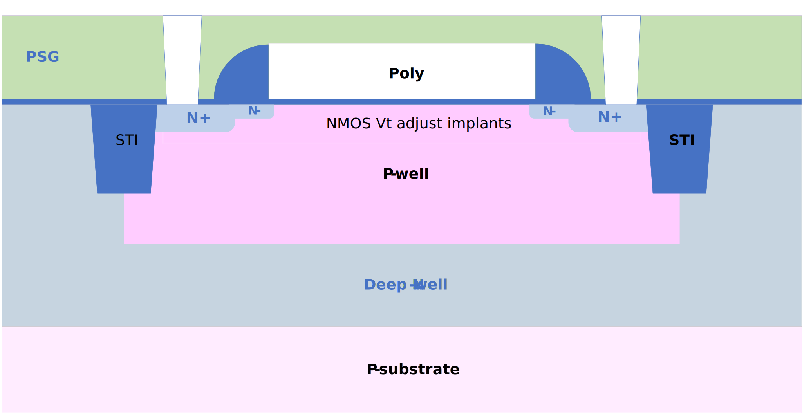

1.8V NMOS FET
-------------

Spice Model Information
~~~~~~~~~~~~~~~~~~~~~~~

-  Cell Name: :cell:`sky130_fd_pr_base__nfet`
-  Model Name: :model:`sky130_fd_pr_base__nshort`

Operating Voltages where SPICE models are valid

-  V\ :sub:`DS` = 0 to 1.95V
-  V\ :sub:`GS` = 0 to 1.95V
-  V\ :sub:`BS` = +0.3 to -1.95V

Details
~~~~~~~

Major model output parameters are shown below and compared against the EDR (e-test) specs.

.. include:: fet-nmos-1v8-table0.rst

The symbol of the :model:`sky130_fd_pr_base__nshort` (1.8V NMOS FET) is shown below:

|symbol-1v8-nmos-fet|

The cross-section of the NMOS FET is shown below:

|cross-section-1v8-nmos-fet|

The device shows the p-well inside of a deep n-well, but it can be made either with or without the DNW under the p-well

.. |symbol-1v8-nmos-fet| image:: symbol-1v8-nmos-fet.svg

