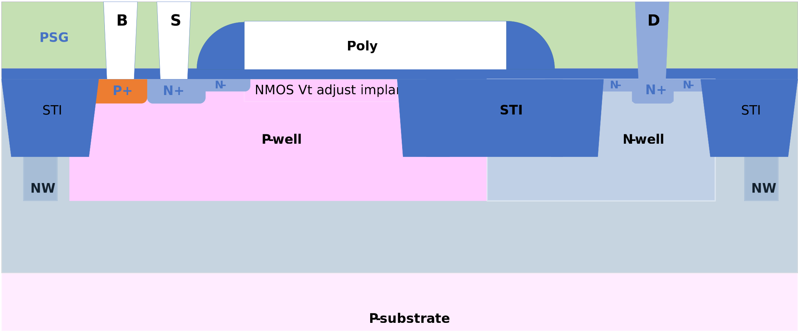

20V isolated NMOS FET
---------------------

Spice Model Information
~~~~~~~~~~~~~~~~~~~~~~~

-  Cell Name: :cell:`sky130_fd_pr_base__nfetexd`
-  Model Name: :model:`sky130_fd_pr_base__n20vhviso1`

Operating Voltages where SPICE models are valid, subject to SOA limitations:

-  V\ :sub:`DS` = 0 to +22V
-  V\ :sub:`GS` = 0 to 5.5V
-  V\ :sub:`BS` = 0 to -2.0V

Details
~~~~~~~

The 20V isolated NMOS FET has the same construction as the 20V NMOS FET, but is built over a Deep N-well. This permits the p-well to be isolated from the substrate and permit “high-side” usage (where the PW body is held above ground).

Major model output parameters are shown below and compared against the EDR (e-test) specs

.. include:: fet-nmos-20v-isolated-table0.rst

The symbol of the :model:`sky130_fd_pr_base__n20vhviso1` (20V isolated NMOS FET) is shown below.

|symbol-20v-isolated-nmos-fet|

The cross-section of the 20V isolated NMOS FET is shown below.

|cross-section-20v-isolated-nmos-fet|

.. |symbol-20v-isolated-nmos-fet| image:: symbol-20v-isolated-nmos-fet.svg

