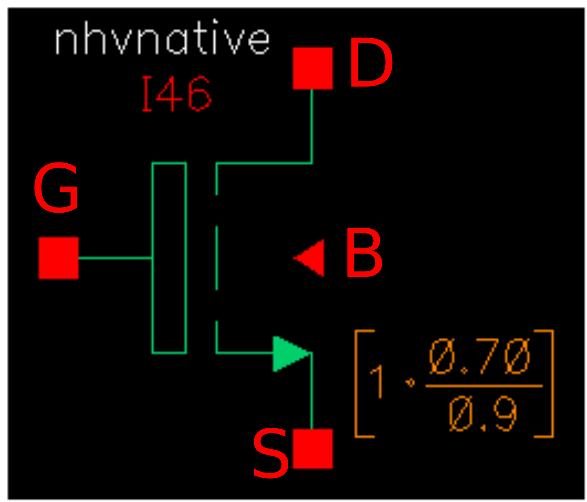

3.0V and 5.0V native NMOS FET
-----------------------------

Spice Model Information
~~~~~~~~~~~~~~~~~~~~~~~

-  Cell Name: :cell:`sky130_fd_pr_base__nfet`
-  Model Name: :model:`sky130_fd_pr_base__ntvnative`, :model:`sky130_fd_pr_base__nhvnative`

Operating Voltages where SPICE models are valid for :model:`sky130_fd_pr_base__ntvnative`

-  V\ :sub:`DS` = 0 to 3.3V
-  V\ :sub:`GS` = 0 to 3.3V
-  V\ :sub:`BS` = 0 to -3.3V

Details
~~~~~~~

Operating Voltages where SPICE models are valid for :model:`sky130_fd_pr_base__nhvnative`

-  V\ :sub:`DS` = 0 to 5.5V
-  V\ :sub:`GS` = 0 to 5.5V
-  V\ :sub:`BS` = +0.3 to -5.5V

Details
~~~~~~~

The native device is constructed by blocking out all VT implants.

The model and EDR (e-test) parameters are compared below. Note that the minimum gate length for 3V operation is 0.5 µm, whereas the 5V device has minimum gate length of 0.9 µm.

.. include:: fet-nmos-3v0-and-5v0-native-table0.rst

The symbols for the :model:`sky130_fd_pr_base__ntvnative` and :model:`sky130_fd_pr_base__nhvnative` devices are shown below.

|symbol-3v0-and-5v0-native-nmos-fet-ntvnative| |symbol-3v0-and-5v0-native-nmos-fet-nhvnative|

The cross-section of the native devices is shown below. Note that the only differences between the nvtnative and :model:`sky130_fd_pr_base__nhvnative` devices are the minimum gate length and the VDS requirements.

|cross-section-3v0-and-5v0-native-nmos-fet|

.. |symbol-3v0-and-5v0-native-nmos-fet-ntvnative| image:: symbol-3v0-and-5v0-native-nmos-fet-ntvnative.svg

.. |cross-section-3v0-and-5v0-native-nmos-fet| image:: cross-section-3v0-and-5v0-native-nmos-fet.svg

