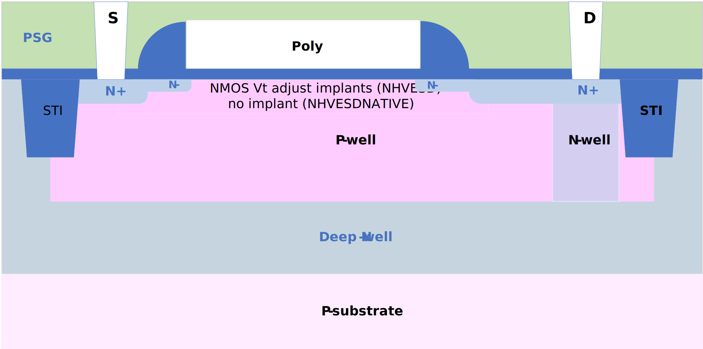

NMOS ESD FET
------------

Spice Model Information
~~~~~~~~~~~~~~~~~~~~~~~

-  Cell Name: :cell:`sky130_fd_pr_base__nfet`
-  Model Name: :model:`sky130_fd_pr_base__nshortesd`, :model:`sky130_fd_pr_base__nhvesd`, :model:`sky130_fd_pr_base__nhvesdnative`

Operating Voltages where SPICE models are valid

-  V\ :sub:`DS` = 0 to 11.0V (nhv\*), 0 to 1.95V (nshort\*)
-  V\ :sub:`GS` = 0 to 5.0V (nhv\*), 0 to 1.95V (nshort\*)
-  V\ :sub:`BS` = 0 to -5.5V, (nhv), +0.3 to -5.5V (nhvnative), 0 to -1.95V (nshort\*)

Details
~~~~~~~

The ESD FET’s differ from the regular NMOS devices in several aspects, most notably:

-  Increased isolation spacing from contacts to surrounding STI
-  Increased drain contact-to-gate spacing
-  Placement of n-well under the drain contacts

Major model output parameters are shown below and compared against the EDR (e-test) specs

.. include:: fet-nmos-esd-table0.rst

The symbols of the :model:`sky130_fd_pr_base__nhvesd` and :model:`sky130_fd_pr_base__nhvesdnative` (ESD NMOS FET) are shown below:

|symbol-nmos-esd-fet-nhvesd| |symbol-nmos-esd-fet-nhvesdnative|

The cross-section of the ESD NMOS FET is shown below.

|cross-section-nmos-esd-fet|

.. |symbol-nmos-esd-fet-nhvesd| image:: symbol-nmos-esd-fet-nhvesd.svg
.. |symbol-nmos-esd-fet-nhvesdnative| image:: symbol-nmos-esd-fet-nhvesdnative.svg

