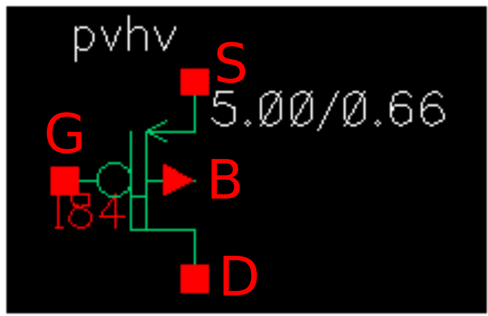
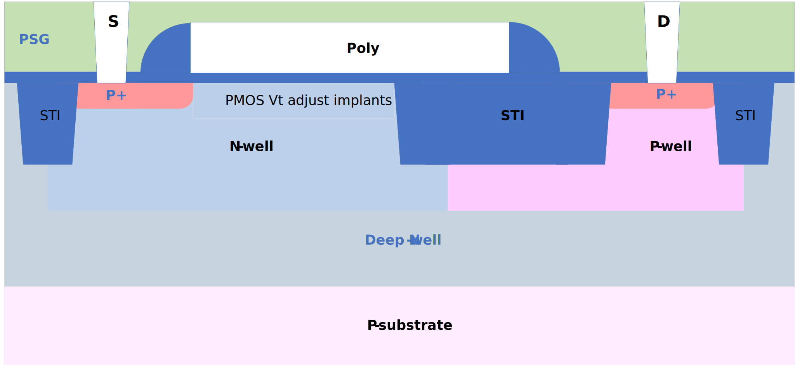

10V/16V PMOS FET
----------------

Spice Model Information
~~~~~~~~~~~~~~~~~~~~~~~

-  Cell Name: :cell:`sky130_fd_pr_base__pfetexd`
-  Model Name: :model:`sky130_fd_pr_base__pvhv`

Operating Voltages where SPICE models are valid, subject to SOA limitations:

-  V\ :sub:`DS` = 0 to -16V (V:sub:`GS` = 0)
-  V\ :sub:`DS` = 0 to -10V (V:sub:`GS` < 0)
-  V\ :sub:`GS` = 0 to -5.5V
-  V\ :sub:`BS` = 0 to +2.0V

Details
~~~~~~~

Major model output parameters are shown below and compared against the EDR (e-test) specs

.. include:: fet-pmos-10v-16v-table0.rst

The symbol of the :model:`sky130_fd_pr_base__pvhv` (10V/16V PMOS FET) is shown below:

|symbol-10v-16v-pmos-fet|

The cross-section of the 10V/16V PMOS FET is shown below.

|cross-section-10v-16v-pmos-fet|

