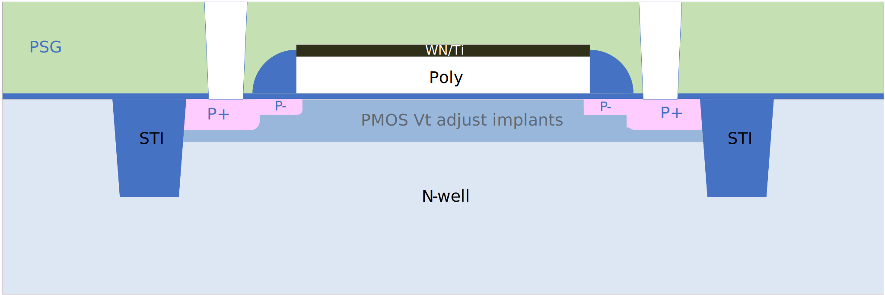

1.8V high-VT PMOS FET
---------------------

Spice Model Information
~~~~~~~~~~~~~~~~~~~~~~~

-  Cell Name: :cell:`sky130_fd_pr_base__pfet`
-  Model Name: :model:`sky130_fd_pr_base__phighvt`

Operating Voltages where SPICE models are valid

-  V\ :sub:`DS` = 0 to -1.95V
-  V\ :sub:`GS` = 0 to -1.95V
-  V\ :sub:`BS` = -0.1 to +1.95V

Details
~~~~~~~

Major model output parameters are shown below and compared against the EDR (e-test) specs

.. include:: fet-pmos-1v8-high-vt-table0.rst

Inverter Gate Delays using nshort/:model:`sky130_fd_pr_base__phighvt` device combinations:

.. include:: fet-pmos-1v8-high-vt-table1.rst

The symbol of the :model:`sky130_fd_pr_base__phighvt` (1.8V high-VT PMOS FET) is shown below:

|symbol-1v8-high-vt-pmos-fet|

The cross-section of the high-VT PMOS FET is shown below. The cross-section is identical to the std PMOS FET except for the V\ :sub:`T` adjust implants (to achieve the higher V\ :sub:`T`)

|cross-section-1v8-high-vt-pmos-fet|

.. |symbol-1v8-high-vt-pmos-fet| image:: symbol-1v8-high-vt-pmos-fet.svg

