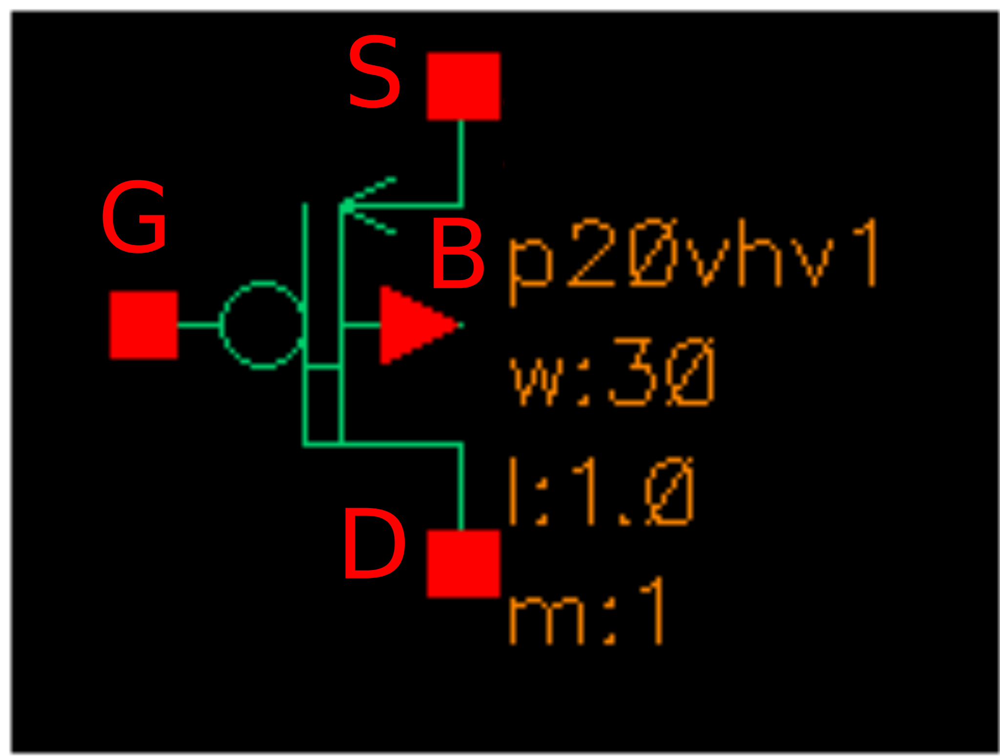
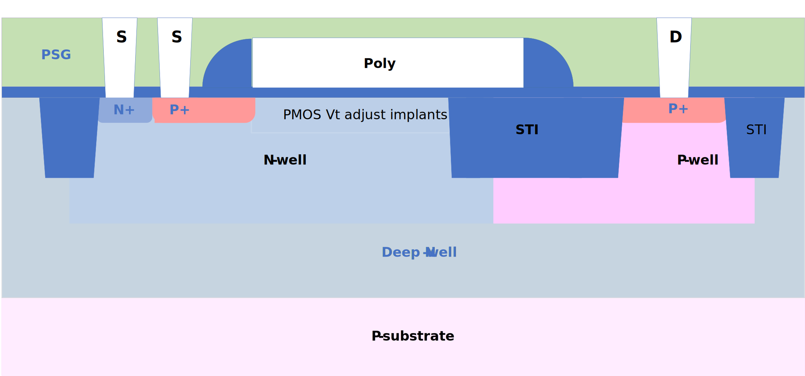

20V PMOS FET
------------

Spice Model Information
~~~~~~~~~~~~~~~~~~~~~~~

-  Cell Name: :cell:`sky130_fd_pr_base__pfetexd`
-  Model Name: :model:`sky130_fd_pr_base__p20vhv1`

Operating Voltages where SPICE models are valid, subject to SOA limitations:

-  V\ :sub:`DS` = 0 to -22V
-  V\ :sub:`GS` = 0 to -5.5V
-  V\ :sub:`BS` = 0 to +2.0V

Details
~~~~~~~

The 20V NMOS FET has similar construction to the 11V/16V NMOS FET, with several differences:

-  Longer drift region
-  Longer poly gate
-  Larger W/L
-  Devices placed in pairs (drain in middle, sources on outside)

Major model output parameters are shown below and compared against the EDR (e-test) specs

.. include:: fet-pmos-20v-table0.rst

The symbol of the :model:`sky130_fd_pr_base__p20vhv1` (20V PMOS FET) is shown below.

|symbol-20v-pmos-fet|

The cross-section of the 20V PMOS FET is shown below.

|cross-section-20v-pmos-fet|

