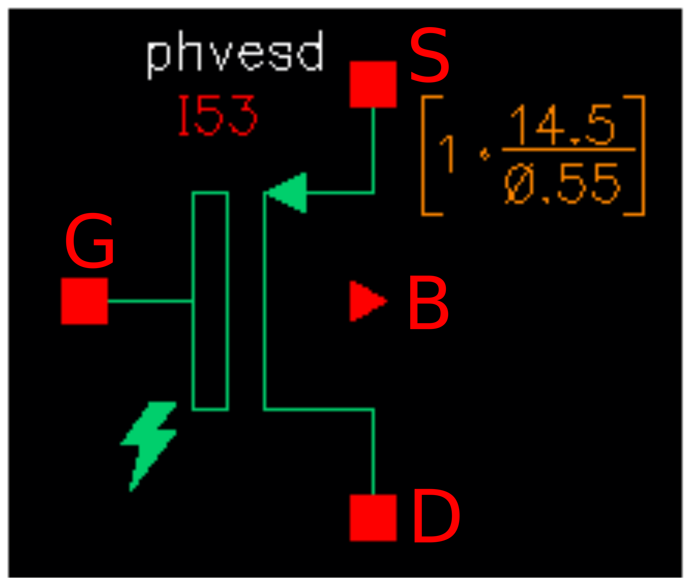
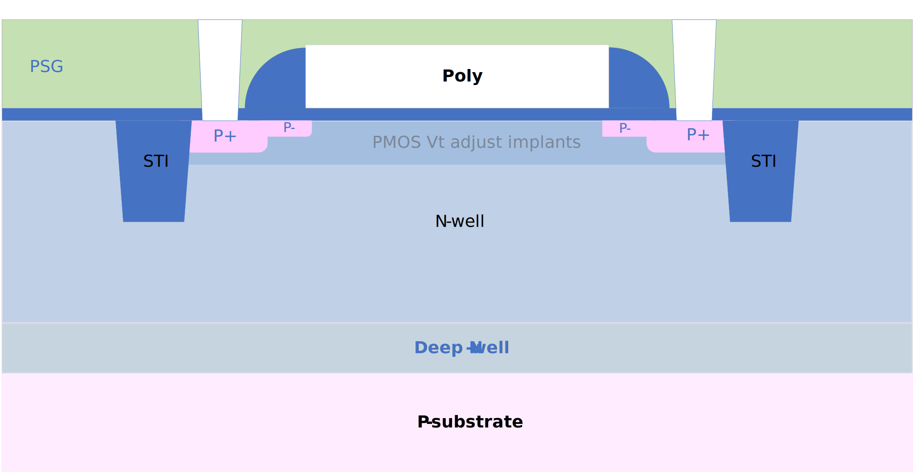

5.0V/10.5V PMOS FET
-------------------

Spice Model Information
~~~~~~~~~~~~~~~~~~~~~~~

-  Cell Name: :cell:`sky130_fd_pr_base__pfet`
-  Model Name: :model:`sky130_fd_pr_base__phv`, :model:`sky130_fd_pr_base__phvesd`

Operating Voltages where SPICE models are valid

-  V\ :sub:`DS` = 0 to -11.0V
-  V\ :sub:`GS` = 0 to -5.5V
-  V\ :sub:`BS` = 0 to +5.5V

Details
~~~~~~~

Major model output parameters are shown below and compared against the EDR (e-test) specs

.. include:: fet-pmos-5v0-10v5-table0.rst

Inverter gate delays are shown below:

.. include:: fet-pmos-5v0-10v5-table1.rst

The symbols of the :model:`sky130_fd_pr_base__phv` and pvhesd (5.0V/10.5V PMOS FET) are shown below:

|symbol-5v0-10v5-pmos-fet-phv| |symbol-5v0-10v5-pmos-fet-pvhesd|

The cross-section of the 5.0V PMOS FET is shown below.

|cross-section-5v0-10v5-pmos-fet|

.. |symbol-5v0-10v5-pmos-fet-phv| image:: symbol-5v0-10v5-pmos-fet-phv.svg

