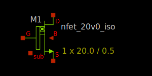

20V isolated NMOS FET
---------------------

Spice Model Information
~~~~~~~~~~~~~~~~~~~~~~~

-  Cell Name: :cell:`sky130_fd_pr__nfet_extenddrain`
-  Model Name: :model:`sky130_fd_pr__nfet_20v0_iso`

Operating Voltages where SPICE models are valid, subject to SOA limitations:

-  :math:`V_{DS} = 0` to +22V
-  :math:`V_{GS} = 0` to 5.5V
-  :math:`V_{BS} = 0` to -2.0V

Details
~~~~~~~

The 20V isolated NMOS FET has the same construction as the 20V NMOS FET, but is built over a Deep N-well. This permits the p-well to be isolated from the substrate and permit “high-side” usage (where the PW body is held above ground).

Major model output parameters are shown below and compared against the EDR (e-test) specs

.. include:: nfet_20v0_iso-table0.rst

The symbol of the :model:`sky130_fd_pr__nfet_20v0_iso` (20V isolated NMOS FET) is shown below.

|symbol-nfet_20v0_iso|

The cross-section of the 20V isolated NMOS FET is shown below.

|cross-section-nfet_20v0_iso|

.. |cross-section-nfet_20v0_iso| image:: cross-section-nfet_20v0_iso.svg

