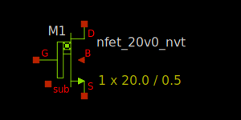

20V native NMOS FET
-------------------

Spice Model Information
~~~~~~~~~~~~~~~~~~~~~~~

-  Cell Name: :cell:`sky130_fd_pr__nfet_extenddrain`
-  Model Name: :model:`sky130_fd_pr__nfet_20v0_nvt`

Operating Voltages where SPICE models are valid, subject to SOA limitations:

-  :math:`V_{DS} = 0` to +22V
-  :math:`V_{GS} = 0` to 5.5V
-  :math:`V_{BS} = 0` to -2.0V

Details
~~~~~~~

The 20V native NMOS FET is similar to the 20V isolated NMOS FET, but has all Vt implants blocked to achieve a very low VT.

Major model output parameters are shown below and compared against the EDR (e-test) specs

.. include:: nfet_20v0_nvt-table0.rst

The symbol of the :model:`sky130_fd_pr__nfet_20v0_nvt` (20V native NMOS FET) shown below.

|symbol-nfet_20v0_nvt|

The cross-section of the 20V native NMOS FET is shown below.

|cross-section-nfet_20v0_nvt|

.. |cross-section-nfet_20v0_nvt| image:: cross-section-nfet_20v0_nvt.svg

