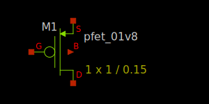

1.8V PMOS FET
-------------

Spice Model Information
~~~~~~~~~~~~~~~~~~~~~~~

-  Cell Name: :cell:`sky130_fd_pr__pfet_01v8`
-  Model Name: :model:`sky130_fd_pr__pfet_01v8`

Operating Voltages where SPICE models are valid

-  :math:`V_{DS} = 0` to -1.95V
-  :math:`V_{GS} = 0` to -1.95V
-  :math:`V_{BS} = -0.1` to +1.95V

Details
~~~~~~~

Major model output parameters are shown below and compared against the EDR (e-test) specs.

.. include:: pfet_01v8-table0.rst

Inverter Gate Delays using sky130_fd_pr__nfet_01v8/:model:`sky130_fd_pr__pfet_01v8` device combinations:

.. include:: pfet_01v8-table1.rst

The symbol of the :model:`sky130_fd_pr__pfet_01v8` (1.8V PMOS FET) is shown below:

|symbol-pfet_01v8|

The cross-section of the PMOS FET is shown below:

|cross-section-pfet_01v8|

.. |cross-section-pfet_01v8| image:: cross-section-pfet_01v8.svg

