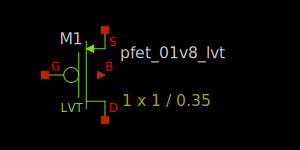
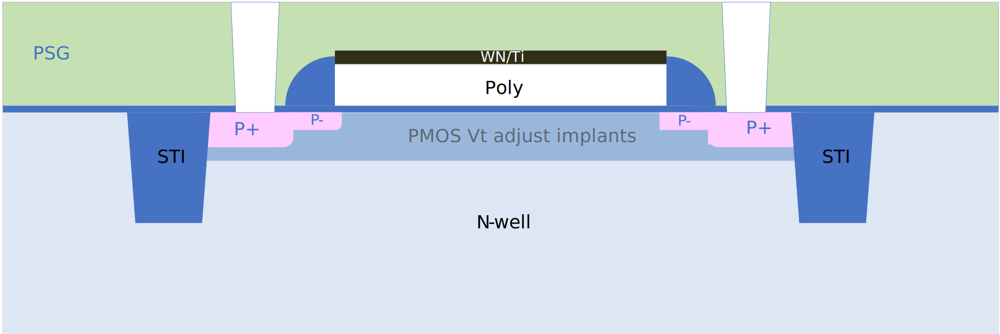

1.8V low-VT PMOS FET
--------------------

Spice Model Information
~~~~~~~~~~~~~~~~~~~~~~~

-  Cell Name: :cell:`sky130_fd_pr__pfet_01v8`
-  Model Name: :model:`sky130_fd_pr__pfet_01v8_lvt`

Operating Voltages where SPICE models are valid

-  :math:`V_{DS} = 0` to -1.95V
-  :math:`V_{GS} = 0` to -1.95V
-  :math:`V_{BS} = -0.1` to +1.95V

Details
~~~~~~~

Major model output parameters are shown below and compared against the EDR (e-test) specs

.. include:: pfet_01v8_lvt-table0.rst

Inverter Gate Delays using sky130_fd_pr__nfet_01v8_lvt/:model:`sky130_fd_pr__pfet_01v8_lvt` device combinations:

.. include:: pfet_01v8_lvt-table1.rst

The symbol of the :model:`sky130_fd_pr__pfet_01v8_lvt` (1.8V low-VT PMOS FET) is shown below:

|symbol-pfet_01v8_lvt|

The cross-section of the low-VT PMOS FET is shown below. The cross-section is identical to the std PMOS FET except for the :math:`V_T` adjust implants (to achieve the lower :math:`V_T`)

|cross-section-pfet_01v8_lvt|

