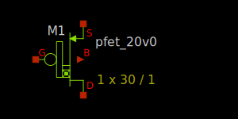

20V PMOS FET
------------

Spice Model Information
~~~~~~~~~~~~~~~~~~~~~~~

-  Cell Name: :cell:`sky130_fd_pr__pfet_extenddrain`
-  Model Name: :model:`sky130_fd_pr__pfet_20v0`

Operating Voltages where SPICE models are valid, subject to SOA limitations:

-  :math:`V_{DS} = 0` to -22V
-  :math:`V_{GS} = 0` to -5.5V
-  :math:`V_{BS} = 0` to +2.0V

Details
~~~~~~~

The 20V NMOS FET has similar construction to the 11V/16V NMOS FET, with several differences:

-  Longer drift region
-  Longer poly gate
-  Larger W/L
-  Devices placed in pairs (drain in middle, sources on outside)

Major model output parameters are shown below and compared against the EDR (e-test) specs

.. include:: pfet_20v0-table0.rst

The symbol of the :model:`sky130_fd_pr__pfet_20v0` (20V PMOS FET) is shown below.

|symbol-pfet_20v0|

The cross-section of the 20V PMOS FET is shown below.

|cross-section-pfet_20v0|

.. |cross-section-pfet_20v0| image:: cross-section-pfet_20v0.svg

