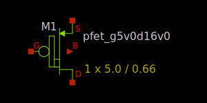

10V/16V PMOS FET
----------------

Spice Model Information
~~~~~~~~~~~~~~~~~~~~~~~

-  Cell Name: :cell:`sky130_fd_pr__pfet_extenddrain`
-  Model Name: :model:`sky130_fd_pr__pfet_g5v0d16v0`

Operating Voltages where SPICE models are valid, subject to SOA limitations:

-  :math:`V_{DS} = 0` to -16V (\ :math:`V_{GS} = 0`\ )
-  :math:`V_{DS} = 0` to -10V (\ :math:`V_{GS} < 0`\ )
-  :math:`V_{GS} = 0` to -5.5V
-  :math:`V_{BS} = 0` to +2.0V

Details
~~~~~~~

Major model output parameters are shown below and compared against the EDR (e-test) specs

.. include:: pfet_g5v0d16v0-table0.rst

The symbol of the :model:`sky130_fd_pr__pfet_g5v0d16v0` (10V/16V PMOS FET) is shown below:

|symbol-pfet_g5v0d16v0|

The cross-section of the 10V/16V PMOS FET is shown below.

|cross-section-pfet_g5v0d16v0|

.. |cross-section-pfet_g5v0d16v0| image:: cross-section-pfet_g5v0d16v0.svg

