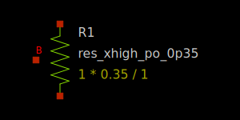
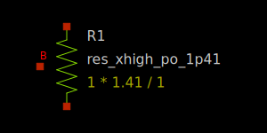
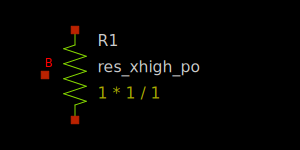

P- poly precision resistors
---------------------------

Spice Model Information
~~~~~~~~~~~~~~~~~~~~~~~

-  Cell Name: :cell:`res_xhigh_po_XpXX`, :cell:`sky130_fd_pr__res_xhigh_po`
-  Model Type: subcircuit

Operating ranges where SPICE models are valid

-  :math:`|V_{r0} – V_{r1}| = 0` to 5.0V
-  Currents up to 500 µA/µm of width (preferred use ≤ 100 µA/µm)

Details
~~~~~~~

The resistors have 5 different fixed widths, plus a variable W/L option.

-  0.35 (0p35)
-  0.69 (0p69)
-  1.41 (1p41)
-  2.85 (2p83)
-  5.73 (5p73)

They are modeled as subcircuits, using a conventional resistor model combined with the capacitance under the resistor, as well as matching parameters and temperature coefficients. The fixed-width resistors may only be used in the above configurations. Each resistor end is contacted using a slot licon. Length is variable and measured between the front ends of the slot licons.

The resistors are modeled using the same equations as for the P+ poly resistors. In the case of the P- poly resistors, a separate implant is used to set the sheet resistance to 2000 ohm/sq.

Fixed value resistors have the same layout footprints as their P+ poly counterparts. Electrical and e-test specs are still TBD, once sufficient silicon has been evaluated. More details on the use of the precision resistors, and their models, are in the document ***SKY130 process Family Device Models*** (002-21997), currently under development.

The symbols for the 2000 ohm/sq precision resistors are shown below:

|symbol-res_xhigh_po_0p35| |symbol-res_xhigh_po_0p69|

:model:`sky130_fd_pr__res_xhigh_po_0p35` :model:`sky130_fd_pr__res_xhigh_po_0p69`

|symbol-res_xhigh_po_1p41| |symbol-res_xhigh_po_2p85|

:model:`sky130_fd_pr__res_xhigh_po_1p41` :model:`sky130_fd_pr__res_xhigh_po_2p85`

|symbol-res_xhigh_po_5p73|

:model:`sky130_fd_pr__res_xhigh_po_5p73`

A generic version of the poly resistor is also available, which permits user inputs for W and L, and connections in series or parallel.

|symbol-res_xhigh_po|

.. |symbol-res_xhigh_po_0p69| image:: symbol-res_xhigh_po_0p69.svg

.. |symbol-res_xhigh_po_2p85| image:: symbol-res_xhigh_po_2p85.svg
.. |symbol-res_xhigh_po_5p73| image:: symbol-res_xhigh_po_5p73.svg

