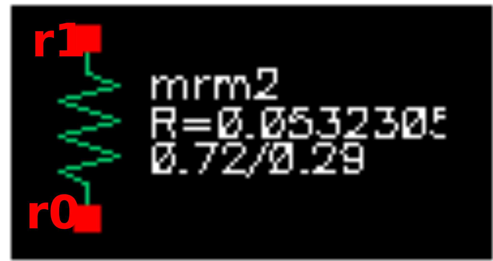

Generic Resistors
-----------------

Generic resistors are supported in the PDK but are not recommended for analog applications. Resistor values will be extracted from the layout as long as the resistor layer is utilized, for LVS against schematic elements.

The following 3-terminal resistors are available, and have built-in diodes inside the models:

-  N+ diffusion (type “resn”, model mrdn)
-  P+ diffusion (type “resp”, model mrdp)
-  P-well (type “respw”, model xpwres)

The following 2-terminal resistors are available (all type “res”):

-  N+ doped gate poly (mrp1)
-  Local interconnect (mrl1)
-  Metal-1 (mrm1)
-  Metal-2 (mrm2)
-  Metal-3 (mrm3)
-  Metal-4 (mrm4)
-  Metal-5 (mrm5)

Specs for the generic resistors are shown below.

.. include:: resistors-generic-table0.rst

Symbols for all resistors are shown below:

|symbol-resistor-generic-resn| |symbol-resistor-generic-resp|

resn resp

|symbol-resistor-generic-respw| |symbol-resistor-generic-res-poly|

respw res (poly)

|symbol-resistor-generic-res-li1| |symbol-resistor-generic-res-met1|

res (li1) res (met1)

|symbol-resistor-generic-res-met2| |symbol-resistor-generic-res-met3|

res (met2) res (met3)

|symbol-resistor-generic-res-met4| |symbol-resistor-generic-res-met5|

res (met4) res (met5)

.. |symbol-resistor-generic-resn| image:: symbol-resistor-generic-resn.svg
.. |symbol-resistor-generic-resp| image:: symbol-resistor-generic-resp.svg
.. |symbol-resistor-generic-respw| image:: symbol-resistor-generic-respw.svg
.. |symbol-resistor-generic-res-poly| image:: symbol-resistor-generic-res-poly.svg

.. |symbol-resistor-generic-res-met1| image:: symbol-resistor-generic-res-met1.svg

.. |symbol-resistor-generic-res-met3| image:: symbol-resistor-generic-res-met3.svg
.. |symbol-resistor-generic-res-met4| image:: symbol-resistor-generic-res-met4.svg
.. |symbol-resistor-generic-res-met5| image:: symbol-resistor-generic-res-met5.svg

