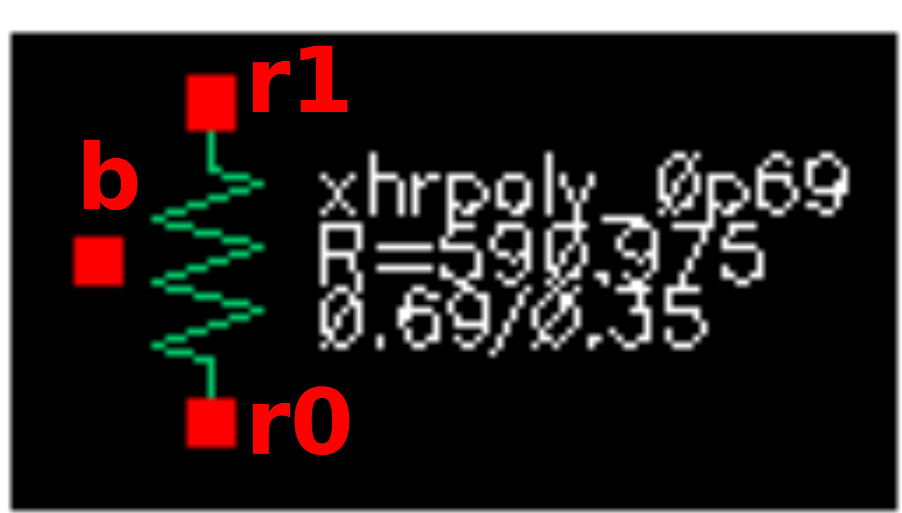
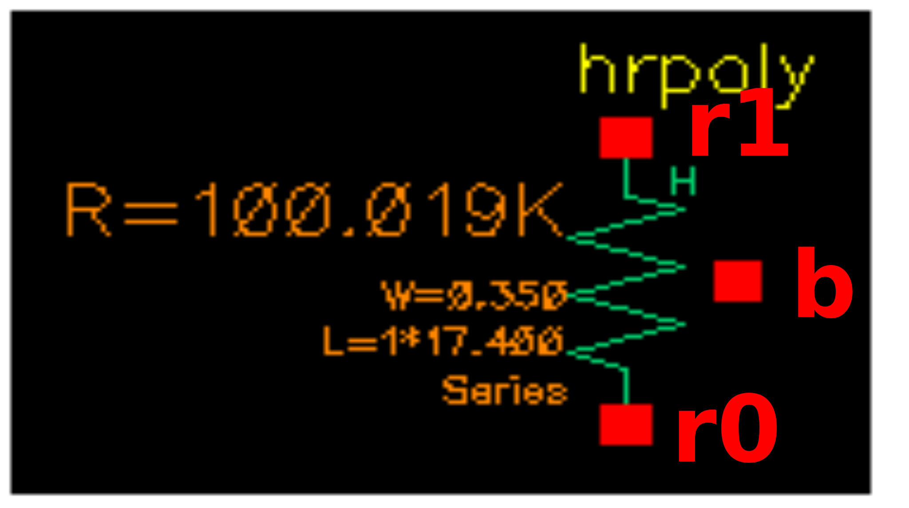

P+ poly precision resistors
---------------------------

Spice Model Information
~~~~~~~~~~~~~~~~~~~~~~~

-  Cell Name: :cell:`sky130_fd_pr_base__xhrpoly_XpYY`, :cell:`sky130_fd_pr_base__xhrpoly`
-  Model Type: subcircuit

Operating ranges where SPICE models are valid

-  \|V\ :sub:`r0` – V\ :sub:`r1`\ \| = 0 to 5.0V
-  Currents up to 500 µA/µm of width (preferred use ≤ 100 µA/µm)

Details
~~~~~~~

The resistors have 5 different fixed widths, plus a variable W/L option.

-  0.35 (0p35)
-  0.69 (0p69)
-  1.41 (1p41)
-  2.85 (2p83)
-  5.73 (5p73)

They are modeled as subcircuits, using a conventional resistor model combined with the capacitance under the resistor, as well as matching parameters and temperature coefficients. The fixed-width resistors may only be used in the above configurations. Each resistor end is contacted using a slot licon. Length is variable and measured between the front ends of the slot licons.

The fixed-width resistors are modeled using the equation

*R\ :sub:`0`* = head/tail resistance [Ω] (dominated by the slot licons)

*R\ :sub:`1`* = body resistance [Ω/µm] = R\ :sub:`SH`/W

A top-down schematic drawing of the precision resistor is shown below.

|p-poly-precision-resistors|

In addition to the R\ :sub:`0` and R\ :sub:`1` values, several fixed-value resistors are measured at e-test, as shown in the table below:

.. include:: resistors-pp-poly-precision-table0.rst

More details on the use of the precision resistors, and their models, are in the document ***SKY130 process Family Device Models*** (002-21997), which can be obtained from SkyWater upon request.

The symbols for the 300 ohm/sq precision resistors are shown below:

|symbol-resistor-precision-300ohm-xhrpoly_0p35| |symbol-resistor-precision-300ohm-xhrpoly_0p69|

xhrpoly\_0p35 xhrpoly\_0p69

|symbol-resistor-precision-300ohm-xhrpoly_1p41| |symbol-resistor-precision-300ohm-xhrpoly_2p85|

xhrpoly\_1p41 xhrpoly\_2p85

|symbol-resistor-precision-300ohm-xhrpoly_5p73|

xhrpoly\_5p73

A generic version of the poly resistor is also available, which permits user inputs for W and L, and connections in series or parallel.

|symbol-resistor-precision-300ohm-generic|

.. |p-poly-precision-resistors| image:: p-poly-precision-resistors.svg
.. |symbol-resistor-precision-300ohm-xhrpoly_0p35| image:: symbol-resistor-precision-300ohm-xhrpoly_0p35.svg

.. |symbol-resistor-precision-300ohm-xhrpoly_1p41| image:: symbol-resistor-precision-300ohm-xhrpoly_1p41.svg
.. |symbol-resistor-precision-300ohm-xhrpoly_2p85| image:: symbol-resistor-precision-300ohm-xhrpoly_2p85.svg
.. |symbol-resistor-precision-300ohm-xhrpoly_5p73| image:: symbol-resistor-precision-300ohm-xhrpoly_5p73.svg

