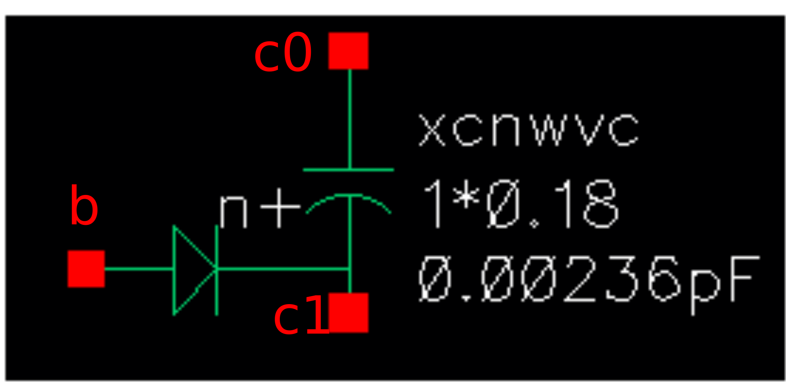

Varactors
---------

Spice Model Information
~~~~~~~~~~~~~~~~~~~~~~~

-  Cell Name: :cell:`sky130_fd_pr_base__capbn_b`
-  Model Name: :model:`sky130_fd_pr_base__xcnwvc`, :model:`sky130_fd_pr_base__xcnwvc2`
-  Model Type: subcircuit

Operating Voltages where SPICE models are valid

-  \|V\ :sub:`0` – V\ :sub:`1`\ \| = 0 to 2.0V

Details
~~~~~~~

The following devices are available; they are subcircuits with the N-well to P-substrate diodes built into the model:

-  xcnwvc—low VT PMOS device option
-  xcnwvc2—high VT PMOS device option

The varactors are used as tunable capacitors, major e-test parameters are listed below. Further details on the device models and their usage are in the SKY130 process Family Spice Models (002-21997), which can be obtained from SkyWater upon request.

.. include:: varactors-table0.rst

There is no equivalent varactor for 5V operation. The NHV or PHV devices should be connected as capacitors for use at 5V.

The symbols for the varactors are shown below:

|symbol-varactors-a| |symbol-varactors-b|

The cross-section of the varactor is shown below:

|cross-section-varactors|

.. |symbol-varactors-b| image:: symbol-varactors-b.svg
.. |cross-section-varactors| image:: cross-section-varactors.svg

