.. Do **not** modify this file it is generated from the periphery.csv file
   found in the periphery directory using the
   ./periphery/periphery-split-csv.py script. Instead run `make
   rules/periphery-rules.rst` in the ./docs directory.

.. list-table::
   :header-rows: 1
   :stub-columns: 1
   :widths: 10 75

   * - Use
     - Explanation
   * -
       .. _P:

       :drc_flag:`P`

     - Rule applies to periphery only (outside :drc_tag:`areaid.ce`). A corresponding core rule may or may not exist.
   * -
       .. _NE:

       :drc_flag:`NE`

     - Rule not checked for esd_nwell_tap. There are no corresponding rule for esd_nwell_tap.
   * -
       .. _NC:

       :drc_flag:`NC`

     - Rule not checked by DRC. It should be used as a guideline only.
   * -
       .. _TC:

       :drc_flag:`TC`

     - Rule not checked for cell name "*_tech_CD_top*"
   * -
       .. _A:

       :drc_flag:`A`

     - Rule documents a functionality implemented in CL algorithms and may not be checked by DRC.
   * -
       .. _AD:

       :drc_flag:`AD`

     - Rule documents a functionality implemented in CL algorithms and checked by DRC.
   * -
       .. _DE:

       :drc_flag:`DE`

     - Rule not checked for source of Drain Extended device
   * -
       .. _LVS:

       :drc_flag:`LVS`

     - Rule handled by LVS
   * -
       .. _F:

       :drc_flag:`F`

     - Rule intended for Frame only, not checked inside Die
   * -
       .. _DNF:

       :drc_flag:`DNF`

     - Drawn Not equal Final. The drawn rule does not reflect the final dimension on silicon. See table J for details.
   * -
       .. _RC:

       :drc_flag:`RC`

     - Recommended rule at the chip level, required rule at the IP level.
   * -
       .. _RR:

       :drc_flag:`RR`

     - Recommended rule at any IP level
   * -
       .. _AL:

       :drc_flag:`AL`

     - Rules applicable only to Al BE flows
   * -
       .. _CU:

       :drc_flag:`CU`

     - Rules applicable only to Cu BE flows
   * -
       .. _IR:

       :drc_flag:`IR`

     - IR drop check compering Al database and slotted Cu database for the same product (2 gds files) must be clean
   * -
       .. _EXEMPT:

       :drc_flag:`EXEMPT`

     - Rule is an exception?

:drc_rule:`(x.-)`
-----------------

.. list-table:: Function: Defines General (FIXME)
   :header-rows: 1
   :stub-columns: 1
   :widths: 9 73 6 6 6

   * - :drc_rule:`Name`
     - Description
     - :drc_flag:`Flags`
     - Value
     - Unit
   * - :drc_rule:`(x.1a)`
     - p1m.md (OPC), DECA and AMKOR layers (pi1.dg, pmm.dg, rdl.dg, pi2.dg, ubm.dg, bump.dg) and mask data for p1m, met1, via, met2 must be on a grid of mm
     - 
     - 0.001
     - mm
   * - :drc_rule:`(x.1b)`
     - Data for SKY130 layout and mask on all layers except those mentioned in 1a must be on a grid of mm (except inside Seal ring)
     - 
     - 0.005
     - mm
   * - :drc_rule:`(x.2)`
     - Angles permitted on: diff
     - 
     - N/A
     - N/A
   * - :drc_rule:`(x.2)`
     - Angles permitted on: diff except for:
         - diff inside "advSeal_6µm* OR cuPillarAdvSeal_6µm*" pcell, 
         - diff rings around the die at min total L>1000 µm and W=0.3 µm
     - 
     - n x 90
     - deg
   * - :drc_rule:`(x.2)`
     - Angles permitted on: tap (except inside :drc_tag:`areaid.en`), poly (except for ESD flare gates or gated_npn), li1(periphery), licon1, capm, mcon, via, via2. Anchors are exempted.
     - 
     - n x 90
     - deg
   * - :drc_rule:`(x.2)`
     - Angles permitted on: via3 and via4. Anchors are exempted.
     - 
     - n x 90
     - deg
   * - :drc_rule:`(x.2a)`
     - Analog circuits identified by :drc_tag:`areaid.analog` to use rectangular diff and tap geometries only; that are not to be merged into more complex shapes (T's or L's)
     - 
     - 
     - 
   * - :drc_rule:`(x.2c)`
     - 45 degree angles allowed on diff, tap inside UHVI
     - 
     - 
     - 
   * - :drc_rule:`(x.3)`
     - Angles permitted on all other layers and in the seal ring for all the layers
     - 
     - 
     - 
   * - :drc_rule:`(x.3a)`
     - Angles permitted on all other layers except WLCSP layers (pmm, rdl, pmm2, ubm and bump)
     - 
     - n x 45
     - deg
   * - :drc_rule:`(x.4)`
     - Electrical DR cover layout guidelines for electromigration
     - :drc_flag:`NC`
     - 
     - 
   * - :drc_rule:`(x.5)`
     - All "pin"polygons must be within the "drawing" polygons of the layer
     - :drc_flag:`AL`
     - 
     - 
   * - :drc_rule:`(x.6)`
     - All intra-layer separation checks will include a notch check
     - 
     - 
     - 
   * - :drc_rule:`(x.7)`
     - Mask layer line and space checks must be done on all layers (checked with s.x rules)
     - :drc_flag:`NC`
     - 
     - 
   * - :drc_rule:`(x.8)`
     - Use of areaid "core" layer ("coreid") must be approved by technology
     - :drc_flag:`NC`
     - 
     - 
   * - :drc_rule:`(x.9)`
     - Shapes on maskAdd or maskDrop layers ("serifs") are allowed in core only. Exempted are: 
         - cfom md/mp inside "advSeal_6um* OR cuPillarAdvSeal_6um*" pcell 
         - diff rings around the die at min total L>1000 um and W=0.3 um, and PMM/PDMM inside areaid:sl
     - 
     - 
     - 
   * - :drc_rule:`(x.9)`
     - Shapes on maskAdd or maskDrop layers ("serifs") are allowed in core only. PMM/PDMM inside areaid:sl are excluded.
     - 
     - N/A
     - N/A
   * - :drc_rule:`(x.10)`
     - Res purpose layer for (diff, poly) cannot overlap licon1
     - 
     - 
     - 
   * - :drc_rule:`(x.11)`
     - Metal fuses are drawn in met2
     - :drc_flag:`LVS`
     - N/A
     - N/A
   * - :drc_rule:`(x.11)`
     - Metal fuses are drawn in met3
     - :drc_flag:`LVS`
     - N/A
     - N/A
   * - :drc_rule:`(x.11)`
     - Metal fuses are drawn in met4
     - :drc_flag:`LVS`
     - 
     - 
   * - :drc_rule:`(x.\n12a\n12b\n12c)`
     - To comply with the minimum spacing requirement for layer X in the frame:
         - Spacing of :drc_tag:`areaid.mt` to any non-ID layer
         - Enclosure of any non-ID layer by :drc_tag:`areaid.mt`
         - Rules exempted for cells with name "*_buildspace"
     - :drc_flag:`F`
     - 
     - 
   * - :drc_rule:`(x.12d)`
     - Spacing of :drc_tag:`areaid.mt` to huge_metX (Exempt met3.dg)
     - :drc_flag:`F`
     - N/A
     - N/A
   * - :drc_rule:`(x.12d)`
     - Spacing of :drc_tag:`areaid.mt` to huge_metX (Exempt met5.dg)
     - :drc_flag:`F`
     - 
     - 
   * - :drc_rule:`(x.12e)`
     - Enclosure of huge_metX by :drc_tag:`areaid.mt` (Exempt met3.dg)
     - :drc_flag:`F`
     - N/A
     - N/A
   * - :drc_rule:`(x.12e)`
     - Enclosure of huge_metX by :drc_tag:`areaid.mt` (Exempt met5.dg)
     - :drc_flag:`F`
     - 
     - 
   * - :drc_rule:`(x.13)`
     - Spacing between features located across areaid:ce is checked by …
     - 
     - 
     - 
   * - :drc_rule:`(x.14)`
     - Width of features straddling areaid:ce is checked by …
     - 
     - 
     - 
   * - :drc_rule:`(x.15a)`
     - Drawn compatible, mask, and waffle-drop layers are allowed only inside areaid:mt (i.e., etest modules), or inside areaid:sl (i.e., between the outer and inner areaid:sl edges, but not in the die) or inside areaid:ft (i.e., frame, blankings). Exception: FOM/P1M/Metal waffle drop are allowed inside the die
     - :drc_flag:`P`
     - 
     - 
   * - :drc_rule:`(x.15b)`
     - Rule X.15a exempted for cpmm.dg inside cellnames "PadPLfp", "padPLhp", "padPLstg" and "padPLwlbi" (for the SKY130di-5r-gsmc flow)
     - :drc_flag:`EXEMPT`
     - 
     - 
   * - :drc_rule:`(x.16)`
     - Die must not overlap :drc_tag:`areaid.mt` (rule waived for test chips and exempted for cellnames "*tech_CD_*", "*_techCD_*", "lazX_*" or "lazY_*" )
     - 
     - 
     - 
   * - :drc_rule:`(x.17)`
     - All labels must be within the "drawing" polygons of the layer; This check is enabled by using switch "floating_labels"; Identifies floating labels which appear as warnings in LVS. Using this check would enable cleaner LVS run; Not a gate for tapeout
     - 
     - 
     - 
   * - :drc_rule:`(x.18)`
     - | Use redundant mcon, via, via2, via3 and via4 (Locations where additional vias/contacts can be added to existing single vias/contacts will be identified by this rule).
       | Single via under :drc_tag:`areaid.core` and :drc_tag:`areaid.standarc` are excluded from the single via check
     - :drc_flag:`RR`
     - 
     - 
   * - :drc_rule:`(x.19)`
     - Lower left corner of the seal ring should be at origin i.e (0,0)
     - 
     - 
     - 
   * - :drc_rule:`(x.20)`
     - Min spacing between pins on the same layer (center to center); Check enabled by switch "IP_block"
     - 
     - 
     - 
   * - :drc_rule:`(x.21)`
     - prunde.dg is allowed only inside :drc_tag:`areaid.mt` or :drc_tag:`areaid.sc`
     - 
     - 
     - 
   * - :drc_rule:`(x.22)`
     - | No floating interconnects (poly, li1, met1-met5) or capm allowed; Rule flags interconnects with no path to poly, difftap or metal pins. Exempt floating layers can be excluded using poly_float, li1_float, m1_float, m2_float, m3_float, m4_float and m5_float text labels. Also flags an error if these text labels are placed on connected layers (not floating) and if the labels are not over the appropriate metal layer.  
       | If floating interconnects need to be connected at a higher level (Parent IP or Full chip), such floating interconnects can be exempted using poly_tie, li1_tie, m1_tie, m2_tie, m3_tie, m4_tie and m5_tie text labels.
       | It is the responsibility of the IP owner and chip/product owner to communicate and agree to the node each of these texted lines is connected to, if there is any risk to how a line is tied, and to what node.
       | Only metals outside :drc_tag:`areaid.stdcell` are checked.
       | 
       The following are exempt from x.22 violations: _techCD_ , inductor.dg, modulecut, capacitors and s8blerf
       The 'notPublicCell' switch will deactivate this rule
     - :drc_flag:`RC`
     - 
     - 
   * - :drc_rule:`(x.23a)`
     - :drc_tag:`areaid.sl` must not overlap diff
     - 
     - N/A
     - N/A
   * - :drc_rule:`(x.23b)`
     - diff cannot straddle :drc_tag:`areaid.sl`
     - 
     - 
     - 
   * - :drc_rule:`(x.23c)`
     - :drc_tag:`areaid.sl` must not overlap tap, poly, li1 and metX
     - 
     - 
     - 
   * - :drc_rule:`(x.23d)`
     - :drc_tag:`areaid.sl` must not overlap tap, poly
     - 
     - N/A
     - N/A
   * - :drc_rule:`(x.23e)`
     - areaid:sl must not overlap li1 and metX for pcell "advSeal_6um"
     - 
     - N/A
     - N/A
   * - :drc_rule:`(x.23f)`
     - areaid:SubstrateCut (:drc_tag:`areaid.st`, local_sub) must not straddle p+ tap
     - :drc_flag:`RR`
     - 
     - 
   * - :drc_rule:`(x.24)`
     - condiode label must be in iso_pwell
     - 
     - 
     - 
   * - :drc_rule:`(x.25)`
     - pnp.dg must be only within cell name "s8rf_pnp", "s8rf_pnp5x" or "s8tesd_iref_pnp", "stk14ecx_*"
     - 
     - 
     - 
   * - :drc_rule:`(x.26)`
     - "advSeal_6um" pcell must overlap diff
     - 
     - 
     - 
   * - :drc_rule:`(x.27)`
     - | If the sealring is present, then partnum is required.  To exempt the requirement, place text.dg saying "partnum_not_necessary".
       | "partnum*block" pcell should be used instead of "partnum*" pcells
     - :drc_flag:`RR`
     - N/A
     - N/A
   * - :drc_rule:`(x.28)`
     - Min width of :drc_tag:`areaid.sl`
     - 
     - N/A
     - N/A
   * - :drc_rule:`(x.29)`
     - nfet must be enclosed by dnwell. Rule is checked when switch nfet_in_dnwell is turned on.
     - 
     - 
     - 

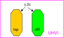

:drc_rule:`(dnwell.-)`
----------------------

.. list-table:: Function: Define deep nwell for isolating pwell and noise immunity
   :header-rows: 1
   :stub-columns: 1
   :widths: 9 73 6 6 6

   * - :drc_rule:`Name`
     - Description
     - :drc_flag:`Flags`
     - Value
     - Unit
   * - :drc_rule:`(dnwell.2)`
     - Min width of deep nwell
     - 
     - 3.000
     - µm
   * - :drc_rule:`(dnwell.3)`
     - Min spacing between deep nwells. Rule exempt inside UHVI.
     - 
     - 6.300
     - µm
   * - :drc_rule:`(dnwell.3a)`
     - Min spacing between deep nwells on same net inside UHVI.
     - 
     - N/A
     - N/A
   * - :drc_rule:`(dnwell.3b)`
     - Min spacing between deep-nwells inside UHVI and deep-nwell outside UHVI
     - 
     - N/A
     - N/A
   * - :drc_rule:`(dnwell.3c)`
     - Min spacing between deep-nwells inside UHVI and nwell outsideUHVI
     - 
     - N/A
     - N/A
   * - :drc_rule:`(dnwell.3d)`
     - Min spacing between deep-nwells inside UHVI on different nets
     - 
     - N/A
     - N/A
   * - :drc_rule:`(dnwell.4)`
     - Dnwell can not overlap pnp:dg
     - 
     - 
     - 
   * - :drc_rule:`(dnwell.5)`
     - P+_diff can not straddle Dnwell
     - 
     - 
     - 
   * - :drc_rule:`(dnwell.6)`
     - RF NMOS must be enclosed by deep nwell (RF FETs are listed in $DESIGN/config/tech/model_set/calibre/fixed_layout_model_map of corresponding techs)
     - 
     - 
     - 
   * - :drc_rule:`(dnwell.7)`
     - Dnwell can not straddle areaid:substratecut
     - 
     - 
     - 

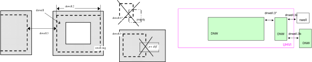

:drc_rule:`(nwell.-)`
---------------------

.. list-table:: Function: Define nwell implant regions
   :header-rows: 1
   :stub-columns: 1
   :widths: 9 73 6 6 6

   * - :drc_rule:`Name`
     - Description
     - :drc_flag:`Flags`
     - Value
     - Unit
   * - :drc_rule:`(nwell.1)`
     - Width of nwell
     - 
     - 0.840
     - µm
   * - :drc_rule:`(nwell.2a)`
     - Spacing between two n-wells
     - 
     - 1.270
     - µm
   * - :drc_rule:`(nwell.2b)`
     - Manual merge wells if less than minimum
     - 
     - 
     - 
   * - :drc_rule:`(nwell.4)`
     - All n-wells will contain metal-contacted tap  (rule checks only for licon on tap) . Rule exempted from high voltage cells inside UHVI
     - 
     - 
     - 
   * - :drc_rule:`(nwell.5)`
     - Deep nwell must be enclosed by nwell by atleast... Exempted inside UHVI or :drc_tag:`areaid.lw`
       Nwells can merge over deep nwell if spacing too small (as in rule nwell.2)
     - :drc_flag:`TC`
     - 0.400
     - µm
   * - :drc_rule:`(nwell.5a)`
     - min enclosure of nwell by dnwell inside UHVI
     - 
     - N/A
     - N/A
   * - :drc_rule:`(nwell.5b)`
     - nwell inside UHVI must not be on the same net as nwell outside UHVI
     - 
     - N/A
     - N/A
   * - :drc_rule:`(nwell.6)`
     - Min enclosure of nwell hole by deep nwell outside UHVI
     - :drc_flag:`TC`
     - 1.030
     - µm
   * - :drc_rule:`(nwell.7)`
     - Min spacing between nwell and deep nwell on separate nets
       Spacing between nwell and deep nwell on the same net is set by the sum of the rules nwell.2 and nwell.5. By default, DRC run on a cell checks for the separate-net spacing, when nwell and deep nwell nets are separate within the cell hierarchy and are joined in the upper hierarchy. To allow net names to be joined and make the same-net rule applicable in this case, the "joinNets" switch should be turned on.
       waffle_chip
     - :drc_flag:`TC`
     - 4.500
     - µm

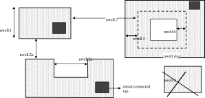

:drc_rule:`(pwbm.-)`
--------------------

.. list-table:: Function: Define p-well block
   :header-rows: 1
   :stub-columns: 1
   :widths: 9 73 6 6 6

   * - :drc_rule:`Name`
     - Description
     - :drc_flag:`Flags`
     - Value
     - Unit
   * - :drc_rule:`(pwbm.1)`
     - Min width of pwbm.dg
     - 
     - N/A
     - N/A
   * - :drc_rule:`(pwbm.2)`
     - Min spacing between two pwbm.dg inside UHVI
     - 
     - N/A
     - N/A
   * - :drc_rule:`(pwbm.3)`
     - Min enclosure of dnwell:dg by pwbm.dg inside UHVI (exempt pwbm hole inside dnwell)
     - 
     - N/A
     - N/A
   * - :drc_rule:`(pwbm.4)`
     - dnwell inside UHVI must be enclosed by pwbm (exempt pwbm hole inside dnwell)
     - 
     - N/A
     - N/A
   * - :drc_rule:`(pwbm.5)`
     - Min Space between two pwbm holes inside UHVI
     - 
     - N/A
     - N/A

.. figure:: periphery/p022-pwbm_dotdash.svg
    :width: 100%
    :align: center

:drc_rule:`(pwdem.-)`
---------------------

.. list-table:: Function: Defines Pwdem (FIXME)
   :header-rows: 1
   :stub-columns: 1
   :widths: 9 73 6 6 6

   * - :drc_rule:`Name`
     - Description
     - :drc_flag:`Flags`
     - Value
     - Unit
   * - :drc_rule:`(pwdem.1)`
     - Min width of pwdem.dg
     - 
     - N/A
     - N/A
   * - :drc_rule:`(pwdem.2)`
     - Min spacing between two pwdem.dg inside UHVI on same net
     - 
     - N/A
     - N/A
   * - :drc_rule:`(pwdem.3)`
     - Min enclosure of pwdem:dg by pwbm.dg inside UHVI
     - 
     - N/A
     - N/A
   * - :drc_rule:`(pwdem.4)`
     - pwdem.dg must be enclosed by UHVI
     - 
     - N/A
     - N/A
   * - :drc_rule:`(pwdem.5)`
     - pwdem.dg inside UHVI must be enclosed by deep nwell
     - 
     - N/A
     - N/A
   * - :drc_rule:`(pwdem.6)`
     - Min enclosure of pwdem:dg by deep nwell inside UHVI
     - 
     - N/A
     - N/A

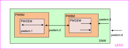

:drc_rule:`(hvtp.-)`
--------------------

.. list-table:: Function: Define Vt adjust implant region for high Vt LV PMOS; 
   :header-rows: 1
   :stub-columns: 1
   :widths: 9 73 6 6 6

   * - :drc_rule:`Name`
     - Description
     - :drc_flag:`Flags`
     - Value
     - Unit
   * - :drc_rule:`(hvtp.1)`
     - Min width of hvtp
     - 
     - 0.380
     - µm
   * - :drc_rule:`(hvtp.2)`
     - Min spacing between hvtp to hvtp
     - 
     - 0.380
     - µm
   * - :drc_rule:`(hvtp.3)`
     - Min enclosure of pfet by hvtp
     - :drc_flag:`P`
     - 0.180
     - µm
   * - :drc_rule:`(hvtp.4)`
     - Min spacing between pfet and hvtp
     - :drc_flag:`P`
     - 0.180
     - µm
   * - :drc_rule:`(hvtp.5)`
     - Min area of hvtp
     - 
     - 0.265
     - µm²
   * - :drc_rule:`(hvtp.6)`
     - Min area of hvtp Holes
     - 
     - 0.265
     - µm²

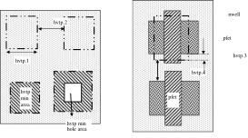

:drc_rule:`(hvtr.-)`
--------------------

.. list-table:: Function: Define low VT adjust implant region for pmedlvtrf; 
   :header-rows: 1
   :stub-columns: 1
   :widths: 9 73 6 6 6

   * - :drc_rule:`Name`
     - Description
     - :drc_flag:`Flags`
     - Value
     - Unit
   * - :drc_rule:`(hvtr.1)`
     - Min width of hvtr
     - 
     - 0.380
     - µm
   * - :drc_rule:`(hvtr.2)`
     - Min spacing between hvtp to hvtr
     - 
     - 0.380
     - µm
   * - :drc_rule:`(hvtr.3)`
     - Min enclosure of pfet by hvtr
     - :drc_flag:`P`
     - 0.180
     - µm

:drc_rule:`(lvtn.-)`
--------------------

.. list-table:: Function: Define regions to block Vt adjust implant for low Vt LV PMOS/NMOS, SONOS FETs and Native NMOS
   :header-rows: 1
   :stub-columns: 1
   :widths: 9 73 6 6 6

   * - :drc_rule:`Name`
     - Description
     - :drc_flag:`Flags`
     - Value
     - Unit
   * - :drc_rule:`(lvtn.1a)`
     - Min width of lvtn
     - 
     - 0.380
     - µm
   * - :drc_rule:`(lvtn.2)`
     - Min space lvtn to lvtn
     - 
     - 0.380
     - µm
   * - :drc_rule:`(lvtn.3a)`
     - Min spacing of lvtn to gate. Rule exempted inside UHVI.
     - :drc_flag:`P`
     - 0.180
     - µm
   * - :drc_rule:`(lvtn.3b)`
     - Min spacing of lvtn to pfet along the S/D direction
     - :drc_flag:`P`
     - 0.235
     - µm
   * - :drc_rule:`(lvtn.4b)`
     - Min enclosure of gate by lvtn. Rule exempted inside UHVI.
     - :drc_flag:`P`
     - 0.180
     - µm
   * - :drc_rule:`(lvtn.9)`
     - Min spacing, no overlap, between lvtn and hvtp
     - 
     - 0.380
     - µm
   * - :drc_rule:`(lvtn.10)`
     - Min enclosure of lvtn by (nwell not overlapping Var_channel) (exclude coincident edges)
     - 
     - 0.380
     - µm
   * - :drc_rule:`(lvtn.12)`
     - Min spacing between lvtn and (nwell inside :drc_tag:`areaid.ce`)
     - 
     - 0.380
     - µm
   * - :drc_rule:`(lvtn.13)`
     - Min area of lvtn
     - 
     - 0.265
     - µm²
   * - :drc_rule:`(lvtn.14)`
     - Min area of lvtn Holes
     - 
     - 0.265
     - µm²

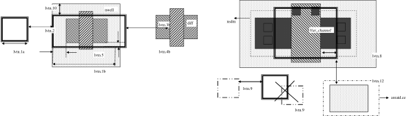

:drc_rule:`(ncm.-)`
-------------------

.. list-table:: Function: Define Vt adjust implant region for LV NMOS in the core of NVSRAM
   :header-rows: 1
   :stub-columns: 1
   :widths: 9 73 6 6 6

   * - :drc_rule:`Name`
     - Description
     - :drc_flag:`Flags`
     - Value
     - Unit
   * - :drc_rule:`(ncm.X.2)`
     - Ncm overlapping areaid:ce is checked for core rules only
     - 
     - 
     - 
   * - :drc_rule:`(ncm.X.3)`
     - Ncm overlapping core cannot overlap N+diff in periphery
     - :drc_flag:`TC`
     - 
     - 
   * - :drc_rule:`(ncm.1)`
     - Width of ncm
     - 
     - 0.380
     - µm
   * - :drc_rule:`(ncm.2a)`
     - Spacing of ncm to ncm
     - 
     - 0.380
     - µm
   * - :drc_rule:`(ncm.2b)`
     - Manual merge ncm if space is below minimum
     - 
     - 
     - 
   * - :drc_rule:`(ncm.3)`
     - Min enclosure of P+diff by Ncm
     - :drc_flag:`P`
     - 0.180
     - µm
   * - :drc_rule:`(ncm.4)`
     - Min enclosure of P+diff within (areaid:ed AndNot areaid:de) by Ncm
     - :drc_flag:`P`
     - 0.180
     - µm
   * - :drc_rule:`(ncm.5)`
     - Min space, no overlap, between ncm and (LVTN_gate) OR (diff containing lvtn)
     - :drc_flag:`P`
     - 0.230
     - µm
   * - :drc_rule:`(ncm.6)`
     - Min space, no overlap, between ncm and nfet
     - :drc_flag:`P`
     - 0.200
     - µm
   * - :drc_rule:`(ncm.7)`
     - Min area of ncm
     - 
     - 0.265
     - µm²
   * - :drc_rule:`(ncm.8)`
     - Min area of ncm Holes
     - 
     - 0.265
     - µm²

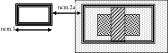

:drc_rule:`(difftap.-)`
-----------------------

.. list-table:: Function: Defines active regions and contacts to substrate
   :header-rows: 1
   :stub-columns: 1
   :widths: 9 73 6 6 6

   * - :drc_rule:`Name`
     - Description
     - :drc_flag:`Flags`
     - Value
     - Unit
   * - :drc_rule:`(difftap.1)`
     - Width of diff or tap
     - :drc_flag:`P`
     - 0.150
     - µm
   * - :drc_rule:`(difftap.2)`
     - Minimum channel width (Diff And Poly) except for FETs inside :drc_tag:`areaid.sc`: Rule exempted in the SP8* flows only, for the cells listed in rule difftap.2a
     - :drc_flag:`P`
     - 0.420
     - µm
   * - :drc_rule:`(difftap.2a)`
     - Minimum channel width (Diff And Poly) for cell names "s8cell_ee_plus_sseln_a", "s8cell_ee_plus_sseln_b", "s8cell_ee_plus_sselp_a", "s8cell_ee_plus_sselp_b" , "s8fpls_pl8", "s8fpls_rdrv4" , "s8fpls_rdrv4f" and "s8fpls_rdrv8"
     - :drc_flag:`P`
     - NA
     - µm
   * - :drc_rule:`(difftap.2b)`
     - Minimum channel width (Diff And Poly) for FETs inside :drc_tag:`areaid.sc`
     - :drc_flag:`P`
     - 0.360
     - µm
   * - :drc_rule:`(difftap.3)`
     - Spacing of diff to diff, tap to tap, or non-abutting diff to tap
     - 
     - 0.270
     - µm
   * - :drc_rule:`(difftap.4)`
     - Min tap bound by one diffusion
     - 
     - 0.290
     - 
   * - :drc_rule:`(difftap.5)`
     - Min tap bound by two diffusions
     - :drc_flag:`P`
     - 0.400
     - 
   * - :drc_rule:`(difftap.6)`
     - Diff and tap are not allowed to extend beyond their abutting edge
     - 
     - 
     - 
   * - :drc_rule:`(difftap.7)`
     - Spacing of diff/tap abutting edge to a non-conciding diff or tap edge
     - :drc_flag:`NE`
     - 0.130
     - µm
   * - :drc_rule:`(difftap.8)`
     - Enclosure of (p+) diffusion by N-well. Rule exempted inside UHVI.
     - :drc_flag:`DE` :drc_flag:`NE` :drc_flag:`P`
     - 0.180
     - µm
   * - :drc_rule:`(difftap.9)`
     - Spacing of (n+) diffusion to N-well outside UHVI
     - :drc_flag:`DE` :drc_flag:`NE` :drc_flag:`P`
     - 0.340
     - µm
   * - :drc_rule:`(difftap.10)`
     - Enclosure of (n+)  tap by N-well. Rule exempted inside UHVI.
     - :drc_flag:`NE` :drc_flag:`P`
     - 0.180
     - µm
   * - :drc_rule:`(difftap.11)`
     - Spacing of (p+) tap to  N-well. Rule exempted inside UHVI.
     - 
     - 0.130
     - µm
   * - :drc_rule:`(difftap.12)`
     - ESD_nwell_tap is considered shorted to the abutting diff
     - :drc_flag:`NC`
     - 
     - 
   * - :drc_rule:`(difftap.13)`
     - Diffusion or the RF FETS in Table H5 is defined by Ldiff and Wdiff.
     - 
     - 
     - 

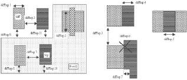

:drc_rule:`(tunm.-)`
--------------------

.. list-table:: Function: Defines SONOS FETs 
   :header-rows: 1
   :stub-columns: 1
   :widths: 9 73 6 6 6

   * - :drc_rule:`Name`
     - Description
     - :drc_flag:`Flags`
     - Value
     - Unit
   * - :drc_rule:`(tunm.1)`
     - Min width of tunm
     - 
     - 0.410
     - µm
   * - :drc_rule:`(tunm.2)`
     - Min spacing of tunm to tunm
     - 
     - 0.500
     - µm
   * - :drc_rule:`(tunm.3)`
     - Extension of tunm beyond (poly and diff)
     - 
     - 0.095
     - 
   * - :drc_rule:`(tunm.4)`
     - Min spacing of tunm to (poly and diff) outside tunm
     - 
     - 0.095
     - µm
   * - :drc_rule:`(tunm.5)`
     - (poly and diff) may not straddle tunm
     - 
     - 
     - 
   * - :drc_rule:`(tunm.6a)`
     - Tunm outside deep n-well is not allowed
     - :drc_flag:`TC`
     - 
     - 
   * - :drc_rule:`(tunm.7)`
     - Min tunm area
     - 
     - 0.672
     - µm²
   * - :drc_rule:`(tunm.8)`
     - tunm must be enclosed by :drc_tag:`areaid.ce`
     - 
     - 
     - 

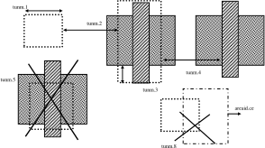

:drc_rule:`(poly.-)`
--------------------

.. list-table:: Function: Defines FET gates, interconnects and resistors
   :header-rows: 1
   :stub-columns: 1
   :widths: 9 73 6 6 6

   * - :drc_rule:`Name`
     - Description
     - :drc_flag:`Flags`
     - Value
     - Unit
   * - :drc_rule:`(poly.X.1)`
     - All FETs would be checked for W/Ls as documented in spec 001-02735  (Exempt FETs that are pruned; exempt for W/L's inside :drc_tag:`areaid.sc` and inside cell name scs8*decap* and listed in the MRGA as a decap only W/L)
     - 
     - 
     - 
   * - :drc_rule:`(poly.X.1a)`
     - Min & max dummy_poly L is equal to min L allowed for corresponding device type (exempt rule for dummy_poly in cells listed on Table H3)
     - 
     - 
     - 
   * - :drc_rule:`(poly.1a)`
     - Width of poly
     - 
     - 0.150
     - µm
   * - :drc_rule:`(poly.1b)`
     - Min channel length (poly width) for pfet overlapping lvtn (exempt rule for dummy_poly in cells listed on Table H3)
     - 
     - 0.350
     - µm
   * - :drc_rule:`(poly.2)`
     - Spacing of poly to poly except for poly.c2 and poly.c3; Exempt cell: sr_bltd_eq where it is same as poly.c2
     - 
     - 0.210
     - µm
   * - :drc_rule:`(poly.3)`
     - Min poly resistor width
     - 
     - 0.330
     - µm
   * - :drc_rule:`(poly.4)`
     - Spacing of poly on field to diff (parallel edges only)
     - :drc_flag:`P`
     - 0.075
     - µm
   * - :drc_rule:`(poly.5)`
     - Spacing of poly on field to tap
     - :drc_flag:`P`
     - 0.055
     - µm
   * - :drc_rule:`(poly.6)`
     - Spacing of poly on diff to abutting tap (min source)
     - :drc_flag:`P`
     - 0.300
     - µm
   * - :drc_rule:`(poly.7)`
     - Extension of diff beyond poly (min drain)
     - :drc_flag:`P`
     - 0.250
     - 
   * - :drc_rule:`(poly.8)`
     - Extension of poly beyond diffusion (endcap)
     - :drc_flag:`P`
     - 0.130
     - 
   * - :drc_rule:`(poly.9)`
     - Poly resistor spacing to poly or spacing (no overlap) to diff/tap
     - 
     - 0.480
     - µm
   * - :drc_rule:`(poly.10)`
     - Poly can't overlap inner corners of diff
     - 
     - 
     - 
   * - :drc_rule:`(poly.11)`
     - No 90 deg turns of poly on diff
     - 
     - 
     - 
   * - :drc_rule:`(poly.12)`
     - (Poly NOT (nwell NOT hvi)) may not overlap tap; Rule exempted for cell name "s8fgvr_n_fg2" and gated_npn and inside UHVI.
     - :drc_flag:`P`
     - 
     - 
   * - :drc_rule:`(poly.15)`
     - Poly must not overlap diff:rs
     - 
     - 
     - 
   * - :drc_rule:`(poly.16)`
     - Inside RF FETs defined in Table H5, poly cannot overlap poly across multiple adjacent instances
     - 
     - 
     - 

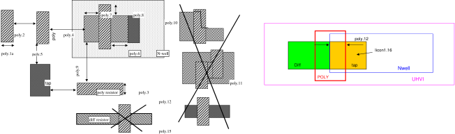

:drc_rule:`(rpm.-)`
-------------------

.. list-table:: Function: Defines p+ poly resistors
   :header-rows: 1
   :stub-columns: 1
   :widths: 9 73 6 6 6

   * - :drc_rule:`Name`
     - Description
     - :drc_flag:`Flags`
     - Value
     - Unit
   * - :drc_rule:`(rpm.1a)`
     - Min width of rpm
     - 
     - 1.270
     - µm
   * - :drc_rule:`(rpm.1b)`
     - Min/Max prec_resistor width xhrpoly_0p35
     - 
     - 0.350
     - µm
   * - :drc_rule:`(rpm.1c)`
     - Min/Max prec_resistor width xhrpoly_0p69
     - 
     - 0.690
     - µm
   * - :drc_rule:`(rpm.1d)`
     - Min/Max prec_resistor width xhrpoly_1p41
     - 
     - 1.410
     - µm
   * - :drc_rule:`(rpm.1e)`
     - Min/Max prec_resistor width xhrpoly_2p85
     - 
     - 2.850
     - µm
   * - :drc_rule:`(rpm.1f)`
     - Min/Max prec_resistor width xhrpoly_5p73
     - 
     - 5.730
     - µm
   * - :drc_rule:`(rpm.1g)`
     - Only 1 licon is allowed in xhrpoly_0p35 prec_resistor_terminal
     - 
     - 
     - 
   * - :drc_rule:`(rpm.1h)`
     - Only 1 licon is allowed in xhrpoly_0p69 prec_resistor_terminal
     - 
     - 
     - 
   * - :drc_rule:`(rpm.1i)`
     - Only 2 licons are allowed in xhrpoly_1p41 prec_resistor_terminal
     - 
     - 
     - 
   * - :drc_rule:`(rpm.1j)`
     - Only 4 licons are allowed in xhrpoly_2p85 prec_resistor_terminal
     - 
     - 
     - 
   * - :drc_rule:`(rpm.1k)`
     - Only 8 licons are allowed in xhrpoly_5p73 prec_resistor_terminal
     - 
     - 
     - 
   * - :drc_rule:`(rpm.2)`
     - Min spacing of rpm to rpm
     - 
     - 0.840
     - µm
   * - :drc_rule:`(rpm.3)`
     - rpm must enclose prec_resistor by atleast
     - 
     - 0.200
     - 
   * - :drc_rule:`(rpm.4)`
     - prec_resistor must be enclosed by psdm by atleast
     - 
     - 0.110
     - µm
   * - :drc_rule:`(rpm.5)`
     - prec_resistor must be enclosed by npc by atleast
     - 
     - 0.095
     - µm
   * - :drc_rule:`(rpm.6)`
     - Min spacing, no overlap, of rpm and nsdm
     - 
     - 0.200
     - µm
   * - :drc_rule:`(rpm.7)`
     - Min spacing between rpm and poly
     - 
     - 0.200
     - µm
   * - :drc_rule:`(rpm.8)`
     - poly must not straddle rpm
     - 
     - 
     - 
   * - :drc_rule:`(rpm.9)`
     - Min space, no overlap, between prec_resistor and hvntm
     - 
     - 0.185
     - µm
   * - :drc_rule:`(rpm.10)`
     - Min spacing of rpm to pwbm
     - 
     - N/A
     - N/A
   * - :drc_rule:`(rpm.11)`
     - | rpm should not overlap or straddle pwbm except cells
       | s8usbpdv2_csa_top
       | s8usbpdv2_20vconn_sw_300ma_ovp_ngate_unit
       | s8usbpdv2_20vconn_sw_300ma_ovp
       | s8usbpdv2_20sbu_sw_300ma_ovp
     - 
     - N/A
     - N/A

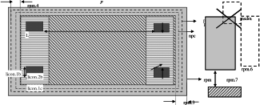

:drc_rule:`(varac.-)`
---------------------

.. list-table:: Function: Defines varactors
   :header-rows: 1
   :stub-columns: 1
   :widths: 9 73 6 6 6

   * - :drc_rule:`Name`
     - Description
     - :drc_flag:`Flags`
     - Value
     - Unit
   * - :drc_rule:`(varac.1)`
     - Min channel length (poly width) of Var_channel
     - 
     - 0.180
     - µm
   * - :drc_rule:`(varac.2)`
     - Min channel width (tap width) of Var_channel
     - 
     - 1.000
     - µm
   * - :drc_rule:`(varac.3)`
     - Min spacing between hvtp to Var_channel
     - 
     - 0.180
     - µm
   * - :drc_rule:`(varac.4)`
     - Min spacing of licon on tap to Var_channel
     - 
     - 0.250
     - µm
   * - :drc_rule:`(varac.5)`
     - Min enclosure of poly overlapping Var_channel by nwell
     - 
     - 0.150
     - µm
   * - :drc_rule:`(varac.6)`
     - Min spacing between VaracTap and difftap
     - 
     - 0.270
     - µm
   * - :drc_rule:`(varac.7)`
     - Nwell overlapping Var_channel must not overlap P+ diff
     - 
     - 
     - 
   * - :drc_rule:`(varac.8)`
     - Min enclosure of Var_channel by hvtp
     - 
     - 0.255
     - µm

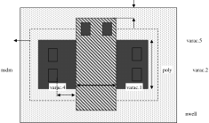

:drc_rule:`(photo.-)`
---------------------

.. list-table:: Function: Photo diode for sensing light
   :header-rows: 1
   :stub-columns: 1
   :widths: 9 73 6 6 6

   * - :drc_rule:`Name`
     - Description
     - :drc_flag:`Flags`
     - Value
     - Unit
   * - :drc_rule:`(photo.1)`
     - Rules dnwell.3 and nwell.5 are exempted for photoDiode
     - 
     - 
     - 
   * - :drc_rule:`(photo.2)`
     - Min/Max width of photoDiode
     - 
     - 3.000
     - µm
   * - :drc_rule:`(photo.3)`
     - Min spacing between photoDiode
     - 
     - 5.000
     - µm
   * - :drc_rule:`(photo.4)`
     - Min spacing between photoDiode and deep nwell
     - 
     - 5.300
     - µm
   * - :drc_rule:`(photo.5)`
     - photoDiode edges must be coincident with :drc_tag:`areaid.po`
     - 
     - 
     - 
   * - :drc_rule:`(photo.6)`
     - photoDiode must be enclosed by dnwell ring
     - 
     - 
     - 
   * - :drc_rule:`(photo.7)`
     - photoDiode must be enclosed by p+ tap ring
     - 
     - 
     - 
   * - :drc_rule:`(photo.8)`
     - Min/Max width of nwell inside photoDiode
     - 
     - 0.840
     - µm
   * - :drc_rule:`(photo.9)`
     - Min/Max enclosure of nwell by photoDiode
     - 
     - 1.080
     - µm
   * - :drc_rule:`(photo.10)`
     - Min/Max width of tap inside photoDiode
     - 
     - 0.410
     - µm
   * - :drc_rule:`(photo.11)`
     - Min/Max enclosure of tap by nwell inside photoDiode
     - 
     - 0.215
     - µm

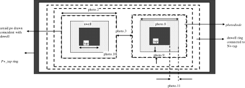

:drc_rule:`(npc.-)`
-------------------

.. list-table:: Function: Defines nitride openings to contact poly and Li1
   :header-rows: 1
   :stub-columns: 1
   :widths: 9 73 6 6 6

   * - :drc_rule:`Name`
     - Description
     - :drc_flag:`Flags`
     - Value
     - Unit
   * - :drc_rule:`(npc.1)`
     - Min width of NPC
     - 
     - 0.270
     - µm
   * - :drc_rule:`(npc.2)`
     - Min spacing of NPC to NPC
     - 
     - 0.270
     - µm
   * - :drc_rule:`(npc.3)`
     - Manual merge if less than minimum
     - 
     - 
     - 
   * - :drc_rule:`(npc.4)`
     - Spacing (no overlap) of NPC to Gate
     - 
     - 0.090
     - µm
   * - :drc_rule:`(npc.5)`
     - Max enclosure of poly overlapping slotted_licon by npcm (merge between adjacent short edges of the slotted_licons if space < min)
     - 
     - 0.095
     - µm

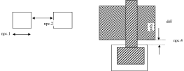

:drc_rule:`(n/ psd.-)`
----------------------

.. list-table:: Function: Defines opening for N+/P+ implants
   :header-rows: 1
   :stub-columns: 1
   :widths: 9 73 6 6 6

   * - :drc_rule:`Name`
     - Description
     - :drc_flag:`Flags`
     - Value
     - Unit
   * - :drc_rule:`(n/ psd.1)`
     - Width of nsdm(psdm)
     - :drc_flag:`P`
     - 0.380
     - µm
   * - :drc_rule:`(n/ psd.2)`
     - Spacing of nsdm(psdm) to nsdm(psdm)
     - :drc_flag:`P`
     - 0.380
     - µm
   * - :drc_rule:`(n/ psd.3)`
     - Manual merge if less than minimum
     - 
     - 
     - 
   * - :drc_rule:`(n/ psd.5a)`
     - Enclosure of diff by nsdm(psdm), except for butting edge
     - 
     - 0.125
     - µm
   * - :drc_rule:`(n/ psd.5b)`
     - Enclosure of tap by nsdm(psdm), except for butting edge
     - :drc_flag:`P`
     - 0.125
     - µm
   * - :drc_rule:`(n/ psd.6)`
     - Enclosure of diff/tap butting edge by nsdm (psdm)
     - 
     - 0.000
     - µm
   * - :drc_rule:`(n/ psd.7)`
     - Spacing of NSDM/PSDM to opposite implant diff or tap (for non-abutting diff/tap edges)
     - 
     - 0.130
     - µm
   * - :drc_rule:`(n/ psd.8)`
     - Nsdm and psdm cannot overlap diff/tap regions of opposite doping
     - :drc_flag:`DE`
     - 
     - 
   * - :drc_rule:`(n/ psd.9)`
     - Diff and tap must be enclosed by their corresponding implant layers. Rule exempted for
         - diff inside "advSeal_6um* OR cuPillarAdvSeal_6um*" pcell for SKY130P*/SP8P*/SKY130DI-5R-CSMC flows
         - diff rings around the die at min total L>1000 um and W=0.3 um
         - gated_npn 
         - :drc_tag:`areaid.zer`.
     - :drc_flag:`DE`
     - 
     - 
   * - :drc_rule:`(n/ psd.10a)`
     - Min area of Nsdm
     - 
     - 0.265
     - µm²
   * - :drc_rule:`(n/ psd.10b)`
     - Min area of Psdm
     - 
     - 0.255
     - µm²
   * - :drc_rule:`(n/ psd.11)`
     - Min area of n/psdmHoles
     - 
     - 0.265
     - µm²

.. figure:: periphery/p032-n_psd_dotdash.svg
    :width: 100%
    :align: center

:drc_rule:`(licon.-)`
---------------------

.. list-table:: Function: Defines contacts between poly/diff/tap and Li1
   :header-rows: 1
   :stub-columns: 1
   :widths: 9 73 6 6 6

   * - :drc_rule:`Name`
     - Description
     - :drc_flag:`Flags`
     - Value
     - Unit
   * - :drc_rule:`(licon.1)`
     - Min and max L and W of licon (exempt licons inside prec_resistor)
     - 
     - 0.170
     - µm
   * - :drc_rule:`(licon.1b)`
     - Min and max width of licon inside prec_resistor
     - 
     - 0.190
     - µm
   * - :drc_rule:`(licon.1c)`
     - Min and max length of licon inside prec_resistor
     - 
     - 2.000
     - µm
   * - :drc_rule:`(licon.2)`
     - Spacing of licon to licon
     - :drc_flag:`P`
     - 0.170
     - µm
   * - :drc_rule:`(licon.2b)`
     - Min spacing between two slotted_licon (when the both the edges are 0.19um in length)
     - 
     - 0.350
     - µm
   * - :drc_rule:`(licon.2c)`
     - Min spacing between two slotted_licon (except for rule licon.2b)
     - 
     - 0.510
     - µm
   * - :drc_rule:`(licon.2d)`
     - Min spacing between a slotted_licon and 0.17um square licon
     - 
     - 0.510
     - µm
   * - :drc_rule:`(licon.3)`
     - Only min. square licons are allowed except die seal ring where licons are (licon CD)*L
     - 
     - 0.170 *L
     - 
   * - :drc_rule:`(licon.4)`
     - Licon1 must overlap li1 and (poly or diff or tap)
     - 
     - 
     - 
   * - :drc_rule:`(licon.5a)`
     - Enclosure of licon by diff
     - :drc_flag:`P`
     - 0.040
     - µm
   * - :drc_rule:`(licon.5b)`
     - Min space between tap_licon and diff-abutting tap edge
     - :drc_flag:`P`
     - 0.060
     - µm
   * - :drc_rule:`(licon.5c)`
     - Enclosure of licon by diff on one of two adjacent sides
     - :drc_flag:`P`
     - 0.060
     - µm
   * - :drc_rule:`(licon.6)`
     - Licon cannot straddle tap
     - :drc_flag:`P`
     - 
     - 
   * - :drc_rule:`(licon.7)`
     - Enclosure of licon by one of two adjacent edges of isolated tap
     - :drc_flag:`P`
     - 0.120
     - µm
   * - :drc_rule:`(licon.8)`
     - Enclosure of poly_licon by poly
     - :drc_flag:`P`
     - 0.050
     - µm
   * - :drc_rule:`(licon.8a)`
     - Enclosure of poly_licon by poly on one of two adjacent sides
     - :drc_flag:`P`
     - 0.080
     - µm
   * - :drc_rule:`(licon.9)`
     - Spacing, no overlap, between poly_licon and psdm; In SKY130DIA/SKY130TMA/SKY130PIR-10 flows, the rule is checked only between (poly_licon outside rpm) and psdm
     - :drc_flag:`P`
     - 0.110
     - µm
   * - :drc_rule:`(licon.10)`
     - Spacing of licon on (tap AND (nwell NOT hvi)) to Var_channel
     - :drc_flag:`P`
     - 0.250
     - µm
   * - :drc_rule:`(licon.11)`
     - Spacing of licon on diff or tap to poly on diff (except for all FETs inside :drc_tag:`areaid.sc` and except s8spf-10r flow for 0.5um phv inside cell names "s8fs_gwdlvx4", "s8fs_gwdlvx8", "s8fs_hvrsw_x4", "s8fs_hvrsw8", "s8fs_hvrsw264", and "s8fs_hvrsw520" and for 0.15um nshort inside cell names "s8fs_rdecdrv", "s8fs_rdec8", "s8fs_rdec32", "s8fs_rdec264", "s8fs_rdec520")
     - :drc_flag:`P`
     - 0.055
     - µm
   * - :drc_rule:`(licon.11a)`
     - Spacing of licon on diff or tap to poly on diff (for all FETs inside :drc_tag:`areaid.sc` except 0.15um phighvt)
     - :drc_flag:`P`
     - 0.050
     - µm
   * - :drc_rule:`(licon.11b)`
     - Spacing of licon on diff or tap to poly on diff (for 0.15um phighvt inside :drc_tag:`areaid.sc`)
     - :drc_flag:`P`
     - 0.050
     - µm
   * - :drc_rule:`(licon.11c)`
     - Spacing of licon on diff or tap to poly on diff (for 0.5um phv inside cell names "s8fs_gwdlvx4", "s8fs_gwdlvx8", "s8fs_hvrsw_x4", "s8fs_hvrsw8", "s8fs_hvrsw264", and "s8fs_hvrsw520")
     - :drc_flag:`P`
     - 0.040
     - µm
   * - :drc_rule:`(licon.11d)`
     - Spacing of licon on diff or tap to poly on diff (for 0.15um nshort inside cell names "s8fs_rdecdrv", "s8fs_rdec8", "s8fs_rdec32", "s8fs_rdec264", "s8fs_rdec520")
     - :drc_flag:`P`
     - 0.045
     - µm
   * - :drc_rule:`(licon.12)`
     - Max SD width without licon
     - :drc_flag:`NC`
     - 5.700
     - µm
   * - :drc_rule:`(licon.13)`
     - Spacing (no overlap) of NPC to licon on diff or tap
     - :drc_flag:`P`
     - 0.090
     - µm
   * - :drc_rule:`(licon.14)`
     - Spacing of poly_licon to diff or tap
     - :drc_flag:`P`
     - 0.190
     - µm
   * - :drc_rule:`(licon.15)`
     - poly_licon must be enclosed by npc by…
     - :drc_flag:`P`
     - 0.100
     - µm
   * - :drc_rule:`(licon.16)`
     - | Every source_diff and every tap must enclose at least one licon1, including the diff/tap straddling areaid:ce. 
       | Rule exempted inside UHVI.
     - :drc_flag:`P`
     - 
     - 
   * - :drc_rule:`(licon.17)`
     - Licons may not overlap both poly and (diff or tap)
     - 
     - 
     - 
   * - :drc_rule:`(licon.18)`
     - Npc must enclose poly_licon
     - 
     - 
     - 
   * - :drc_rule:`(licon.19)`
     - poly of the HV varactor must not interact with licon
     - :drc_flag:`P`
     - 
     - 

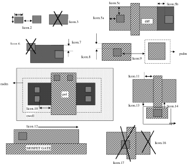

:drc_rule:`(li.-.-)`
--------------------

.. list-table:: Function: Defines local interconnect to diff/tap and poly
   :header-rows: 1
   :stub-columns: 1
   :widths: 9 73 6 6 6

   * - :drc_rule:`Name`
     - Description
     - :drc_flag:`Flags`
     - Value
     - Unit
   * - :drc_rule:`(li.1.-)`
     - Width of LI (except for li.1a)
     - :drc_flag:`P`
     - 0.170
     - µm
   * - :drc_rule:`(li.1a.-)`
     - Width of LI inside of cells with name s8rf2_xcmvpp_hd5_*
     - :drc_flag:`P`
     - 0.140
     - µm
   * - :drc_rule:`(li.2.-)`
     - Max ratio of length to width of LI without licon or mcon
     - :drc_flag:`NC`
     - 10.000
     - µm
   * - :drc_rule:`(li.3.-)`
     - Spacing of LI to LI (except for li.3a)
     - :drc_flag:`P`
     - 0.170
     - µm
   * - :drc_rule:`(li.3a.-)`
     - Spacing of LI to LI inside cells with names s8rf2_xcmvpp_hd5_*
     - :drc_flag:`P`
     - 0.140
     - µm
   * - :drc_rule:`(li.5.-)`
     - Enclosure of licon by one of two adjacent LI sides
     - :drc_flag:`P`
     - 0.080
     - µm
   * - :drc_rule:`(li.6.-)`
     - Min area of LI
     - :drc_flag:`P`
     - 0.0561
     - µm²
   * - :drc_rule:`(li.7.-)`
     - Min LI resistor width (rule exempted within :drc_tag:`areaid.ed`; Inside :drc_tag:`areaid.ed`, min width of the li resistor is determined by rule li.1)
     - 
     - 0.290
     - µm

:drc_rule:`(ct.-)`
------------------

.. list-table:: Function: Defines contact between Li1 and met1
   :header-rows: 1
   :stub-columns: 1
   :widths: 9 73 6 6 6

   * - :drc_rule:`Name`
     - Description
     - :drc_flag:`Flags`
     - Value
     - Unit
   * - :drc_rule:`(ct.1)`
     - Min and max L and W of mcon
     - :drc_flag:`DNF`
     - 0.170
     - µm
   * - :drc_rule:`(ct.2)`
     - Spacing of mcon to mcon
     - :drc_flag:`DNF`
     - 0.190
     - µm
   * - :drc_rule:`(ct.3)`
     - Only min. square mcons are allowed except die seal ring where mcons are…
     - 
     - 0.170*L
     - 
   * - :drc_rule:`(ct.4)`
     - Mcon must be enclosed by LI by at least …
     - :drc_flag:`P`
     - 0.000
     - µm
   * - :drc_rule:`(ct.irdrop.1)`
     - For 1 <= n <= 10 contacts on the same connector, mcon area pre- and post- Cu conversion must differ by no more than…
     - :drc_flag:`CU` :drc_flag:`IR`
     - 0.2
     - µm
   * - :drc_rule:`(ct.irdrop.2)`
     - For 11 <= n <= 100 contacts on the same connector, mcon area pre- and post- Cu conversion must differ by no more than…
     - :drc_flag:`CU` :drc_flag:`IR`
     - 0.3
     - µm
   * - :drc_rule:`(ct.irdrop.3)`
     - For n > 100 contacts on the same connector, mcon area pre- and post- Cu conversion must differ by no more than…
     - :drc_flag:`CU` :drc_flag:`IR`
     - 0.7
     - µm

:drc_rule:`(capm.-)`
--------------------

.. list-table:: Function: Defines MIM capacitor
   :header-rows: 1
   :stub-columns: 1
   :widths: 9 73 6 6 6

   * - :drc_rule:`Name`
     - Description
     - :drc_flag:`Flags`
     - Value
     - Unit
   * - :drc_rule:`(capm.1)`
     - Min width of capm
     - 
     - N/A
     - N/A
   * - :drc_rule:`(capm.2a)`
     - Min spacing of capm to capm
     - 
     - N/A
     - N/A
   * - :drc_rule:`(capm.2b)`
     - Minimum spacing of capacitor bottom_plate to bottom plate
     - 
     - N/A
     - N/A
   * - :drc_rule:`(capm.3)`
     - Minimum enclosure of capm (top_plate) by met2
     - 
     - N/A
     - N/A
   * - :drc_rule:`(capm.4)`
     - Min enclosure of via2 by capm
     - 
     - N/A
     - N/A
   * - :drc_rule:`(capm.5)`
     - Min spacing between capm and via2
     - 
     - N/A
     - N/A
   * - :drc_rule:`(capm.6)`
     - Maximum Aspect Ratio (Length/Width)
     - 
     - N/A
     - N/A
   * - :drc_rule:`(capm.7)`
     - Only rectangular capacitors are allowed
     - 
     - N/A
     - N/A
   * - :drc_rule:`(capm.8)`
     - Min space, no overlap, between via and capm
     - 
     - N/A
     - N/A
   * - :drc_rule:`(capm.10)`
     - capm must not straddle nwell, diff, tap, poly, li1 and met1 (Rule exempted for capm overlapping capm_2t.dg)
     - :drc_flag:`TC`
     - N/A
     - N/A
   * - :drc_rule:`(capm.11)`
     - Min spacing between capm to (met2 not overlapping capm)
     - 
     - N/A
     - N/A
   * - :drc_rule:`(capm.12)`
     - Max area of capm (um^2)
     - 
     - N/A
     - N/A

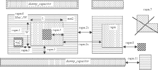

:drc_rule:`(vpp.-)`
-------------------

.. list-table:: Function: Defines VPP capacitor
   :header-rows: 1
   :stub-columns: 1
   :widths: 9 73 6 6 6

   * - :drc_rule:`Name`
     - Description
     - :drc_flag:`Flags`
     - Value
     - Unit
   * - :drc_rule:`(vpp.1)`
     - Min width of capacitor:dg
     - 
     - 1.430
     - µm
   * - :drc_rule:`(vpp.1b)`
     - Max width of capacitor:dg; Rule not applicable for vpp_with_Met3Shield and vpp_with_LiShield and vpp_over_MOSCAP and vpp_with_Met5 and vpp_with_noLi
     - 
     - 11.350
     - µm
   * - :drc_rule:`(vpp.1c)`
     - Min/Max width of cell name "s8rf_xcmvpp1p8x1p8_m3shield "
     - 
     - 3.880
     - µm
   * - :drc_rule:`(vpp.3)`
     - capacitor:dg must not overlap (tap or diff or poly); (one exception: Poly is allowed to overlap  vpp_with_Met3Shield and vpp_with_Met5PolyShield); (not applicable for vpp_over_Moscap or "s8rf2_xcmvppx4_2xnhvnative10x4" or vpp_with_LiShield)
     - 
     - 
     - 
   * - :drc_rule:`(vpp.4)`
     - capacitor:dg must not straddle (nwell or dnwell)
     - 
     - 
     - 
   * - :drc_rule:`(vpp.5)`
     - Min spacing between (capacitor:dg edge and (poly or li1 or met1 or met2)) to (poly or li1 or met1 or met2) on separate nets (Exempt area of the error shape less than 2.25 µm² and run length less than 2.0um); Rule not applicable for vpp_with_Met3Shield and vpp_with_LiShield and vpp_over_MOSCAP and vpp_with_Met5 and vpp_with_noLi
     - 
     - 1.500
     - µm
   * - :drc_rule:`(vpp.5a)`
     - Max pattern density of met3.dg over capacitor.dg (not applicable for vpp_with_Met3Shield and vpp_with_LiShield and vpp_over_MOSCAP and vpp_with_Met5)
     - 
     - 0.25
     - \-
   * - :drc_rule:`(vpp.5b)`
     - Max pattern density of met4.dg over capacitor.dg (not applicable for vpp_with_Met3Shield and vpp_with_Met5 and vpp_over_MOSCAP)
     - 
     - 0.3
     - \-
   * - :drc_rule:`(vpp.5c)`
     - Max pattern density of met5.dg over capacitor.dg (not applicable for vpp_with_Met3Shield and vpp_with_Met5 and vpp_over_MOSCAP and vpp_with_noLi); (one exception: rules does apply to cell "s8rf2_xcmvpp11p5x11p7_m1m4" and "s8rf2_xcmvpp_hd5_atlas*")
     - 
     - 0.4
     - \-
   * - :drc_rule:`(vpp.8)`
     - Min enclosure of capacitor:dg by nwell
     - 
     - 1.500
     - µm
   * - :drc_rule:`(vpp.9)`
     - Min spacing of capacitor:dg to nwell (not applicable for vpp_over_MOSCAP)
     - 
     - 1.500
     - µm
   * - :drc_rule:`(vpp.10)`
     - vpp capacitors must not overlap; Rule checks for capacitor.dg overlapping more than one pwell pin
     - 
     - 
     - 
   * - :drc_rule:`(vpp.11)`
     - Min pattern density of (poly and diff) over capacitor.dg; (vpp_over_Moscap only)
     - 
     - 0.87
     - \-
   * - :drc_rule:`(vpp.12a)`
     - Number of met4 shapes inside capacitor.dg of cell "s8rf2_xcmvpp8p6x7p9_m3_lim5shield"  must overlap with size 2.01 x 2.01 (no other met4 shapes allowed)
     - 
     - 9.00
     - µm
   * - :drc_rule:`(vpp.12b)`
     - Number of met4 shapes inside capacitor.dg of cell "s8rf2_xcmvpp11p5x11p7_m3_lim5shield"  must overlap with size 2.01 x 2.01 (no other met4 shapes allowed)
     - 
     - 16.00
     - µm
   * - :drc_rule:`(vpp.12c)`
     - Number of met4 shapes inside capacitor.dg of cell "s8rf2_xcmvpp4p4x4p6_m3_lim5shield"  must overlap with size 1.5 x 1.5 (no other met4 shapes allowed)
     - 
     - 4.00
     - µm
   * - :drc_rule:`(vpp.13)`
     - Min space of met1 to met1inside VPP capacitor
     - :drc_flag:`CU`
     - 0.160
     - µm
   * - :drc_rule:`(vpp.14)`
     - Min space of met2 to met2 inside VPP capacitor
     - :drc_flag:`CU`
     - 0.160
     - µm

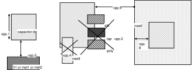

:drc_rule:`(m1.-)`
------------------

.. list-table:: Function: Defines first level of metal interconnects, buses etc;
   :header-rows: 1
   :stub-columns: 1
   :widths: 9 73 6 6 6

   * - :drc_rule:`Name`
     - Description
     - :drc_flag:`Flags`
     - Value
     - Unit
   * - :drc_rule:`(m1.-)`
     - | Algorithm should flag errors, for met1, if ANY of the following is true:
       | An entire 700x700 window is covered by cmm1 waffleDrop, and metX PD < 70% for same window.
       | 80-100% of 700x700 window is covered by cmm1 waffleDrop, and metX PD < 65% for same window.
       | 60-80% of 700x700 window is covered by cmm1 waffleDrop, and metX PD < 60% for same window.
       | 50-60% of 700x700 window is covered by cmm1 waffleDrop, and metX PD < 50% for same window.
       | 40-50% of 700x700 window is covered by cmm1 waffleDrop, and metX PD < 40% for same window.
       | 30-40% of 700x700 window is covered by cmm1 waffleDrop, and metX PD < 30% for same window.
       | Exclude cells whose area is below 40Kum2. NOTE: Required for IP, Recommended for Chip-level.
     - :drc_flag:`RC`
     - 
     - 
   * - :drc_rule:`(m1.1)`
     - Width of metal1
     - 
     - 0.140
     - µm
   * - :drc_rule:`(m1.2)`
     - Spacing of metal1 to metal1
     - 
     - 0.140
     - µm
   * - :drc_rule:`(m1.3a)`
     - Min. spacing of features attached to or extending from huge_met1 for a distance of up to  0.280 µm to metal1 (rule not checked over non-huge met1 features)
     - 
     - 0.280
     - µm
   * - :drc_rule:`(m1.3b)`
     - Min. spacing of huge_met1 to metal1 excluding features checked by m1.3a
     - 
     - 0.280
     - µm
   * - :drc_rule:`(m1.4)`
     - Mcon must be enclosed by Met1 by at least …(Rule exempted for cell names documented in rule m1.4a)
     - :drc_flag:`P`
     - 0.030
     - µm
   * - :drc_rule:`(m1.4a)`
     - Mcon must be enclosed by Met1 by at least (for cell names "s8cell_ee_plus_sseln_a", "s8cell_ee_plus_sseln_b", "s8cell_ee_plus_sselp_a", "s8cell_ee_plus_sselp_b", "s8fpls_pl8", and "s8fs_cmux4_fm")
     - :drc_flag:`P`
     - 0.005
     - µm
   * - :drc_rule:`(m1.5)`
     - Mcon must be enclosed by Met1 on one of two adjacent sides by at least …
     - :drc_flag:`P` :drc_flag:`AL`
     - 0.060
     - µm
   * - :drc_rule:`(m1.6)`
     - Min metal 1 area
     - 
     - 0.083
     - µm²
   * - :drc_rule:`(m1.7)`
     - Min area of metal1 holes
     - 
     - 0.140
     - µm²
   * - :drc_rule:`(m1.pd.1)`
     - Min MM1_oxide_Pattern_density
     - :drc_flag:`RR` :drc_flag:`AL`
     - 0.7
     - \-
   * - :drc_rule:`(m1.pd.2a)`
     - Rule m1.pd.1 has to be checked by dividing the chip into square regions of width and length equal to …
     - :drc_flag:`A` :drc_flag:`AL`
     - 700
     - µm
   * - :drc_rule:`(m1.pd.2b)`
     - Rule m1.pd.1 has to be checked by dividing the chip into steps of …
     - :drc_flag:`A` :drc_flag:`AL`
     - 70
     - 
   * - :drc_rule:`(m1.11)`
     - Max width of metal1after slotting
     - :drc_flag:`CU` :drc_flag:`NC`
     - 4.000
     - µm
   * - :drc_rule:`(m1.12)`
     - Add slots and remove vias and contacts if met1 wider than…..
     - :drc_flag:`CU`
     - 3.200
     - 
   * - :drc_rule:`(m1.13)`
     - Max pattern density (PD) of met1
     - :drc_flag:`CU`
     - 0.77
     - \-
   * - :drc_rule:`(m1.14)`
     - Met1 PD window size
     - :drc_flag:`CU`
     - 50.000
     - µm
   * - :drc_rule:`(m1.14a)`
     - Met1 PD window step
     - :drc_flag:`CU`
     - 25.000
     - µm
   * - :drc_rule:`(m1.15)`
     - Mcon must be enclosed by met1 on one of two adjacent sides by at least …
     - :drc_flag:`CU`
     - 0.030
     - µm

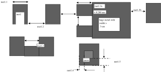

:drc_rule:`(via.-)`
-------------------

.. list-table:: Function: Defines contact between met1  and met2
   :header-rows: 1
   :stub-columns: 1
   :widths: 9 73 6 6 6

   * - :drc_rule:`Name`
     - Description
     - :drc_flag:`Flags`
     - Value
     - Unit
   * - :drc_rule:`(via.1a)`
     - Min and max L and W of via outside :drc_tag:`areaid.mt`
     - :drc_flag:`AL`
     - 0.150
     - µm
   * - :drc_rule:`(via.1b)`
     - Three sizes of square Vias allowed inside areaid:mt: 0.150um, 0.230um and 0.280um
     - :drc_flag:`AL`
     - 
     - 
   * - :drc_rule:`(via.2)`
     - Spacing of via to via
     - :drc_flag:`AL`
     - 0.170
     - µm
   * - :drc_rule:`(via.3)`
     - Only min. square vias are allowed except die seal ring where vias are (Via CD)*L
     - 
     - 0.2*L
     - 
   * - :drc_rule:`(via.4a)`
     - 0.150 µm Via must be enclosed by Met1 by at least …
     - 
     - 0.055
     - µm
   * - :drc_rule:`(via.4b)`
     - Inside :drc_tag:`areaid.mt`, 0.230 µm Via must be enclosed by met1 by atleast
     - :drc_flag:`AL`
     - 0.030
     - µm
   * - :drc_rule:`(via.4c)`
     - Inside :drc_tag:`areaid.mt`, 0.280 µm Via must be enclosed by met1 by atleast
     - :drc_flag:`AL`
     - 0.000
     - µm
   * - :drc_rule:`(via.5a)`
     - 0.150 µm Via must be enclosed by Met1 on one of two adjacent sides by at least …
     - 
     - 0.085
     - µm
   * - :drc_rule:`(via.5b)`
     - Inside :drc_tag:`areaid.mt`, 0.230 µm Via must be enclosed by met1 on one of two adjacent sides by at least …
     - :drc_flag:`AL`
     - 0.060
     - µm
   * - :drc_rule:`(via.5c)`
     - Inside :drc_tag:`areaid.mt`, 0.280 µm Via must be enclosed by met1 on one of two adjacent sides by at least …
     - :drc_flag:`AL`
     - 0.000
     - µm
   * - :drc_rule:`(via.11)`
     - Min and max L and W of via outside :drc_tag:`areaid.mt`
     - :drc_flag:`CU`
     - 0.180
     - µm
   * - :drc_rule:`(via.12)`
     - Min spacing between vias
     - :drc_flag:`CU`
     - 0.130
     - µm
   * - :drc_rule:`(via.13)`
     - Max of 5 vias within …
     - :drc_flag:`CU`
     - 0.350
     - µm
   * - :drc_rule:`(via.14)`
     - 0.180 µm Via must be enclosed by parallel edges of Met1 by at least …
     - :drc_flag:`CU`
     - 0.040
     - µm
   * - :drc_rule:`(via.irdrop.1)`
     - For 1 <= n <= 2 vias on the same connector, mcon area pre- and post- Cu conversion must differ by no more than…
     - :drc_flag:`CU` :drc_flag:`IR`
     - 0.0
     - µm
   * - :drc_rule:`(via.irdrop.2)`
     - For 3 <= n <= 15 vias on the same connector, mcon area pre- and post- Cu conversion must differ by no more than…
     - :drc_flag:`CU` :drc_flag:`IR`
     - 0.6
     - µm
   * - :drc_rule:`(via.irdrop.3)`
     - For 16 <= n <= 30 vias on the same connector, mcon area pre- and post- Cu conversion must differ by no more than…
     - :drc_flag:`CU` :drc_flag:`IR`
     - 0.8
     - µm
   * - :drc_rule:`(via.irdrop.4)`
     - For n > 30 vias on the same connector, mcon area pre- and post- Cu conversion must differ by no more than…
     - :drc_flag:`CU` :drc_flag:`IR`
     - 0.9
     - µm
   * - :drc_rule:`(via.14a)`
     - 0.180 µm Via must be enclosed by 45 deg edges of Met1 by at least …
     - :drc_flag:`CU`
     - 0.037
     - deg µm

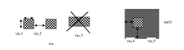

:drc_rule:`(m2.-)`
------------------

.. list-table:: Function: Defines second level of metal interconnects, buses etc
   :header-rows: 1
   :stub-columns: 1
   :widths: 9 73 6 6 6

   * - :drc_rule:`Name`
     - Description
     - :drc_flag:`Flags`
     - Value
     - Unit
   * - :drc_rule:`(m2.-)`
     - | Algorithm should flag errors, for met2, if ANY of the following is true:
       | An entire 700x700 window is covered by cmm2 waffleDrop, and metX PD < 70% for same window.
       | 80-100% of 700x700 window is covered by cmm2 waffleDrop, and metX PD < 65% for same window.
       | 60-80% of 700x700 window is covered by cmm2 waffleDrop, and metX PD < 60% for same window.
       | 50-60% of 700x700 window is covered by cmm2 waffleDrop, and metX PD < 50% for same window.
       | 40-50% of 700x700 window is covered by cmm2 waffleDrop, and metX PD < 40% for same window.
       | 30-40% of 700x700 window is covered by cmm2 waffleDrop, and metX PD < 30% for same window.
       | Exclude cells whose area is below 40Kum2. Required for IP, Recommended for Chip-level.
     - :drc_flag:`RC`
     - 
     - 
   * - :drc_rule:`(m2.1)`
     - Width of metal 2
     - 
     - 0.140
     - µm
   * - :drc_rule:`(m2.2)`
     - Spacing of metal 2 to metal 2
     - 
     - 0.140
     - µm
   * - :drc_rule:`(m2.3a)`
     - Min. spacing of features attached to or extending from huge_met2 for a distance of up to  0.280 µm to metal2 (rule not checked over non-huge met2 features)
     - 
     - 0.280
     - µm
   * - :drc_rule:`(m2.3b)`
     - Min. spacing of huge_met2 to metal2 excluding features checked by m2.3a
     - 
     - 0.280
     - µm
   * - :drc_rule:`(m2.3c)`
     - Min spacing between floating_met2 with AR_met2_A >= 0.05 and AR_met2_B =< 0.032, outside areaid:sc must be greater than
     - :drc_flag:`RR`
     - 0.145
     - µm
   * - :drc_rule:`(m2.4)`
     - Via must be enclosed by Met2 by at least …
     - :drc_flag:`P` :drc_flag:`AL`
     - 0.055
     - µm
   * - :drc_rule:`(m2.5)`
     - Via must be enclosed by Met2 on one of two adjacent sides by at least …
     - :drc_flag:`AL`
     - 0.085
     - µm
   * - :drc_rule:`(m2.6)`
     - Min metal2 area
     - 
     - 0.0676
     - µm²
   * - :drc_rule:`(m2.7)`
     - Min area of metal2 holes
     - 
     - 0.140
     - µm²
   * - :drc_rule:`(m2.pd.1)`
     - Min MM2_oxide_Pattern_density
     - :drc_flag:`RR`
     - 0.7
     - \-
   * - :drc_rule:`(m2.pd.2a)`
     - Rule m2.pd.1 has to be checked by dividing the chip into square regions of width and length equal to …
     - :drc_flag:`A`
     - 700
     - µm
   * - :drc_rule:`(m2.pd.2b)`
     - Rule m2.pd.1 has to be checked by dividing the chip into steps of …
     - :drc_flag:`A`
     - 70
     - 
   * - :drc_rule:`(m2.11)`
     - Max width of metal2
     - :drc_flag:`CU`
     - 4.000
     - µm
   * - :drc_rule:`(m2.12)`
     - Add slots and remove vias and contacts if met2 wider than…..
     - :drc_flag:`CU`
     - 3.200
     - 
   * - :drc_rule:`(m2.13)`
     - Max pattern density (PD) of metal2
     - :drc_flag:`CU`
     - 0.77
     - \-
   * - :drc_rule:`(m2.14)`
     - Met2 PD window size
     - :drc_flag:`CU`
     - 50.000
     - µm
   * - :drc_rule:`(m2.14a)`
     - Met2 PD window step
     - :drc_flag:`CU`
     - 25.000
     - µm
   * - :drc_rule:`(m2.15)`
     - Via must be enclosed by met2 by at least…
     - :drc_flag:`CU`
     - 0.040
     - µm

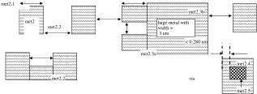

:drc_rule:`(via2.-)`
--------------------

.. list-table:: Function: Via2 connects met2 to met3 in the SKY130T*/SKY130P*/SP8Q/SP8P* flows and met2/capm to met3 in the SKY130DI* flow.
   :header-rows: 1
   :stub-columns: 1
   :widths: 9 73 6 6 6

   * - :drc_rule:`Name`
     - Description
     - :drc_flag:`Flags`
     - Value
     - Unit
   * - :drc_rule:`(via2.X.1)`
     - Via2 connects met2 to met3 in the SKY130T*/SKY130P*/SP8Q/SP8P* flow and met2/capm to met3 in the SKY130DI* flow.
     - 
     - 
     - 
   * - :drc_rule:`(via2.1a)`
     - Min and max L and W of via2 (except for rule via2.1b/1c/1d/1e/1f)
     - :drc_flag:`AL`
     - 0.200
     - µm
   * - :drc_rule:`(via2.1b)`
     - Three sizes of square Vias allowed inside areaid:mt: 0.280um, 1.2 um and 1.5 um
     - :drc_flag:`AL`
     - N/A
     - N/A
   * - :drc_rule:`(via2.1c)`
     - Two sizes of square Vias allowed inside areaid:mt: 1.2 um and 1.5 um
     - :drc_flag:`AL`
     - N/A
     - N/A
   * - :drc_rule:`(via2.1d)`
     - Four sizes of square Vias allowed inside areaid:mt: 0.2um, 0.280um, 1.2 um and 1.5 um
     - :drc_flag:`AL`
     - 
     - 
   * - :drc_rule:`(via2.1e)`
     - Three sizes of square Vias allowed inside areaid:mt: 0.8um, 1.2 um and 1.5 um
     - :drc_flag:`AL`
     - N/A
     - N/A
   * - :drc_rule:`(via2.1f)`
     - Two sizes of square Vias allowed outside areaid:mt: 0.8um and 1.2 um
     - :drc_flag:`AL`
     - N/A
     - N/A
   * - :drc_rule:`(via2.2)`
     - Spacing of via2 to via2
     - :drc_flag:`AL`
     - 0.200
     - µm
   * - :drc_rule:`(via2.3)`
     - Only min. square via2s are allowed except die seal ring where via2s are (Via2 CD)*L
     - :drc_flag:`AL`
     - 0.2*L
     - 
   * - :drc_rule:`(via2.4)`
     - Via2 must be enclosed by Met2 by at least …
     - :drc_flag:`AL`
     - 0.040
     - µm
   * - :drc_rule:`(via2.4a)`
     - Inside :drc_tag:`areaid.mt`, 1.5 µm Via2 must be enclosed by met2 by atleast
     - 
     - 0.140
     - µm
   * - :drc_rule:`(via2.5)`
     - Via2 must be enclosed by Met2 on one of two adjacent sides by at least …
     - :drc_flag:`AL`
     - 0.085
     - µm
   * - :drc_rule:`(via2.11)`
     - Min and max L and W of via2
     - :drc_flag:`CU`
     - 0.210
     - µm
   * - :drc_rule:`(via2.12)`
     - Min spacing between via2's
     - :drc_flag:`CU`
     - 0.180
     - µm
   * - :drc_rule:`(via2.13)`
     - Min spacing between via2 rows
     - :drc_flag:`CU`
     - 0.200
     - µm
   * - :drc_rule:`(via2.14)`
     - Via2 must be enclosed by met2 by atleast
     - :drc_flag:`CU`
     - 0.035
     - µm
   * - :drc_rule:`(via2.irdrop.1)`
     - For 1 <= n <= 2 via2's on the same connector, mcon area pre- and post- Cu conversion must differ by no more than…
     - :drc_flag:`CU` :drc_flag:`IR`
     - 0.0
     - µm
   * - :drc_rule:`(via2.irdrop.2)`
     - For 3 <= n <= 4 via2's on the same connector, mcon area pre- and post- Cu conversion must differ by no more than…
     - :drc_flag:`CU` :drc_flag:`IR`
     - 0.6
     - µm
   * - :drc_rule:`(via2.irdrop.3)`
     - For 5 <= n <= 30 via2's on the same connector, mcon area pre- and post- Cu conversion must differ by no more than…
     - :drc_flag:`CU` :drc_flag:`IR`
     - 0.79
     - µm
   * - :drc_rule:`(via2.irdrop.4)`
     - For n > 30 via2's on the same connector, mcon area pre- and post- Cu conversion must differ by no more than…
     - :drc_flag:`CU` :drc_flag:`IR`
     - 0.9
     - µm

.. figure:: periphery/p041-via2_dotdash.svg
    :width: 100%
    :align: center

:drc_rule:`(m3.-)`
------------------

.. list-table:: Function: Defines third level of metal interconnects, buses etc
   :header-rows: 1
   :stub-columns: 1
   :widths: 9 73 6 6 6

   * - :drc_rule:`Name`
     - Description
     - :drc_flag:`Flags`
     - Value
     - Unit
   * - :drc_rule:`(m3.-)`
     - | Algorithm should flag errors, for met3, if ANY of the following is true:
       | An entire 700x700 window is covered by cmm3 waffleDrop, and metX PD < 70% for same window.
       | 80-100% of 700x700 window is covered by cmm3 waffleDrop, and metX PD < 65% for same window.
       | 60-80% of 700x700 window is covered by cmm3 waffleDrop, and metX PD < 60% for same window.
       | 50-60% of 700x700 window is covered by cmm3 waffleDrop, and metX PD < 50% for same window.
       | 40-50% of 700x700 window is covered by cmm3 waffleDrop, and metX PD < 40% for same window.
       | 30-40% of 700x700 window is covered by cmm3 waffleDrop, and metX PD < 30% for same window.
       | Exclude cells whose area is below 40Kum2. NOTE: Required for IP, Recommended for Chip-level.
     - :drc_flag:`RC`
     - 
     - 
   * - :drc_rule:`(m3.1)`
     - Width of metal 3
     - 
     - 0.300
     - µm
   * - :drc_rule:`(m3.2)`
     - Spacing of metal 3 to metal 3
     - 
     - 0.300
     - µm
   * - :drc_rule:`(m3.3a)`
     - Min. spacing of features attached to or extending from huge_met3 for a distance of up to 0.480 um to metal3  (rule not checked over non-huge met3 features)
     - 
     - N/A
     - N/A
   * - :drc_rule:`(m3.3b)`
     - Min. spacing of huge_met3 to metal3 excluding features checked by m3.3a
     - 
     - N/A
     - N/A
   * - :drc_rule:`(m3.3c)`
     - Min. spacing of features attached to or extending from huge_met3 for a distance of up to 0.400 µm to metal3  (rule not checked over non-huge met3 features)
     - 
     - 0.400
     - µm
   * - :drc_rule:`(m3.3d)`
     - Min. spacing of huge_met3 to metal3 excluding features checked by m3.3a
     - 
     - 0.400
     - µm
   * - :drc_rule:`(m3.4)`
     - Via2 must be enclosed by Met3 by at least …
     - :drc_flag:`AL`
     - 0.065
     - µm
   * - :drc_rule:`(m3.5)`
     - Via2 must be enclosed by Met3 on one of two adjacent sides by at least …
     - 
     - N/A
     - N/A
   * - :drc_rule:`(m3.5a)`
     - Via2 must be enclosed by Met3 on all sides by at least …(Rule not checked on a layout when it satisfies both rules m3.4 and m3.5)
     - 
     - N/A
     - N/A
   * - :drc_rule:`(m3.6)`
     - Min area of metal3
     - 
     - 0.240
     - µm²
   * - :drc_rule:`(m3.7)`
     - Min area of metal3 holes
     - :drc_flag:`CU`
     - 0.200
     - µm²
   * - :drc_rule:`(m3.pd.1)`
     - Min MM3_oxide_Pattern_density
     - :drc_flag:`RR`
     - 0.7
     - \-
   * - :drc_rule:`(m3.pd.2a)`
     - Rule m3.pd.1 has to be checked by dividing the chip into square regions of width and length equal to …
     - :drc_flag:`A`
     - 700
     - µm
   * - :drc_rule:`(m3.pd.2b)`
     - Rule m3.pd.1 has to be checked by dividing the chip into steps of …
     - :drc_flag:`A`
     - 70
     - 
   * - :drc_rule:`(m3.11)`
     - Max width of metal3
     - :drc_flag:`CU`
     - 4.000
     - µm
   * - :drc_rule:`(m3.12)`
     - Add slots and remove vias and contacts if wider than…..
     - :drc_flag:`CU`
     - 3.200
     - 
   * - :drc_rule:`(m3.13)`
     - Max pattern density (PD) of metal3
     - :drc_flag:`CU`
     - 0.77
     - \-
   * - :drc_rule:`(m3.14)`
     - Met3 PD window size
     - :drc_flag:`CU`
     - 50.000
     - µm
   * - :drc_rule:`(m3.14a)`
     - Met3 PD window step
     - :drc_flag:`CU`
     - 25.000
     - µm
   * - :drc_rule:`(m3.15)`
     - Via2 must be enclosed by met3 by at least…
     - :drc_flag:`CU`
     - 0.060
     - µm

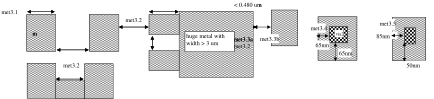

:drc_rule:`(via3.-)`
--------------------

.. list-table:: Function: Via3 connects met3 to met4 in the SKY130Q*/SKY130P*/SP8Q/SP8P* flow 
   :header-rows: 1
   :stub-columns: 1
   :widths: 9 73 6 6 6

   * - :drc_rule:`Name`
     - Description
     - :drc_flag:`Flags`
     - Value
     - Unit
   * - :drc_rule:`(via3.1)`
     - Min and max L and W of via3 (except for rule via3.1a)
     - :drc_flag:`AL`
     - 0.200
     - µm
   * - :drc_rule:`(via3.1a)`
     - Two sizes of square via3 allowed inside :drc_tag:`areaid.mt`: 0.200um and 0.800um
     - :drc_flag:`AL`
     - 
     - 
   * - :drc_rule:`(via3.2)`
     - Spacing of via3 to via3
     - :drc_flag:`AL`
     - 0.200
     - µm
   * - :drc_rule:`(via3.3)`
     - Only min. square via3s are allowed except die seal ring where via3s are (Via3 CD)*L
     - 
     - 0.2*L
     - 
   * - :drc_rule:`(via3.4)`
     - Via3 must be enclosed by Met3 by at least …
     - :drc_flag:`AL`
     - 0.060
     - µm
   * - :drc_rule:`(via3.5)`
     - Via3 must be enclosed by Met3 on one of two adjacent sides by at least …
     - :drc_flag:`AL`
     - 0.090
     - µm
   * - :drc_rule:`(via3.11)`
     - Min and max L and W of via3
     - :drc_flag:`CU`
     - 0.210
     - µm
   * - :drc_rule:`(via3.12)`
     - Min spacing between via2's
     - :drc_flag:`CU`
     - 0.180
     - µm
   * - :drc_rule:`(via3.13)`
     - Via3 must be enclosed by Met3 by at least …
     - :drc_flag:`CU`
     - 0.055
     - µm
   * - :drc_rule:`(via3.14)`
     - Min spacing between via3 rows
     - :drc_flag:`CU`
     - 0.350
     - µm
   * - :drc_rule:`(via3.irdrop.1)`
     - For 1 <= n <= 2 via3's on the same connector, mcon area pre- and post- Cu conversion must differ by no more than…
     - :drc_flag:`CU` :drc_flag:`IR`
     - 0.0
     - µm
   * - :drc_rule:`(via3.irdrop.2)`
     - For 3 <= n <= 15 via3's on the same connector, mcon area pre- and post- Cu conversion must differ by no more than…
     - :drc_flag:`CU` :drc_flag:`IR`
     - 0.6
     - µm
   * - :drc_rule:`(via3.irdrop.3)`
     - For 16 <= n <= 30 via3's on the same connector, mcon area pre- and post- Cu conversion must differ by no more than…
     - :drc_flag:`CU` :drc_flag:`IR`
     - 0.8
     - µm
   * - :drc_rule:`(via3.irdrop.4)`
     - For n > 30 via3's on the same connector, mcon area pre- and post- Cu conversion must differ by no more than…
     - :drc_flag:`CU` :drc_flag:`IR`
     - 0.9
     - µm

:drc_rule:`(nsm.-)`
-------------------

.. list-table:: Function: Defines Nitride Seal Mask (FIXME)
   :header-rows: 1
   :stub-columns: 1
   :widths: 9 73 6 6 6

   * - :drc_rule:`Name`
     - Description
     - :drc_flag:`Flags`
     - Value
     - Unit
   * - :drc_rule:`(nsm.1)`
     - Min. width of nsm
     - 
     - 3.000
     - µm
   * - :drc_rule:`(nsm.2)`
     - Min. spacing of nsm to nsm
     - 
     - 4.000
     - µm
   * - :drc_rule:`(nsm.3)`
     - Min spacing, no overlap, between NSM_keepout to diff.dg, tap.dg, fom.dy, cfom.dg, cfom.mk, poly.dg, p1m.mk, li1.dg, cli1m.mk, metX.dg (X=1 to 5) and cmmX.mk (X=1 to 5). Exempt the following from the check: (a) cell name "nikon*" and (b) diff ring inside :drc_tag:`areaid.sl`
     - :drc_flag:`AL`
     - 1.000
     - µm
   * - :drc_rule:`(nsm.3a)`
     - Min enclosure of diff.dg, tap.dg, fom.dy, cfom.dg, cfom.mk, poly.dg, p1m.mk, li1.dg, cli1m.mk, metX.dg (X=1 to 5) and cmmX.mk (X=1 to 5) by :drc_tag:`areaid.ft`. Exempt the following from the check: (a) cell name "s8Fab_crntic*"  (b)  blankings in the frame (rule uses :drc_tag:`areaid.dt` for exemption)
     - 
     - 3.000
     - µm
   * - :drc_rule:`(nsm.3b)`
     - Min spacing between :drc_tag:`areaid.dt` to diff.dg, tap.dg, fom.dy, cfom.dg, cfom.mk, poly.dg, p1m.mk, li1.dg, cli1m.mk, metX.dg (X=1 to 5) and cmmX.mk (X=1 to 5). Exempt the following from the check: (a) blankings in the frame (rule uses :drc_tag:`areaid.dt` for exemption)
     - 
     - 3.000
     - µm

:drc_rule:`(indm.-)`
--------------------

.. list-table:: Function: Defines third level of metal interconnects, buses and inductor; top_indmMetal is met3 for SKY130D* flows; Similarly top_padVia is Via2 for SKY130D*
   :header-rows: 1
   :stub-columns: 1
   :widths: 9 73 6 6 6

   * - :drc_rule:`Name`
     - Description
     - :drc_flag:`Flags`
     - Value
     - Unit
   * - :drc_rule:`(indm.1)`
     - Min width of top_indmMetal
     - 
     - N/A
     - N/A
   * - :drc_rule:`(indm.2)`
     - Min spacing between two top_indmMetal
     - 
     - N/A
     - N/A
   * - :drc_rule:`(indm.3)`
     - top_padVia must  be enclosed by top_indmMetal by atleast
     - 
     - N/A
     - N/A
   * - :drc_rule:`(indm.4)`
     - Min area of top_indmMetal
     - 
     - N/A
     - N/A

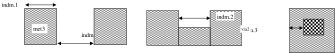

:drc_rule:`(m4.-)`
------------------

.. list-table:: Function: Defines Fourth level of metal interconnects;
   :header-rows: 1
   :stub-columns: 1
   :widths: 9 73 6 6 6

   * - :drc_rule:`Name`
     - Description
     - :drc_flag:`Flags`
     - Value
     - Unit
   * - :drc_rule:`(m4.-)`
     - | Algorithm should flag errors, for met4, if ANY of the following is true:
       | An entire 700x700 window is covered by cmm4 waffleDrop, and metX PD < 70% for same window.
       | 80-100% of 700x700 window is covered by cmm4 waffleDrop, and metX PD < 65% for same window.
       | 60-80% of 700x700 window is covered by cmm4 waffleDrop, and metX PD < 60% for same window.
       | 50-60% of 700x700 window is covered by cmm4 waffleDrop, and metX PD < 50% for same window.
       | 40-50% of 700x700 window is covered by cmm4 waffleDrop, and metX PD < 40% for same window.
       | 30-40% of 700x700 window is covered by cmm4 waffleDrop, and metX PD < 30% for same window.
       | Exclude cells whose area is below 40Kum2. Required for IP, Recommended for Chip-level.
     - :drc_flag:`RC`
     - 
     - 
   * - :drc_rule:`(m4.1)`
     - Min width of met4
     - 
     - 0.300
     - µm
   * - :drc_rule:`(m4.2)`
     - Min spacing between two met4
     - 
     - 0.300
     - µm
   * - :drc_rule:`(m4.3)`
     - via3 must  be enclosed by met4 by atleast
     - :drc_flag:`AL`
     - 0.065
     - µm
   * - :drc_rule:`(m4.4)`
     - Min area of met4 (rule exempted for probe pads which are exactly 1.42um by 1.42um)
     - 
     - N/A
     - N/A
   * - :drc_rule:`(m4.4a)`
     - Min area of met4
     - 
     - 0.240
     - µm²
   * - :drc_rule:`(m4.5a)`
     - Min. spacing of features attached to or extending from huge_met4 for a distance of up to  0.400 µm to metal4 (rule not checked over non-huge met4 features)
     - 
     - 0.400
     - µm
   * - :drc_rule:`(m4.5b)`
     - Min. spacing of huge_met4 to metal4 excluding features checked by m4.5a
     - 
     - 0.400
     - µm
   * - :drc_rule:`(m4.7)`
     - Min area of meta4 holes
     - :drc_flag:`CU`
     - 0.200
     - µm²
   * - :drc_rule:`(m4.pd.1)`
     - Min MM4_oxide_Pattern_density
     - :drc_flag:`RR`
     - 0.7
     - \-
   * - :drc_rule:`(m4.pd.2a)`
     - Rule m4.pd.1 has to be checked by dividing the chip into square regions of width and length equal to …
     - :drc_flag:`A`
     - 700
     - µm
   * - :drc_rule:`(m4.pd.2b)`
     - Rule m4.pd.1 has to be checked by dividing the chip into steps of …
     - :drc_flag:`A`
     - 70
     - 
   * - :drc_rule:`(m4.11)`
     - Max width of metal4
     - :drc_flag:`CU`
     - 10.000
     - µm
   * - :drc_rule:`(m4.12)`
     - Add slots and remove vias and contacts if wider than…..
     - :drc_flag:`CU`
     - 10.000
     - 
   * - :drc_rule:`(m4.13)`
     - Max pattern density (PD) of metal4; met4 overlapping pdm areas are excluded from the check
     - :drc_flag:`CU`
     - 0.77
     - \-
   * - :drc_rule:`(m4.14)`
     - Met4 PD window size
     - :drc_flag:`CU`
     - 50.000
     - µm
   * - :drc_rule:`(m4.14a)`
     - Met4 PD window step
     - :drc_flag:`CU`
     - 25.000
     - µm
   * - :drc_rule:`(m4.15)`
     - Via3 must be enclosed by met4 by at least…
     - :drc_flag:`CU`
     - 0.060
     - µm
   * - :drc_rule:`(m4.16)`
     - Min enclosure of pad by met4
     - :drc_flag:`CU`
     - 0.850
     - µm

.. figure:: periphery/p044-m4_dotdash.svg
    :width: 100%
    :align: center

:drc_rule:`(via4.-)`
--------------------

.. list-table:: Function: Via4 connects met4 to met5 in the SKY130P*/SP8P* flow 
   :header-rows: 1
   :stub-columns: 1
   :widths: 9 73 6 6 6

   * - :drc_rule:`Name`
     - Description
     - :drc_flag:`Flags`
     - Value
     - Unit
   * - :drc_rule:`(via4.1)`
     - Min and max L and W of via4
     - 
     - 0.800
     - µm
   * - :drc_rule:`(via4.2)`
     - Spacing of via4 to via4
     - 
     - 0.800
     - µm
   * - :drc_rule:`(via4.3)`
     - Only min. square via4s are allowed except die seal ring where via4s are (Via4 CD)*L
     - 
     - 0.8*L
     - 
   * - :drc_rule:`(via4.4)`
     - Via4 must be enclosed by Met4 by at least …
     - 
     - 0.190
     - µm
   * - :drc_rule:`(via4.irdrop.1)`
     - For 1 <= n <= 4 via4's on the same connector, mcon area pre- and post- Cu conversion must differ by no more than…
     - :drc_flag:`CU` :drc_flag:`IR`
     - 0.0
     - µm
   * - :drc_rule:`(via4.irdrop.2)`
     - For 5 <= n <= 10 via4's on the same connector, mcon area pre- and post- Cu conversion must differ by no more than…
     - :drc_flag:`CU` :drc_flag:`IR`
     - 0.2
     - µm
   * - :drc_rule:`(via4.irdrop.3)`
     - For 11 <= n <= 100 via4's on the same connector, mcon area pre- and post- Cu conversion must differ by no more than…
     - :drc_flag:`CU` :drc_flag:`IR`
     - 0.5
     - µm
   * - :drc_rule:`(via4.irdrop.4)`
     - For n > 100 via4's on the same connector, mcon area pre- and post- Cu conversion must differ by no more than…
     - :drc_flag:`CU` :drc_flag:`IR`
     - 0.8
     - µm

:drc_rule:`(m5.-)`
------------------

.. list-table:: Function: Defines Fifth level of metal interconnects;
   :header-rows: 1
   :stub-columns: 1
   :widths: 9 73 6 6 6

   * - :drc_rule:`Name`
     - Description
     - :drc_flag:`Flags`
     - Value
     - Unit
   * - :drc_rule:`(m5.1)`
     - Min width of met5
     - 
     - 1.600
     - µm
   * - :drc_rule:`(m5.2)`
     - Min spacing between two met5
     - 
     - 1.600
     - µm
   * - :drc_rule:`(m5.3)`
     - via4 must  be enclosed by met5 by atleast
     - 
     - 0.310
     - µm
   * - :drc_rule:`(m5.4)`
     - Min area of met5 (For all flows except SKY130PIR*/SKY130PF*, the rule is exempted for probe pads which are exactly 1.42um by 1.42um)
     - 
     - 4.000
     - µm²

:drc_rule:`(pad.-)`
-------------------

.. list-table:: Function: Opens the passivation
   :header-rows: 1
   :stub-columns: 1
   :widths: 9 73 6 6 6

   * - :drc_rule:`Name`
     - Description
     - :drc_flag:`Flags`
     - Value
     - Unit
   * - :drc_rule:`(pad.2)`
     - Min spacing of pad:dg to pad:dg
     - 
     - 1.270
     - µm
   * - :drc_rule:`(pad.3)`
     - Max area of hugePad NOT top_metal
     - 
     - 30000
     - µm²

:drc_rule:`(rdl.-)`
-------------------

.. list-table:: Function: Defines the Cu Inductor. Connects to met5 through the pad opening
   :header-rows: 1
   :stub-columns: 1
   :widths: 9 73 6 6 6

   * - :drc_rule:`Name`
     - Description
     - :drc_flag:`Flags`
     - Value
     - Unit
   * - :drc_rule:`(rdl.1)`
     - Min width of rdl
     - 
     - 10
     - µm
   * - :drc_rule:`(rdl.2)`
     - Min spacing between two rdl
     - 
     - 10
     - µm
   * - :drc_rule:`(rdl.3)`
     - Min enclosure of pad by rdl, except rdl interacting with bump
     - 
     - 10.750
     - µm
   * - :drc_rule:`(rdl.4)`
     - Min spacing between rdl and outer edge of the seal ring
     - 
     - 15.000
     - µm
   * - :drc_rule:`(rdl.5)`
     - (rdl OR ccu1m.mk) must not overlap :drc_tag:`areaid.ft`. Exempt the following from the check: (a)  blankings in the frame (rule uses :drc_tag:`areaid.dt` for exemption)
     - 
     - 
     - 
   * - :drc_rule:`(rdl.6)`
     - Min spacing of rdl to pad, except rdl interacting with bump
     - 
     - 19.660
     - µm

:drc_rule:`(mf.-)`
------------------

.. note::

    For SKY130D* and SKY130TM* CADflow use MM2 for Metal Fuse

    For SP8P*/SKY130P* (PLM) CADflow use MM4 for Metal Fuse

.. list-table:: Function: Defines metal fuses
   :header-rows: 1
   :stub-columns: 1
   :widths: 9 73 6 6 6

   * - :drc_rule:`Name`
     - Description
     - :drc_flag:`Flags`
     - Value
     - Unit
   * - :drc_rule:`(mf.1)`
     - Min. and max width of fuse
     - 
     - 0.800
     - µm
   * - :drc_rule:`(mf.2)`
     - Length of fuse
     - 
     - 7.200
     - µm
   * - :drc_rule:`(mf.3)`
     - Spacing between centers of adjacent fuses
     - 
     - 2.760
     - µm
   * - :drc_rule:`(mf.4)`
     - Spacing between center of fuse and fuse_metal (fuse shields are exempted)
     - 
     - 3.300
     - µm
   * - :drc_rule:`(mf.5)`
     - Max. extension of fuse_metal beyond fuse boundary
     - 
     - 0.830
     - 
   * - :drc_rule:`(mf.6)`
     - Spacing (no overlapping) between fuse center and Metal1
     - 
     - 3.300
     - µm
   * - :drc_rule:`(mf.7)`
     - Spacing (no overlapping) between fuse center and LI
     - 
     - 3.300
     - µm
   * - :drc_rule:`(mf.8)`
     - Spacing (no overlapping) between fuse center and poly
     - 
     - 2.660
     - µm
   * - :drc_rule:`(mf.9)`
     - Spacing (no overlapping) between fuse center and tap
     - 
     - 2.640
     - µm
   * - :drc_rule:`(mf.10)`
     - Spacing (no overlapping) between fuse center and diff
     - 
     - 3.250
     - µm
   * - :drc_rule:`(mf.11)`
     - Spacing (no overlapping) between fuse center and nwell
     - 
     - 3.320
     - µm
   * - :drc_rule:`(mf.12)`
     - Size of  fuse_shield
     - 
     - 0.5x2.4
     - µm
   * - :drc_rule:`(mf.13)`
     - Min. spacing of center of fuse to fuse_shield
     - 
     - 2.200
     - µm
   * - :drc_rule:`(mf.14)`
     - Max. spacing of center of fuse to fuse_shield
     - 
     - 3.300
     - µm
   * - :drc_rule:`(mf.15)`
     - Fuse_shields are only placed between periphery metal (i.e., without fuse:dg) and non-isolated edges of fuse as defined by mf.16
     - 
     - 
     - 
   * - :drc_rule:`(mf.16)`
     - The edge of a fuse is considered non-isolated if wider than or equal to mf.2 and spaced to fuse_metal by less than …
     - 
     - 4.000
     - 
   * - :drc_rule:`(mf.17)`
     - Offset between fuse_shields center and fuse center
     - :drc_flag:`NC`
     - 0.000
     - 
   * - :drc_rule:`(mf.18)`
     - Min and max space between fuse_shield and fuse_metal (opposite edges). Rule checked within 1 gridpoint.
     - 
     - 0.600
     - µm
   * - :drc_rule:`(mf.19)`
     - Spacing (no overlapping) between fuse center and Metal2
     - 
     - 3.300
     - µm
   * - :drc_rule:`(mf.20)`
     - Only one fuse per metal line allowed
     - 
     - 
     - 
   * - :drc_rule:`(mf.21)`
     - Min spacing , no overlap, between metal3 and fuse center
     - 
     - 3.300
     - µm
   * - :drc_rule:`(mf.22)`
     - Min spacing between fuse_contact to fuse_contact
     - 
     - 1.960
     - µm
   * - :drc_rule:`(mf.23)`
     - Spacing (no overlapping) between fuse center and Metal4
     - 
     - N/A
     - N/A
   * - :drc_rule:`(mf.24)`
     - Spacing (no overlapping) between fuse center and Metal5
     - 
     - 3.300
     - µm

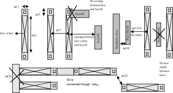

:drc_rule:`(hvi.-)`
-------------------

.. list-table:: Function: Defines thick oxide for high voltage devices
   :header-rows: 1
   :stub-columns: 1
   :widths: 9 73 6 6 6

   * - :drc_rule:`Name`
     - Description
     - :drc_flag:`Flags`
     - Value
     - Unit
   * - :drc_rule:`(hvi.1)`
     - Min width of Hvi
     - :drc_flag:`P`
     - 0.600
     - µm
   * - :drc_rule:`(hvi.2a)`
     - Min spacing of Hvi to Hvi
     - :drc_flag:`P`
     - 0.700
     - µm
   * - :drc_rule:`(hvi.2b)`
     - Manual merge if space is below minimum
     - 
     - 
     - 
   * - :drc_rule:`(hvi.4)`
     - Hvi must not overlap tunm
     - 
     - 
     - 
   * - :drc_rule:`(hvi.5)`
     - Min space between hvi and nwell (exclude coincident edges)
     - 
     - 0.700
     - µm

:drc_rule:`(hvnwell.-)`
-----------------------

.. list-table:: Function: Defines rules for HV nwell; All nwell connected to voltages greater than 1.8V must be enclosed by hvi; Nets connected to LV nwell or nwell overlapping hvi but connected to LV voltages (i.e 1.8V) should be tagged "lv_net" using text.dg; This tag should be only on Li layer
   :header-rows: 1
   :stub-columns: 1
   :widths: 9 73 6 6 6

   * - :drc_rule:`Name`
     - Description
     - :drc_flag:`Flags`
     - Value
     - Unit
   * - :drc_rule:`(hvnwell.8)`
     - Min space between HV_nwell  and any nwell on different nets
     - 
     - 2.000
     - µm
   * - :drc_rule:`(hvnwell.9)`
     - (Nwell overlapping hvi) must be enclosed by hvi
     - 
     - 
     - 
   * - :drc_rule:`(hvnwell.10)`
     - LVnwell and HnWell should not be on the same net (for the purposes of this check, short the connectivity through resistors); Exempt HnWell with li nets tagged "lv_net" using text.dg and Hnwell connected to nwell overlapping :drc_tag:`areaid.hl`
     - :drc_flag:`TC`
     - 
     - 
   * - :drc_rule:`(hvnwell.11)`
     - Nwell connected to the nets mentioned in the "Power_Net_Hv" field of the latcup GUI must be enclosed by hvi (exempt nwell inside :drc_tag:`areaid.hl`). Also for the purposes of this check, short the connectivity through resistors. The rule will be checked in the latchup run and exempted for cells "s8tsg5_tx_ibias_gen" and "s8bbcnv_psoc3p_top_18",  "rainier_top, indus_top*", "rainier_top, manas_top, ccg3_top"
     - 
     - 
     - 

:drc_rule:`(hvdifftap.-)`
-------------------------

.. list-table:: Function: Defines rules for HV diff/tap
   :header-rows: 1
   :stub-columns: 1
   :widths: 9 73 6 6 6

   * - :drc_rule:`Name`
     - Description
     - :drc_flag:`Flags`
     - Value
     - Unit
   * - :drc_rule:`(hvdifftap.14)`
     - Min width of diff inside Hvi, except HV Pdiff resistors (difftap.14a)
     - :drc_flag:`P`
     - 0.290
     - µm
   * - :drc_rule:`(hvdifftap.14a)`
     - Min width of diff inside Hvi, HV Pdiff resistors only
     - :drc_flag:`P`
     - 0.150
     - µm
   * - :drc_rule:`(hvdifftap.15a)`
     - Min space of Hdiff to Hdiff
     - :drc_flag:`P`
     - 0.300
     - µm
   * - :drc_rule:`(hvdifftap.15b)`
     - Min space of n+diff to non-abutting p+tap inside Hvi
     - :drc_flag:`P`
     - 0.370
     - µm
   * - :drc_rule:`(hvdifftap.16)`
     - Min width tap butting diff on one or two sides inside Hvi (rule exempted inside UHVI)
     - 
     - 0.700
     - µm
   * - :drc_rule:`(hvdifftap.17)`
     - P+ Hdiff or Pdiff inside areaid:hvnwell must be enclosed by Hv_nwell by at least ….[Rule exempted inside UHVI]
     - :drc_flag:`DE` :drc_flag:`NE`
     - 0.330
     - µm
   * - :drc_rule:`(hvdifftap.18)`
     - Spacing of N+ diff to HV_nwell (rule exempted inside UHVI)
     - :drc_flag:`DE` :drc_flag:`NE`
     - 0.430
     - µm
   * - :drc_rule:`(hvdifftap.19)`
     - N+ Htap must be enclosed by Hv_nwell by at least …Rule exempted inside UHVI.
     - :drc_flag:`NE`
     - 0.330
     - µm
   * - :drc_rule:`(hvdifftap.20)`
     - Spacing of P+ tap to HV_nwell (Exempted for p+tap butting pwell.rs; rule exempted inside UHVI)
     - 
     - 0.430
     - µm
   * - :drc_rule:`(hvdifftap.21)`
     - Diff or tap cannot straddle Hvi
     - :drc_flag:`P`
     - 
     - 
   * - :drc_rule:`(hvdifftap.22)`
     - Min enclosure of Hdiff or Htap by Hvi. Rule exempted inside UHVI.
     - :drc_flag:`P`
     - 0.180
     - µm
   * - :drc_rule:`(hvdifftap.23)`
     - Space between diff or tap outside Hvi and Hvi
     - :drc_flag:`P`
     - 0.180
     - µm
   * - :drc_rule:`(hvdifftap.24)`
     - Spacing of nwell to N+ Hdiff (rule exempted inside UHVI)
     - :drc_flag:`DE` :drc_flag:`NE`
     - 0.430
     - µm
   * - :drc_rule:`(hvdifftap.25)`
     - Min space of N+ Hdiff inside HVI across non-abutting P+_tap
     - :drc_flag:`NC`
     - 1.070
     - µm
   * - :drc_rule:`(hvdifftap.26)`
     - Min spacing between pwbm to difftap outside UHVI
     - 
     - N/A
     - N/A

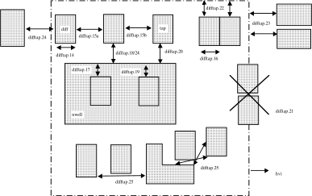

:drc_rule:`(hvpoly.-)`
----------------------

.. list-table:: Function: Defines rules for HV poly
   :header-rows: 1
   :stub-columns: 1
   :widths: 9 73 6 6 6

   * - :drc_rule:`Name`
     - Description
     - :drc_flag:`Flags`
     - Value
     - Unit
   * - :drc_rule:`(hvpoly.13)`
     - Min width of poly over diff inside Hvi
     - :drc_flag:`P`
     - 0.500
     - µm
   * - :drc_rule:`(hvpoly.14)`
     - (poly and diff) cannot straddle Hvi
     - 
     - 
     - 

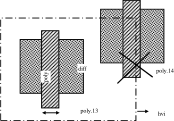

:drc_rule:`(hvntm.-)`
---------------------

.. list-table:: Function: Defines tip implants for the HV NMOS
   :header-rows: 1
   :stub-columns: 1
   :widths: 9 73 6 6 6

   * - :drc_rule:`Name`
     - Description
     - :drc_flag:`Flags`
     - Value
     - Unit
   * - :drc_rule:`(hvntm.X.1)`
     - Hvntm can be drawn inside HVI. Drawn layer will be OR-ed with the CL and rechecked for CLDRC
     - 
     - 
     - 
   * - :drc_rule:`(hvntm.1)`
     - Width of hvntm
     - :drc_flag:`P`
     - 0.700
     - µm
   * - :drc_rule:`(hvntm.2)`
     - Spacing of hvntm to hvntm
     - :drc_flag:`P`
     - 0.700
     - µm
   * - :drc_rule:`(hvntm.3)`
     - Min. enclosure of (n+_diff inside Hvi) but not overlapping :drc_tag:`areaid.ce` by hvntm
     - :drc_flag:`P`
     - 0.185
     - µm
   * - :drc_rule:`(hvntm.4)`
     - Space, no overlap, between n+_diff outside Hvi and hvntm
     - :drc_flag:`P`
     - 0.185
     - µm
   * - :drc_rule:`(hvntm.5)`
     - Space, no overlap, between p+_diff  and hvntm
     - :drc_flag:`P` :drc_flag:`DE`
     - 0.185
     - µm
   * - :drc_rule:`(hvntm.6a)`
     - Space, no overlap, between p+_tap and hvntm (except along the diff-butting edge)
     - :drc_flag:`P`
     - 0.185
     - µm
   * - :drc_rule:`(hvntm.6b)`
     - Space, no overlap, between p+_tap and hvntm along the diff-butting edge
     - :drc_flag:`P`
     - 0.000
     - µm
   * - :drc_rule:`(hvntm.7)`
     - hvntm must enclose ESD_nwell_tap inside hvi by atleast
     - :drc_flag:`P`
     - 0.000
     - 
   * - :drc_rule:`(hvntm.9)`
     - Hvntm must not overlap :drc_tag:`areaid.ce`
     - 
     - 
     - 
   * - :drc_rule:`(hvntm.10)`
     - Hvntm must overlap hvi
     - 
     - 
     - 

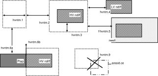

:drc_rule:`(denmos.-)`
----------------------

.. list-table:: Function: Defines rules for the 16V Drain extended NMOS devices
   :header-rows: 1
   :stub-columns: 1
   :widths: 9 73 6 6 6

   * - :drc_rule:`Name`
     - Description
     - :drc_flag:`Flags`
     - Value
     - Unit
   * - :drc_rule:`(denmos.1)`
     - Min width of de_nFet_gate
     - 
     - 1.055
     - µm
   * - :drc_rule:`(denmos.2)`
     - Min width of de_nFet_source not overlapping poly
     - 
     - 0.280
     - µm
   * - :drc_rule:`(denmos.3)`
     - Min width of de_nFet_source overlapping poly
     - 
     - 0.925
     - µm
   * - :drc_rule:`(denmos.4)`
     - Min width of the de_nFet_drain
     - 
     - 0.170
     - µm
   * - :drc_rule:`(denmos.5)`
     - Min/Max extension of de_nFet_source over nwell
     - 
     - 0.225
     - 
   * - :drc_rule:`(denmos.6)`
     - Min/Max spacing between de_nFet_drain and de_nFet_source
     - 
     - 1.585
     - µm
   * - :drc_rule:`(denmos.7)`
     - Min channel width for de_nFet_gate
     - 
     - 5.000
     - µm
   * - :drc_rule:`(denmos.8)`
     - 90 degree angles are not permitted for nwell overlapping de_nFET_drain
     - 
     - 
     - 
   * - :drc_rule:`(denmos.9a)`
     - All bevels on nwell are 45 degree, 0.43 µm from corners
     - :drc_flag:`NC`
     - 
     - µm
   * - :drc_rule:`(denmos.9b)`
     - All bevels on de_nFet_drain are 45 degree, 0.05 µm from corners
     - :drc_flag:`NC`
     - 
     - µm
   * - :drc_rule:`(denmos.10)`
     - Min enclosure of de_nFet_drain by nwell
     - 
     - 0.660
     - µm
   * - :drc_rule:`(denmos.11)`
     - Min spacing between p+ tap and (nwell overlapping de_nFet_drain)
     - 
     - 0.860
     - µm
   * - :drc_rule:`(denmos.12)`
     - Min spacing between nwells overlapping de_nFET_drain
     - 
     - 2.400
     - µm
   * - :drc_rule:`(denmos.13)`
     - de_nFet_source must be enclosed by nsdm by
     - 
     - 0.130
     - µm
   * - :drc_rule:`(denmos.14)`
     - nvhv FETs must be enclosed by :drc_tag:`areaid.mt`
     - 
     - N/A
     - N/A

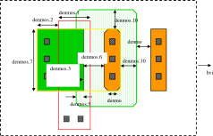

:drc_rule:`(depmos.-)`
----------------------

.. list-table:: Function: Defines rules for the 16V Drain extended NMOS devices
   :header-rows: 1
   :stub-columns: 1
   :widths: 9 73 6 6 6

   * - :drc_rule:`Name`
     - Description
     - :drc_flag:`Flags`
     - Value
     - Unit
   * - :drc_rule:`(depmos.1)`
     - Min width of de_pFet_gate
     - 
     - 1.050
     - µm
   * - :drc_rule:`(depmos.2)`
     - Min width of de_pFet_source not overlapping poly
     - 
     - 0.280
     - µm
   * - :drc_rule:`(depmos.3)`
     - Min width of de_pFet_source overlapping poly
     - 
     - 0.920
     - µm
   * - :drc_rule:`(depmos.4)`
     - Min width of the de_pFet_drain
     - 
     - 0.170
     - µm
   * - :drc_rule:`(depmos.5)`
     - Min/Max extension of de_pFet_source beyond nwell
     - 
     - 0.260
     - 
   * - :drc_rule:`(depmos.6)`
     - Min/Max spacing between de_pFet_drain and de_pFet_source
     - 
     - 1.190
     - µm
   * - :drc_rule:`(depmos.7)`
     - Min channel width for de_pFet_gate
     - 
     - 5.000
     - µm
   * - :drc_rule:`(depmos.8)`
     - 90 degree angles are not permitted for nwell hole overlapping de_pFET_drain
     - 
     - 
     - 
   * - :drc_rule:`(depmos.9a)`
     - All bevels on nwell hole are 45 degree, 0.43 µm from corners
     - :drc_flag:`NC`
     - 
     - µm
   * - :drc_rule:`(depmos.9b)`
     - All bevels on de_pFet_drain are 45 degree, 0.05 µm from corners
     - :drc_flag:`NC`
     - 
     - µm
   * - :drc_rule:`(depmos.10)`
     - Min enclosure of de_pFet_drain by nwell hole
     - 
     - 0.860
     - µm
   * - :drc_rule:`(depmos.11)`
     - Min spacing between n+ tap and (nwell hole enclosing de_pFET_drain)
     - 
     - 0.660
     - µm
   * - :drc_rule:`(depmos.12)`
     - de_pFet_source must be enclosed by psdm by
     - 
     - 0.130
     - µm
   * - :drc_rule:`(depmos.13)`
     - pvhv fets( except those with W/L = 5.0/0.66) must be enclosed by :drc_tag:`areaid.mt`
     - 
     - N/A
     - N/A

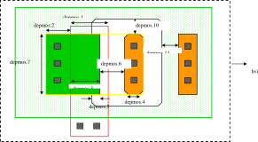

:drc_rule:`(extd.-)`
--------------------

.. list-table:: Function: Defines rules :drc_tag:`areaid.en`
   :header-rows: 1
   :stub-columns: 1
   :widths: 9 73 6 6 6

   * - :drc_rule:`Name`
     - Description
     - :drc_flag:`Flags`
     - Value
     - Unit
   * - :drc_rule:`(extd.1)`
     - Difftap cannot straddle areaid:en
     - 
     - 
     - 
   * - :drc_rule:`(extd.2)`
     - DiffTap must have 2 or 3 coincident edges with areaid:en if enclosed by areaid:en
     - 
     - 
     - 
   * - :drc_rule:`(extd.3)`
     - Poly must not be entirely overlapping difftap in areaid:en
     - 
     - 
     - 
   * - :drc_rule:`(extd.4)`
     - Only cell name "s8rf_n20vhv1*" is a valid cell name for n20vhv1 device  (Check in LVS as invalid device)
     - 
     - N/A
     - N/A
   * - :drc_rule:`(extd.5)`
     - Only cell name "s8rf_n20vhviso1" is a valid cell name for n20vhviso1 device  (Check in LVS as invalid device)
     - 
     - N/A
     - N/A
   * - :drc_rule:`(extd.6)`
     - Only cell name "s8rf_p20vhv1" is a valid cell name for p20vhv1 device  (Check in LVS as invalid device)
     - 
     - N/A
     - N/A
   * - :drc_rule:`(extd.7)`
     - Only cell name "s8rf_n20nativevhv1*" is a valid cell name for n20nativevhv1 device  (Check in LVS as invalid device)
     - 
     - N/A
     - N/A
   * - :drc_rule:`(extd.8)`
     - Only cell name "s8rf_n20zvtvhv1*" is a valid cell name for n20zvtvhv1 device  (Check in LVS as invalid device)
     - 
     - N/A
     - N/A

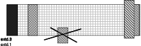

:drc_rule:`(hv.-.-)`
--------------------

.. note::

    High voltage rule apply for an operating voltage range of 5.5 - 12V; Nodes switching between 0 to 5.5V do not need to follow these rules

.. list-table:: Function: Defines High Voltage Rules (FIXME)
   :header-rows: 1
   :stub-columns: 1
   :widths: 9 73 6 6 6

   * - :drc_rule:`Name`
     - Description
     - :drc_flag:`Flags`
     - Value
     - Unit
   * - :drc_rule:`(hv.X.1)`
     - High voltage source/drain regions must be tagged by diff:hv
     - 
     - 
     - 
   * - :drc_rule:`(hv.X.3)`
     - High voltage poly can be drawn over multiple diff regions that are ALL reverse-biased by at least 300 mV (existence of reverse-bias is not checked by the CAD flow).  It can also be drawn over multiple diffs when all sources and all drain are shorted together. In these case, the high voltage poly can be tagged with the text:dg label with a value “hv_bb”.  Exceptions to this use of the hv_bb label must be approved by technology.  Under certain bias conditions, high voltage poly tagged with hv_bb can cross an nwell boundary. The poly of the drain extended device crosses nwell by construction and can be tagged with the "hv_bb" label. Use of the hv_bb label on high voltage poly crossing an nwell boundary must be approved by technology. All high voltage poly tagged with hv_bb will not be checked to hv.poly.1, hv.poly.2, hv.poly.3 and hv.poly.4.
     - 
     - 
     - 
   * - :drc_rule:`(hv.X.4)`
     - Any piece of layout that is shorted to hv_source/drain becomes a high voltage feature.
     - 
     - 
     - 
   * - :drc_rule:`(hv.X.5)`
     - In cases where an hv poly gate abuts only low voltage source and drain, the poly gate can be tagged with the text:dg label with a value "hv_lv".  In this case, the "hv_lv" tagged poly gate and its extensions will not be checked to hv.poly.6, but is checked by rules in the poly.-.- section.  The use of the hv_lv label must be approved by technology.
     - 
     - 
     - 
   * - :drc_rule:`(hv.X.6)`
     - Nwell biased at voltages >= 7.2V must be tagged with text "shv_nwell"
     - :drc_flag:`NC`
     - 
     - 
   * - :drc_rule:`(hv.nwell.1)`
     - Min spacing of nwell tagged with text "shv_nwell" to any nwell on different nets
     - 
     - 2.500
     - µm
   * - :drc_rule:`(hv.diff.1a)`
     - Minimum hv_source/drain spacing to diff for edges of hv_source/drain and diff not butting tap
     - 
     - 0.300
     - µm
   * - :drc_rule:`(hv.diff.1b)`
     - Minimum spacing of (n+/p+ diff resistors and diodes) connected to hv_source/drain to diff
     - 
     - 0.300
     - µm
   * - :drc_rule:`(hv.diff.2)`
     - Minimum spacing of nwell connected to hv_source/drain to n+ diff
     - :drc_flag:`DE`
     - 0.430
     - µm
   * - :drc_rule:`(hv.diff.3a)`
     - Minimum n+ hv_source/drain spacing to nwell
     - 
     - 0.550
     - µm
   * - :drc_rule:`(hv.diff.3b)`
     - Minimum spacing of (n+ diff resistors and diodes) connected to hv_source/drain to nwell
     - 
     - 0.550
     - µm
   * - :drc_rule:`(hv.poly.1)`
     - Hv poly feature hvPoly (including hv poly resistors) can be drawn over only one diff region and is not allowed to cross nwell boundary except (1) as allowed in rule .X.3 and (2) nwell hole boundary in depmos
     - 
     - 
     - 
   * - :drc_rule:`(hv.poly.2)`
     - Min spacing of hvPoly (including hv poly resistor) on field to diff (diff butting hvPoly are excluded)
     - 
     - 0.300
     - µm
   * - :drc_rule:`(hv.poly.3)`
     - Min spacing of hvPoly (including hv poly resistor) on field to n-well (exempt poly stradding nwell in a denmos/depmos)
     - 
     - 0.550
     - µm
   * - :drc_rule:`(hv.poly.4)`
     - Enclosure of hvPoly (including hv poly resistor) on field by n-well (exempt poly stradding nwell in a denmos/depmos)
     - 
     - 0.300
     - µm
   * - :drc_rule:`(hv.poly.6a)`
     - Min extension of poly beyond hvFET_gate (exempt poly extending beyond diff along the S/D direction in a denmos/depmos)
     - 
     - 0.160
     - 
   * - :drc_rule:`(hv.poly.6b)`
     - Extension of hv poly beyond FET_gate (including hvFET_gate; exempt poly extending beyond diff along the S/D direction in a denmos/depmos)
     - 
     - 0.160
     - 
   * - :drc_rule:`(hv.poly.7)`
     - Minimum overlap of hv poly ring_FET and diff
     - 
     - 
     - 
   * - :drc_rule:`(hv.poly.8)`
     - Any poly gate abutting hv_source/drain becomes a hvFET_gate
     - 
     - 
     - 

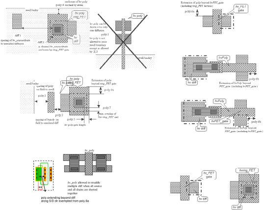

:drc_rule:`(vhvi.-.-)`
----------------------

.. list-table:: Function: Identify nets working between 12-16V
   :header-rows: 1
   :stub-columns: 1
   :widths: 9 73 6 6 6

   * - :drc_rule:`Name`
     - Description
     - :drc_flag:`Flags`
     - Value
     - Unit
   * - :drc_rule:`(vhvi.vhv.1)`
     - Terminals operating at nominal 12V (maximum 16V) bias must be tagged as Very-High-Voltage (VHV) using vhvi:dg layer
     - :drc_flag:`NC`
     - 
     - 
   * - :drc_rule:`(vhvi.vhv.2)`
     - A source or drain of a drain-extended device can be tagged by vhvi:dg. A device with either source or drain (not both) tagged with vhvi:dg serves as a VHV propagation stopper
     - :drc_flag:`NC`
     - 
     - 
   * - :drc_rule:`(vhvi.vhv.3)`
     - Any feature connected to VHVSourceDrain becomes a very-high-voltage feature
     - :drc_flag:`NC`
     - 
     - 
   * - :drc_rule:`(vhvi.vhv.4)`
     - Any feature connected to VHVPoly becomes a very-high-voltage feature
     - :drc_flag:`NC`
     - 
     - 
   * - :drc_rule:`(vhvi.vhv.5)`
     - Diffusion that is not a part of a drain-extended device (i.e., diff not areaid:en) must not be on the same net as VHVSourceDrain. Only diffusion inside :drc_tag:`areaid.ed` and LV diffusion tagged with vhvi:dg are exempted.
     - 
     - 
     - 
   * - :drc_rule:`(vhvi.vhv.6)`
     - Poly resistor can act as a VHV propagation stopper. For this, it should be tagged with text "vhv_block"
     - :drc_flag:`NC`
     - 
     - 
   * - :drc_rule:`(vhvi.1.-)`
     - Min width of vhvi:dg
     - 
     - 0.020
     - µm
   * - :drc_rule:`(vhvi.2.-)`
     - Vhvi:dg cannot overlap areaid:ce
     - 
     - 
     - 
   * - :drc_rule:`(vhvi.3.-)`
     - VHVGate must overlap hvi:dg
     - 
     - 
     - 
   * - :drc_rule:`(vhvi.4.-)`
     - Poly connected to the same net as a VHVSourceDrain must be tagged with vhvi:dg layer
     - 
     - 
     - 
   * - :drc_rule:`(vhvi.5.-)`
     - Vhvi:dg cannot straddle VHVSourceDrain
     - 
     - 
     - 
   * - :drc_rule:`(vhvi.6.-)`
     - Vhvi:dg overlapping VHVSourceDrain must not overlap poly
     - 
     - 
     - 
   * - :drc_rule:`(vhvi.7.-)`
     - Vhvi:dg cannot straddle VHVPoly
     - 
     - 
     - 
   * - :drc_rule:`(vhvi.8.-)`
     - Min space between nwell tagged with vhvi:dg and deep nwell, nwell, or n+diff on a separate net (except for n+diff overlapping nwell tagged with vhvi:dg).
     - 
     - 11.240
     - µm

:drc_rule:`(uhvi.-.-)`
----------------------

.. list-table:: Function: Identify nets working between 20V
   :header-rows: 1
   :stub-columns: 1
   :widths: 9 73 6 6 6

   * - :drc_rule:`Name`
     - Description
     - :drc_flag:`Flags`
     - Value
     - Unit
   * - :drc_rule:`(uhvi.1.-)`
     - diff/tap can not straddle UHVI
     - 
     - N/A
     - N/A
   * - :drc_rule:`(uhvi.2.-)`
     - poly can not straddle UHVI
     - 
     - N/A
     - N/A
   * - :drc_rule:`(uhvi.3.-)`
     - pwbm.dg must be enclosed by UHVI (exempt inside :drc_tag:`areaid.lw`)
     - 
     - N/A
     - N/A
   * - :drc_rule:`(uhvi.4.-)`
     - dnw.dg can not straddle UHVI
     - 
     - N/A
     - N/A
   * - :drc_rule:`(uhvi.5.-)`
     - UHVI must enclose :drc_tag:`areaid.ext`
     - 
     - N/A
     - N/A
   * - :drc_rule:`(uhvi.6.-)`
     - UHVI must enclose dnwell
     - 
     - N/A
     - N/A
   * - :drc_rule:`(uhvi.7.-)`
     - natfet.dg must be enclosed by UHVI layer by at least
     - 
     - N/A
     - N/A
   * - :drc_rule:`(uhvi.8.-)`
     - Minimum width of natfet.dg
     - 
     - N/A
     - N/A
   * - :drc_rule:`(uhvi.9.-)`
     - Minimum Space spacing of natfet.dg
     - 
     - N/A
     - N/A
   * - :drc_rule:`(uhvi.10.-)`
     - natfet.dg layer is not allowed
     - 
     - N/A
     - N/A

:drc_rule:`(ulvt-.-)`
---------------------

.. list-table:: Function: Identify dnwdiodehv_Psub(BV~60V)
   :header-rows: 1
   :stub-columns: 1
   :widths: 9 73 6 6 6

   * - :drc_rule:`Name`
     - Description
     - :drc_flag:`Flags`
     - Value
     - Unit
   * - :drc_rule:`(ulvt-.1)`
     - :drc_tag:`areaid.low_vt` must enclose dnw for the UHV dnw-psub diode texted "condiodeHvPsub"
     - 
     - NA
     - 
   * - :drc_rule:`(ulvt-.2)`
     - :drc_tag:`areaid.low_vt` must enclose pwbm.dg for the UHV dnw-psub diode texted "condiodeHvPsub"
     - 
     - NA
     - 
   * - :drc_rule:`(ulvt-.3)`
     - :drc_tag:`areaid.low_vt` can not straddle UHVI
     - 
     - NA
     - 

:drc_rule:`(pwres.-.-)`
-----------------------

.. list-table:: Function: Identify pwell resistors
   :header-rows: 1
   :stub-columns: 1
   :widths: 9 73 6 6 6

   * - :drc_rule:`Name`
     - Description
     - :drc_flag:`Flags`
     - Value
     - Unit
   * - :drc_rule:`(pwres.1.-)`
     - Pwell resistor has to be enclosed by the res layer
     - :drc_flag:`NC`
     - 
     - 
   * - :drc_rule:`(pwres.2.-)`
     - Min/Max width of pwell resistor
     - 
     - 2.650
     - µm
   * - :drc_rule:`(pwres.3.-)`
     - Min length of pwell resistor
     - 
     - 26.500
     - µm
   * - :drc_rule:`(pwres.4.-)`
     - Max length of pwell resistor
     - 
     - 265.00
     - µm
   * - :drc_rule:`(pwres.5.-)`
     - Min/Max spacing of tap inside the pwell resistor to nwell
     - 
     - 0.220
     - µm
   * - :drc_rule:`(pwres.6.-)`
     - Min/Max width of tap inside the pwell resistor
     - 
     - 0.530
     - µm
   * - :drc_rule:`(pwres.7a.-)`
     - Every pwres_terminal must enclose 12 licon1
     - 
     - 
     - 
   * - :drc_rule:`(pwres.7b.-)`
     - Every pwres_terminal must enclose 12 mcons if routed through metal1
     - 
     - 
     - 
   * - :drc_rule:`(pwres.8.-)`
     - Diff or poly is not allowed in the pwell resistor.
     - 
     - 
     - 
   * - :drc_rule:`(pwres.9.-)`
     - Nwell surrounding the pwell resistor must have a full ring of contacted tap strapped with metal.
     - 
     - 
     - 
   * - :drc_rule:`(pwres.10.-)`
     - The res layer must abut pwres_terminal on opposite and parallel edges
     - 
     - 
     - 
   * - :drc_rule:`(pwres.11.-)`
     - The res layer must abut nwell on opposite and parallel edges not checked in Rule pwres.10
     - 
     - 
     - 

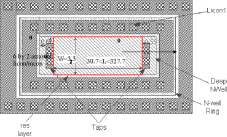

:drc_rule:`(rfdiode.-.-)`
-------------------------

.. list-table:: Function: Identify RF diodes; Used for RCX
   :header-rows: 1
   :stub-columns: 1
   :widths: 9 73 6 6 6

   * - :drc_rule:`Name`
     - Description
     - :drc_flag:`Flags`
     - Value
     - Unit
   * - :drc_rule:`(rfdiode.1.-)`
     - Only 90 degrees allowed for :drc_tag:`areaid.re`
     - 
     - 
     - 
   * - :drc_rule:`(rfdiode.2.-)`
     - :drc_tag:`areaid.re` must be coincident with nwell for the rf nwell diode
     - 
     - 
     - 
   * - :drc_rule:`(rfdiode.3.-)`
     - :drc_tag:`areaid.re` must be coincident with innwer edge of the nwell ring for the rf pwell-deep nwell diode
       Allowed PNP layout
       Layout: pnppar
       Allowed NPN layout
       Layout: npnpar1x1
     - 
     - 
     - 

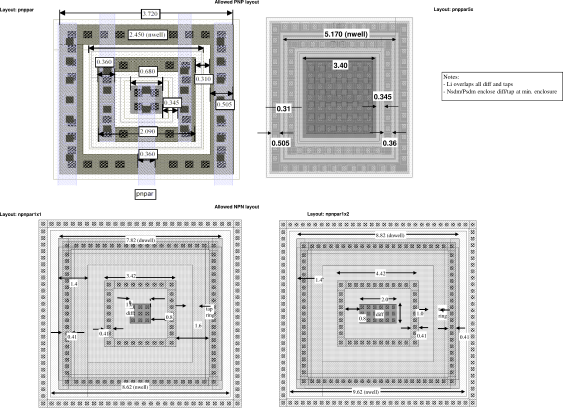

