User Guide for :lib:`sky130_fd_io`
==================================

Summary
-------

This IP document includes two versions of a General Purpose I/O buffer (:cell:`sky130_fd_io__gpio`) with different feature sets,
:cell:`sky130_fd_io__sio` macro (pair of Special I/O buffer (:cell:`sky130_fd_io__sio`) + REFerence GENerator (:cell:`sky130_fd_io__refgen`).

The IP also includes;

*  Power, Ground cells (PG pads),
*  Reset cells (XRES),
*  Test pads,
*  Analog pads,
*  power detector,
*  overlay cells.

The IP also includes all the relevant ESD clamps, diodes and trigger circuits to complete the I/O ring.

The I/O buffers can be configured as an input buffer, output buffer, or an I/O buffer.

The :cell:`sky130_fd_io__gpio` buffer includes a single-ended input buffer that can be configured for LVTTL, CMOS/I2C operation.

:cell:`sky130_fd_io__gpiov2` has better electrical performance and the Rx can handle 1.8V signaling when the I/O supply is different from 1.8V.

:cell:`sky130_fd_io__gpio_ovtv2` is fully I2C compliant and includes the over-voltage tolerance feature.
It also has an input buffer that can support selectable trip-point feature along with a reference generator.

The :cell:`sky130_fd_io__sio` buffer can be configured to produce a regulated high output level, and includes a differential input buffer.
All I/O buffers support multiple drive modes.

The IP supports a power supply range of 1.71V to 5.5V.

Features. Benefits, Tradeoffs, Limitations
------------------------------------------

*  1.71V-5.5V continuous supply operating range
*  Rail-based ESD protection for :cell:`sky130_fd_io__gpio*` and :cell:`sky130_fd_io__sio_macro`
*  I2C compliant :cell:`sky130_fd_io__gpio_ovtv2`
*  I2C compatible - :cell:`sky130_fd_io__gpiov2`, :cell:`sky130_fd_io__gpio`, :cell:`sky130_fd_io__sio`
*  CMOS, LPC compliant - :cell:`sky130_fd_io__gpio*`, :cell:`sky130_fd_io__sio`
*  Low Power modes: Hibernate mode (Latch previous state), Deep Sleep Mode (allows I2C communication), Stop Mode (retains I/O state when LV supply is gone)
*  Selectable output buffer drive modes (open drain high/low, strong/weak pull up/down, High-Z output) - :cell:`sky130_fd_io__gpio*`, :cell:`sky130_fd_io__sio`
*  Regulated output high level - :cell:`sky130_fd_io__sio`
*  Hot swap & over-voltage tolerant - :cell:`sky130_fd_io__sio`, :cell:`sky130_fd_io__gpio_ovtv2`
*  Selectable output buffer slew rate control - :cell:`sky130_fd_io__sio`, :cell:`sky130_fd_io__gpio*`
*  Selectable input buffer threshold (LVTTL or CMOS/I2C)- :cell:`sky130_fd_io__gpio*`, :cell:`sky130_fd_io__sio`
*  Selectable 1.8V signaling (Active Mode) - :cell:`sky130_fd_io__gpiov2`, :cell:`sky130_fd_io__gpio_ovtv2`
*  Selectable differential input buffer threshold (4 options) - :cell:`sky130_fd_io__sio`
*  Integrated analog multiplexers (2) - :cell:`sky130_fd_io__gpio*`
*  IP has multiple Power/Ground pads with HV and LV clamps, diodes, Test pads to enable I/O ring assembly
*  VDDIO and VDDD power detector
*  Multiple flavors of XRES cells
*  For complete set of feature comparison, see :numref:`io features comparison`
*  AIP/LEDA rules set compliant : 5.0

Design Metrics
--------------

.. table:: Design Metrics-1
   :name: design-metrics-1

   +--------------------------------+--------------+------------+
   | Description                    | Active Mode  | Deep Sleep |
   +================================+==============+============+
   | Output: Fmax Freq              | 33MHz        | 33Mhz      |
   +--------------------------------+--------------+------------+
   | Output: Fmax Freq              | 33MHz        | 33Mhz      |
   +--------------------------------+--------------+------------+
   | SE Input: Fmax Freq            | 66MHz        | 66MHz      |
   +--------------------------------+--------------+------------+
   | Number of power domains        | 5                         |
   +--------------------------------+---------------------------+
   | Number of power modes          | *  Active                 |
   |                                | *  Hibernate              |
   |                                | *  Deep Sleep             |
   |                                | *  Stop                   |
   +--------------------------------+---------------------------+
   | Single-ended Input buffer      | I2C complaint             |
   | hysteresis (ALL I/O)           |                           |
   +--------------------------------+---------------------------+
   | Rise/Fall trip point for       | 0.7V-1.5V                 |
   | VDDD detector                  |                           |
   +--------------------------------+---------------------------+
   | Rise/Fall trip point for       | 0.7V-1.5V                 |
   | VDDIO detector                 |                           |
   +--------------------------------+---------------------------+
   | Simulation Temperature Range   | -40C to 100C              |
   +--------------------------------+---------------------------+
   | * Simulation Voltage range I/O | 1.65V-5.5V                |
   | * Analog Supply                |                           |
   +--------------------------------+---------------------------+
   | * Simulation Voltage range I/O | 1.60V-1.95V               |
   | * LV Digital Supply            |                           |
   +--------------------------------+---------------------------+

.. table:: Design Metrics-2
   :name: design-metrics-2

   +---------------------------+------------+-----------+------------+
   | :cell:`sky130_fd_io__sio` | 2.0V       | 3.3V      | 5.0V       |
   | Differential Input buffer |            |           |            |
   +===========================+============+===========+============+
   | Quiescent current         | 0.23mA     | 0.25mA    | 0.27mA     |
   +---------------------------+------------+-----------+------------+
   | ICC @ Fmax                | 0.35mA     | 0.40mA    | 0.50mA     |
   +---------------------------+------------+-----------+------------+
   | Voltage trip point (SIO)  | Vinref±200mV                        |
   +---------------------------+-------------------------------------+

.. table:: Design Metrics-3
   :name: design-metrics-3

   +-----------------------------------+-------------+-----------+
   |                                   | ``tt_leak`` | ``leak``  |
   |                                   | 3.0V, 25C   | 3.0V, 85C |
   +===================================+=============+===========+
   | * :cell:`sky130_fd_io__gpio*` ISB | 0.17nA      | 89.63nA   |
   | * ``enable_h`` = 0                |             |           |
   +-----------------------------------+-------------+-----------+
   | * :cell:`sky130_fd_io__sio` ISB   | 0.22nA      | 40.29nA   |
   | * ``enable_h`` = 0                |             |           |
   +-----------------------------------+-------------+-----------+

.. table:: Design Metrics-4
   :name: design-metrics-4

   +----------------------------------------------------+----------------------+
   | :cell:`sky130_fd_io__gpio*` AMUX switch resistance | *  275 : CSD Range   |
   |                                                    | *  1000 : Full Range |
   +----------------------------------------------------+----------------------+

Configuration Options
---------------------

* ALL I/O: Input and Output buffers can be enabled independently
* ALL I/O: Input buffer trip point select between CMOS/I2C & LVTTL
* ALL I/O: Configurable for 8 different Output drive modes
* ALL I/O: Output can be configured for different slew rates
* ALL I/O: I/O buffer can be configured into low power or low leakage mode using hold state control signals
* ALL I/O: O/P Buffer can be configured to drive the PAD during deep sleep mode
* :cell:`sky130_fd_io__sio` output buffer can be cured to be CMOS or Regulated output high level buffer (only in Strong Pull up mode)
* :cell:`sky130_fd_io__gpiov2`, :cell:`sky130_fd_io__gpio_ovtv2` to handle 1.8V signaling on pad
* :cell:`sky130_fd_io__gpio_ovtv2` input buffer supports selectable trip point feature

Typical Application
-------------------

The SKY130 IO cells are typically used to build the I/O ring around the chip core.
In addition to I/O's, Power/Ground cells, ESD clamps, Bond pad etc.
are also available in this IP.
I/O's are used to communicate with the external world and acts as the interface/buffer between the chip core and the external system.

Power Performance
-----------------

The I/O's support multiple power modes (Hibernate, Deep Sleep, Stop) which are low-power modes, while still retaining the state of the I/O.

FMEA
----

Rail-Based ESD
~~~~~~~~~~~~~~

The ESD strategy for M0S8 platform is non-distributed (grouped) rail-based ESD.
This will be implemented across all pins and the ESD scheme can be fully simulated and easily portable across technologies.

Architecture and Implementation details
^^^^^^^^^^^^^^^^^^^^^^^^^^^^^^^^^^^^^^^

The different components needed to build the I/O ring are - :cell:`sky130_fd_io__gpio` :cell:`sky130_fd_io__sio`, ESD RC Clamps (which sit inside the Power/Ground PADS).
Each external power domain will be protected with its own ESD RC clamp.
There will be ESD diodes from each of the derived supplies to the source supply.
For this purpose, two types of ESD RC clamps will be developed - HV Clamp and LV clamp.

Alternate XRES implementation
^^^^^^^^^^^^^^^^^^^^^^^^^^^^^

The glitch filter and 5k pull-up resistor in the current :cell:`sky130_fd_io__top_xres_2` are provided as separate cells.
A PMOS switch is used to disable the pull-up resistor.

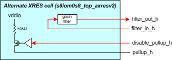

   Alternate XRES Implementation

Critical Requirements Summary
=============================

Overview of Block Applications
------------------------------

The Data I/O circuitry is used to communicate with other components in a PC board environment.
The circuit also has the capability of shifting between core level voltages and I/O level voltages.

The buffers support a power supply range of 1.71V to 5.5V.

Block Architecture Overview
---------------------------

Block Description
~~~~~~~~~~~~~~~~~

The SKY130 IO cells is a toolkit IP.
It contains all the cells and primitives required to construct an I/O ring in the SKY130 technology.

Additional details of the cells included can be found in the sections below.

This :lib:`sky130_fd_io` library contained in this document covers different kinds of I/O cells, a general purpose I/O (:cell:`sky130_fd_io__gpio`)
and a special I/O (:cell:`sky130_fd_io__sio`), a reference generator (:cell:`sky130_fd_io__refgen`) for providing voltage references to the :cell:`sky130_fd_io__sio` and Power and Ground (PG)
cells that make up the I/O ring.

The following sections describe each of the blocks in detail:

A single table comparison of all features across different IO's is provided in :numref:`io features comparison`.

*  I/O [1]_ Common Features, section :ref:`io-common-features`.
*  :cell:`sky130_fd_io__gpio`, :cell:`sky130_fd_io__gpiosf` Additional Features, section :ref:`sky130_fd_io__gpio-additional-features`.
*  :cell:`sky130_fd_io__gpiov2` Additional Features, section :ref:`sky130_fd_io__gpiov2-additional-features`.
*  :cell:`sky130_fd_io__gpio_ovtv2` Additional Features, section :ref:`sky130_fd_io__gpio_ovtv2-additional-features`.
*  :cell:`sky130_fd_io__sio` Additional Features, :ref:`sky130_fd_io__sio-additional-features`.
*  :cell:`sky130_fd_io__refgen` Features, :ref:`sky130_fd_io__refgen-features`.
*  PG pads (ESD), :ref:`pg-pads`.
*  Overlay Cells, :ref:`overlay-cells`.
*  Power Detectors, :ref:`power-detector`.

.. _io-common-features:

I/O\ [1]_ Common Features
~~~~~~~~~~~~~~~~~~~~~~~~~

The :cell:`sky130_fd_io__gpio` and :cell:`sky130_fd_io__sio` buffers contain the following common features:

.. contents:: :local:
   :depth: 1

.. [1] I/O (:cell:`sky130_fd_io__gpio`, :cell:`sky130_fd_io__gpiosf`, :cell:`sky130_fd_io__gpiov2`, :cell:`sky130_fd_io__gpio_ovtv2`, SIO).

The features that are supported by different I/O's are documented in :numref:`io features comparison` below:

.. table:: Comparison of features across different I/O's provided in this IP
   :name: io features comparison

   +-------------------+-----------------------------+---------------------------------+------------------------------+----------------------------------+
   | Feature           | :cell:`sky130_fd_io__gpio*` | :cell:`sky130_fd_io__sio_macro` | :cell:`sky130_fd_io__gpiov2` | :cell:`sky130_fd_io__gpio_ovtv2` |
   +===================+=============================+=================================+==============================+==================================+
   | Drive Capability  | 4mA                         | 4mA                             | 4mA                          | 4mA                              |
   | (Source) [2]_     |                             |                                 |                              |                                  |
   +-------------------+-----------------------------+---------------------------------+------------------------------+----------------------------------+
   | Drive Capability  | 4mA [3]_                    | 20mA [5]_                       | 4mA [3]_                     | 10mA [3]_                        |
   | (Sink)            |                             |                                 |                              |                                  |
   +-------------------+-----------------------------+---------------------------------+------------------------------+----------------------------------+
   | Drive Modes       | 8-Modes                     | 8-Modes                         | 8-Modes                      | 8-Modes                          |
   +-------------------+-----------------------------+---------------------------------+------------------------------+----------------------------------+
   | Slew Rate Control | Slow/Fast                   | Slow/Fast                       | Slow/Fast                    | Slow/Fast/I2C                    |
   +-------------------+-----------------------------+---------------------------------+------------------------------+----------------------------------+
   | Input Buffer      | CMOS/TTL                    | CMOS/TTL                        | CMOS/TTL/1.8V                | CMOS/TTL/1.8V/Selectable         |
   | trip point        |                             |                                 |                              |                                  |
   +-------------------+-----------------------------+---------------------------------+------------------------------+----------------------------------+
   | Over-Voltage      | No                          | Yes                             | No                           | Yes                              |
   | Tolerance         |                             |                                 |                              |                                  |
   +-------------------+-----------------------------+---------------------------------+------------------------------+----------------------------------+
   | Analog Mux        | 2                           | 0 [4]_                          | 2                            | 2                                |
   +-------------------+-----------------------------+---------------------------------+------------------------------+----------------------------------+
   | Regulated Output  | No                          | Yes                             | No                           | No                               |
   +-------------------+-----------------------------+---------------------------------+------------------------------+----------------------------------+
   | Input buffer type | SE                          | SE+Diff                         | SE                           | SE                               |
   +-------------------+-----------------------------+---------------------------------+------------------------------+----------------------------------+
   | I2C Compliance    | Limited [5]_                | Limited [5]_                    | Standard,Fast                | * Standard                       |
   |                   |                             |                                 |                              | * Fast                           |
   |                   |                             |                                 |                              | * Fast-Plus [6]_                 |
   |                   |                             |                                 |                              | * High-Speed                     |
   +-------------------+-----------------------------+---------------------------------+------------------------------+----------------------------------+
   | Low-voltage       | No                          | No                              | Yes                          | Yes                              |
   | DFT support       |                             |                                 |                              |                                  |
   +-------------------+-----------------------------+---------------------------------+------------------------------+----------------------------------+
   | Hysteresis [7]_   | 5%                          | 5%                              | 10% [8]_                     | 10% [8]_                         |
   +-------------------+-----------------------------+---------------------------------+------------------------------+----------------------------------+

.. [2] For 3V range. :cell:`sky130_fd_io__sio` configured in unregulated mode.
.. [3] VDDIO≥1.71V.
.. [4] SIO interacts with the analog mux for ADFT of :cell:`sky130_fd_io__refgen`.
.. [5] Limited - Compliant for limited ranges of Vext, Rext and Cbus.
.. [6] 20mA support for VDDIO>2.9V.
.. [7] Input Buffer operating at 48 MHz w hen VCCHIB=1.4V, VDDIO=1.65V
.. [8] For CMOS mode only.

Eight drive strength modes
^^^^^^^^^^^^^^^^^^^^^^^^^^

The IP includes three static drive mode bits (dm<2:0>).
These bits are used to configure the output buffer drive strength.
A default setting for enabling or disabling the input and output buffer is also defined.
The eight drive strength modes are defined in the following table.

.. table:: Truth table for I/O Drive Strength Modes
   :name: io drive strength modes

   +-------------+----------+---------+-----------------+----------+----------+---------------------------------+
   | ``inp_dis`` | ``oe_n`` | dm<2:0> | Pad State       | Input    | Output   | Mode Description                |
   |             |          |         +--------+--------+ Buffer   | Buffer   |                                 |
   |             |          |         | out=1  | out=0  |          |          |                                 |
   +=============+==========+=========+========+========+==========+==========+=================================+
   | X           | X        | 000     | Hi- Z  | Hi- Z  | Disabled | Disabled | * Input/Output buffers disabled |
   |             |          |         |        |        | (in=0)   |          | * Analog Input Mode             |
   +-------------+----------+---------+--------+--------+----------+----------+---------------------------------+
   | 0           | X        | 001     | Hi- Z  | Hi- Z  | Enabled  | Disabled | Configured as Input only        |
   +-------------+----------+---------+--------+--------+----------+----------+---------------------------------+
   | 0           | 0        | 010     | Res 1  | Strong | Enabled  | Enabled  | * Weak pull-up,                 |
   |             |          |         | (5k)   | 0      | (in=0)   |          | * strong pull-down              |
   +-------------+----------+---------+--------+--------+----------+----------+---------------------------------+
   | 0           | 0        | 011     | Strong | Res 0  | Enabled  | Enabled  | * Strong pull-up                |
   |             |          |         | 1      | (5k)   | (in=0)   |          | * Weak pull-down                |
   +-------------+----------+---------+--------+--------+----------+----------+---------------------------------+
   | 0           | 0        | 100     | Hi- Z  | Strong | Enabled  | Enabled  | * Open Drain                    |
   |             |          |         |        | 0      | (in=0)   |          | * Strong pull-down              |
   +-------------+----------+---------+--------+--------+----------+----------+---------------------------------+
   | 0           | 0        | 101     | Strong | Hi- Z  | Enabled  | Enabled  | * Open Drain                    |
   |             |          |         | 1      |        | (in=0)   |          | * Strong pull-up                |
   +-------------+----------+---------+--------+--------+----------+----------+---------------------------------+
   | 0           | 0        | 110     | Strong | Strong | Enabled  | Enabled  | * Strong pull-up                |
   |             |          |         | 1      | 0      | (in=0)   |          | * Strong pull-down              |
   +-------------+----------+---------+--------+--------+----------+----------+---------------------------------+
   | 0           | 0        | 111     | Res 1  | Res 0  | Enabled  | Enabled  | * Weak pull-up                  |
   |             |          |         | (5k)   | (5k)   | (in=0)   |          | * Weak pull-down                |
   +-------------+----------+---------+--------+--------+----------+----------+---------------------------------+
   | 1           | X        | XXX     |        |        | Disabled |          | Input buffer disabled           |
   +-------------+----------+---------+--------+--------+----------+----------+---------------------------------+
   | X           | 1        | XXX     | Hi-Z   | Hi-Z   |          | Disabled | Output buffer tri-stated        |
   +-------------+----------+---------+--------+--------+----------+----------+---------------------------------+

*X = don't care 0/1*

Independent control of input and output buffer enables
^^^^^^^^^^^^^^^^^^^^^^^^^^^^^^^^^^^^^^^^^^^^^^^^^^^^^^

The I/O cells also include separate input disable ``inp_dis`` and output enable ``oe_n`` control signals as shown in :numref:`io drive strength modes`.
When ``inp_dis`` = 0 the input buffer is enabled and when ``oe_n`` = 0 the output buffer is enabled.
When these signals are high (logic 1) the corresponding buffers are disabled independent of the state of the drive mode bits dm<2:0>.
For example, if drive mode 2 (dm<2:0>=010) is selected, the input buffer is enabled by default.
If ``inp_dis=1`` for this drive mode, the input buffer enable default state will be overridden and the input buffer will be disabled and the input buffer
output will be driven low.

Input buffer threshold select
^^^^^^^^^^^^^^^^^^^^^^^^^^^^^

The ``vtrip_sel`` signal alters the input buffer Vil and Vih specifications.
The Vil and Vih specifications are listed in the following table.

.. table:: I/O Vil & Vih Specifications
   :name: io vil vih

   +----------+-------------+-------+----------------+-----------------+-----------------+
   | Prameter | Description | Units | Condition      | ``vtrip_sel=0`` | ``vtrip_sel=1`` |
   +==========+=============+=======+================+=================+=================+
   | VIL      | Input Low   | V     | * vddio < 2.7V | 0.3 \* vddio    | * 0.3 \* vddio  |
   |          | Voltage     |       | * vddio > 2.7V |                 | * 0.8           |
   +----------+-------------+-------+----------------+-----------------+-----------------+
   | VIH      | Input High  | V     | * vddio < 2.7V | 0.7 \* vddio    | * 0.7 \* vddio  |
   |          | Voltage     |       | * vddio > 2.7V |                 | * 2.0           |
   +----------+-------------+-------+----------------+-----------------+-----------------+

When ``vtrip_sel`` = 0, the input buffer functions as a CMOS input buffer.
When ``vtrip_sel`` = 1, the input buffer functions as an LVTTL input buffer.

I/O supply and Internal supply level input buffer outputs
^^^^^^^^^^^^^^^^^^^^^^^^^^^^^^^^^^^^^^^^^^^^^^^^^^^^^^^^^

The input buffer produces two outputs, a low voltage output and a high voltage output.
The low voltage output is produced by level shifting the external ``vddio`` referenced level input to the internal ``vcchib`` level output.
The high voltage output is produced by not level shifting the external ``vddio`` referenced level input to a buffered internal ``vddio_q`` level output.

Selectable output edge rate control
^^^^^^^^^^^^^^^^^^^^^^^^^^^^^^^^^^^

The CMOS output buffer includes a slew rate control input signal ``slow``.
When this signal is activated (slow = 1) the output edge rate will be slower than the default setting (slow = 0).

Hold state mode (latch previous state)
^^^^^^^^^^^^^^^^^^^^^^^^^^^^^^^^^^^^^^

The I/O cell includes a hold state control signal ``hld_h_n``.
The purpose of this signal is to place the I/O cell into a low leakage mode while holding the previous state of the input controls, output controls
and data.
``hld_h_n`` latches all control signals except ``enable_h``.
Specific timing constraints between the ``hld_h_n`` input and the other control signals must be satisfied to when entering and exiting the hold state
mode.
The Input signals which are latched by ``hld_h_n`` are dm<2:0>, slow, ``vtrip_sel``, ``inp_dis``, out, ``oe_n``.
The input signals, ``ibuf_sel``, ``vreg_en``, in :cell:`sky130_fd_io__sio` cell are also latched by ``hld_h_n``.

During the hold mode, vccd can either be taken down to 0 or can float.
During this case, the I/O input buffer would continue to actively drive out as long as there are valid power supplies (vddio, vddio_q and vcchib).

During the hold mode, the O/P can be configured to drive the PAD as described in Feature 9.

I/O Mode Control Override during Power-up
^^^^^^^^^^^^^^^^^^^^^^^^^^^^^^^^^^^^^^^^^

The :cell:`sky130_fd_io__gpio` includes an I/O mode control override signal ``enable_h`` that is different from the ``oe_n`` signal.
The signal ``enable_h=0`` forces the output drive mode to Hi-Z.
The ``enable_h`` signal is intended to be at logic 0 during the chip power-up sequence.
During the power-up sequence this signal is driven low and the output driver is forced to a known state (Hi-Z).
This ensures that the output driver does not enter a crow-bar condition.

Before the power-up sequence is completed, and the ``enable_h`` signal is asserted (logic 1), the data inputs and the control signals must be stable to
ensure that the output driver does not inadvertently enter a crow-bar condition while exiting the power-up sequence.

The ``enable_h`` signal takes priority over the ``hld_h_n`` signal.
In other words, when the I/O mode control override signal ``enable_h`` is logic 0 and the ``hld_h_n`` control signal is active, the output driver will
be forced to drive Hi-Z.
The previous states on the pull-up and pull-down signals will be over written and set to the levels required to force the driver.
If the ``hld_h_n`` signal remains active after the ``enable_h`` signal transitions from logic 0 to logic 1, the forced condition (Hi-Z) will be held.
:numref:`mode control override and hold state` describes the ``enable_h``, ``hld_h_n`` functionality.

.. table:: :cell:`sky130_fd_io__gpio` Mode Control Override & Hold State Operation
   :name: mode control override and hold state

   +--------------+-------------+--------------+--------------+--------------------------------------------------+
   | ``enable_h`` | ``hld_h_n`` | Previous pad | Current pad  | Notes                                            |
   |              |             | Output state | Output State |                                                  |
   +==============+=============+==============+==============+==================================================+
   | 1            | 0           | 0            | 0            |                                                  |
   +--------------+-------------+--------------+--------------+--------------------------------------------------+
   | 1            | 0           | 1            | 1            |                                                  |
   +--------------+-------------+--------------+--------------+--------------------------------------------------+
   | 1            | 0           | Hi-Z         | Hi-Z         |                                                  |
   +--------------+-------------+--------------+--------------+--------------------------------------------------+
   | 1            | 1           | Table 4.2-1  | Table 4.2-1  |                                                  |
   +--------------+-------------+--------------+--------------+--------------------------------------------------+
   | 0            | X           | X            | Hi-Z         | * Input buffer disabled;                         |
   |              |             |              |              | * Output buffer Hi-Z (configured as dm<2:0>=000) |
   +--------------+-------------+--------------+--------------+--------------------------------------------------+

Note that there is no latch present on the ``pad`` itself, but the data ``in`` gets latched whenever ``hld_h_n=0``.
Further whenever ``enable_h=0``, this data level shifter gets forced to a value which determines the ``pad`` current output state.

Pad Access to the Core
^^^^^^^^^^^^^^^^^^^^^^

The I/O provides pad access to the core.
``pad_no_esd_h`` is directly connected to the pad.
``pad_a_esd_0_h`` and ``pad_a_esd_1_h`` is connected to the pad through a 150 ohm ESD resistor.

O/P configuration to drive the PAD in hold mode
^^^^^^^^^^^^^^^^^^^^^^^^^^^^^^^^^^^^^^^^^^^^^^^

The hold over ride signal (``hld_ovr``, active high, vcchib domain) signals the O/P buffer when to provide the flow-through functionality of the data
input to the output buffer and output enable in deep sleep mode.

The functionality is defined in :numref:`normal and hold modes`.

.. table:: Functionality during normal and hold modes
   :name: normal and hold modes

   +-------------+-------------+-----------+-----------+
   | ``hld_ovr`` | ``hld_h_n`` | in        | ``oe_n``  |
   +=============+=============+===========+===========+
   | 0           | 0           | Latched   | Latched   |
   +-------------+-------------+-----------+-----------+
   | 0           | 1           | Normal    | Normal    |
   +-------------+-------------+-----------+-----------+
   | 1           | 0           | Over-ride | Over-ride |
   +-------------+-------------+-----------+-----------+
   | 1           | 1           | Normal    | Normal    |
   +-------------+-------------+-----------+-----------+

.. note::
   - Latched means that the input and output enable are latched. This is the same functionality as mentioned in :numref:`io vil vih`.
   - Normal refers any mode other than Sleep modes

.. _sky130_fd_io__gpio-additional-features:
:cell:`sky130_fd_io__gpio` Additional Features
~~~~~~~~~~~~~~~~~~~~~~~~~~~~~~~~~~~~~~~~~~~~~~

The block diagram for the :cell:`sky130_fd_io__gpio` is shown in :numref:`sky130_fd_io__top_gpio block diagram`.
Note: Bus notation dm[3] denotes a 3 bit bus dm[2:0].
These notations are interchangeably used in the document.

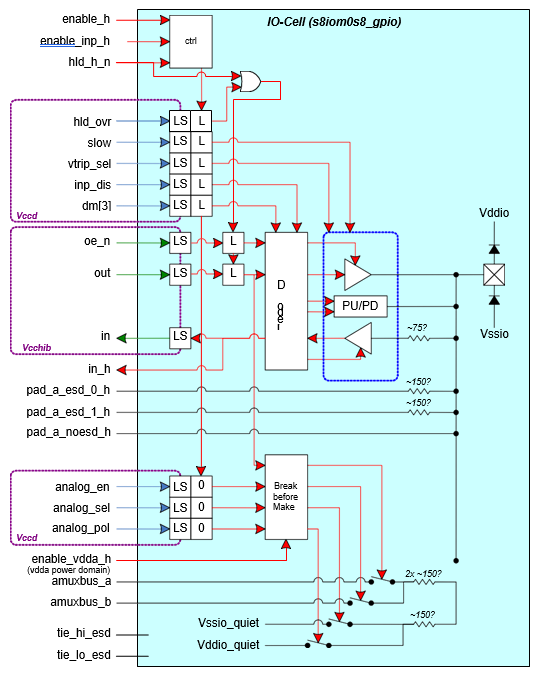

   Block diagram for :cell:`sky130_fd_io__top_gpio`

All :cell:`sky130_fd_io__gpio` provides additional functionality of analog connectivity to the PAD for CSD and other applications as described
below:

:cell:`sky130_fd_io__gpio` Analog Connectivity Modes
^^^^^^^^^^^^^^^^^^^^^^^^^^^^^^^^^^^^^^^^^^^^^^^^^^^^

The M0S8 :cell:`sky130_fd_io__gpio` integrates the AMUXBUS switches to two ``AMUXBUS_A`` and ``AMUXBUS_B`` analog buses.
These buses are used for both Capsense operation (as described in the CSD chapter), and general analog connectivity for Programmable Analog blocks and
ADFT.

The analog functionality is controlled using three control signals.

-  ``analog_en`` enables the analog functions of the :cell:`sky130_fd_io__gpio` cell

-  ``analog_sel`` selects between ``AMUXBUS_A`` and ``AMUXBUS_B``

-  ``analog_pol`` selects the function of the ``out`` input, which toggles between AMUXBUS and VSSIO or between VDDIO and AMUXBUS

:numref:`analog functionality` describes the analog functionality as selected by the relevant control signals:

.. table:: Analog functionality by the relevant control signals
   :name: analog functionality

   +-------------------------------------------------+-------------------------------+-------------------------+
   |                                                 | Analog Function               | Digital Function        |
   +---------------+----------------+----------------+---------------+---------------+------------+------------+
   | ``analog_en`` | ``analog_sel`` | ``analog_pol`` | out=0         | out=1         | Input      | Output     |
   +===============+================+================+===============+===============+============+============+
   | 0             | X              | X              | N/C           | N/C           | Unaffected | Unaffected |
   +---------------+----------------+----------------+---------------+---------------+------------+------------+
   | 1             | 0              | 0              | Vssio         | ``amuxbus_a`` | Disabled   | Unaffected |
   +---------------+----------------+----------------+---------------+---------------+------------+------------+
   | 1             | 0              | 1              | ``amuxbus_a`` | Vddio         | Disabled   | Unaffected |
   +---------------+----------------+----------------+---------------+---------------+------------+------------+
   | 1             | 1              | 0              | Vssio         | ``amuxbus_b`` | Disabled   | Unaffected |
   +---------------+----------------+----------------+---------------+---------------+------------+------------+
   | 1             | 1              | 1              | ``amuxbus_b`` | Vddio         | Disabled   | Unaffected |
   +---------------+----------------+----------------+---------------+---------------+------------+------------+

Note that digital output driver can be used concurrent with analog function

Note the following: When the I/O is in an ``analog`` mode, the digital input buffer is disabled, but the output driver is not.
Both CSD and certain Programmable Analog applications make use of the digital output driver as a driver on analog signals/nodes.
The output driver performs the function as selected by its dm[3] inputs (which may be either OFF or not).

Note that these modes only concern analog functions ``internal`` to the :cell:`sky130_fd_io__gpio`, i.e.
using the internal AMUXBUS switches.

*Shielding for Analog Mux busses:* AMUX switches can also be used to source and sink currents from CSD IDAC block to :cell:`sky130_fd_io__gpio` pins.
The current IDAC for CSD block can be used to supply/ source current through AMUX to any :cell:`sky130_fd_io__gpio` pin.
The maximum current can be up to 1mA and thus the AMUX layout needs to be designed keeping EM/IR considerations in mind.

*Usage of ``VSSIO_Q`` in AMUX:* The CSD pull-down transistor used in AMUX is the only one that uses the ``vssio_q`` connection to the I/O.
In case the AMUX is used for CSD operation, ``vssio_q`` can alternatively be connected to VSSA without concerns for noise.
Care must be taken that VSSIO and ``VSSIO_Q`` should not be shorted at VSSIO pad when used in this configuration.

Changes to Analog Mux for :cell:`sky130_fd_io__gpiov2` and :cell:`sky130_fd_io__gpio_ovtv2`
*******************************************************************************************

1. The input buffer is no longer disabled inside :cell:`sky130_fd_io__gpiov2` and :cell:`sky130_fd_io__gpio_ovtv2` automatically when analog mux is
   enabled (``analog_en=1``).
   This was done to unblock self-testing of I/O cells.
   The firmware needs to ensure that ``inp_dis=1`` when ``analog_en=1``.

2. Power mode behavior was modified for both :cell:`sky130_fd_io__gpiov2` and :cell:`sky130_fd_io__gpio_ovtv2`.
   An extra control signal ``enable_vswitch_h`` is added to have better control over the power mode behavior.
   The following table gives the supplies, control signals and their role:

.. list-table:: Supplies, control signals and their definition
   :name: supplies control signals
   :widths: 10 90
   :header-rows: 1

   * - Signal
     - I/O-Behavior
   * - vddio
     - Digital supply for the I/O-cell. This supply is used to implement all digital input/output functions. It can be connected to the main system digital supply (vddd) or to an independent vddio supply.
   * - vdda
     - Analog supply for the I/O-cell. This supply is used to implement the analog switches associated with amuxbus and CSD behavior. This supply is either connected to the global analog supply in the system or tied off to vddio when amuxbus functionality is not used.
   * - vccd
     - The main regulated (1.8V) core supply. This supply is the relative supply of most of the configuration/control signals coming into the I/O-cell and is used for level translation only. No I/O circuits are powered using this supply.
   * - vcchib
     - The hibernate regulated supply (1.8V). This supply is the relative supply for the I/O data interface (in, out, ``oe_n``) and is also used mainly for level translation only. This supply can also be used as a reference for the :cell:`sky130_fd_io__gpio` input buffer.
   * - ``enable_h``
     - The master enable signal to the I/O-cell's digital section. This signal is in the vddio voltage domain. This signal is guaranteed to establish early during the vddio power ramp to enable glitch free operation during power up and down ramps. When asserted (1), this signal guarantees that vddio is valid and that either ``hld_h_n=0`` or all LV control signals are valid.
   * - ``enable_inp_h``
     - This signal must be tied off to 0 or 1. Its value controls the power state of the input buffer when ``enable_h=0``. This is a special feature used on 2 I/O-cells to allow for test-mode entry while XRES=0.
   * - ``enable_vdda_h``
     - The master enable signal to the I/O-cell's analog section. This signal is guaranteed to establish early during the power ramp to enable glitch free operation during power up and down ramps. It is used to power up/down all vdda powered circuits in the I/O-cell. When asserted (1), this signal guarantees that vdda and vddio are valid, and that either ``hld_h_n=0`` or all LV control signals are valid.
   * - ``enable_vswitch_h``
     - A signal that controls the use of the pumped-up vswitch supply. When asserted (1), this signal guarantees that vswitch and vdda and vddio are valid, and that either ``hld_h_n=0`` or all LV control signals are valid.
   * - ``enable_vddio``
     - A signal that controls the use of the vcchib supply in some of the I/O circuits. When asserted (1), this signal guarantees that vcchib and all HV supplies are valid, and that either ``hld_h_n=0`` or all LV control signals are valid.
   * - ``hld_h_n``
     - This signal controls the iso-latches in the I/O-cell. It transitions low to freeze the state of the I/O-cell such that the active supply can be removed and the IO continues to function as configured.
   * - ``hld_ovr``
     - When ``hld_h_n=1`` this signal is ignored, when ``hld_h_n=0`` all control signals including this signal are frozen. The frozen value of this signal determines if the ``out`` and ``oe_n`` are frozen or not.  0: the I/O latches all of its configuration and control inputs as well as out and ``oe_n``. 1: only the configuration and control inputs are latched.  The logic in IOSS makes sure that ``hld_ovr=1`` never occurs when the system goes into STOP mode (which removes vcchib).

The normal operational state of the analog mux is when all supplies are present and all qualifiers asserted.
However, there are many transient and special states that occur during power sequencing and during low power modes.

Input buffer enable during reset (``enable_inp_h``)
^^^^^^^^^^^^^^^^^^^^^^^^^^^^^^^^^^^^^^^^^^^^^^^^^^^

The ``enable_inp_h`` input determines the power on/off state of the digital input buffer when the I/O is disabled; i.e.
``enable_h`` is ``0``.
This pin is intended to be tied off to 0 or 1 (using the ``tie_hi_esd`` and ``tie_lo_esd`` signals on the I/O cell), depending on the need to have the
input buffer enabled while ``enable_h=0``.
The truth table for ``enable_inp_h`` is given below in :numref:`enable_inp_h truth table`:

.. table:: ``enable_inp_h`` truth table
   :name: enable_inp_h truth table

   +--------------+------------------+---------------+---------------+
   | ``enable_h`` | ``enable_inp_h`` | * ``Inp_dis`` | Input Buffer  |
   |              |                  | * dm[3]       | State         |
   +==============+==================+===============+===============+
   | 0            | 0                | X             | Disabled      |
   +--------------+------------------+---------------+---------------+
   | 0            | 1                | X             | Enabled       |
   +--------------+------------------+---------------+---------------+
   | 1            | X                | Valid         | F(``inp_dis`` |
   |              |                  |               | , dm[3])      |
   +--------------+------------------+---------------+---------------+

Use of ``enable_inp_h`` at chip level: ``enable_inp_h`` is a hard-tie to either ``tie_hi_esd`` or ``tie_lo_esd`` of the :cell:`sky130_fd_io__gpio` and
should not be register controlled.
The ``enable_inp_h`` functionality is used to implement the Power-On-Reset Bypass Mode in SRSSv2: while XRES is asserted, SRSSv2 listens for a magic key
on the SWD interface.
This requires that primary SWD interface :cell:`sky130_fd_io__gpio` cells have their input buffers enabled, while XRES is asserted (``enable_inp_h`` is
``tie_hi_esd``).
All other :cell:`sky130_fd_io__gpio` cells have their input buffers disabled while XRES is asserted (``enable_inp_h`` is ``tie_lo_esd``).

.. _sky130_fd_io__gpiov2-additional-features:
:cell:`sky130_fd_io__gpiov2` Additional Features
~~~~~~~~~~~~~~~~~~~~~~~~~~~~~~~~~~~~~~~~~~~~~~~~

The block diagram for :cell:`sky130_fd_io__gpiov2` is shown below in :numref:`sky130_fd_io__gpiov2 block diagram`.
Note: bus notation dm[3] denotes a 3 bit bus dm[2:0].
These notations are used interchangeably in the document.

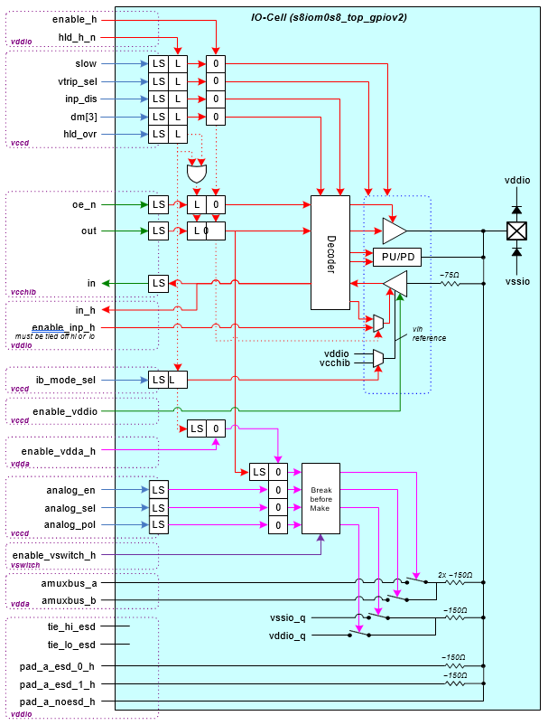

   :cell:`sky130_fd_io__gpiov2` Block Diagram

:cell:`sky130_fd_io__gpiov2` provides all functionality as the original :cell:`sky130_fd_io__gpio` does.
In addition, it provides the following extra features:

-  Improved hysteresis of 10% across the entire supply range in CMOS mode

-  Improved hysteresis of 100mV in LVTTL mode

-  Improvements to meet I2C fall time with a certain minimum bus cap. Support only for Standard and Fast I2C modes. :numref:`sky130_fd_io__gpiov2 output buffer` gives the different output buffer configurations.

-  Supports 1.8V signaling on PAD independent of vddio.

   1. Full spec support for Vcchib ≥ 1.6

   2. Limited functional support down to Vcchib ≥ 1.4 (Deep-sleep mode). 15Mhz CMOS operation.

-  Improvements to the analog mux to support multiple power modes.

-  Low-voltage DFT support (Input buffer runs at lower supply voltage than spec'ed)

Following additional pins have been added to support some of the above features:

-  ``ib_mode_sel:`` This signal is used select between VDDIO and VCCHIB based thresholds (0=VDDIO, 1=VCCHIB)

-  ``enable_vddio:`` This qualifier lets the :cell:`sky130_fd_io__gpio` know that VDDIO is either present (1) or absent (0) in VCCHIB domain. Currently, a skew of 100ns is allowed between ``enable_h`` and ``enable_vddio``

-  ``enable_vswitch_h:`` These qualifiers let the :cell:`sky130_fd_io__gpio` know that VSWITCH is either present (1) or absent (0) in VSWITCH domain

Input Buffer selection for :cell:`sky130_fd_io__gpiov2` is explained below in :numref:`sky130_fd_io__gpiov2 input buffer trip point`:

.. table:: Input Buffer Trip point selection for :cell:`sky130_fd_io__gpiov2`
   :name: sky130_fd_io__gpiov2 input buffer trip point

   +--------+-----------------+---------------+-------------------------+--------------------+
   | Mode   | ``ib_mode_sel`` | ``vtrip_sel`` | Input Buffer Trip Point | Description        |
   +========+=================+===============+=========================+====================+
   | CMOS   | 0               | 0             | 30%/70% of Vddio        | CMOS input buffer  |
   +--------+-----------------+---------------+-------------------------+--------------------+
   | TTL    | 0               | 1             | * VIL=0.8V, Vddio>2.7V  | LVTTL input buffer |
   |        |                 |               | * VIH=2.0V, Vddio>2.7V  |                    |
   +--------+-----------------+---------------+-------------------------+--------------------+
   | VCCHIB | 1               | 0/1           | VIH=1.26V, VIL=0.54V    | Supports 1.8V      |
   |        |                 |               |                         | signaling on PAD   |
   +--------+-----------------+---------------+-------------------------+--------------------+

.. note::
    If :cell:`sky130_fd_io__gpiov2` or :cell:`sky130_fd_io__gpio_ovtv2` is used to catch an external interrupt in hibernate mode, then care must be
    taken to have ``ib_mode_sel`` in logic 0 state before entering low-power modes.

    This is because VCCHIB mode will not work in hibernate mode.

.. table:: :cell:`sky130_fd_io__gpiov2` output buffer configurations
   :name: sky130_fd_io__gpiov2 output buffer

   +---------+----------+------+-------------------+-------------------+---------------------+---------------------------+
   | dm[3]   | ``oe_n`` | slow | Driver PU         | Driver PU         | Driver PD           | Description               |
   |         |          |      | (Rise Time Specs) | (Rise Times- Sch) | (Fall Time Specs)   |                           |
   +=========+==========+======+===================+===================+=====================+===========================+
   | 000/001 | x        | x    | Disabled          | Disabled          | Disabled            | Tri-state                 |
   +---------+----------+------+-------------------+-------------------+---------------------+---------------------------+
   | x       | 1        | x    | Disabled          | Disabled          | Disabled            | Tri-state                 |
   +---------+----------+------+-------------------+-------------------+---------------------+---------------------------+
   | 010     | 0        | 0    | Resistive (5K)    |                   | Strong-Fast         | * WPU                     |
   |         |          |      |                   |                   | (2-12ns)            | * SPD Mode                |
   |         |          |      |                   |                   |                     | * 25pF load               |
   +---------+----------+------+-------------------+-------------------+---------------------+---------------------------+
   | 010     | 0        | 1    | Resistive (5K)    |                   | Strong-Slow         |                           |
   |         |          |      |                   |                   | (10-60ns)           |                           |
   +---------+----------+------+-------------------+-------------------+---------------------+---------------------------+
   | 011     | 0        | 0    | Strong-Fast       |                   | Resistive (5K)      | * SPU                     |
   |         |          |      | (2-12ns)          |                   |                     | * WPD Mode                |
   |         |          |      |                   |                   |                     | * 25pF load               |
   +---------+----------+------+-------------------+-------------------+---------------------+---------------------------+
   | 011     | 0        | 1    | Strong-Slow       |                   | Resistive (5K)      |                           |
   |         |          |      | (10-60ns)         |                   |                     |                           |
   +---------+----------+------+-------------------+-------------------+---------------------+---------------------------+
   | 100     | 0        | 0    | Open-Drain        |                   | Strong-Fast         | * OPD-PU                  |
   |         |          |      |                   |                   | (2-12ns)            | * SPD Mode                |
   |         |          |      |                   |                   |                     | * I2C Standard Mode       |
   |         |          |      |                   |                   |                     | * I2C FS+ Mode            |
   +---------+----------+------+-------------------+-------------------+---------------------+---------------------------+
   | 100     | 0        | 1    | Open-Drain        |                   | I2C Fast Mode       | * I2C Fast Mode           |
   |         |          |      |                   |                   | (6.22/20ns - 250ns) | * Cbus>200pF              |
   |         |          |      |                   |                   |                     | * Rext≥1K                 |
   |         |          |      |                   |                   |                     | * Rext= tr/(0.8463\*Cbus) |
   +---------+----------+------+-------------------+-------------------+---------------------+---------------------------+
   | 101     | 0        | 0    | Strong-Fast       |                   | Open-Drain          | * SPU                     |
   |         |          |      | (2-12ns)          |                   |                     | * OPD-PD Mode             |
   +---------+----------+------+-------------------+-------------------+---------------------+---------------------------+
   | 101     | 0        | 1    | Strong-Slow       |                   | Open-Drain          | * WPU                     |
   |         |          |      | (10-60ns)         |                   |                     | * OPD-PD Mode             |
   +---------+----------+------+-------------------+-------------------+---------------------+---------------------------+
   | 110     | 0        | 0    | Strong-Fast       |                   | Strong-Fast         | * SPU                     |
   |         |          |      | (2-12ns)          |                   | (2-12ns)            | * SPD Mode                |
   +---------+----------+------+-------------------+-------------------+---------------------+---------------------------+
   | 110     | 0        | 1    | Strong-Slow       |                   | Strong-Slow         | * SPU                     |
   |         |          |      | (10-60ns)         |                   | (10-60ns)           | * SPD Mode                |
   +---------+----------+------+-------------------+-------------------+---------------------+---------------------------+
   | 111     | 0        | x    | Resistive (5K)    |                   | Resistive (5K)      | * WPU                     |
   |         |          |      |                   |                   |                     | * WPD Mode                |
   +---------+----------+------+-------------------+-------------------+---------------------+---------------------------+

.. _sky130_fd_io__gpio_ovtv2-additional-features:
:cell:`sky130_fd_io__gpio_ovtv2` Additional Features
~~~~~~~~~~~~~~~~~~~~~~~~~~~~~~~~~~~~~~~~~~~~~~~~~~~~

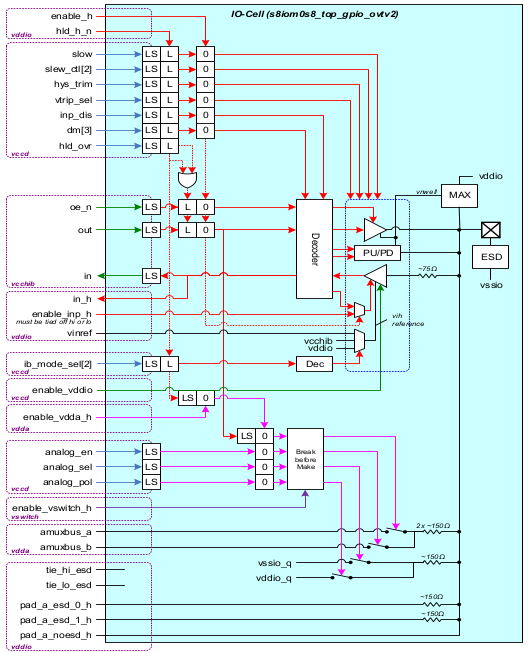

   :cell:`sky130_fd_io__gpio_ovtv2` Block Diagram

:cell:`sky130_fd_io__gpio_ovtv2` provides all functionality as :cell:`sky130_fd_io__gpiov2` does.
In addition, it provides the following extra features

-  Over-voltage tolerant

-  Provides better pull-down drive strength (V:sub:`OL`\ =0.6V @ I\ :sub:`OL`\ =10mA for VDDIO=1.71V)

-  Compliance to I2C standard, fast, fast-plus and high-speed modes

-  Provides selectable trip points feature. Using an internal reference generator, input buffer trip points can be adjusted over a wide range of value. The max frequency of operation is 66MHz when input signaling is greater than 2.2V. When input signaling is between 1.8V and 2.2V, the max frequency is 33 MHz. The minimum value of input signaling for which full functional specs are met is 1.8v.

-  :cell:`sky130_fd_io__gpio_ovtv2` is not critical corner compliant as it uses the MIM cap from :lib:`sky130_fd_pr` library. :cell:`sky130_fd_io__gpio_ovtv2` cannot be placed in corner of the die.

   Following additional pins have been added to support some of the above features:

-  ``ib_mode_sel<1:0>:`` Used to configure input buffer trip points. Refer to :numref:`Input Buffer gpio_ovtv2`

-  ``hys_trim:`` Used to increase hysteresis feedback for input buffer in ``Ref Mode``. Set to ``1`` for input signaling voltage > 2.2V and ``0`` otherwise.

-  ``slew_ctl<1:0>`` : Used to vary slew rate in I2C mode (dm=100). Refer to :numref:`sky130_fd_io__gpio_ovtv2 slew rate control`

-  ``enable_vddio_lv:`` This qualifier lets the :cell:`sky130_fd_io__gpio` know that VDDIO is either present (1) or absent (0) in VCCHIB domain

-  ``enable_vswitch_h:`` This qualifier lets the :cell:`sky130_fd_io__gpio` know that VSWITCH is either present (1) or absent (0) in VSWITCH domain

Feature: Selectable Trip point feature
^^^^^^^^^^^^^^^^^^^^^^^^^^^^^^^^^^^^^^

The input buffer in :cell:`sky130_fd_io__gpio_ovtv2` supports the following modes as given in :numref:`Input Buffer gpio_ovtv2` below:

.. table:: Input Buffer modes in :cell:`sky130_fd_io__gpio_ovtv2` and their description
   :name: Input Buffer gpio_ovtv2

   +--------+-----------------+---------------+-----------------------------+-------------------------------------------+
   | Mode   | ``ib_mode_sel`` | ``vtrip_sel`` | Input Buffer Trip Point     | Description                               |
   |        | <1:0>           |               |                             |                                           |
   +========+=================+===============+=============================+===========================================+
   | CMOS   | 00              | 0             | 30%/70% of Vddio            | CMOS input buffer                         |
   |        |                 |               |                             |                                           |
   +--------+-----------------+---------------+--------------+--------------+-------------------------------------------+
   | TTL    | 00              | 1             | * VIL=0.8V   | * VIH=2.0V   | LVTTL input buffer                        |
   |        |                 |               | * Vddio>2.7V | * Vddio>2.7V |                                           |
   +--------+-----------------+---------------+--------------+--------------+-------------------------------------------+
   | VCCHIB | 01              | 0/1           | * VIH=1.26V                 | Supports 1.8V signalling on PAD           |
   |        |                 |               | * VIL=0.54V                 |                                           |
   +--------+-----------------+---------------+-----------------------------+-------------------------------------------+
   | Ref    | 10/11           | 0/1           | 30%/70% of ``vinref``       | * vinref = VDDIO\*(13n+184)/600           |
   |        |                 |               |                             | * This feature works in conjunction with: |
   |        |                 |               |                             | * ::cell:`sky130_fd_io__top_gpiovrefv2`   |
   |        |                 |               |                             | * ::cell:`sky130_fd_io__top_vrefcapv2`    |
   +--------+-----------------+---------------+-----------------------------+-------------------------------------------+

.. table:: :cell:`sky130_fd_io__gpio_ovtv2` Slew rate control with slow and ``slew_ctl<1:0>``
   :name: sky130_fd_io__gpio_ovtv2 slew rate control

   +-------+----------+------+--------------+-------------------+-------------------------------------------+---------------+
   | dm[3] | ``oe_n`` | slow | ``slew_ctl`` | Driver PU         | Driver PD (Fall Time Specs)               | Description   |
   |       |          |      | [2]          | (Fall Time Specs) |                                           |               |
   +=======+==========+======+==============+===================+===========================================+===============+
   | * 000 | x        | x    | x            | Disabled          | Disabled                                  | Tri-state     |
   | * 001 |          |      |              |                   |                                           |               |
   +-------+----------+------+--------------+-------------------+-------------------------------------------+---------------+
   | x     | 1        | x    | x            | Disabled          | Disabled                                  | Tri-state     |
   +-------+----------+------+--------------+-------------------+-------------------------------------------+---------------+
   | 010   | 0        | 0    | x            | Resistive (5K)    | Strong-Fast  (2-12ns)                     | * WPU         |
   +-------+----------+------+--------------+-------------------+-------------------------------------------+ * SPD Mode    |
   | 010   | 0        | 1    | x            | Resistive (5K)    | Strong-Slow  (10-60ns)                    | * 25pF load   |
   +-------+----------+------+--------------+-------------------+-------------------------------------------+---------------+
   | 011   | 0        | 0    | x            | Strong-Fast       | Resistive (5K)                            | * SPU         |
   |       |          |      |              | (2-12ns)          |                                           |               |
   +-------+----------+------+--------------+-------------------+-------------------------------------------+ * WPD Mode    |
   | 011   | 0        | 1    | x            | Strong-Slow       | Resistive (5K)                            | * 25pF load   |
   |       |          |      |              | (10-60ns)         |                                           |               |
   +-------+----------+------+--------------+-------------------+-------------------------------------------+---------------+
   | 100   | 0        | 0    | x            | Open-Drain        | Strong-Fast  (2-12ns)                     | * OPD-PU      |
   |       |          |      |              |                   |                                           | * SPD Mode    |
   +-------+----------+------+--------------+-------------------+-------------------------------------------+---------------+
   | 100   | 0        | 1    | 11           | Open-Drain        | * HS mode (Vext=<2.8, F=1.7MHz) (10-80ns) | To be used in |
   |       |          |      |              |                   | * FS+ mode, Vext<=2.8V (20-120ns)         | I2C mode      |
   |       |          |      +--------------+                   +-------------------------------------------+               |
   |       |          |      | 01           |                   | * HS mode (Vext>2.8, F=1.7MHz) (10-80ns)  |               |
   |       |          |      |              |                   | * FS+ mode, Vext>2.8 (20-120ns)           |               |
   |       |          |      +--------------+                   +-------------------------------------------+               |
   |       |          |      | 10           |                   | HS mode (Vext<3.3) (20-160ns)             |               |
   |       |          |      +--------------+                   +-------------------------------------------+               |
   |       |          |      | 00           |                   | * HS mode (Vext>3.0)                      |               |
   |       |          |      |              |                   | * FS mode (20-160ns)                      |               |
   +-------+----------+------+--------------+-------------------+-------------------------------------------+---------------+
   | 101   | 0        | 0    | x            | Strong-Fast       | Open-Drain                                | * SPU         |
   |       |          |      |              | (2-12ns)          |                                           | * OPD-PD Mode |
   +-------+----------+------+--------------+-------------------+-------------------------------------------+---------------+
   | 101   | 0        | 1    | x            | Strong-Slow       | Open-Drain                                | * WPU         |
   |       |          |      |              | (10-60ns)         |                                           | * OPD-PD Mode |
   +-------+----------+------+--------------+-------------------+-------------------------------------------+---------------+
   | 110   | 0        | 0    | x            | Strong-Fast       | Strong-Fast  (2-12ns)                     | * SPU         |
   |       |          |      |              | (2-12ns)          |                                           | * SPD Mode    |
   +-------+----------+------+--------------+-------------------+-------------------------------------------+---------------+
   | 110   | 0        | 1    | x            | Strong-Slow       | Strong-Slow  (10-60ns)                    | * SPU         |
   |       |          |      |              | (10-60ns)         |                                           | * SPD Mode    |
   +-------+----------+------+--------------+-------------------+-------------------------------------------+---------------+
   | 111   | 0        | x    | x            | Resistive (5K)    | Resistive (5K)                            | * WPU         |
   |       |          |      |              |                   |                                           | * WPD Mode    |
   +-------+----------+------+--------------+-------------------+-------------------------------------------+---------------+

.. _sky130_fd_io__sio-additional-features:
:cell:`sky130_fd_io__sio` Additional Features
~~~~~~~~~~~~~~~~~~~~~~~~~~~~~~~~~~~~~~~~~~~~~

The block diagram for Special I/O (:cell:`sky130_fd_io__sio`) macro is shown below in :numref:`sky130_fd_io__sio_macro block diagram`

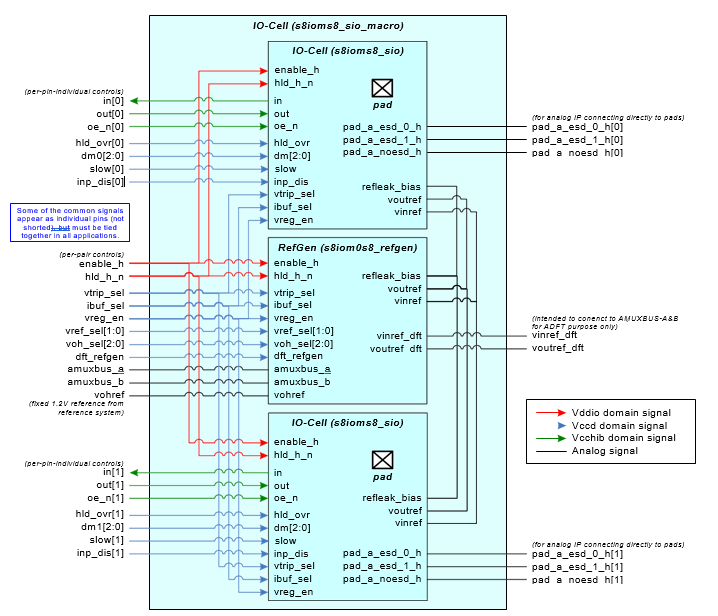

   Block diagram of :cell:`sky130_fd_io__sio_macro`

The :cell:`sky130_fd_io__sio_macro` consists of 2 :cell:`sky130_fd_io__sio` cells (:numref:`sky130_fd_io__top_sio block diagram`) and a Reference generator cell.
The :cell:`sky130_fd_io__sio` cells are ONLY available as pairs.
The block diagram of :cell:`sky130_fd_io__sio` is shown below in :numref:`sky130_fd_io__top_sio block diagram`.
Note that dm[3] denotes a 3 bit bus dm[2:0].
These notations are used interchangeably in the document.

1. I/O-Cell :cell:`sky130_fd_io__sio`

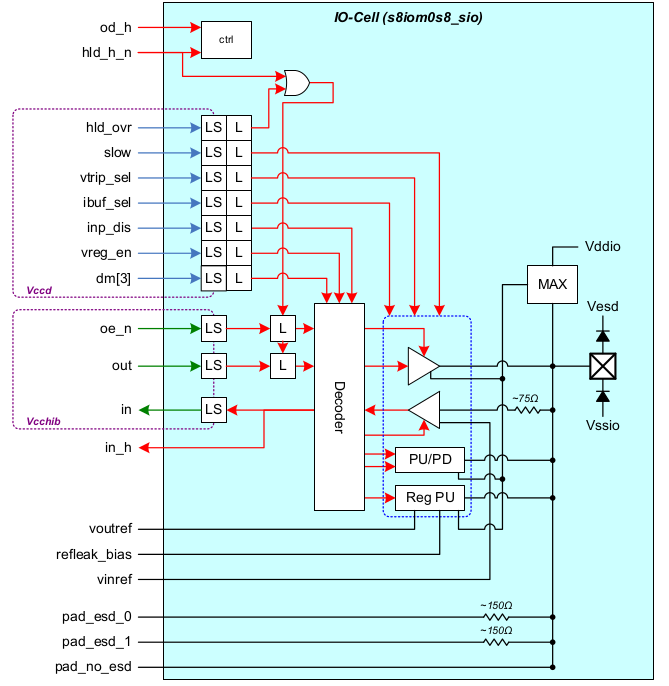

   Block diagram for :cell:`sky130_fd_io__top_sio`

The :cell:`sky130_fd_io__sio` provides the following additional features over the :cell:`sky130_fd_io__gpio`:

-  Regulated output buffer

-  Differential input buffer

The :cell:`sky130_fd_io__sio` cell adds a differential input buffer and a means for controlling or regulating the output buffer output high voltage level (Voh).
The :cell:`sky130_fd_io__sio` cell has two additional control inputs (``vreg_en``, ``ibuf_sel``), and an input buffer reference voltage (``vinref``), and an output buffer
reference voltage (``voutref``).
The added control inputs are used to select the input buffer type (single ended or differential) and output buffer type (CMOS or regulated).
The input buffer configuration is selected based on the state of the ``ibuf_sel`` control input.
If this signal is low the standard single ended (:cell:`sky130_fd_io__gpio`) input buffer is selected, otherwise the differential input buffer is
selected.

The following tables 13 and 14 describe the :cell:`sky130_fd_io__sio` cell configurations based on the added control signals.

.. table:: :cell:`sky130_fd_io__sio` Input Buffer Truth Table
   :name: sio Input Buffer

   +--------------+--------------+-------------+---------------+------------------+--------------------+
   | ``ibuf_sel`` | ``Vref_sel`` | ``voh_sel`` | ``vtrip_sel`` | Trip Point       | Description        |
   |              | [1:0]        | [2:0]       |               | (Vinref)         |                    |
   +==============+==============+=============+===============+==================+====================+
   | 0            | X            | X           | 0             | 30% / 70%        | CMOS input buffer  |
   |              |              |             |               |                  | w/wo Hysteresis    |
   +--------------+--------------+-------------+---------------+------------------+--------------------+
   | 0            | X            | X           | 1             | * min (0.8V,30%) | LVTTL input buffer |
   |              |              |             |               | * min (2.0V,70%) | w/wo Hysteresis    |
   +--------------+--------------+-------------+---------------+------------------+--------------------+
   | 1            | 00           | X           | 0             | 50% of vddio     | Differential input |
   |              |              |             |               |                  | buffer             |
   +--------------+--------------+-------------+---------------+------------------+--------------------+
   | 1            | 00           | X           | 1             | 40% of vddio     | Differential input |
   |              |              |             |               |                  | buffer             |
   +--------------+--------------+-------------+---------------+------------------+--------------------+
   | 1            | 01           | 000         | 0             | 0.5 \* Vohref    | Differential input |
   |              |              |             |               |                  | buffer             |
   +--------------+--------------+-------------+---------------+------------------+--------------------+
   | 1            | 01           | 000         | 1             | Vohref           | Differential input |
   |              |              |             |               | (buffered)       | buffer             |
   +--------------+--------------+-------------+---------------+------------------+--------------------+
   | 1            | 10/11        | 000         | 0             | 0.5 \*           | Differential input |
   |              |              |             |               | ``amuxbus_a/b``  | buffer             |
   +--------------+--------------+-------------+---------------+------------------+--------------------+
   | 1            | 10/11        | 000         | 1             | ``amuxbus_a/b``  | Differential input |
   |              |              |             |               | (buffered)       | buffer             |
   +--------------+--------------+-------------+---------------+------------------+--------------------+

The ``vreg_en`` control input selects the output buffer configuration.
If this signal is low the standard CMOS (:cell:`sky130_fd_io__gpio`) output configuration is selected.
The regulated output configuration is selected ONLY if the dm<2:0> bits are correctly set to the strong pull up configuration.
If the dm bits are set to any other configuration other than strong pull up, the regulated output buffer will be disabled, and the standard CMOS
output buffer would take over.

.. table:: :cell:`sky130_fd_io__sio` Output Buffer Truth Table
   :name: sio Output Buffer

   +-------------+------+--------------+-------------+--------------------+---------------------------------------+
   | ``Vreg_en`` | slow | ``Vref_seL`` | ``Voh_sel`` | Voutref for o/p    | Description                           |
   |             |      | [1:0]        | [2:0]       | buffer             |                                       |
   +=============+======+==============+=============+====================+=======================================+
   | 0           | 0    | X            | X           | vohref             | * Output driver in CMOS mode          |
   |             |      |              |             |                    | * Max slew rate                       |
   +-------------+------+--------------+-------------+--------------------+---------------------------------------+
   | 0           | 1    | X            | X           | vohref             | * Output driver in CMOS mode          |
   |             |      |              |             |                    | * Reduced slew rate                   |
   +-------------+------+--------------+-------------+--------------------+---------------------------------------+
   | 1           | 0    | 00/01        | [0-7]       | Refer to           | * Output driver in Regulate mode      |
   |             |      |              |             | :numref:`voh sel` | * VOH is vohref based                 |
   +-------------+------+--------------+-------------+--------------------+---------------------------------------+
   | 1           | 0    | 10/11        | [0-7]       | Refer to           | * Output driver in Regulate mode      |
   |             |      |              |             | :numref:`voh sel` | * VOH  is ``amuxbus_a/b`` based.      |
   +-------------+------+--------------+-------------+--------------------+---------------------------------------+
   | 1           | 1    | 00/01        | [0-7]       | Refer to           | * Output driver in Regulate slow mode |
   |             |      |              |             | :numref:`voh sel` | * VOH is vohref based.                |
   +-------------+------+--------------+-------------+--------------------+---------------------------------------+
   | 1           | 1    | 10/11        | [0-7]       | Refer to           | * Output driver in Regulate slow mode |
   |             |      |              |             | :numref:`voh sel`  | * VOH is ``amuxbus_a/b`` based.       |
   +-------------+------+--------------+-------------+--------------------+---------------------------------------+

Note: The ``voh_sel[2:0]`` combinations are found in the :numref:`voh sel`

Notice that the input buffer and output buffer configurations can be selected independently.
For example, the standard single-ended input buffer and the regulated output buffer can be selected.

.. _sky130_fd_io__refgen-features:
:cell:`sky130_fd_io__refgen` (Reference Generator) Features
~~~~~~~~~~~~~~~~~~~~~~~~~~~~~~~~~~~~~~~~~~~~~~~~~~~~~~~~~~~

The block diagram of :cell:`sky130_fd_io__refgen` used in :cell:`sky130_fd_io__sio_macro` is shown below in :numref:`sky130_fd_io__refgen block diagram`:

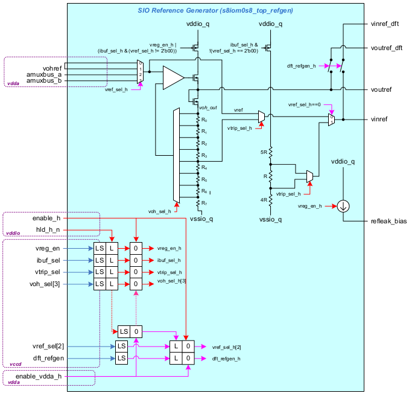

   Block diagram for :cell:`sky130_fd_io__refgen`

The :cell:`sky130_fd_io__refgen` block :cell:`sky130_fd_io__top_refgen` is an opamp connected in negative feedback loop configuration to generate the output
reference voltage ``voutref``.
The input to the opamp (vref) can be selected from any of the three input references (vohref, ``amuxbus_a`` or ``amuxbus_b`` ).
The input reference is selected based on the control input ``vref_sel[1:0]`` (:numref:`io drive strength modes`).
The voltage voutref is ``voh_out+Vgs`` (diode-connected nFET).
In the Regulated Output Buffer, the voltage voutref is applied to the gate of a nFET (of the same type as the diode-connected nFET used to generate
the voutref signal) and the output is the source of that nFET.

Consequently, this configuration compensates for the V\ :sub:`GS` voltage drop of the source follower in the Regulated Output Buffer circuit and
allows its output to be pulled to the desired V\ :sub:`OH` voltage level, nominally equal to vohref value.
The actual V\ :sub:`OH` level and its tolerance relative to the vohref voltage depends on the output current load conditions.
The acceptable variation in V\ :sub:`OH`-vohref tolerance versus output current load is specified in DC Specification tables.
For a given input reference, vref, the value of voutref can varied by selecting different tap point from the resistive divider in the feedback path
(:numref:`sky130_fd_io__refgen block diagram`).
The resistors are not equal in value and are skewed to generate standard voltages (1.2, 1.5, 1.8, 2, 2.5, 3.3, 4.8), when the bandgap voltage (1.2V)
is connected to vohref.
This selection is based on the select signals , ``voh_sel[2:0]`` (:numref:`voh sel`).
The output regulated value ``(voh_out)`` equals ``vref/n``, where n=Rtap/Rtotal (:numref:`voh sel`).

.. table:: Input Reference selection
   :name: input reference selection

   +--------------+---------------+
   | ``Vref_sel`` | Ref.Selected  |
   | [1:0]        |               |
   +==============+===============+
   | 00           | Vohref        |
   +--------------+---------------+
   | 01           | Vohref        |
   +--------------+---------------+
   | 10           | ``amuxbus_a`` |
   +--------------+---------------+
   | 11           | ``amuxbus_b`` |
   +--------------+---------------+

Note: The voltage range for the analog reference inputs ``(vref/amuxbus_a/amuxbus_b)`` is 1.0-4.6V and is dependent on the I/O supply, shown in :numref:`analog reference input` below.

.. table:: Analog Reference Input
   :name: analog reference input

   +-------------------------+--------------------------------+
   | I/O Supply (vddio)      | analog input to reference      |
   |                         | ``(vref/amuxbus_a/amuxbus_b)`` |
   +=========================+================================+
   | 1.65V <= vddio < = 3.7V | 1 - (vddio-0.5)                |
   +-------------------------+--------------------------------+
   | 3.7V< vddio <= 5.6V     | 1 - (vddio-1)                  |
   +-------------------------+--------------------------------+

.. table:: V\ :sub:`OH` reference selection
   :name: voh sel

   +------------------+-----------------+
   | ``voh_sel[2:0]`` | n = Rtap/Rtotal |
   +==================+=================+
   | 000              | 1               |
   +------------------+-----------------+
   | 001              | 0.8             |
   +------------------+-----------------+
   | 010              | 0.67            |
   +------------------+-----------------+
   | 011              | 0.6             |
   +------------------+-----------------+
   | 100              | 0.48            |
   +------------------+-----------------+
   | 101              | 0.4             |
   +------------------+-----------------+
   | 110              | 0.36            |
   +------------------+-----------------+
   | 111              | 0.25            |
   +------------------+-----------------+

Note:

-  All the ``voh_sel[2:0]`` values cannot be selected for entire reference range (1V-4.6V). The upper value on VOH is limited to ``Vddio_q - 400mV``.

-  The resistors are not equal in value and are skewed to generates standard voltages (1.2, 1.5, 1.8, 2, 2.5, 3.3, 4.8), when band-gap voltage (1.2V) is connected to vref.

The input buffer reference ``vinref`` can be derived from four sources: vinref, half of ``voh_out``, and 40% or 50% of the I/O supply voltage ``vcc_io``.
The ``vinref`` voltage level selected is based on the input buffer voltage trip point select ``vtrip_sel`` and voltage reference select ``vref_sel``
control inputs.

The truth tables for :cell:`sky130_fd_io__refgen` are shown in :numref:`sky130_fd_io__sio input buffer voltage` and :numref:`sky130_fd_io__refgen truth table`.

Important notes about :cell:`sky130_fd_io__sio` macro:

-  Each pair of :cell:`sky130_fd_io__sio`'s share a single RefGen block. This block allows for the generation of a ``regulated mode`` selectable input buffer trip point and output driver level.

-  The I/Os retain the ability to disable the input buffer for I/O's with an active analog function. For :cell:`sky130_fd_io__sio`'s not connected to any analog component this input must be tied off.

-  The input reference (Vohref) to the RefGen block is assumed to be 1.2V.

-  The RefGen block also connects to ``amuxbus_a`` and ``amuxbus_b`` for reference generation. Use case: An external pin as reference voltage.

-  Regulated output buffer mode and differential input buffer mode cannot be used in low-power modes where VCCD is unavailable. It is the responsibility of firmware to ensure that the :cell:`sky130_fd_io__sio` is not configured in these modes before entering low-power modes.

-  If :cell:`sky130_fd_io__sio_macro` is being used as an I2C pin to drive SDA, the following configuration bits need to be set (CMOS input buffer and open-drain output)—The configuration bits are given w.r.t a single :cell:`sky130_fd_io__sio`

   -  dm<2:0>=100 (To enable the 20mA driver (I2C FS+ mode and input buffer)

   -  ``ibuf_sel=0`` (To enable the SE buffer)

   -  ``inp_dis=0`` (To enable input buffer)

   -  ``vtrip_sel=0`` (To enable CMOS input buffer mode)

-  All other control signals are don't care. The refgen can be disabled when :cell:`sky130_fd_io__sio_macro` is used for I2C ``(vreg_en_refgen=0)``

.. table:: Valid :cell:`sky130_fd_io__sio` Differential Input Buffer Reference Voltage
   :name: sky130_fd_io__sio input buffer voltage

   +--------------+---------------+--------------------+
   | ``Vref_sel`` | ``vtrip_sel`` | Vinref             |
   | <1:0>        |               |                    |
   +==============+===============+====================+
   | 00           | 0             | 0.5 \* ``vcc_io``  |
   +--------------+---------------+--------------------+
   | 00           | 1             | 0.4 \* ``vcc_io``  |
   +--------------+---------------+--------------------+
   | 01           | 0             | 0.5 \* ``voh_out`` |
   +--------------+---------------+--------------------+
   | 01           | 1             | vref               |
   +--------------+---------------+--------------------+
   | 10           | 0             | 0.5 \* ``voh_out`` |
   +--------------+---------------+--------------------+
   | 10           | 1             | vref               |
   +--------------+---------------+--------------------+
   | 11           | 0             | 0.5 \* ``voh_out`` |
   +--------------+---------------+--------------------+
   | 11           | 1             | vref               |
   +--------------+---------------+--------------------+

.. table:: :cell:`sky130_fd_io__refgen` Truth Table
   :name: sky130_fd_io__refgen truth table

   +--------+-------------+--------------+--------------+---------+--------+
   | vohref | ``vreg_en`` | ``ibuf_sel`` | ``vref_sel`` | voutref | vinref |
   |        |             |              | <1:0>        |         |        |
   +========+=============+==============+==============+=========+========+
   | X      | 0           | 0            | X            | Hi-Z    | Hi-Z   |
   +--------+-------------+--------------+--------------+---------+--------+
   | 1      | 0           | 1            | 00           | Hi-Z    | 1      |
   +--------+-------------+--------------+--------------+---------+--------+
   | 1      | 0           | 1            | 01,10,11     | 1       | 1      |
   +--------+-------------+--------------+--------------+---------+--------+
   | 1      | 1           | 0            | 00,01        | 1       | Hi-Z   |
   +--------+-------------+--------------+--------------+---------+--------+
   | X      | 1           | 0            | XX           | 1       | Hi-Z   |
   +--------+-------------+--------------+--------------+---------+--------+
   | 1      | 1           | 1            | 00,01        | 1       | 1      |
   +--------+-------------+--------------+--------------+---------+--------+
   | X      | 1           | 1            | 10,11        | 1       | 1      |
   +--------+-------------+--------------+--------------+---------+--------+

Use of ``dft_refgen`` for ADFT purpose:

-  The :cell:`sky130_fd_io__refgen` block produces two references to be used in the :cell:`sky130_fd_io__sio_macro`. ``vinref`` is the reference to the differential input buffer and ``voutref`` is the reference to the regulated output buffer.

-  In order to have 100% ADFT coverage, these two references are bought out to the interface of the :cell:`sky130_fd_io__sio_macro`. By enabling ``dft_refgen``, these two outputs of refgen can be observed on ``vinref_dft`` and ``voutref_dft``. In order to observe these two pins on any :cell:`sky130_fd_io__gpio` pins, these two pins need to be hooked to the analog busses and bought to any :cell:`sky130_fd_io__gpio` pad through the AMUXBUS inside the :cell:`sky130_fd_io__gpio`.

:cell:`sky130_fd_io__gpio_vrefv2` (Reference generator for Selectable trip point input buffer) Features
~~~~~~~~~~~~~~~~~~~~~~~~~~~~~~~~~~~~~~~~~~~~~~~~~~~~~~~~~~~~~~~~~~~~~~~~~~~~~~~~~~~~~~~~~~~~~~~~~~~~~~~

This cell provides a reference (``vinref``) to the selectable trip point buffer in :cell:`sky130_fd_io__gpio_ovtv2`.
This reference generator is a low-leakage resistive ladder whose tap points are selected based on the signaling required at the
:cell:`sky130_fd_io__gpio_ovtv2` pad.
The block diagram is shown below in :numref:`sky130_fd_io__gpio_vrefv2 block diagram`.
Note ref_sel[5] denotes a 5 bit bus ``ref_sel[4:0].``
These notations are used interchangeably in the document.

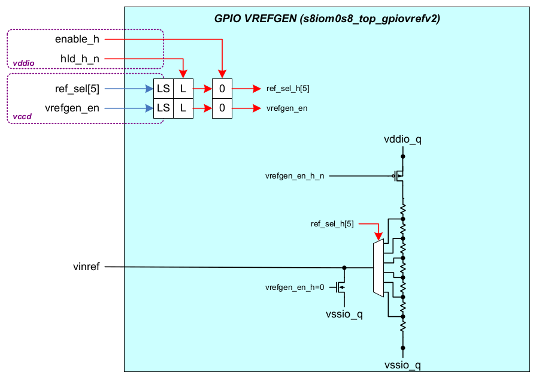

   :cell:`sky130_fd_io__gpio_vrefv2` Block Diagram

The reference selection is based on the signaling range that needs to be at the PAD.
For this to work, the external signaling range must be lower than VDDIO.
The tap point selection is based on the formula:

vinref = (13n+184)\*VDDIO/600

-  Where vinref represents the input signaling voltage at :cell:`sky130_fd_io__gpio_ovtv2` pad

-  VDDIO is the supply voltage to the :cell:`sky130_fd_io__gpio`

-  ``n`` is the tap point selection that gives us required vinref. Binary coding of ``n`` is ``ref_sel<4:0>.`` ``n`` should be chosen such that ``vinref`` is greater than 1.8V

   For example:

   -  Need to support 1.8V (vinref) signaling on PAD with VDDIO=5.0V. Plugging these numbers into the equation yields:

      1.8 = (13n+184)\*5.0/600

      n= 2.46

   -  As n=2.46, ``ref_sel<4:0>`` can be selected as either 2 (5'b00010) or 3 (5'b00011). This would give out a reference of ``1.75V`` and ``1.858V`` respectively.

   -  Use a ceiling on ``n`` i.e. if n=2.46, use n=3 instead of n=2.

::cell:`sky130_fd_io__top_vrefcapv2` Features
~~~~~~~~~~~~~~~~~~~~~~~~~~~~~~~~~~~~~~~~~~~~~

This cell contains a unit capacitance (4pF) that is intended to be placed on the ``vinref`` node that goes to multiple :cell:`sky130_fd_io__gpio_ovtv2`
cells.
This is a filter cap used to suppress kick-back noise from the input buffers.
The usage is shown below in :numref:`sky130_fd_io__top_vrefcapv2 block diagram`:

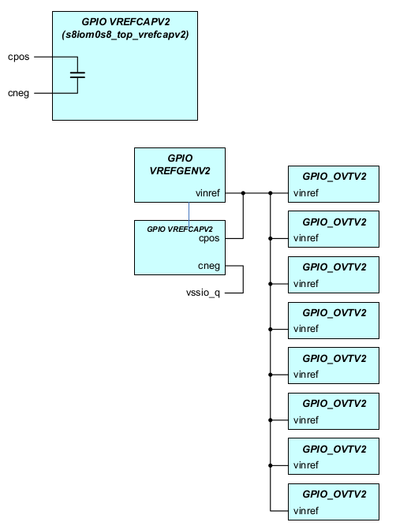

   :cell:`sky130_fd_io__top_vrefcapv2`

:cell:`sky130_fd_io__top_amuxsplitv2` Features
~~~~~~~~~~~~~~~~~~~~~~~~~~~~~~~~~~~~~~~~~~~~~~

The amux splitter cell is designed to provide large chips (with large number of :cell:`sky130_fd_io__gpio`'s) to break the analog mux into multiple segments.
This cell is capable of grounding, disconnecting or feeding through each amuxbus.
The block diagram is shown below in :numref:`sky130_fd_io__top_amuxsplitv2 block diagram`.

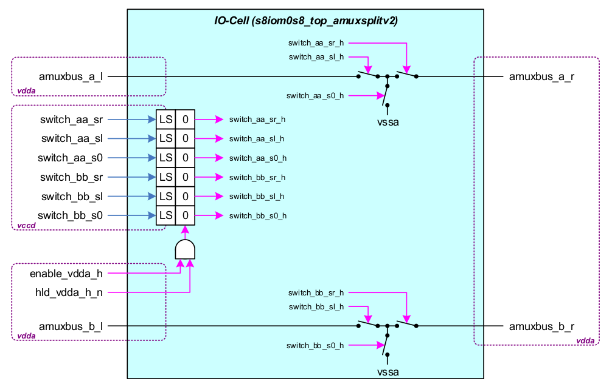

   Block diagram of :cell:`sky130_fd_io__top_amuxsplitv2`

Each T-switch has 3 control signals coming to control the state of the switches.
These are expected to be static switches.
During power-up ``(enable_vdda_h=0)`` and low-power modes ``(hld_vdda_h_n=0),`` the switches of the amux splitter are open.

General guidelines for the T-switch: Break before make logic that needs to be followed when working with the switch control signals.
For example - when ``amux_a_l`` and ``amux_a_r`` are Independent, the mid-node of the switch needs to be closed to prevent unwanted coupling between the
two amuxbus's.
When connecting ``amux_a_l`` and ``amux_a_r`` care must be taken to disconnect the mid-node and then close the right and left switch.

.. _pg-pads:
PG pads (ESD)
~~~~~~~~~~~~~

The I/O library consists of Power (P) and Ground (G) pads that have RC ESD clamps embedded in them.
There are two types of RC ESD clamps that are present in these PG pads.

-  HV clamp- Only one HV (High Voltage) clamp is present underneath the PG pads whose terminals can be connected independently without interfering with the PG connections

-  LV clamp- Two LV (Low Voltage) clamps and a B2B (back 2 back) diode can be accommodated underneath the PG pads. The two LV clamps have a total of six terminals that can be tied according to chip-level needs. The B2B however should be connected to the source/body of LV clamp1 and another independent ground node ``(bdy_b2b).``

A layout variant of the HV clamp without pad is :cell:`sky130_fd_io__top_hvclamp_wopadv2`.
This is a derivative of :cell:`sky130_fd_io__top_hvclamp_wopad` with following changes:

-  Vssd pin added: P-substrate connection

-  HV clamp gate connection improved.

-  HV clamp source/drain connection improved.

Two additional pad cells to be used for power and ground connections added, namely:

-  :cell:`sky130_fd_io__top_power_padonlyv2`

-  :cell:`sky130_fd_io__top_ground_padonlyv2`

These are only M4/M5 pad structures with a short element.
They are used to provide pad structure/connection to wopad clamps.

Integration Guidelines
^^^^^^^^^^^^^^^^^^^^^^

All power and ground pads have the I/O bussing running through them in M5/M4, thereby forming an I/O ring when abutted to each other.
The power and ground pads can be abutted to either the :cell:`sky130_fd_io__gpio` or the :cell:`sky130_fd_io__sio_macro`.

The Power and Ground pads are designed in such a way that one side of it is full DRC complaint to any :cell:`sky130_fd_io__gpio` or :cell:`sky130_fd_io__sio_macro` that abuts it.
However due to limited area constraints, the other side cannot be abutted directly to a :cell:`sky130_fd_io__gpio`/:cell:`sky130_fd_io__sio_macro`.
This puts a restriction that 2 pads (power/ground) should be paired to build the I/O ring.

ESD design details
~~~~~~~~~~~~~~~~~~

The architecture for the RC ESD clamps trigger circuit is the simple one-time constant RC trigger circuit.
For the over-voltage tolerant :cell:`sky130_fd_io__sio`, use ESD rail clamp :cell:`sky130_fd_io__top_hvclamp_wopad_sio`.

The HV and LV RC ESD clamps are robust up to 3.3KV HBM.

ESD HV RC ESD Clamp design

-  Single trigger - 2us time constant

-  Driver width of 2880 um was used

-  Cell height the same as the :cell:`sky130_fd_io__gpio`

Usage of Outer Guard ring Connection (OGC) in ESD HV and LV clamps for :lib:`sky130_fd_io`
^^^^^^^^^^^^^^^^^^^^^^^^^^^^^^^^^^^^^^^^^^^^^^^^^^^^^^^^^^^^^^^^^^^^^^^^^^^^^^^^^^^^^^^^^^

Power and Ground pads in :lib:`sky130_fd_io` library come along with ESD HV and LV clamps embedded within them.
All the ESD clamps are independent of the power or ground pads providing maximum flexibility, thereby making the end user make proper connections to
the ESD clamps.
The end user chip lead is the best-informed person about making these connections and must approve all the ESD connections.

One of the clamp connections is the outer guard ring connection ``(ogc_hvc/ogc_lvc).``
The basic purpose of this is to connect the outer guard ring (deep nwell) to provide noise isolation.
The recommended usage of this is to connect it to a HV supply that is available all/most of the time.

Bottlenecks during implementation: The power and ground pads that contain the ESD clamps have a number of pins coming to the boundary interface.
In order to minimize the resistance inside the cell to these ESD clamps, some of the ``ogc_\*`` connections are floated and connected internally to
VDDIO.

The following :numref:`ogc connection` lists the different cells in :lib:`sky130_fd_io` library that have this ``ogc_\*`` connection and the recommended way to connect them.

.. table:: OGC connection and Usage
   :name: ogc connection

   +------+---------------------------------------------+-------------+---------------------------------------------+
   | S.No | Public Cell                                 | Internally  | Recommended connection to end user          |
   |      |                                             | connected?  |                                             |
   +======+=============================================+=============+=============================================+
   | 1    | :cell:`sky130_fd_io__top_power_hvc_wpad`    | YES (VDDIO) | No need to connect                          |
   +------+---------------------------------------------+-------------+---------------------------------------------+
   | 2    | :cell:`sky130_fd_io__top_ground_hvc_wpad`   | YES (VDDIO) | No need to connect                          |
   +------+---------------------------------------------+-------------+---------------------------------------------+
   | 3    | :cell:`sky130_fd_io__top_power_lvc_wpad`    | YES (VDDIO) | No need to connect                          |
   +------+---------------------------------------------+-------------+---------------------------------------------+
   | 4    | :cell:`sky130_fd_io__top_ground_lvc_wpad`   | YES (VDDIO) | No need to connect                          |
   +------+---------------------------------------------+-------------+---------------------------------------------+
   | 5    | :cell:`sky130_fd_io__top_hvclamp_wopad`     | NO          | Connect to HV Supplythat is always present  |
   +------+---------------------------------------------+-------------+---------------------------------------------+
   | 6    | :cell:`sky130_fd_io__top_lvclamp_b2b_wopad` | NO          | Connect to HV Supply that is always present |
   |      |                                             |             | (Outer guard ring is HV rules compliant)    |
   +------+---------------------------------------------+-------------+---------------------------------------------+
   | 7    | :cell:`sky130_fd_io__top_lvclamp`           | NO          | Connect to HV Supply that is always present |
   |      |                                             |             | (Outer guard ring is HV rules compliant)    |
   +------+---------------------------------------------+-------------+---------------------------------------------+

XRES
~~~~

The XRES cell is a macro that is used to influence the internal system wide reset.
The purpose of this cell is to provide a noise free signal from the input buffer to the core.
Any glitch of 50ns or less on the XRES pad is rejected by the XRES macro.

The XRES cell (:cell:`sky130_fd_io__top_xres`, :cell:`sky130_fd_io__top_xres_2`) is a cell that integrates the input buffer from the :cell:`sky130_fd_io__gpio` and an HV RC
filter.
It also has a 5k weak pull up on the XRES pad.

The XRES cell has two outputs, out (LV) and ``out_h`` (HV).
The HV output will be functional even when the LV supply to the input buffer is gone (STOP mode).

There are 5 variants of XRES cells in :lib:`sky130_fd_io` IP:

1. :cell:`sky130_fd_io__top_xres` and :cell:`sky130_fd_io__top_xres_2`

The two versions are the same except for layout differences.

2. :cell:`sky130_fd_io__top_xres2v2`

This cell is essentially a copy of the current :cell:`sky130_fd_io__top_xres_2` cell.
One minor layout modification is made to this cell which is to make the height of the new cell=200u (:cell:`sky130_fd_io__top_xres_2` has 198u height).
No change in functionality compared to current :cell:`sky130_fd_io__top_xres_2`.

.. figure:: figures/sky130_fd_io__xres2v2.png
   :name: sky130_fd_io__top_xres2v2 block diagram
   :width: 3.21875in
   :height: 1.47917in

   :cell:`sky130_fd_io__top_xres2v2`

3. :cell:`sky130_fd_io__top_xres3v2`

This cell is also a copy of the :cell:`sky130_fd_io__top_xres_2` cell but with the pull-up disabled.
(I.e.
pull-up metal connection will be cut).

There is a metal option provided to connect the pullup back on if required.
This requires 2 extra pins in this cell.

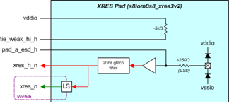

   :cell:`sky130_fd_io__top_xres3v2`

4. :cell:`sky130_fd_io__top_axresv2`

Glitch filter to filter out pulses less than 50ns pulse width.
This glitch filter currently resides inside of the xres cells.
In order to provide more flexibility, the glitch filter portion of the existing xres cell will be copied into this new public cell.

Pull-up cell to connect the pad to the power supply (vddio) through a 5k ohm resistor.
A control bit ``(disable_pullup_h)`` is used to enable/disable the pull-up.

   :cell:`sky130_fd_io__top_axresv2`

Use case for the XRES cells
^^^^^^^^^^^^^^^^^^^^^^^^^^^

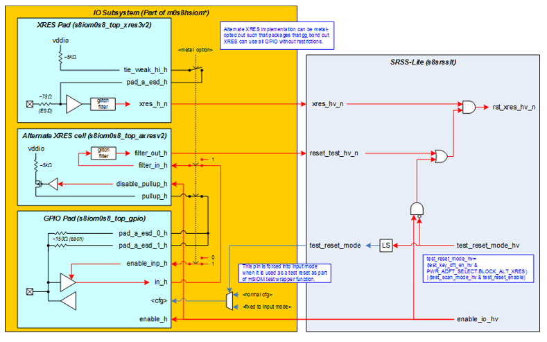

   Use case for the XRES cells

Usage guidelines on when to use the different cells:

:cell:`sky130_fd_io__top_xres`:
^^^^^^^^^^^^^^^^^^^^^^^^^^^^^^^

The first XRES cell :cell:`sky130_fd_io__top_xres` can ONLY be abutted to the :cell:`sky130_fd_io__sio_macro` on its right and to TP2 on its left.
This will not have any physical verification errors with the above mentioned placement of :cell:`sky130_fd_io__top_xres` cell.
This cell CANNOT be abutted with any other cells in the :lib:`sky130_fd_io` library to form the I/O ring.

:cell:`sky130_fd_io__top_xres_2`:
^^^^^^^^^^^^^^^^^^^^^^^^^^^^^^^^^

This is a generic cell that can be abutted to most of the existing cells inside the :lib:`sky130_fd_io` library.

:cell:`sky130_fd_io__top_xres2v2`, :cell:`sky130_fd_io__top_xres3v2`, :cell:`sky130_fd_io__top_axresv2`:
^^^^^^^^^^^^^^^^^^^^^^^^^^^^^^^^^^^^^^^^^^^^^^^^^^^^^^^^^^^^^^^^^^^^^^^^^^^^^^^^^^^^^^^^^^^^^^^^^^^^^^^^

All the :cell:`sky130_fd_io__top_xres` cells have the I/O bussing running through them in M5/M4, thereby forming an I/O ring when abutted to each other.
This is a generic cell that can be abutted to most of the existing cells inside the :lib:`sky130_fd_io` library.

Test Pads (TP1, TP2, TP3)
~~~~~~~~~~~~~~~~~~~~~~~~~

TP1 and TP2 are used to monitor the flash voltages.
TP3 is an analog pad.
The TP1 and TP2 pads do not have any state elements and have no initialization requirements.
It is expected that ``en_tp1`` and ``en_tp2`` input will be driven low during startup and during normal operation - only toggling high during test modes
(class test or characterization, in particular).

The TP1 and TP2 pad are specifically for test mode.

There are two modes: ``en_tp1`` and ``en_tp2`` = 0 and ``en_tp1`` and ``en_tp2`` = 1.

The ``en_tp1`` and ``en_tp2`` inputs must be asserted high to enable scaled/divided version of outputs for full-chip hook-up.
In this mode the ``tp1_out`` voltages and ``tp2_out_voltages`` are directly observed on the TP1 and TP2 pads.

The TP1, TP2, TP3 pads have snap back ESD protection inside them.

Below are the truth tables for the TP1, TP2, TP3 pads:

.. table:: Truth Table for :cell:`sky130_fd_io__top_tp1`
   :name: sky130_fd_io__top_tp1 truth table

   +------------+-------------+---------------+
   | ``en_tp1`` | tp1         | ``tp1_div``   |
   +============+=============+===============+
   | 0          | ``tp1_out`` | Hi-Z          |
   +------------+-------------+---------------+
   | 1          | ``tp1_out`` | ``tp1_out/7`` |
   +------------+-------------+---------------+

.. table:: Truth Table for :cell:`sky130_fd_io__top_tp2`
   :name: sky130_fd_io__top_tp2 truth table

   +------------+-------------+-----------------------------+
   | ``en_tp2`` | tp2         | ``tp2_div``                 |
   +============+=============+=============================+
   | 0          | ``tp2_out`` | Hi-Z                        |
   +------------+-------------+-----------------------------+
   | 1          | ``tp2_out`` | ``tp1_out/9`` + (8/9)\*vccd |
   +------------+-------------+-----------------------------+

.. table:: Truth Table for :cell:`sky130_fd_io__top_tp3`
   :name: sky130_fd_io__top_tp3 truth table

   +------+-------------+
   | tp3  | ``tp3_out`` |
   +======+=============+
   | 0    | 0           |
   +------+-------------+
   | 1    | 1           |
   +------+-------------+
   | Hi-Z | Hi-Z        |
   +------+-------------+

.. _overlay-cells:
Overlay Cells
~~~~~~~~~~~~~

There are two kinds of overlays that exist in the :lib:`sky130_fd_io` I/O library:

-  Power Ground (PG) overlays - These overlay cells (12) are coupled with the existing generic power and ground public cells and made into a specific power and ground pad. The overlays connect the pad to the one of the horizontally running I/O ring busses.

-  :cell:`sky130_fd_io__gpio`

1. Power Ground Overlays

   :lib:`sky130_fd_io` I/O library has twelve overlays that go with the two existing power and ground pads.
   The purpose of the overlays is to convert a generic power/ground pad to a specific power/ground pad.
   For example: :cell:`sky130_fd_io__top_power_hvc_wpad` is just a power pad with no hook-up to the horizontally running I/O busses in the I/O ring.
   By placing an overlay called :cell:`sky130_fd_io__overlay_vddio_hvc` on top of :cell:`sky130_fd_io__top_power_hvc_wpad`, this would become a VDDIO power pad (in that the
   PAD is physically connected to the VDDIO bus in the I/O ring).

   Below are the important busses running in the I/O ring for which these overlays are built:

   1. VDDIO

   2. VSSIO

   3. VDDA

   4. VSSA

   5. VCCD

   6. VSSD

   Since any power or ground pad can be connected to an ESD HV or an ESD LV clamp, there are twelve overlays for the above mentioned buses.
   :numref:`overlay cells` shows the usage.

.. table:: Overlay Cell along with usage
   :name: overlay cells

   +------+-----------------------------------------+-------------------------------------------+-----------------+------------------+
   | S.No | Overlay                                 | Used in conjunciton with                  | Converts above  | Using underneath |
   |      |                                         |                                           | power PAD to    | clamp of         |
   +======+=========================================+===========================================+=================+==================+
   | 1    | :cell:`sky130_fd_io__overlay_vddio_hvc` | :cell:`sky130_fd_io__top_power_hvc_wpad`  | VDDIO power pad | HV ESD clamp     |
   +------+-----------------------------------------+-------------------------------------------+-----------------+------------------+
   | 2    | :cell:`sky130_fd_io__overlay_vddio_lvc` | :cell:`sky130_fd_io__top_power_lvc_wpad`  | VDDIO power pad | LV ESD clamp     |
   +------+-----------------------------------------+-------------------------------------------+-----------------+------------------+
   | 3    | :cell:`sky130_fd_io__overlay_vdda_hvc`  | :cell:`sky130_fd_io__top_power_hvc_wpad`  | VDDA  power pad | HV ESD clamp     |
   +------+-----------------------------------------+-------------------------------------------+-----------------+------------------+
   | 4    | :cell:`sky130_fd_io__overlay_vdda_lvc`  | :cell:`sky130_fd_io__top_power_lvc_wpad`  | VDDA  power pad | LV ESD clamp     |
   +------+-----------------------------------------+-------------------------------------------+-----------------+------------------+
   | 5    | :cell:`sky130_fd_io__overlay_vccd_hvc`  | :cell:`sky130_fd_io__top_power_hvc_wpad`  | VCCD  power pad | HV ESD clamp     |
   +------+-----------------------------------------+-------------------------------------------+-----------------+------------------+
   | 6    | :cell:`sky130_fd_io__overlay_vccd_lvc`  | :cell:`sky130_fd_io__top_power_lvc_wpad`  | VCCD  power pad | LV ESD clamp     |
   +------+-----------------------------------------+-------------------------------------------+-----------------+------------------+
   | 7    | :cell:`sky130_fd_io__overlay_vssio_hvc` | :cell:`sky130_fd_io__top_ground_hvc_wpad` | VSSIO power pad | HV ESD clamp     |
   +------+-----------------------------------------+-------------------------------------------+-----------------+------------------+
   | 8    | :cell:`sky130_fd_io__overlay_vssio_lvc` | :cell:`sky130_fd_io__top_ground_lvc_wpad` | VSSIO power pad | LV ESD clamp     |
   +------+-----------------------------------------+-------------------------------------------+-----------------+------------------+
   | 9    | :cell:`sky130_fd_io__overlay_vssa_hvc`  | :cell:`sky130_fd_io__top_ground_hvc_wpad` | VSSA  power pad | HV ESD clamp     |
   +------+-----------------------------------------+-------------------------------------------+-----------------+------------------+
   | 10   | :cell:`sky130_fd_io__overlay_vssa_lvc`  | :cell:`sky130_fd_io__top_ground_lvc_wpad` | VSSA  power pad | LV ESD clamp     |
   +------+-----------------------------------------+-------------------------------------------+-----------------+------------------+
   | 11   | :cell:`sky130_fd_io__overlay_vssd_hvc`  | :cell:`sky130_fd_io__top_ground_hvc_wpad` | VSSD  power pad | HV ESD clamp     |
   +------+-----------------------------------------+-------------------------------------------+-----------------+------------------+

.. _power-detector:
Power Detector
~~~~~~~~~~~~~~

This cell is developed to detect vddd and vddio power supplies and to level shift the hv control signals across vddio<->vddd voltage domains.
This cell is made of the following sub-blocks.

1. vddd detector : It detects the presence of vddd supply in vddio domain

2. vddio detector : It detects the presence of vddio supply in vddd domain

3. There are 6 level shifters inside the top cell. The first 3 level shifters are enabled by the vddd detector and the later three are enabled by the vddio detector. The detectors make sure that the level shifters are powered down to a safe state when the input power supply to the level shifters is not present.

Use case for the detector
^^^^^^^^^^^^^^^^^^^^^^^^^

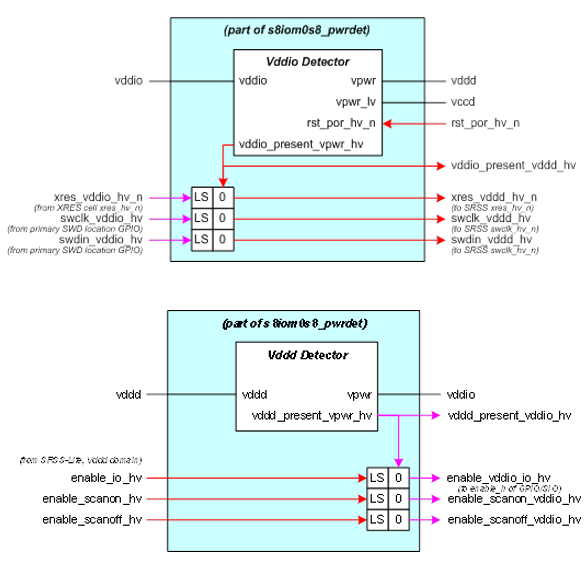

   Use case for the Power detector

Block diagram
^^^^^^^^^^^^^

The following diagram shows the complete sub-blocks of the power detector in detail.

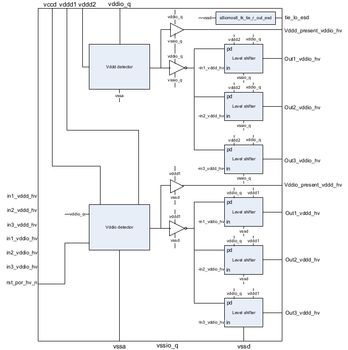

   :cell:`sky130_fd_io__top_pwrdet`

Truth Table
^^^^^^^^^^^

The table below captures all steady state combinations of ``vddio_q,`` vccd and vddd1 for the vddio detector and explains the behavior of the vddio
detector for each of the cases.

.. table:: Truth Table for Power detector
   :name: power detector truth table

   +-------+-------+-------------+---------------------------------------------------------+--------------------------------------------------------------------+
   | vccd  | vddd1 | ``vddio_q`` | vddio detector behavior                                 | Comment                                                            |
   +=======+=======+=============+=========================================================+====================================================================+
   | 0     | 0     | 0           | Output is floating.                                     | Chip shutdown                                                      |
   +-------+-------+-------------+---------------------------------------------------------+--------------------------------------------------------------------+
   | 0     | 0     | 1           | Output is floating.                                     | vddd is absent                                                     |
   +-------+-------+-------------+---------------------------------------------------------+--------------------------------------------------------------------+
   | 0     | 1     | 0           | The detector is unreliable in this condition            | Sec.2.4.9 of SAS calls out this condition.                         |
   |       |       |             |                                                         | It states the circuit above is unreliable when vddio is 0          |
   |       |       |             |                                                         | and ``vpwr_lv`` is 0, which is the case during POR and when XRES=0 |
   +-------+-------+-------------+---------------------------------------------------------+--------------------------------------------------------------------+
   | 0     | 1     | 1           | * Detector output will be high.                         | xres mode                                                          |
   |       |       |             | * vccd=0 does not affect circuit behavior when vddio=1  |                                                                    |
   +-------+-------+-------------+---------------------------------------------------------+--------------------------------------------------------------------+
   | 1     | 0     | 0           | Output is floating.                                     | Invalid combination. Vccd cannot be ``1`` when vddd is 0           |
   +-------+-------+-------------+---------------------------------------------------------+--------------------------------------------------------------------+
   | 1     | 0     | 1           | Output is floating.                                     | Invalid combination. Vccd cannot be ``1`` when vddd is 0           |
   +-------+-------+-------------+---------------------------------------------------------+--------------------------------------------------------------------+
   | 1     | 1     | 0           | Output will be low. since ``vddio_q=0``                 | When vddio de-asserts in a working system -                        |
   |       |       |             |                                                         | it what leads the system to reset as a result of it                |
   +-------+-------+-------------+---------------------------------------------------------+--------------------------------------------------------------------+
   | 1     | 1     | 1           | Output of detector is high.                             | Active mode.                                                       |
   +-------+-------+-------------+---------------------------------------------------------+--------------------------------------------------------------------+

The table below captures all steady state combinations of ``vddio_q,`` and vddd2 for the vddd detector and explains the behavior of the vddd detector for each of the cases.

.. table:: Steady state combinations of ``vddio_q,`` and vddd2
   :name: steady state vddio_q and vddd2

   +-------------+-----------+----------------------+---------------------------+
   | ``vddio_q`` | ``vddd2`` | vddd detector behavio| Comment                   |
   +=============+===========+======================+===========================+
   | 0           | 0         | Output is floating.  | Chip shutdown             |
   +-------------+-----------+----------------------+---------------------------+
   | 0           | 1         | Output is floating   | ``vddio_q`` (power supply |
   |             |           |                      | of detector) is absent.   |
   +-------------+-----------+----------------------+---------------------------+
   | 1           | 0         | Output will be low,  | ``vddio_q`` is present    |
   |             |           | since vddd2 =0       | and vddd2 is absent.      |
   +-------------+-----------+----------------------+---------------------------+
   | 1           | 1         | Output will be high, | Active mode.              |
   |             |           | since vddd2=1        |                           |
   +-------------+-----------+----------------------+---------------------------+

The output of the level shifter will be zero when the power supply that is being detected is not present (=0).

Block Integration Guidelines
^^^^^^^^^^^^^^^^^^^^^^^^^^^^

The cell uses metal routing untill Met3.
Met4 and Met5 can be routed above this block.

The ``rst_por_hv_n`` pin should be hooked up to the ``rst_por_hv_n`` coming from the SRSS IP for proper functionality.

The cell does not include any circuitry for test mode control or for self-test.

IP block test coverage goals should be met by asserting the inputs of the level shifter and observing the respective outputs.
The block is mainly used to carry global enable signals and hence this functionality is tested implicitly.

The detector outputs are buffered using buffer sizes similar to buf4 cell.
The user must insert an additional buffer if one intends to cater to a higher load than that is supported by this buffer.

The level shifter outputs are buffered to drive a 3pf load at about 10ns rise/fall times.
Any additional load requirement must be taken care by inserting additional buffers.

The reset signal connected to vddio detector should be high in steady state condition for proper functionality.

If the VDDD detector is not to be used then the vddd2 has to be tied to ``vddio_q.``
The inputs of the corresponding level shifters ``(in1_vddd_hv,`` ``in2_vddd_hv`` and ``in3_vddd_hv`` must be tied to ground.
The outputs of the level shifters and detector must not be used anywhere.

If the VDDIO detector is not planned to be used then the vddd1, ``rst_por_hv_n`` and vccd has to be tied to ``vddio_q.``
The inputs of the corresponding level shifters ``(in1_vddio_hv,`` ``in2_vddio_hv`` and ``in3_vddio_hv`` must be tied to ground.
The outputs of the level shifters and detector must not be used anywhere.

This cell can be placed in critical corner.

The cell has power connections in Met3.
The power connections must be properly connected in Met4 and Met5 at the chip level.
The MET4 and MET5 power hookups should be at least 6um.
Minimum 10 VIA3 and VIA4 must be used in the power hookups.

If the block is placed in the I/O ring in the ESD routing path the power bussing should follow that of the I/O ring.

The vddio and vddd detectors were tested with 500mV, 10ns pulse width noise at 1 MHz and 25 MHz frequencies at the input power supply domain assuming
no noise at the output power supply domain.

The vddio and vddd detectors were tested with 500mV, 10ns pulse width noise at 1 MHz and 25 MHz frequencies at the output power supply domain assuming
no noise at the input power supply domain.

The vddio and vddd detectors were tested with 100mV, 10ns pulse width noise at 1 MHz and 25 MHz frequencies at the vssa domain.

The vddio and vddd detectors were tested with 100mV, 10ns pulse width noise at 1 MHz and 25 MHz frequencies at the vssd and ``vssio_q`` domain.

The outputs of the level shifters should be routed in Met2 of 0.5um width or Met3

The default state of the level shifters outputs is zero.
Hence the level shifters must be used to shift active high control signals to avoid glitches on this control signals during various power supply
ramps.

The power detector carries the ``enable_io`` signals to the :cell:`sky130_fd_io__sio` and :cell:`sky130_fd_io__gpio_ovtv2`.
Hence any glitches on the VDDD level shifter output when VDDIO ramping will cause a possible glitch in I2C communication.
The following table shows the outputs with various power supply ramp scenarios for the detector and level shifters outputs with the input to the level
shifter driven by zero.

.. table:: Power detector outputs with various power supply ramp scenarios
   :name: power detector outputs

   +--------+---------+---------+----------------+----------------+---------------+----------------+
   | Case # | vddd    | vddio   | vddio detector | vddio Level    | vddd detector | vddd Level     |
   |        |         |         | output         | shifter output | output        | shifter output |
   +========+=========+=========+================+================+===============+================+
   | 1      | Stable  | Ramping | no glitch      | no glitch      | glitches      | no glitch      |
   +--------+---------+---------+----------------+----------------+---------------+----------------+
   | 2      | Ramping | Stable  | glitches       | no glitch      | no glitch     | no glitch      |
   +--------+---------+---------+----------------+----------------+---------------+----------------+
   | 3      | Stable  | Stable  | no glitch      | no glitch      | no glitch     | no glitch      |
   +--------+---------+---------+----------------+----------------+---------------+----------------+
   | 4      | Ramping | Ramping | glitches       | glitches       | glitches      | glitches       |
   +--------+---------+---------+----------------+----------------+---------------+----------------+

**Case 1:** vddio ramp - vddd detector

VDDIO detector is keeping system in reset, so ``enable_`` signals are 0.
Hence LS input is being driven by 0, so a glitch on VDDD detector output is of no concern.

**Case 2**: vddd ramp - vddio detector

The system is not listening to output of VDDIO detector/level shifter when vddd ramps.
Hence this is not a concern.

**Case 3:** No concerns

**Case 4:** Glitches on detector/level shifter outputs not a problem during concurrent ramps.

The user must connect the power and ground to the less noisy sources.

:lib:`sky130_fd_io` Pin Information
~~~~~~~~~~~~~~~~~~~~~~~~~~~~~~~~~~~

#. DFT, BIST Pins

   As a summary, there is no additional DFT circuitry needed to test the :cell:`sky130_fd_io__gpio`.
   However, DFT circuitry has been added to the :cell:`sky130_fd_io__sio` macro to test the references from the :cell:`sky130_fd_io__refgen` to the :cell:`sky130_fd_io__sio` macro.

#. Bulk Pins

   There are no bulk pins to the LV devices in this library.

   Some high voltage pfet bodies are connected to their sources.
   These pfet bodies are connected to the I/O supply ``vddio``.
   There are some high voltage pfet bodies that are associated with the pad during an overvoltage or hot swap event.
   When a hot swap or overvoltage event occurs, these bodies are connected to the pad otherwise they are connected to the I/O supply ``vddio``.

   There are nfet bodies that do not connect to common ground.
   These bodies are in an isolated psub and are connected to ``vssd``.
   This is required in order to ensure that the threshold voltage does not change if substrate bias is applied.
   Normally, this scheme is used in the input buffer to ensure that the input trip does not shift due to substrate biasing.

#. Power Supply Pins

-  The :cell:`sky130_fd_io__gpio` cells use the main Vddio/Vssio connections for their ESD current steering diodes.

-  The main Vddio/Vssio power rails are used for the digital output driver only. A separately routed ``Vddio_quiet/Vssio_quiet`` bus is used for all lower current circuits.

-  Most LV logic is in the Vccd domain. A few signals are in the Vcchib domain to enable DeepSleep functionality.

-  The AMUXBUS section contains switches that are supplied from the Vdda domain. The gates are driven using the Vswitch supply, which is either equal to Vdda or pumped up from it. If the product has no Programmable Analog, these supplies can be connected to Vddio (e.g. TSGx).

-  The AMUXBUS section contains shunting switches to Vssio/Vddio for the sensing/shielding currents during CSD operation. These use the ``Vssio_quiet/Vddio_quiet`` rails with private routes to the corresponding Vssio/Vddio pads to minimize the noise experienced due to IR- Drop caused by switching current of regular digital drivers.

-  There are no control signals in the Vdda domain. Only the AMUXBUS buses themselves are in the Vdda domain.

Timing Requirements and Diagrams
~~~~~~~~~~~~~~~~~~~~~~~~~~~~~~~~

The following diagrams apply to the input buffer AC parameters.

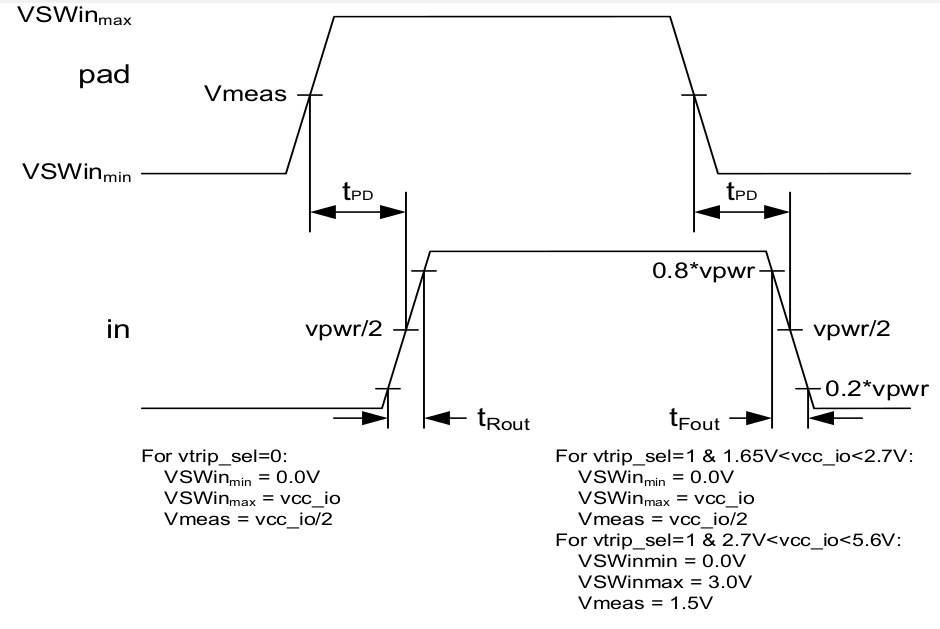

   :cell:`sky130_fd_io__gpio`, tPD, tRFout

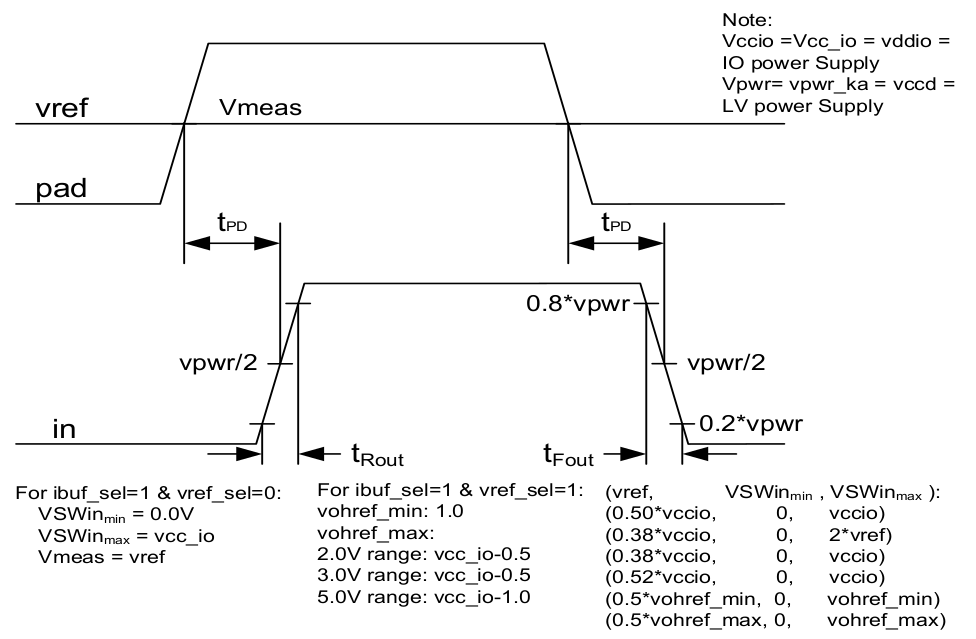

   :cell:`sky130_fd_io__sio` tPD, tRFout

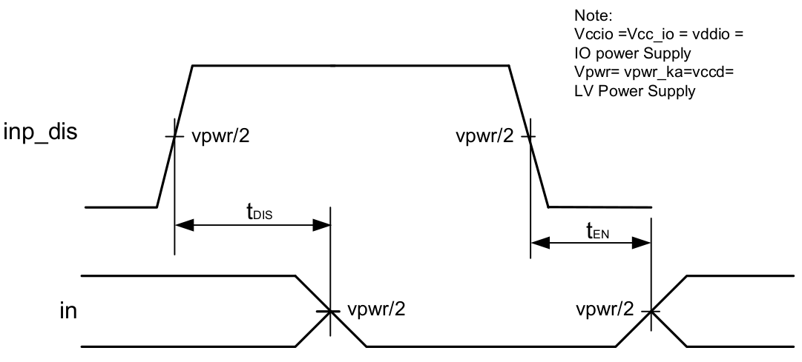

   :cell:`sky130_fd_io__gpio` & :cell:`sky130_fd_io__sio` tDIS, tEN

The following timing diagrams apply to the output buffer AC parameters.

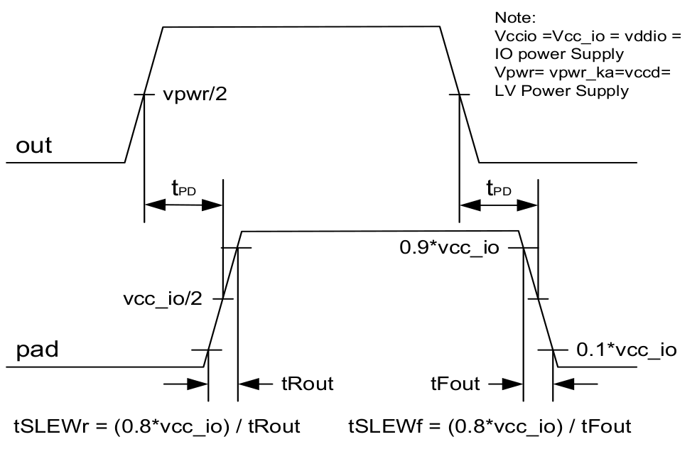

   :cell:`sky130_fd_io__gpio` tPD, tRFout (tSLEW)

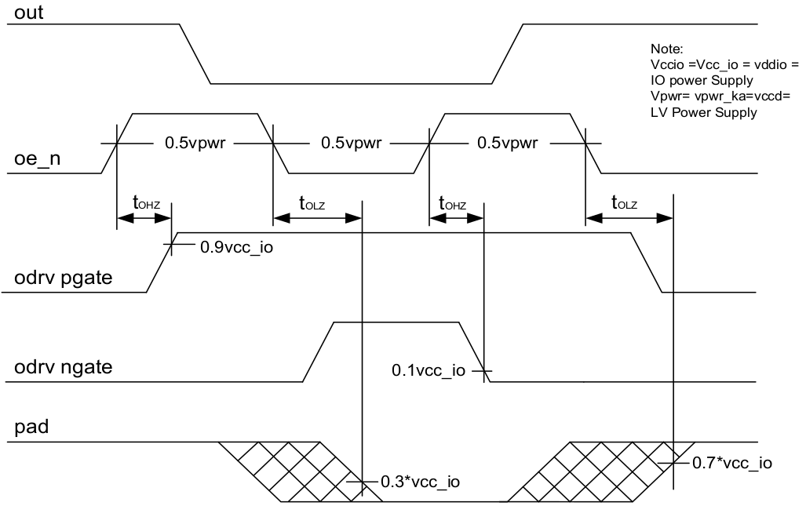

   :cell:`sky130_fd_io__gpio` and :cell:`sky130_fd_io__sio` non-regulated outbuf tOLZ & internal measurement method for tOHZ

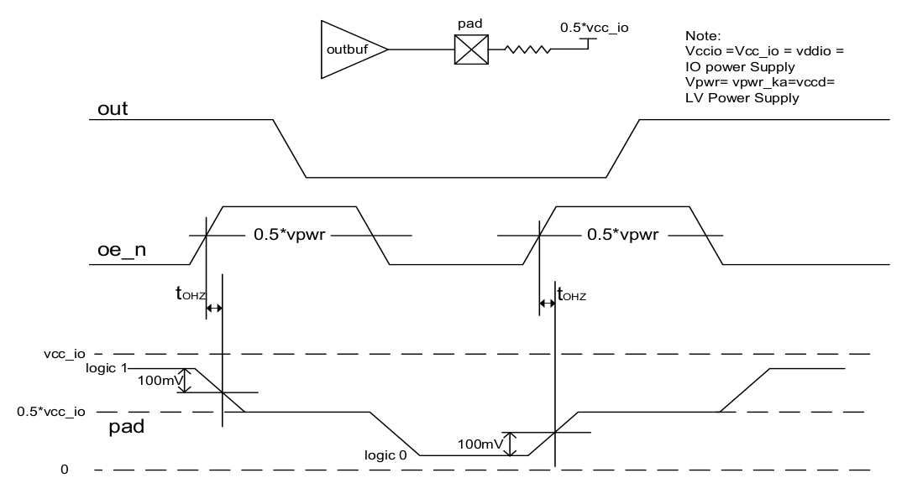

   :cell:`sky130_fd_io__gpio` and :cell:`sky130_fd_io__sio` non-regulated outbuf tOHZ external measurement method

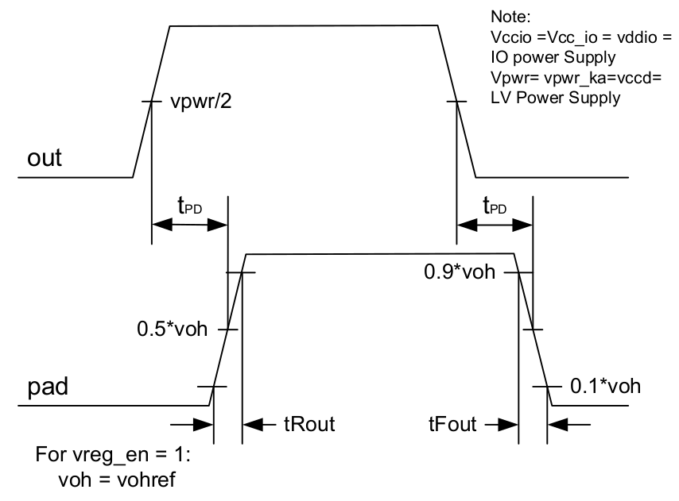

   :cell:`sky130_fd_io__sio` regulated outbuf ttRFout(tSLEW)

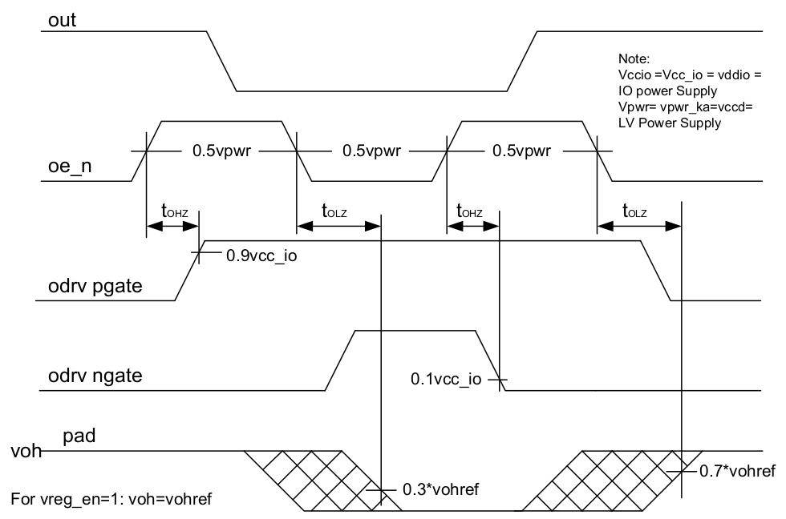

   :cell:`sky130_fd_io__sio` regulated outbuf tOLZ & external measurement method for tOHZ

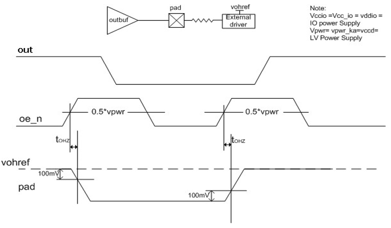

   :cell:`sky130_fd_io__sio` regulated outbuf tOHZ external measurement method

.. figure:: figures/timing_diagram_gpio_and_sio_hold_state_mode_timing_diagram.png
   :name: hold state mode timing diagram
   :width: 5.40000in
   :height: 3.25000in

   :cell:`sky130_fd_io__gpio` and :cell:`sky130_fd_io__sio` Hold State Mode Timing Diagram

Block Level Interfaces
~~~~~~~~~~~~~~~~~~~~~~

The :cell:`sky130_fd_io__gpio` and :cell:`sky130_fd_io__sio` cells interface with the core and the external world.
These cells accept inputs from the core at ``vcchib``, ``vccd``, ``vdda`` and ``vddio`` voltage levels.
The cell interfaces with the external world at ``vddio`` and ``vdda`` levels.
This cell also produces output signals to the core at ``vcchib`` and ``vddio`` levels.
``vcchib`` tracks vccd in normal operation and does not track ``vccd`` in sleep mode in which ``vddio`` and ``vcchib`` are up and ``vccd`` is down.

The :cell:`sky130_fd_io__sio_macro` cell is like the :cell:`sky130_fd_io__gpio` cell and it also accepts analog voltage levels as inputs and produces analog voltages at the pad.

The internal blocks on the ``vcchib`` power domain are input buffers and control logic for ``oe_hs`` (hot swap output enable).

The Reference voltage generator block receives the vohref analog global signal and has low voltage input configuration signals
(``vreg_en``, ``vref_sel`` , ``ibuf_sel`` , ``vtrip_sel`` ).
This block provides ``voutref`` reference voltage and ``refleak_bias`` bias voltage for the :cell:`sky130_fd_io__sio` Regulated Output Buffer and the ``vinref`` reference
voltage for the :cell:`sky130_fd_io__sio` differential input buffer.
The internal blocks on the ``vcchib`` power domain is the internal current bias generator and a level shifter block, that controls that sub-block.

The Reference voltage generator ``vcc_a`` pin must be connected to the analog supply of the chip, to reduce its noise sensitivity at its Vinref and
Voutref outputs.
This issue affects the supply noise sensitivity in the :cell:`sky130_fd_io__sio` input buffer and the :cell:`sky130_fd_io__sio` Regulated Output Buffer, respectively.

Reset and Initialization
~~~~~~~~~~~~~~~~~~~~~~~~

There are two resets to the I/O blocks -

-  ``Enable_h`` - This is a reset issued by the SRSS in VDDD (VDDIO) domain that resets everything when it is at logic 0 in the I/O block and ensures that the I/O blocks are tri-stated

-  ``Enable_vdda_h`` - This is reset issued by the SRSS in VDDA domain to ensure that any analog blocks in VDDA domain are reset when ``enable_vdda_h`` is at logic 0. This will ensure that any portions of the I/O (Analog Mux) that are tied to PAD are reset and the I/O block is in reset state.

Power Modes
~~~~~~~~~~~

The :cell:`sky130_fd_io__gpio` and :cell:`sky130_fd_io__sio` buffers support multiple standby modes.
The following tables list the input and output standby modes and their dependency on the related control inputs.

.. table:: :cell:`sky130_fd_io__gpio` & :cell:`sky130_fd_io__sio` Input Buffer Standby Modes
   :name: input buffer standby modes

   +--------------+-------------+---------+-------------------------------+
   | ``enable_h`` | ``inp_dis`` | dm<2:0> | Standby Mode Description      |
   +==============+=============+=========+===============================+
   | 1            | X           | 000     | Input Buffer disabled         |
   |              |             |         | by drive mode state           |
   +--------------+-------------+---------+-------------------------------+
   | 1            | 1           | XXX     | Input Buffer disabled         |
   |              |             |         | by input buffer disable input |
   +--------------+-------------+---------+-------------------------------+
   | 0            | X           | XXX     | Input Buffer disabled         |
   +--------------+-------------+---------+-------------------------------+

.. table:: :cell:`sky130_fd_io__gpio` & :cell:`sky130_fd_io__sio` Output Buffer Standby Modes
   :name: output buffer standby modes

   +--------------+-------------+----------+---------+-----------------------------+
   | ``enable_h`` | ``hld_h_n`` | ``oe_n`` | dm<2:0> | Standby Mode Description    |
   +==============+=============+==========+=========+=============================+
   | 1            | 1           | X        | 00X     | Output Buffer disabled      |
   |              |             |          |         | by drive mode state         |
   +--------------+-------------+----------+---------+-----------------------------+
   | 1            | 1           | 1        | * 1XX   | Output Buffer disabled by   |
   |              |             |          | * X1X   | output buffer enable signal |
   +--------------+-------------+----------+---------+-----------------------------+
   | 1            | 0           | X        | XXX     | Output Buffer maintains     |
   |              |             |          |         | previous state              |
   +--------------+-------------+----------+---------+-----------------------------+
   | 0            | X           | X        | XXX     | Output Buffer tri-stated    |
   +--------------+-------------+----------+---------+-----------------------------+

The standby power consumption depends on the state of the control bits.
For example, the lowest standby current mode is achieved when oe_n=1, inp_dis=1, dm<2:0>=000.
During this mode the input and output buffer are permanently disabled allowing the circuits to be configured for minimal leakage current.

For all control bit states not covered in :numref:`power detector outputs` and :numref:`input buffer standby modes` either the input buffer, output buffer, or both buffers will be enabled.
During these modes the I/O buffer is considered active.
The power consumption for these modes depends on the drive mode setting and the switching frequency.

Register Definitions
~~~~~~~~~~~~~~~~~~~~

This IP contains latches to hold the previous state of the output when the hold state mode is selected.
When the hold state mode is selected the internal power supply connected to the output path may float.
The hold state latches are required to hold the previous output state regardless of the current state of the control signals.

Power Architecture and Modes
~~~~~~~~~~~~~~~~~~~~~~~~~~~~

The IP cells include multiple power domains.
In general there is a high voltage domain and a low voltage domain.
The high voltage domain is supplied by the I/O power supply ``vddio``.
There are no switched domains located inside the cell for the ``vddio`` power supply domain.

The low voltage domain consists of two internally generated supplies, vccd and vcchib.
The vccd supply is the regulated internal supply that can be forced low during low standby current modes.
The vcchib supply is the low voltage regulated keep alive supply.
This supply is kept active during low standby current modes and the level can drop to 1.2V.
The chip team is responsible to correctly controlling the levels on these supplies during the appropriate modes of operation.

Grounded Power Supplies
~~~~~~~~~~~~~~~~~~~~~~~

As there are multiple power supplies to the I/O's, no single power supply will be grounded while another supply is active.
This will help alleviate the grounded NWELL issues that induce latch-up.
It is OK to float a supply while another is active though.

Block behavioral model requirements
~~~~~~~~~~~~~~~~~~~~~~~~~~~~~~~~~~~

The :cell:`sky130_fd_io__gpio` and :cell:`sky130_fd_io__sio` input buffers are operating from the vcchib supply.
This means that the input buffer can operate even when vccd is taken down to 0 or floats.
But, note that before taking vccd=0 (or floating vccd), the hold mode must be asserted i.e.
hld_h_n=0 must go to 0 before vccd is taken to 0.
During the hold mode of operation and with vccd=0 (or floating), the input buffer can actively drive out depending on pad input if there is a valid
I/O (vddio, vddioq and vcchib) power supply.
This functionality is implemented in the behavioral model.
If vccd=0 (or floats) and when the I/O is not in the hold mode of operation, the behavioral model would force an ``X`` on the outputs of the input
buffer (``out`` and ``out_h``) and the input buffer cannot be actively driven from pad.

Block Integration Requirements and Constraints
----------------------------------------------

General Integration Requirements
~~~~~~~~~~~~~~~~~~~~~~~~~~~~~~~~

The following is a list of items users must be aware of before using this IP.

1. The IP cells described within this document are I/O cells and Power and Ground pads. Each cell (GPIO and :cell:`sky130_fd_io__sio`) contains an input and output buffer, with a bond pad.

2. The circuit blocks do not include any circuitry for test mode control or for self-test. All input pin states will be exercisable in all product applications so that the IP block test coverage goals will be met.

3. The control signal ``enable_h`` will override all other input and control pins to force the input and output to a predetermined state. When ``enable_h`` transitions from logic 0 to logic 1, the block expects all of the inputs to be valid state. If ``hld_h_n=0`` when the ``enable_h`` pin transitions 0->1 (inactive->active) the state set by ``enable_h`` is latched in the output driver.

4. There is a separate ``enable_vdda_h`` control signal to the :cell:`sky130_fd_io__gpio`. This control signal is logic 0 when VDDA supply is ramping up. This control signal ensures that the AMUX is completely turned OFF when ``enable_vdda_h`` is at logic 0.

5. It is permissible to externally connect the I/O pin to a voltage above vddio or below ``vssd_io``, provided that the current flowing into/out of the pin is externally limited to 100uA.

6. The :cell:`sky130_fd_io__gpio` and :cell:`sky130_fd_io__sio` input buffers are operating from the vcchib supply. This means that the input buffer can operate even when vccd is taken down to 0V or floats. But note that before taking vccd=0 (or floating vccd), the hold mode must be asserted i.e. ``hld_h_n=0`` must go to 0 before vccd is taken to 0. During the hold mode of operation and with vccd=0 (or floating), the input buffer can actively drive out depending on pad input if there is a valid I/O (vddio, vddioq and vcchib) power supply. This functionality is implemented in the behavioral model. If vccd=0 (or floats) and when the I/O is not in the hold mode of operation, the behavioral model would force an ``X`` on the outputs of the input buffer (``out`` and ``out_h``) and the input buffer cannot be actively driven from pad.

7. In hibernate mode, the I/P buffer just needs to toggle. It need not meet the VIH/VIL specs.

8. The charge pump is powered down during startup and thus VSWITCH=VDDA during startup.

9. ``tie_weak_hi_h`` signal for the :cell:`sky130_fd_io__top_xres3v2` is really a pull up and not intended to interact with any other intermediate strength drivers (weak, pull).

10. For the cell :cell:`sky130_fd_io__top_axresv2`, glitch filter input (``filter_in_h``) is intended to be connected to only the :cell:`sky130_fd_io__gpio` output and no other uses are permitted.

11. The glitch filter in :cell:`sky130_fd_io__top_xres2v2`, :cell:`sky130_fd_io__top_xres3v2` and :cell:`sky130_fd_io__top_axresv2` cells have metal1 option to increase/decrease the glitch rejection pulse width.

12. When using the pad connections of the :cell:`sky130_fd_io__sio_macro`, care should be taken about power-domain interaction at PAD (when used as I2C pads). The :cell:`sky130_fd_io__sio_macro` has a tracking NWELL on its PAD which is driven to VDDIO when PAD<VDDIO. If a pad is being connected to a signal from any other power-domain other than VDDIO, power- supply sequencing issues must be analyzed at chip- level.

1. Chip Floor planning guidelines when using :lib:`sky130_fd_io` to build I/O ring

   The following information is a MUST know when using the :lib:`sky130_fd_io` library components to build an I/O ring.
   Due to the complex nature of these I/O's and other PG pads, it is critical that the following matrix be understood when placing the cells that form
   the I/O ring.

   -  ALL cells CANNOT be abutted with each other. There are limitations because of the ESD LU rules and due to the different Deep NWELLS being used in different cells.

   -  It is strongly recommended to run a DRC at the chip level as soon as the I/O cell placements are complete. Also, scheduling a preliminary ESD review is recommended before routing is started.

2. Layout Integration guidelines specific to :cell:`sky130_fd_io__gpio`

   1. The GPIO cell (:cell:`sky130_fd_io__top_gpio`) forms part of the I/O ring. If multiple instances of this cell are used, they must be mirrored and placed by abutment.

   2. The boundary of the :cell:`sky130_fd_io__gpio` cell (PAD side) can be abutted with the seal ring. It takes care of the pad to seal ring rules internally.

   3. The :cell:`sky130_fd_io__gpio` cell can be abutted to the rest of the cells in this IP by proper placement as documented below for the rest of the public cells.

3. ``enable_h`` integration guidelines for :cell:`sky130_fd_io__gpio_ovtv2` and :cell:`sky130_fd_io__sio_macro`

   Any product that has I2C ports and is claiming over-voltage tolerance needs to ensure that the glitch on ``enable_h`` coming into the :cell:`sky130_fd_io__top_gpio_ovtv2` or :cell:`sky130_fd_io__sio_macro` is less than 300mV.

Scan Attributes to be used for :lib:`sky130_fd_io` cells
~~~~~~~~~~~~~~~~~~~~~~~~~~~~~~~~~~~~~~~~~~~~~~~~~~~~~~~~

:cell:`sky130_fd_io__gpio`'s can be used as SCAN IN and SCAN Out pads based on the configuration.

However, if a :cell:`sky130_fd_io__gpio` is configured as a SCAN IN pad, all the output buffer control signals can be toggled.
Likewise, if the :cell:`sky130_fd_io__gpio` is used as a SCAN OUT pad, all the input buffer control signals can be toggled.

.. table:: Control signals that can be toggled for public cells
   :name: public cells control signals

   +------+---------------------------------------+--------------------------+-----------------------------+----------------------+
   | S.No | Public Cell                           | * Used as SCAN IN        | * Used as SCAN OUT          | * Others             |
   |      |                                       | * dm[3]=001              | * dm=110                    | * ``analog_en=0``    |
   |      |                                       | * ``analog_en=0``        | * ``inp_dis=1``             | * ``hld_vdda_h_n=0`` |
   |      |                                       |                          | * ``analog_en=0``           |                      |
   +======+=======================================+==========================+=============================+======================+
   | 1    | :cell:`sky130_fd_io__top_gpiov2`      | * out                    | * ``vtrip_sel ib_mode_sel`` |                      |
   |      |                                       | * ``oe_n``               | * ``analog_sel analog_pol`` |                      |
   |      |                                       | * slow                   |                             |                      |
   |      |                                       | * ``analog_sel``         |                             |                      |
   |      |                                       | * ``analog_pol``         |                             |                      |
   +------+---------------------------------------+--------------------------+-----------------------------+----------------------+
   | 2    | :cell:`sky130_fd_io__top_gpio_ovtv2`  | * out                    | * ``vtrip_sel``             |                      |
   |      |                                       | * ``oe_n``               | * ``ib_mode_sel<1:0>``      |                      |
   |      |                                       | * slow                   | * ``analog_sel``            |                      |
   |      |                                       | * ``analog_sel``         | * ``analog_pol``            |                      |
   |      |                                       | * ``analog_pol``         | * ``hys_trim``              |                      |
   |      |                                       | * ``hys_trim``           | * ``slew_ctl<1:0>``         |                      |
   |      |                                       | * ``slew_ctl<1:0>``      |                             |                      |
   +------+---------------------------------------+--------------------------+-----------------------------+----------------------+
   | 3    | :cell:`sky130_fd_io__sio_macro`       | * ``inp_dis=0``          | * ``vreg_en=0``             |                      |
   |      |                                       | * ``vtrip_sel=0``        | * ``vreg_en_refgen=0``      |                      |
   |      | (assuming both the pad in macro       | * ``hld_h_n=1``          | * ``vtrip_sel<1:0>``        |                      |
   |      | are used the same way)                |                          |                             |                      |
   |      |                                       | * ``ibuf_sel=0``         | * ``ibuf_sel<1:0>``         |                      |
   |      |                                       | * ``vreg_en_refgen=0``   | * ``voh_sel<2:0>``          |                      |
   |      |                                       | * out<1:0>               | * ``vref_sel<1:0>``         |                      |
   |      |                                       | * ``oe_n<1:0>``          | * ``vtrip_sel_refgen``      |                      |
   |      |                                       | * slow<1:0>              | * ``ibuf_sel_refgen``       |                      |
   |      |                                       | * ``voh_sel<1:0>``       | * ``dft_refgen=0``          |                      |
   |      |                                       | * ``vref_sel<1:0>``      |                             |                      |
   |      |                                       | * ``vtrip_sel_refgen=0`` |                             |                      |
   |      |                                       | * ``ibuf_sel_refgen=0``  |                             |                      |
   |      |                                       | * ``dft_refgen=0``       |                             |                      |
   +------+---------------------------------------+--------------------------+-----------------------------+----------------------+
   | 4    | :cell:`sky130_fd_io__top_amuxsplitv2` |                          |                             | * ``switch_aa_sl``   |
   |      |                                       |                          |                             | * ``switch_aa_sr``   |
   |      |                                       |                          |                             | * ``switch_aa_s0``   |
   |      |                                       |                          |                             | * ``switch_bb_sl``   |
   |      |                                       |                          |                             | * ``switch_bb_sr``   |
   |      |                                       |                          |                             | * ``switch_bb_s0``   |
   +------+---------------------------------------+--------------------------+-----------------------------+----------------------+
